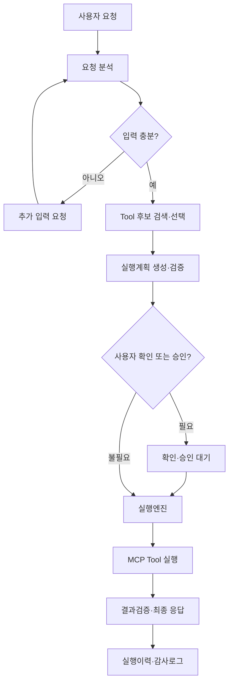

# MCPFlow 기능정의서

> **MCPFlow - MCP-based AI Agent Automation Platform**

| 항목 | 내용 |
|---|---|
| 문서 ID | `MCPF-FUNC-001` |
| 문서 버전 | `v0.1` |
| 상태 | Draft - 개발 기준 초안 |
| 기준 문서 | `docs/01-requirements.md` v0.1 |
| 공식 과제명 | MCP 연계 업무 자동화 AI 에이전트 개발 |
| 개발 프로젝트명 | MCPFlow |
| 최종 수정일 | 2026-09-02 |

---

## 1. 문서 목적

본 문서는 `docs/01-requirements.md`에서 정의한 요구사항을 MCPFlow에서 실제로 구현할 기능 단위로 구체화한다. 각 기능은 사용자, 사전조건, 입력, 처리, 출력, 상태변화, 예외처리 및 검증기준을 포함하며 이후 데이터 모델, API, UI/UX, 배포 및 시험 설계의 기준이 된다.

문서 적용 원칙은 다음과 같다.

- 요구사항 ID(`REQ-*`, `NFR-*`)는 개발범위와 수용기준을 추적하는 기준이다.
- 기능 ID(`FNC-*`)는 API, 서비스, 화면, 테스트케이스가 참조하는 구현 단위이다.
- 화면 ID(`SCR-*`)는 Figma 및 Frontend 라우트 설계에서 사용한다.
- LLM은 분석·추천·계획 생성을 담당하고 권한, 정책, 상태전이 및 실제 실행은 애플리케이션이 통제한다.
- 미확정 기술제품은 본 문서에서 특정 제품으로 고정하지 않고 인터페이스와 동작을 정의한다.
- 본 문서와 코드가 충돌할 경우 관련 요구사항과 영향범위를 먼저 검토한 후 문서를 현행화한다.

---

## 2. 기능 범위 요약

| 기능 영역 | 기능 ID 범위 | 주요 기능 |
|---|---|---|
| 공통 기반 | `FNC-COM-*` | 공통 API, 입력검증, 목록조회, 비동기 Job, 오류처리 |
| 인증·권한 | `FNC-AUTH-*` | 로그인, 사용자, 역할, Permission, 자원 접근제어 |
| MCP Server | `FNC-MCP-*` | 등록, 연결검증, 초기화, 상태, 상태점검, 변경영향 |
| MCP Tool | `FNC-TOOL-*` | Discovery, Registry, 버전, 정책, 시험호출, 검증완료 관리 |
| Agent | `FNC-AGT-*` | Agent 설정, 요청분석, 후보검색, Tool 선택, 입력구성, 응답생성 |
| Workflow | `FNC-WF-*` | 실행계획, Workflow 작성·검증·버전·게시, 복합 흐름 |
| 실행엔진 | `FNC-EXE-*` | Queue, 상태전이, Tool 호출, timeout, 재시도, 취소, 복구, 결과검증 |
| 승인 | `FNC-APR-*` | 승인요청, 판단, 재개, 만료, 알림 이벤트 |
| 예약 | `FNC-SCH-*` | 일회성·반복 예약, 중복정책, 보충실행, 실패정책 |
| 운영·감사 | `FNC-OPS-*`, `FNC-AUD-*` | 대시보드, 이력, 로그, metric, 설정, 감사로그, 내보내기 |
| 외부 MCP 탐색 | `FNC-DISC-*` | Registry 검색, 후보 검토, 도입, 버전변경 감지 |
| Tool Factory | `FNC-FAC-*` | OpenAPI/Python 분석, 생성, 격리시험, 등록, 버전복원 |

---

## 3. 전체 기능 흐름

### 3.1 자연어 요청 실행 흐름



### 3.2 기능 책임 분리

| 모듈 | 책임 | 수행하지 않는 책임 |
|---|---|---|
| Web UI | 입력, 상태 표시, 계획 확인, 승인, 운영화면 | 권한 최종판단, Tool 직접 호출 |
| Backend API | 인증, 입력검증, 유스케이스 진입점, 응답계약 | 장기 실행을 요청 thread에서 직접 수행 |
| Agent Runtime | 요청 구조화, 후보평가, 계획 및 응답 생성 | 권한 우회, 상태 직접 변경, 비검증 Tool 호출 |
| Execution Engine | 계획검증, 상태전이, Queue, Step 제어, 오류정책 | 자연어 의도 추측, MCP 메타데이터 임의 변경 |
| MCP Manager | 연결, protocol 협상, Discovery, Tool 호출 | 사용자 권한판단, Workflow 상태전이 |
| Scheduler | 실행시각 계산, Execution 생성 | Agent/Workflow 내부 실행 |
| Approval | 승인 요청, 판단, 만료, 실행 재개 이벤트 | 승인값과 다른 입력 실행 허용 |
| Audit | 중요 행위의 추적 기록과 조회 | 업무데이터의 원본 저장소 대체 |

---

## 4. 공통 기능 규격

### 4.1 공통 식별자 및 시간

- 주요 자원은 전역 고유 ID를 사용한다.
- 내부 저장 시각은 UTC로 통일하고 API는 timezone을 명시할 수 있는 ISO 8601 형식을 사용한다.
- 사용자 화면은 사용자 설정 timezone으로 변환하며 원본 UTC 값을 훼손하지 않는다.
- 모든 API 요청에는 `request_id`, 모든 실행에는 `execution_id`, Step에는 `step_execution_id`를 부여한다.
- 비동기 Job에는 `job_id`를 부여하고 관련 자원 ID와 연결한다.

### 4.2 공통 목록 조회

모든 주요 목록 기능은 다음 동작을 동일하게 제공한다.

| 항목 | 기능 정의 |
|---|---|
| 페이지네이션 | 기본 page size와 최대 page size를 적용하고 다음 페이지 또는 offset 정보를 제공한다. |
| 검색 | 이름·설명 등 허용된 문자열 필드의 부분검색을 제공한다. |
| 필터 | 상태, 소유자, 기간, 유형 등 자원별 필터를 제공한다. |
| 정렬 | 허용된 필드만 정렬하고 기본 정렬을 명시한다. |
| 권한 | 조회 권한이 없는 레코드는 목록 건수와 데이터에서 모두 제외한다. |
| 응답 | `items`, 페이지정보, 전체 건수 또는 다음 cursor를 일관된 구조로 반환한다. |

### 4.3 공통 오류 구조

```json
{
  "error": {
    "code": "MCP_CONNECTION_TIMEOUT",
    "message": "MCP Server 연결 시간이 초과되었습니다.",
    "details": [],
    "request_id": "...",
    "retryable": true
  }
}
```

| 오류 분류 | 코드 접두어 | 예시 |
|---|---|---|
| 인증·권한 | `AUTH_` | `AUTH_REQUIRED`, `AUTH_PERMISSION_DENIED` |
| 입력검증 | `VALIDATION_` | `VALIDATION_REQUIRED_FIELD`, `VALIDATION_SCHEMA_MISMATCH` |
| MCP | `MCP_` | `MCP_CONNECTION_FAILED`, `MCP_PROTOCOL_UNSUPPORTED` |
| Tool | `TOOL_` | `TOOL_INACTIVE`, `TOOL_INPUT_INVALID` |
| Agent | `AGENT_` | `AGENT_LOW_CONFIDENCE`, `AGENT_OUTPUT_INVALID` |
| Workflow | `WORKFLOW_` | `WORKFLOW_CYCLE_DETECTED`, `WORKFLOW_BINDING_INVALID` |
| 실행 | `EXECUTION_` | `EXECUTION_TIMEOUT`, `EXECUTION_CANCELLED` |
| 승인 | `APPROVAL_` | `APPROVAL_REQUIRED`, `APPROVAL_EXPIRED` |
| 예약 | `SCHEDULE_` | `SCHEDULE_INVALID_RULE`, `SCHEDULE_OVERLAP` |
| 시스템 | `SYSTEM_` | `SYSTEM_INTERNAL_ERROR`, `SYSTEM_DEPENDENCY_UNAVAILABLE` |

오류 응답은 사용자용 메시지와 운영자용 상세 원인을 분리한다. stack trace, credential, 원본 secret 및 불필요한 개인정보는 API 응답에 포함하지 않는다.

### 4.4 공통 비동기 Job

Discovery, 동기화, Factory 생성, 대량 내보내기 등 장기 작업은 공통 Job 모델을 사용한다.

| 상태 | 의미 |
|---|---|
| `QUEUED` | 실행 대기 |
| `RUNNING` | 작업 진행 중 |
| `SUCCEEDED` | 정상 완료 |
| `FAILED` | 오류로 종료 |
| `CANCELLED` | 사용자 또는 시스템에 의해 취소 |
| `TIMED_OUT` | 허용시간 초과 |

Job은 진행률이 계산 가능한 경우 `progress_current`, `progress_total`을 제공하며, 불가능한 경우 현재 처리단계와 최근 진행시각을 제공한다.

### 4.5 공통 변경·삭제 규칙

- 과거 실행에서 참조한 MCP Server, Tool, Agent 및 Workflow는 물리 삭제보다 비활성화한다.
- 게시된 Agent/Workflow 정의는 직접 덮어쓰지 않고 새 버전을 생성한다.
- 위험한 변경은 영향받는 Agent, Workflow, Schedule 및 진행 중 Execution을 사전 조회한다.
- 생성·변경·비활성화·복원·삭제 행위는 감사로그 대상이다.
- 동일 idempotency key의 생성 요청은 최초 성공결과를 반환하고 중복 자원을 만들지 않는다.

### FNC-COM-001. 공통 자원 식별 및 응답

| 항목 | 정의 |
|---|---|
| 적용 대상 | 전체 Backend API와 주요 업무 자원 |
| 입력 | 인증 컨텍스트, 자원 ID, request ID |
| 출력 | 일관된 자원 응답, 생성·수정시각, 추적정보 |
| 관련 요구사항 | `REQ-CORE-001`, `REQ-CORE-002`, `REQ-CORE-005` |

모든 자원 API는 동일한 식별자·시각·오류 표현원칙을 사용한다. Frontend는 DB 구조나 내부 서비스 객체가 아니라 공개 API 응답계약에만 의존한다.

### FNC-COM-002. 공통 목록 검색

| 항목 | 정의 |
|---|---|
| 적용 대상 | 사용자, MCP Server/Tool, Agent, Workflow, Execution, Schedule, Approval, Audit 목록 |
| 입력 | 검색어, filter, sort, page 또는 cursor |
| 출력 | 권한이 적용된 목록과 페이지정보 |
| 관련 요구사항 | `REQ-CORE-003`, `REQ-AUTH-004` |

허용하지 않은 정렬·필터 필드는 검증 오류로 처리하고, 권한 없는 레코드는 `items`뿐 아니라 전체 건수에서도 제외한다.

### FNC-COM-003. 입력검증 및 표준 오류

| 항목 | 정의 |
|---|---|
| 적용 대상 | 전체 생성·변경·실행 API |
| 입력 | 요청 payload, schema, 업무 검증규칙 |
| 출력 | 검증된 입력 또는 구조화 오류 |
| 관련 요구사항 | `REQ-CORE-004`, `NFR-SEC-003`, `NFR-SEC-007` |

형식검증과 업무검증을 구분하고 필드별 오류를 제공한다. 예상하지 못한 오류는 request ID로 추적하되 내부 stack trace와 민감정보를 외부 응답에 포함하지 않는다.

### FNC-COM-004. 비동기 Job 관리

| 항목 | 정의 |
|---|---|
| 적용 대상 | Discovery, 동기화, Factory 생성, 평가, 내보내기 등 장기 작업 |
| 입력 | Job 유형, 실행자, 대상, 입력 snapshot |
| 출력 | Job ID, 상태, 진행정보, 결과 또는 오류 |
| 관련 요구사항 | `REQ-CORE-007`, `NFR-PERF-003`, `NFR-REL-005` |

사용자는 권한 범위 내 Job을 조회·취소할 수 있다. Worker 재전달로 같은 Job이 중복 실행되더라도 최종 업무 결과는 한 번만 반영한다.

### FNC-COM-005. 중복 방지와 안전한 변경

| 항목 | 정의 |
|---|---|
| 적용 대상 | Execution, Schedule, Approval, 중요 자원 생성·비활성화 |
| 입력 | idempotency key, 대상 자원, 변경유형 |
| 출력 | 기존 또는 신규 결과, 영향목록, 변경결과 |
| 관련 요구사항 | `REQ-CORE-006`, `REQ-CORE-008` |

동일한 작업의 재전송은 중복 자원을 만들지 않는다. 이력이 있는 자원의 파괴적 변경은 영향목록을 확인하고 가능한 경우 비활성화와 버전 보존으로 처리한다.

관련 요구사항: `REQ-CORE-001`~`REQ-CORE-008`, `NFR-MNT-003`, `NFR-MNT-004`

---

## 5. 인증·사용자·권한 기능

### FNC-AUTH-001. 로그인 및 인증상태 확인

| 항목 | 정의 |
|---|---|
| 사용자 | 전체 사용자 |
| 사전조건 | 활성 사용자 계정 또는 연계 인증주체가 존재함 |
| 입력 | 인증정보, 인증방식, 선택적 redirect 정보 |
| 출력 | 인증 세션 또는 token, 사용자 기본정보, 역할·Permission 요약 |
| 관련 요구사항 | `REQ-AUTH-001`, `REQ-AUTH-008`, `NFR-SEC-001`, `NFR-SEC-002` |

처리절차:

1. 인증정보의 형식과 인증 시도 제한을 검증한다.
2. 설정된 인증 Provider로 사용자를 확인한다.
3. 사용자 활성상태와 로그인 허용정책을 확인한다.
4. 성공 시 인증 컨텍스트를 생성하고 실패 시 표준 오류를 반환한다.
5. 성공·실패 결과를 보안 감사 이벤트로 기록하되 비밀번호나 token은 기록하지 않는다.

예외처리:

- 존재하지 않는 사용자와 잘못된 인증정보는 외부에 구분되지 않는 메시지를 사용할 수 있다.
- 비활성 사용자는 인증 성공 여부와 무관하게 접근을 거절한다.
- 인증 Provider 장애는 credential 오류와 구분되는 재시도 가능 오류로 기록한다.

검증기준:

- 미인증 사용자가 보호 API를 호출하면 `AUTH_REQUIRED`가 반환된다.
- 비활성 사용자에게 신규 세션이 발급되지 않는다.
- 인증 성공·실패 감사로그에 secret이 포함되지 않는다.

### FNC-AUTH-002. 사용자 관리

| 항목 | 정의 |
|---|---|
| 사용자 | System Administrator |
| 입력 | 사용자 식별정보, 표시명, 상태, timezone, 역할 목록 |
| 출력 | 사용자 상세, 상태 및 역할 정보 |
| 관련 요구사항 | `REQ-AUTH-002`, `REQ-AUTH-003`, `REQ-AUTH-006`, `REQ-AUTH-008` |

주요 기능:

- 사용자 생성, 상세조회, 검색, 정보변경, 활성화 및 비활성화
- 역할 복수 부여 및 회수
- 본인 기본정보와 timezone 조회·변경
- 사용자의 최근 실행·승인·감사 이력 연결 조회

업무 규칙:

- 사용자 식별자는 중복될 수 없다.
- 비활성화해도 과거 실행·승인·감사 이력의 사용자 표시정보를 보존한다.
- 마지막 System Administrator 비활성화 등 운영 불능을 유발하는 변경은 차단한다.
- 사용자 역할 변경은 신규 요청부터 적용하며 진행 중 Step은 실행 직전 권한 재검증을 따른다.

### FNC-AUTH-003. 역할 및 Permission 관리

| 항목 | 정의 |
|---|---|
| 사용자 | System Administrator |
| 입력 | 역할명, 설명, Permission 목록, 자원범위 정책 |
| 출력 | 역할 상세, 사용자 수, Permission 및 영향정보 |
| 관련 요구사항 | `REQ-AUTH-003`, `REQ-AUTH-004`, `REQ-AUTH-007`, `REQ-AUTH-008` |

처리절차:

1. 역할명 중복과 Permission 유효성을 검사한다.
2. 승인, 감사, 시스템 관리 Permission을 서로 독립적으로 구성한다.
3. 변경 시 영향받는 사용자와 기능범위를 계산한다.
4. 변경을 저장하고 권한 cache가 있다면 안전하게 무효화한다.
5. 변경 전후 Permission을 감사로그에 기록한다.

검증기준:

- UI에서 숨겨진 기능을 API로 직접 호출해도 동일하게 거절된다.
- Auditor에게 변경권한 없이 감사조회만 부여할 수 있다.
- Approver에게 시스템 관리권한 없이 승인권한만 부여할 수 있다.

### FNC-AUTH-004. 자원 단위 접근제어

| 항목 | 정의 |
|---|---|
| 적용 대상 | MCP Server, Tool, Agent, Workflow, Execution, Schedule, Approval |
| 입력 | 인증 사용자, Permission, 자원범위, 행위, 현재 정책 |
| 출력 | `ALLOW` 또는 `DENY`, 내부 판단사유 |
| 관련 요구사항 | `REQ-AUTH-004`~`REQ-AUTH-007`, `REQ-AGT-002`, `REQ-EXE-005` |

판단 순서:

1. 인증 여부와 사용자 활성상태를 확인한다.
2. 요청 행위에 필요한 Permission을 확인한다.
3. 자원 소유, 조직, 공개범위 또는 개별 allowlist를 확인한다.
4. Agent 허용 Tool, Tool 상태, 승인정책 등 추가 정책을 확인한다.
5. 하나라도 명시적으로 거부되면 실행을 차단한다.

권한판단 결과의 상세 내부사유는 운영·감사 목적에는 기록하되 일반 사용자에게 다른 사용자의 자원 존재 여부를 불필요하게 노출하지 않는다.

---

## 6. MCP Server 관리 기능

### FNC-MCP-001. MCP Server 등록

| 항목 | 정의 |
|---|---|
| 사용자 | MCP Administrator |
| 사전조건 | Server 등록 Permission 보유 |
| 입력 | 이름, 설명, transport, 연결설정, secret 참조, timeout, 재시도, 동시실행 정책 |
| 출력 | `DRAFT` 상태의 MCP Server, 등록 검증결과 |
| 관련 요구사항 | `REQ-MCP-001`~`REQ-MCP-003`, `REQ-MCP-006`~`REQ-MCP-008`, `REQ-MCP-011`, `REQ-MCP-012` |

transport별 입력:

| transport | 필수 입력 | 주요 검증 |
|---|---|---|
| `stdio` | 승인된 실행대상, 인자, 환경변수 secret 참조, 작업정책 | shell 문자열 금지, allowlist, 경로·이미지, 자원제한 |
| `streamable_http` | endpoint URL, header secret 참조, 연결 timeout | HTTPS 정책, URL·redirect·SSRF, host 허용정책 |
| `legacy_sse` | endpoint URL, 인증 참조 | 호환기능 활성 여부, 보안정책, 지원중단 표시 |

처리절차:

1. 공통 입력과 transport별 스키마를 검증한다.
2. secret 값은 별도 저장 또는 secret store 참조로 변환한다.
3. 네트워크 및 프로세스 보안정책을 검증한다.
4. 자원을 `DRAFT`로 저장한다.
5. 연결시험은 명시적으로 요청하거나 등록 흐름의 다음 단계에서 수행한다.

예외처리:

- 중복 이름은 정책에 따라 거절한다.
- 금지된 URL, 미승인 실행대상, 원문 secret 반환 시 등록을 거절한다.
- 연결시험 실패가 입력 저장 자체를 취소할지는 사용자 선택으로 하되 활성화는 허용하지 않는다.

### FNC-MCP-002. 연결시험 및 capability 협상

| 항목 | 정의 |
|---|---|
| 사용자 | MCP Administrator |
| 사전조건 | Server 설정 저장 완료 |
| 입력 | MCP Server ID, 선택적 임시 timeout |
| 출력 | 연결결과, protocol 정보, capability, 지연시간, 분류된 오류 |
| 관련 요구사항 | `REQ-MCP-004`, `REQ-MCP-005`, `REQ-MCP-009`, `NFR-COMP-001` |

처리절차:

1. Server 설정과 secret 참조를 로딩한다.
2. transport 연결을 생성하고 지정 timeout을 적용한다.
3. MCP initialize와 protocol/capability 협상을 수행한다.
4. 성공 시 protocol version, server info, capability 및 지연시간을 저장한다.
5. 실패 시 DNS, network, authentication, protocol, process, timeout 또는 unknown으로 분류한다.
6. 연결을 정상 종료하고 결과를 감사·운영 로그에 기록한다.

검증기준:

- 성공 결과로 Server가 자동 활성화되지는 않는다.
- 연결시험마다 시작·종료시각과 결과가 남는다.
- unsupported protocol은 일반 network 오류와 구분된다.

### FNC-MCP-003. Server 활성화·비활성화 및 설정변경

| 항목 | 정의 |
|---|---|
| 사용자 | MCP Administrator |
| 입력 | Server ID, 목표 상태 또는 변경 설정, 변경사유 |
| 출력 | 변경된 Server, 영향목록, 감사 이벤트 |
| 관련 요구사항 | `REQ-MCP-007`, `REQ-MCP-008`, `REQ-MCP-010`, `REQ-CORE-006` |

상태전이:

| 현재 상태 | 가능한 상태 | 조건 |
|---|---|---|
| `DRAFT` | `ACTIVE`, `INACTIVE` | 연결·protocol 검증 및 최소 1회 Discovery 성공 후 활성화 가능 |
| `ACTIVE` | `INACTIVE`, `ERROR` | 관리자 비활성화 또는 운영오류 |
| `INACTIVE` | `ACTIVE` | 재연결 검증 및 정책 충족 |
| `ERROR` | `ACTIVE`, `INACTIVE` | 원인 해소 후 재검증 |

변경 전 영향받는 Tool, Agent, Workflow, Schedule 및 진행 중 Execution을 조회한다. 활성 Server의 연결정보·secret·transport 변경은 기존 연결을 안전하게 종료한 후 신규 설정으로 재검증한다.

### FNC-MCP-004. Server 상태점검

| 항목 | 정의 |
|---|---|
| 실행주체 | MCP Administrator 또는 주기 Job |
| 입력 | Server ID 또는 점검대상 집합 |
| 출력 | 가용상태, 지연시간, 최근 성공·실패, 연속 실패횟수 |
| 관련 요구사항 | `REQ-MCP-009`, `REQ-OPS-001`, `REQ-OPS-005` |

업무 규칙:

- 상태점검은 Tool의 부작용 호출 없이 연결 및 protocol 수준에서 수행한다.
- 일시적 실패 한 번으로 즉시 모든 Server를 `ERROR` 처리하지 않고 설정된 연속 실패정책을 적용할 수 있다.
- 점검 주기와 timeout은 운영설정으로 관리한다.
- 상태변경 이벤트를 metric과 감사 또는 운영 이벤트에 연결한다.

### FNC-MCP-005. Server 삭제 및 변경영향 분석

| 항목 | 정의 |
|---|---|
| 사용자 | MCP Administrator |
| 입력 | Server ID, 변경 또는 삭제 유형 |
| 출력 | 참조 Tool·Agent·Workflow·Schedule, 차단사유, 실행 가능 조치 |
| 관련 요구사항 | `REQ-MCP-010`, `REQ-CORE-006`, `REQ-AUD-001` |

과거 이력이 있거나 다른 자원이 참조하는 Server는 기본적으로 물리 삭제하지 않는다. 삭제 요청 시 비활성화, 참조 해소 또는 보존정책에 따른 정리 중 가능한 조치를 제시한다.

---

## 7. MCP Tool Discovery 및 Registry 기능

### FNC-TOOL-001. Tool Discovery 실행

| 항목 | 정의 |
|---|---|
| 사용자 | MCP Administrator |
| 사전조건 | Server 연결검증 성공 |
| 입력 | Server ID, 동기화 모드 |
| 출력 | Discovery Job, Tool 후보 및 변경 미리보기 |
| 관련 요구사항 | `REQ-TOOL-001`~`REQ-TOOL-004`, `REQ-CORE-007` |

처리절차:

1. Server와 protocol session을 초기화한다.
2. Tool 목록을 pagination과 protocol 기능에 따라 끝까지 조회한다.
3. 각 Tool의 원본 이름, 설명, input schema, output 정보, annotation을 정규화한다.
4. 원본 메타데이터 hash를 계산하고 기존 Registry와 비교한다.
5. `ADDED`, `CHANGED`, `UNCHANGED`, `REMOVED` 후보를 생성한다.
6. 변경 미리보기를 저장하고 관리자 적용 또는 자동정책을 기다린다.

예외처리:

- 일부 page 실패 시 전체 동기화를 성공으로 처리하지 않는다.
- 유효하지 않은 Tool schema는 Tool 단위 오류로 표시하되 다른 정상 후보를 확인할 수 있게 한다.
- Discovery 중 Server 변경이 감지되면 결과를 적용하지 않고 재실행을 요구한다.

### FNC-TOOL-002. 동기화 적용 및 Tool 버전 관리

| 항목 | 정의 |
|---|---|
| 사용자 | MCP Administrator |
| 입력 | Discovery Job ID, 적용할 변경목록 |
| 출력 | 생성·변경·비활성화된 Tool 버전과 적용결과 |
| 관련 요구사항 | `REQ-TOOL-002`~`REQ-TOOL-005`, `REQ-TOOL-012` |

업무 규칙:

- 원본 메타데이터와 운영자 보완 이름·설명·태그를 별도 필드로 관리한다.
- 원본 schema 또는 의미 있는 metadata 변경 시 새 Tool 버전을 만든다.
- Server에서 사라진 Tool은 `UNAVAILABLE` 또는 동등한 사용중지 상태로 전환한다.
- 과거 Execution은 호출 당시 Tool 버전과 schema snapshot을 유지한다.
- 변경된 Tool은 영향받는 Agent와 Workflow의 재검증 필요 여부를 계산한다.

### FNC-TOOL-003. Tool 상태 및 실행정책 관리

| 항목 | 정의 |
|---|---|
| 사용자 | MCP Administrator, 권한 있는 Agent Designer |
| 입력 | Tool ID, 상태, 사용자용 메타데이터, 위험등급, 승인, timeout, 재시도, 결과제한, 권한범위 |
| 출력 | Tool 운영설정 및 정책버전 |
| 관련 요구사항 | `REQ-TOOL-005`~`REQ-TOOL-009`, `REQ-AUTH-005` |

Tool 상태:

| 상태 | 실행 후보 포함 여부 | 의미 |
|---|---:|---|
| `DISCOVERED` | 아니오 | Discovery 후 검토 전 |
| `ACTIVE` | 예 | schema·정책·권한 검증 완료 |
| `INACTIVE` | 아니오 | 관리자가 사용중지 |
| `INVALID` | 아니오 | schema 또는 설정 오류 |
| `UNAVAILABLE` | 아니오 | Server에서 더 이상 제공되지 않음 |

위험정책은 Tool annotation을 참고할 수 있으나 내부 정책을 우선한다. 입력 또는 정책 변경으로 승인 snapshot이 달라지면 기존 승인을 재사용하지 않는다.

### FNC-TOOL-004. Tool 검색 및 상세조회

| 항목 | 정의 |
|---|---|
| 사용자 | 권한 있는 사용자, Agent Designer, MCP Administrator |
| 입력 | 키워드, Server, 상태, 태그, 위험등급, 검증상태 |
| 출력 | 권한이 적용된 Tool 목록과 상세정보 |
| 관련 요구사항 | `REQ-TOOL-009`, `REQ-AGT-004`, `REQ-AUTH-005` |

상세정보에는 운영자용 정보와 일반 사용자·Agent용 정보를 구분한다. 일반 검색결과에는 secret 참조, 내부 endpoint, 민감한 연결오류를 포함하지 않는다.

### FNC-TOOL-005. Tool 시험호출

| 항목 | 정의 |
|---|---|
| 사용자 | MCP Administrator 또는 Tool 시험 Permission 보유자 |
| 사전조건 | Server 사용 가능, Tool schema 유효 |
| 입력 | Tool ID와 버전, 시험 파라미터 |
| 출력 | 시험 Execution, 결과, 오류, 소요시간, 검증결과 |
| 관련 요구사항 | `REQ-TOOL-006`, `REQ-TOOL-010`~`REQ-TOOL-012`, `REQ-EXE-001` |

처리절차:

1. 시험 입력을 Tool schema로 검증한다.
2. 사용자 권한, Tool 정책 및 승인 필요 여부를 확인한다.
3. 일반 Execution과 구분되는 `TEST` 실행을 생성한다.
4. MCP Manager를 통해 호출하고 timeout·결과크기·masking 정책을 적용한다.
5. protocol 성공과 업무 출력 검증을 각각 기록한다.
6. 검증자가 결과를 승인하면 해당 Tool 버전에 검증완료 정보를 연결한다.

시험호출은 관리화면이라는 이유로 권한, 승인, 감사 및 보안정책을 우회하지 않는다.

---

## 8. Agent 및 자연어 처리 기능

### FNC-AGT-001. Agent 등록·변경·버전 관리

| 항목 | 정의 |
|---|---|
| 사용자 | Agent Designer |
| 입력 | 이름, 목적, 시스템 지침, Provider/모델, 허용 Tool, planning 정책, 확인정책, 한도 |
| 출력 | Agent와 버전, 검증결과 |
| 관련 요구사항 | `REQ-AGT-001`, `REQ-AGT-002`, `REQ-AGT-010`, `REQ-AGT-013` |

Agent 설정:

| 구분 | 주요 항목 |
|---|---|
| 기본정보 | 이름, 설명, 목적, 소유자, 공개범위 |
| 모델 | Provider, model name, temperature 등 허용 파라미터, timeout |
| Tool 범위 | 허용 Tool/태그/Server allowlist와 deny policy |
| Planning | 최대 Step, 최대 반복, 후보 수, 최소 신뢰도 |
| 실행 | 사용자 확인 기준, 전체 timeout, 비용·호출 한도 |
| 응답 | 결과표시 수준, 근거표시, 실패·부분성공 표현 지침 |

게시 또는 사용 중인 Agent 변경은 새 버전을 생성한다. 실행 시점의 Agent 버전과 설정 snapshot을 Execution에 연결한다.

### FNC-AGT-002. 자연어 요청 접수 및 구조화

| 항목 | 정의 |
|---|---|
| 사용자 | User |
| 입력 | 자연어 요청, 선택한 Agent, 대화 맥락, 첨부 가능한 구조 데이터 |
| 출력 | 구조화된 요청, 분석상태, 부족정보 |
| 관련 요구사항 | `REQ-AGT-003`, `REQ-AGT-007`, `REQ-AGT-009`, `REQ-AGT-013` |

구조화 결과는 최소 다음을 포함한다.

```json
{
  "intent": "업무 목적",
  "entities": {},
  "constraints": [],
  "expected_output": "기대 결과",
  "required_inputs": [],
  "risk_hints": [],
  "needs_clarification": false
}
```

처리절차:

1. 입력 크기, 형식 및 사용자 권한을 검증한다.
2. 대화 맥락 중 현재 요청과 관련된 범위만 구성한다.
3. Agent 지침과 구조화 schema를 사용해 LLM을 호출한다.
4. 출력 schema를 검증하고 제한 횟수 내 보정한다.
5. 부족하거나 모호한 정보가 있으면 실행계획을 만들기 전에 추가입력 상태로 전환한다.

### FNC-AGT-003. Tool 후보 검색

| 항목 | 정의 |
|---|---|
| 실행주체 | Agent Runtime |
| 입력 | 구조화 요청, Agent 버전, 사용자 권한, 검색 정책 |
| 출력 | 순위가 있는 Tool 후보 집합과 검색근거 |
| 관련 요구사항 | `REQ-AGT-002`, `REQ-AGT-004`, `NFR-PERF-005` |

후보 필터 순서:

1. `ACTIVE` Server와 Tool만 포함한다.
2. 사용자 자원권한을 적용한다.
3. Agent allowlist와 deny policy를 적용한다.
4. 이름, 설명, 태그, schema 및 목적을 기반으로 검색한다.
5. 후보 수 상한을 적용한 뒤 LLM 평가에 전달한다.

전체 Tool metadata를 매 요청마다 무제한으로 LLM에 전달하지 않는다. 검색방식은 keyword, embedding 또는 hybrid로 교체 가능하되 동일한 후보계약을 반환한다.

### FNC-AGT-004. Tool 평가 및 선택

| 항목 | 정의 |
|---|---|
| 실행주체 | Agent Runtime |
| 입력 | 구조화 요청, Tool 후보, 선택정책 |
| 출력 | 선택 Tool, 후보별 점수·근거, 신뢰도, 확인 필요 여부 |
| 관련 요구사항 | `REQ-AGT-005`, `REQ-AGT-006`, `REQ-AGT-014` |

업무 규칙:

- 선택 결과는 Tool ID와 Tool 버전을 명시한다.
- 후보가 없으면 임의 Tool을 만들거나 미등록 Tool을 호출하지 않는다.
- 신뢰도가 기준 미만이거나 상위 후보가 경합하면 사용자의 선택 또는 요청 보완을 요구한다.
- 선택근거는 평가·감사 가능한 요약정보로 저장하되 내부 chain-of-thought의 저장을 요구하지 않는다.
- 위험도가 높은 Tool은 높은 선택 신뢰도와 별개로 확인·승인정책을 적용한다.

### FNC-AGT-005. 추가입력 및 사용자 확인

| 항목 | 정의 |
|---|---|
| 사용자 | User |
| 입력 | 부족정보 질문 또는 Tool 선택지에 대한 사용자 응답 |
| 출력 | 보완된 구조화 요청 또는 취소 결과 |
| 관련 요구사항 | `REQ-AGT-006`, `REQ-AGT-007`, `REQ-WF-010` |

질문은 한 번에 필요한 항목을 명확히 제시하고 각 항목의 타입, 필수 여부 및 예시를 포함할 수 있다. 사용자 응답은 기존 요청과 연결하여 schema 검증 후 planning을 재개한다. 사용자가 취소하면 Tool 호출 없이 Execution을 `CANCELLED`로 종료한다.

### FNC-AGT-006. Tool 파라미터 생성

| 항목 | 정의 |
|---|---|
| 실행주체 | Agent Runtime |
| 입력 | 구조화 요청, Tool input schema, 이전 Step 출력, 사용자 값, 정책 기본값 |
| 출력 | 검증된 파라미터와 필드별 출처 |
| 관련 요구사항 | `REQ-AGT-007`~`REQ-AGT-009`, `REQ-WF-008` |

파라미터 출처는 최소 `USER_INPUT`, `CONVERSATION`, `STEP_OUTPUT`, `POLICY_DEFAULT`, `MODEL_DERIVED`를 구분한다. secret 값은 LLM이 생성하거나 원문을 보관하지 않고 승인된 secret 참조를 실행 직전에 주입한다.

검증 실패 시:

- 필수값 누락: 사용자에게 추가입력 요청
- 타입 불일치: 안전한 변환이 명확할 때만 변환하고 출처 기록
- enum·범위 오류: 허용값을 제시하여 재입력 요청
- 의미가 불명확한 고위험 값: 추측하지 않고 확인 요청

### FNC-AGT-007. 실행계획 생성

| 항목 | 정의 |
|---|---|
| 실행주체 | Agent Runtime |
| 입력 | 구조화 요청, 선택 Tool, 검증 파라미터, 실행정책 |
| 출력 | Execution Plan 초안 |
| 관련 요구사항 | `REQ-WF-001`, `REQ-WF-002`, `REQ-WF-010`, `REQ-WF-014` |

Agent는 자연어 계획을 직접 실행하지 않고 정의된 Execution Plan schema로 출력한다. 생성계획은 Workflow Validator를 통과해야 하며 사용자가 작성한 Workflow와 동일한 Execution Engine 계약을 사용한다.

### FNC-AGT-008. 결과 기반 최종 응답 생성

| 항목 | 정의 |
|---|---|
| 실행주체 | Agent Runtime |
| 입력 | 사용자 원요청, 계획, Step 결과, 검증상태, 오류요약 |
| 출력 | 최종 자연어 응답, 결과상태, 근거 Step 참조 |
| 관련 요구사항 | `REQ-AGT-011`, `REQ-AGT-012`, `REQ-EXE-018` |

응답 규칙:

- 실제 Step 상태와 일치하는 성공, 부분성공, 실패를 표시한다.
- 실행되지 않은 작업을 완료한 것으로 표현하지 않는다.
- Tool 결과의 외부 지시문을 시스템 지침으로 사용하지 않는다.
- 사용자가 확인할 수 있도록 주요 결과와 관련 Step을 연결한다.
- 민감하거나 제한된 출력은 권한과 masking 정책을 적용한다.

### FNC-AGT-009. LLM Provider 및 모델 설정

| 항목 | 정의 |
|---|---|
| 사용자 | System Administrator |
| 입력 | Provider 유형, base URL, 모델, secret 참조, timeout, 기본 한도 |
| 출력 | Provider 설정, 연결시험 결과, 사용 가능 모델 정보 |
| 관련 요구사항 | `REQ-AGT-010`, `REQ-AGT-013`, `NFR-MNT-002` |

OpenAI-compatible API를 기본 연계계약으로 지원하되 Provider adapter로 분리한다. 설정조회에서 API key 원문을 반환하지 않으며 Agent 버전은 사용한 Provider 설정 버전을 참조한다.

### FNC-AGT-010. Tool 매핑 평가

| 항목 | 정의 |
|---|---|
| 사용자 | Agent Designer, Operator |
| 입력 | 평가 dataset 버전, Agent/모델/검색 설정 |
| 출력 | Tool 매핑 정확도, 요청별 정답·예측·점수·오류유형 |
| 관련 요구사항 | `REQ-AGT-014`, `NFR-TEST-002`, 과제 Tool 매핑 정확도 지표 |

평가 실행은 실제 Tool을 호출하지 않는 선택평가와 실제 실행까지 포함하는 E2E 평가를 구분한다. 동일 dataset·Agent·모델·설정으로 결과를 재현할 수 있도록 version snapshot을 보존한다.

---

## 9. Execution Plan 및 Workflow 기능

### FNC-WF-001. Execution Plan 구조검증

| 항목 | 정의 |
|---|---|
| 실행주체 | Workflow Validator |
| 입력 | Execution Plan, 사용자, Agent/Workflow 버전 |
| 출력 | 검증 성공 또는 오류목록 |
| 관련 요구사항 | `REQ-WF-001`, `REQ-WF-002`, `REQ-WF-008`, `REQ-WF-009` |

검증항목:

- plan schema 및 지원 Step type
- Step ID 중복과 참조 무결성
- 의존성 cycle 및 도달 불가능 Step
- 입력 바인딩 경로와 타입 호환성
- 조건식 문법과 허용 연산자
- 반복 최대횟수와 종료조건
- Agent·Tool·Workflow 상태와 버전
- 사용자와 Agent의 Tool 권한
- 전체 Step 수, 병렬 수, 반복 수 한도

검증은 가능한 오류를 한 번에 목록으로 반환하되 보안상 노출하면 안 되는 자원정보는 제거한다.

### FNC-WF-002. Workflow 등록 및 편집

| 항목 | 정의 |
|---|---|
| 사용자 | Agent Designer |
| 입력 | 이름, 설명, 입력정의, Step, 연결, 조건, 오류정책 |
| 출력 | `DRAFT` Workflow 버전과 검증결과 |
| 관련 요구사항 | `REQ-WF-011`~`REQ-WF-014` |

편집방식은 form 기반을 필수로 하고 canvas 편집기는 UI 설계에서 적용범위를 확정한다. 저장 시 초안 저장과 검증 저장을 구분할 수 있으며 게시 전에는 모든 치명적 오류를 해소해야 한다.

### FNC-WF-003. 순차·병렬 실행구조 정의

| 항목 | 정의 |
|---|---|
| 사용자 | Agent Designer 또는 Agent Runtime |
| 입력 | Step과 dependency, parallel group, join 정책 |
| 출력 | 유효한 DAG 형태의 계획 |
| 관련 요구사항 | `REQ-WF-003`, `REQ-WF-004`, `REQ-EXE-011` |

병렬 join 정책은 최소 다음을 구분한다.

| 정책 | 의미 |
|---|---|
| `ALL_SUCCESS` | 모든 Step 성공 시 후속 진행 |
| `ALL_COMPLETE` | 성공·실패와 무관하게 모두 종료 후 후속 정책 판단 |
| `ANY_SUCCESS` | 하나 이상 성공 시 후속 진행, 나머지 취소 여부는 별도 정책 |

동시실행은 시스템, Server 및 Tool 한도를 초과하지 않는다.

### FNC-WF-004. 조건 분기 정의

| 항목 | 정의 |
|---|---|
| 입력 | 허용된 변수경로, 비교연산자, 값, true/false 경로 |
| 출력 | 검증된 조건 Step |
| 관련 요구사항 | `REQ-WF-005`, `REQ-WF-009` |

조건식은 임의 코드 실행이 아닌 제한된 표현식을 사용한다. 참조할 수 있는 값은 검증된 Workflow 입력과 선행 Step 출력으로 제한한다. 선택되지 않은 경로는 `SKIPPED`로 기록한다.

### FNC-WF-005. 제한 반복 정의

| 항목 | 정의 |
|---|---|
| 입력 | 반복대상, 최대횟수, 종료조건, 반복별 입력 바인딩 |
| 출력 | 검증된 loop Step |
| 관련 요구사항 | `REQ-WF-006`, `REQ-WF-009`, `BR-010` |

최대횟수는 필수이며 시스템 상한을 초과할 수 없다. 반복별 결과와 종료사유를 저장하고 한도 도달은 정상종료와 구분한다.

### FNC-WF-006. Workflow 입력 및 데이터 바인딩

| 항목 | 정의 |
|---|---|
| 입력 | 이름, 타입, 필수 여부, 기본값, secret 여부, 설명, Step 입력경로 |
| 출력 | 검증된 Workflow input schema와 binding |
| 관련 요구사항 | `REQ-WF-008`, `REQ-WF-013` |

UI 입력폼과 API는 동일한 schema를 사용한다. secret 입력은 화면 재표시와 Execution 일반 상세에서 원문을 반환하지 않는다. Step 출력이 없거나 타입이 맞지 않으면 후속 Step 시작 전에 실패한다.

### FNC-WF-007. Workflow 게시·폐기·복제

| 항목 | 정의 |
|---|---|
| 사용자 | Agent Designer |
| 입력 | Workflow ID/버전, 목표 상태, 변경사유 |
| 출력 | 상태변경 결과와 영향정보 |
| 관련 요구사항 | `REQ-WF-011`, `REQ-WF-012`, `REQ-CORE-006` |

상태전이:

| 현재 상태 | 가능한 상태 | 조건 |
|---|---|---|
| `DRAFT` | `PUBLISHED` | 구조·권한·Tool 검증 통과 |
| `PUBLISHED` | `DEPRECATED` | 신규 실행 차단, 기존 실행 유지 |
| `DEPRECATED` | 없음 | 복원 대신 새 버전 또는 복제 사용 |

게시 버전 수정은 새 `DRAFT` 버전을 생성한다. 예약에서 사용 중인 버전 폐기 시 영향받는 예약을 표시한다.

### FNC-WF-008. Workflow 수동 실행

| 항목 | 정의 |
|---|---|
| 사용자 | User |
| 입력 | 게시 Workflow 버전, 입력값, 선택적 실행명 |
| 출력 | Execution ID와 초기상태 |
| 관련 요구사항 | `REQ-WF-010`, `REQ-WF-012`~`REQ-WF-014`, `REQ-EXE-001` |

실행시점에 Workflow 상태, 입력 schema, 사용자 권한, Tool 상태 및 정책을 다시 검증한다. 계획 미리보기 또는 사용자 확인정책이 적용되는 경우 `WAITING_CONFIRMATION` 후 실행한다.

---

## 10. Execution Engine 기능

### FNC-EXE-001. Execution 생성 및 계획 snapshot

| 항목 | 정의 |
|---|---|
| 실행주체 | API, Agent Runtime, Scheduler |
| 입력 | 실행 출처, 사용자, Agent/Workflow, 검증된 Plan, 입력값, idempotency key |
| 출력 | Execution ID, 계획 snapshot, 초기상태 |
| 관련 요구사항 | `REQ-CORE-008`, `REQ-EXE-001`, `REQ-EXE-004`, `REQ-EXE-014` |

Execution 생성 시 다음 snapshot을 고정한다.

- 사용자 요청과 실행 출처
- Agent 또는 Workflow 버전
- Execution Plan
- Tool 및 정책 버전
- 사용자가 제공한 입력과 보호된 secret 참조
- 생성시각, request ID, idempotency key

동일 idempotency key와 의미상 동일한 요청은 기존 Execution을 반환한다.

### FNC-EXE-002. Execution 및 Step 상태전이

Execution 상태:

| 상태 | 설명 | 종료상태 |
|---|---|---:|
| `QUEUED` | Worker 할당 대기 | 아니오 |
| `PLANNING` | Agent 분석·계획 중 | 아니오 |
| `WAITING_CONFIRMATION` | 사용자 입력·계획 확인 대기 | 아니오 |
| `WAITING_APPROVAL` | 승인자 판단 대기 | 아니오 |
| `RUNNING` | 하나 이상의 Step 실행 가능 또는 실행 중 | 아니오 |
| `SUCCEEDED` | 필수 Step 정상 완료 | 예 |
| `PARTIAL` | 허용된 일부 Step 실패·건너뜀 | 예 |
| `FAILED` | 성공조건 미충족 | 예 |
| `CANCELLED` | 취소 요청에 따라 종료 | 예 |
| `TIMED_OUT` | 전체 제한시간 초과 | 예 |

Step 상태:

| 상태 | 설명 |
|---|---|
| `PENDING` | 선행조건 대기 |
| `READY` | 실행 가능 |
| `RUNNING` | 실행 중 |
| `SUCCEEDED` | 결과검증 포함 성공 |
| `FAILED` | 재시도 종료 후 실패 |
| `SKIPPED` | 분기 또는 정책상 미실행 |
| `CANCELLED` | 취소로 종료 |
| `TIMED_OUT` | Step 제한시간 초과 |

관련 요구사항: `REQ-EXE-002`, `REQ-EXE-003`, `REQ-EXE-017`

상태는 Execution Engine의 전이함수를 통해서만 변경한다. 모든 전이는 이전상태, 신규상태, 사유, 행위자 또는 시스템 원인과 시각을 기록한다.

### FNC-EXE-003. Queue 및 동시실행 제어

| 항목 | 정의 |
|---|---|
| 입력 | READY Step, 우선순위, 사용자·Server·Tool 동시실행 정책 |
| 출력 | Worker 할당 또는 Queue 대기 |
| 관련 요구사항 | `REQ-EXE-011`, `NFR-PERF-003`, `NFR-PERF-004`, `NFR-REL-005` |

업무 규칙:

- Queue message 중복을 고려해 Step 실행권 획득을 멱등 처리한다.
- 시스템, 사용자, MCP Server, Tool 한도 중 가장 제한적인 값을 적용한다.
- Worker 장애로 lease가 만료된 Step은 복구정책으로 전달한다.
- 우선순위 사용 시 일반 작업의 영구 starvation을 방지한다.

### FNC-EXE-004. 실행 직전 정책검증

| 항목 | 정의 |
|---|---|
| 입력 | Step, 현재 사용자·Agent·Tool·Server·승인 상태 |
| 출력 | 실행 허용, 승인대기 또는 실패 |
| 관련 요구사항 | `REQ-EXE-005`, `REQ-AUTH-005`, `REQ-APR-005` |

검증항목:

1. 사용자 활성상태와 Permission
2. Agent allowlist 및 버전 유효성
3. Server와 Tool 활성·가용상태
4. Tool 입력 schema와 secret 참조
5. 승인 필요 여부와 승인 snapshot 일치
6. 동시실행 및 전체 실행한도

계획 생성 후 권한이나 정책이 변경되었으면 최신 정책을 우선하며 차단사유를 Execution에 기록한다.

### FNC-EXE-005. MCP Tool 호출

| 항목 | 정의 |
|---|---|
| 입력 | Tool 버전, 검증된 입력, 호출정책, 추적정보 |
| 출력 | protocol 결과, 원본 또는 보호된 결과참조, 호출 metric |
| 관련 요구사항 | `REQ-EXE-001`, `REQ-EXE-013`, `REQ-EXE-014`, `REQ-MCP-008` |

처리절차:

1. Step 시도번호와 호출 ID를 생성한다.
2. secret을 실행 직전에 안전하게 주입한다.
3. MCP Manager가 대상 Server session을 준비한다.
4. Tool call을 수행하고 progress·취소·timeout을 가능한 범위에서 전달한다.
5. 결과크기와 민감정보 정책을 적용한다.
6. protocol 성공 여부, 소요시간 및 오류분류를 저장한다.
7. secret과 connection 내부정보를 제거한 운영 로그를 남긴다.

### FNC-EXE-006. timeout 및 재시도

| 항목 | 정의 |
|---|---|
| 입력 | Step 오류, Tool 정책, 시도횟수, idempotency 정보 |
| 출력 | 재시도 예약 또는 최종 실패 |
| 관련 요구사항 | `REQ-EXE-006`~`REQ-EXE-008` |

재시도 판단:

| 오류 유형 | 기본 처리 |
|---|---|
| 입력·권한·승인 오류 | 재시도 안 함 |
| protocol 비호환·Tool 없음 | 재시도 안 함 |
| 일시적 network·rate limit | 정책과 멱등성 확인 후 재시도 가능 |
| timeout | 부작용·멱등성 확인 전 자동 재시도 금지 |
| 결과 schema 불일치 | 동일 입력 자동 반복보다 실패 또는 제한적 보정정책 적용 |

각 시도는 별도 시작·종료시각, 오류 및 지연시간을 기록한다. 최대 횟수와 전체 Execution timeout을 초과할 수 없다.

### FNC-EXE-007. 결과검증 및 후속 Step 준비

| 항목 | 정의 |
|---|---|
| 입력 | Tool protocol 결과, output schema 또는 Workflow 검증규칙 |
| 출력 | 검증된 결과, Step 상태, 후속 Step 입력 |
| 관련 요구사항 | `REQ-EXE-012`, `REQ-EXE-017`, `REQ-EXE-018` |

protocol 호출 성공과 업무 결과 성공을 분리한다. 출력 schema, 필수 필드 및 명시적 업무 검증규칙을 적용한 후에만 Step을 `SUCCEEDED`로 전환한다. 대용량 결과는 설정에 따라 외부 저장, 요약 또는 잘라내고 처리방식을 기록한다.

### FNC-EXE-008. 실행 취소

| 항목 | 정의 |
|---|---|
| 사용자 | 요청자, Operator 또는 취소 Permission 보유자 |
| 입력 | Execution ID, 취소사유 |
| 출력 | 취소 접수 및 최종상태 |
| 관련 요구사항 | `REQ-EXE-009` |

취소 처리:

- Queue와 `READY` Step은 신규 실행을 차단한다.
- 진행 중 Tool 호출에는 protocol이 지원하는 취소를 전달한다.
- 취소 불가능한 외부 작업은 결과를 기다리되 후속 Step은 실행하지 않는다.
- 이미 종료된 Execution의 취소 요청은 상태를 변경하지 않는다.
- 취소 요청자, 사유 및 처리결과를 감사로그에 기록한다.

### FNC-EXE-009. 장애복구

| 항목 | 정의 |
|---|---|
| 실행주체 | Recovery Worker |
| 입력 | 비정상 종료 의심 Execution/Step, lease, 마지막 heartbeat |
| 출력 | 재개, 재시도, 실패 또는 수동확인 필요 상태 |
| 관련 요구사항 | `REQ-EXE-010`, `NFR-REL-001`, `NFR-REL-002`, `NFR-REL-005` |

부작용 Tool의 호출결과가 불명확하면 자동 재호출하지 않고 `UNKNOWN_OUTCOME` 성격의 운영 오류로 분류하여 수동확인을 요구한다. 승인대기와 예약 데이터는 Worker 재시작과 무관하게 DB 기준으로 복구한다.

### FNC-EXE-010. 재실행

| 항목 | 정의 |
|---|---|
| 사용자 | 원 요청자 또는 Operator |
| 입력 | 원본 Execution ID, 재실행 범위, 변경 가능한 입력 |
| 출력 | 원본과 연결된 신규 Execution |
| 관련 요구사항 | `REQ-EXE-016`, `REQ-EXE-004`, `REQ-EXE-005` |

재실행은 원본 레코드를 변경하지 않는다. 기본적으로 원본 계획과 입력을 복제하되 현재 사용자 권한, Agent/Workflow/Tool 상태 및 정책을 다시 검증한다. 특정 실패 Step부터 재개하는 기능은 선행 결과 재사용 안전성이 확인되는 경우에만 허용한다.

### FNC-EXE-011. 실행 상세 및 타임라인 조회

| 항목 | 정의 |
|---|---|
| 사용자 | 요청자, Operator, Auditor |
| 입력 | Execution ID |
| 출력 | 요청, 계획, 상태이력, Step, 시도, 입출력 요약, 오류, 승인, 최종응답 |
| 관련 요구사항 | `REQ-EXE-014`, `REQ-EXE-015`, `REQ-AUTH-006` |

권한과 masking 정책에 따라 상세 수준을 조정한다. 일반 사용자는 내부 stack trace와 secret을 볼 수 없고 Operator는 비밀값 없이 운영 오류와 correlation 정보를 확인할 수 있다.

---

## 11. 승인 기능

### FNC-APR-001. 승인 요청 생성

| 항목 | 정의 |
|---|---|
| 실행주체 | Execution Engine |
| 사전조건 | 실행 직전 정책검증에서 승인 필요 판정 |
| 입력 | Execution/Step, 요청자, Tool·입력·정책 snapshot, 만료정책 |
| 출력 | Approval Request, `WAITING_APPROVAL` 상태 |
| 관련 요구사항 | `REQ-APR-001`, `REQ-APR-002`, `REQ-APR-006`, `REQ-APR-007` |

동일 Execution Step에는 하나의 열린 승인 요청만 허용한다. 승인 요청에는 판단에 필요한 목적, Tool, 입력 요약, 예상 영향, 선행결과, 요청자 및 만료시각을 포함하되 secret은 masking한다.

### FNC-APR-002. 승인·거절·회수 처리

| 항목 | 정의 |
|---|---|
| 사용자 | 배정범위 내 Approver |
| 입력 | Approval ID, 결정, 의견 |
| 출력 | 결정상태, 처리자·시각, 실행 재개 이벤트 |
| 관련 요구사항 | `REQ-APR-003`~`REQ-APR-005` |

처리절차:

1. 승인자 권한, 배정범위 및 자기승인 금지정책을 검증한다.
2. 요청이 열린 상태이고 만료되지 않았는지 확인한다.
3. 승인 snapshot과 현재 Step 입력·Tool·정책을 비교한다.
4. 원자적으로 결정을 저장하여 중복처리를 방지한다.
5. 승인 시 실행 재개 이벤트, 거절 시 계획의 거절경로 또는 실패처리를 수행한다.
6. 모든 결정을 감사로그에 기록한다.

입력 또는 정책이 달라졌으면 `APPROVAL_SNAPSHOT_MISMATCH`로 기존 승인을 거절하고 새 승인 요청이 필요하다.

### FNC-APR-003. 승인 만료 및 복구

| 항목 | 정의 |
|---|---|
| 실행주체 | Approval Worker |
| 입력 | 열린 승인 요청, 만료시각, Workflow 만료정책 |
| 출력 | `EXPIRED`, 실행 종료 또는 대체경로 |
| 관련 요구사항 | `REQ-APR-006`, `REQ-APR-008` |

승인 대기정보는 프로세스 memory가 아닌 영속 상태로 관리한다. 시스템 재시작 후 열린 건을 복구하며 이미 만료된 건은 자동 승인하지 않는다.

### FNC-APR-004. 승인 알림 이벤트

| 항목 | 정의 |
|---|---|
| 실행주체 | Approval Service |
| 입력 | 승인 생성·결정·만료 이벤트 |
| 출력 | 내부 notification event와 전달상태 |
| 관련 요구사항 | `REQ-APR-009` |

알림 채널은 adapter로 분리한다. 알림 전달 실패는 승인 데이터와 실행상태를 되돌리지 않으며 재전달 가능한 상태로 기록한다.

---

## 12. 예약 실행 기능

### FNC-SCH-001. 예약 생성·변경

| 항목 | 정의 |
|---|---|
| 사용자 | User |
| 입력 | Agent/Workflow 버전, 입력값, 일회성 또는 반복 규칙, timezone, 시작·종료, 중복정책 |
| 출력 | Schedule, 다음 실행시각, 검증결과 |
| 관련 요구사항 | `REQ-SCH-001`~`REQ-SCH-003` |

처리절차:

1. 사용자의 예약 및 대상 실행 권한을 검증한다.
2. Agent/Workflow 상태와 입력 schema를 검증한다.
3. timezone을 포함하여 다음 실행시각을 계산한다.
4. 중복, 놓친 실행, 반복 실패 정책을 저장한다.
5. 예약을 활성화하고 감사로그를 기록한다.

일정표현의 구체 형식은 API 설계에서 정하되 일회성 시각과 반복 규칙을 구분한다.

### FNC-SCH-002. 예약 활성화·일시정지·종료

| 항목 | 정의 |
|---|---|
| 사용자 | 예약 소유자 또는 Operator |
| 입력 | Schedule ID, 목표 상태, 사유 |
| 출력 | 상태, 다음 실행시각, 변경이력 |
| 관련 요구사항 | `REQ-SCH-004`, `REQ-SCH-008` |

상태는 `ACTIVE`, `PAUSED`, `COMPLETED`, `DISABLED_ERROR`를 기본으로 한다. 일시정지 기간에는 신규 Execution을 생성하지 않으며 기존 실행은 별도 취소 요청이 없는 한 유지한다.

### FNC-SCH-003. 예약 시각 도래 및 Execution 생성

| 항목 | 정의 |
|---|---|
| 실행주체 | Scheduler Worker |
| 입력 | 실행시각이 도래한 Schedule |
| 출력 | 신규 Execution 또는 건너뜀·대기 결과, 다음 실행시각 |
| 관련 요구사항 | `REQ-SCH-005`~`REQ-SCH-008` |

처리절차:

1. 예약 lock을 획득하여 복수 Worker의 중복 생성을 방지한다.
2. 최신 사용자 권한과 대상 Agent/Workflow/Tool 상태를 검증한다.
3. 이전 실행이 진행 중이면 `ALLOW`, `SKIP`, `QUEUE` 중 중복정책을 적용한다.
4. 예약 발생시각을 idempotency key에 포함하여 Execution을 생성한다.
5. 결과와 다음 실행시각을 원자적으로 기록한다.

### FNC-SCH-004. 놓친 실행 및 반복 실패 처리

| 항목 | 정의 |
|---|---|
| 실행주체 | Scheduler Worker |
| 입력 | 시스템 중단기간, 미처리 발생시각, 최근 실행결과 |
| 출력 | 보충실행, 건너뜀, 자동 일시정지 또는 알림 이벤트 |
| 관련 요구사항 | `REQ-SCH-006`, `REQ-SCH-009` |

보충실행 횟수와 조회기간에 상한을 둔다. 연속 실패 기준 도달 시 예약을 `DISABLED_ERROR` 또는 `PAUSED`로 전환하고 한 번의 상태변경 이벤트를 발행한다.

---

## 13. 운영·감사 기능

### FNC-OPS-001. 운영 대시보드

| 항목 | 정의 |
|---|---|
| 사용자 | Operator, System Administrator |
| 입력 | 조회기간, Agent/Workflow/Server 필터 |
| 출력 | 상태·건수·성공률·지연·Queue·승인·예약 집계 |
| 관련 요구사항 | `REQ-OPS-001`, `REQ-OPS-005`, `NFR-PERF-001` |

집계항목:

- MCP Server 가용·오류 상태와 Tool 활성·검증 건수
- Execution 상태별 건수와 성공·부분성공·실패율
- E2E, planning, Queue, LLM, MCP, Tool 구간별 지연
- 오류분류 상위 항목과 최근 실패
- 승인 대기·만료 및 예약 활성·오류 현황
- Worker 상태와 동시실행·Queue 깊이

대시보드 집계와 원본 Execution 조회가 동일한 필터 기준을 사용해야 한다.

### FNC-OPS-002. Execution 통합 검색

| 항목 | 정의 |
|---|---|
| 사용자 | User, Operator, Auditor |
| 입력 | 상태, 사용자, Agent, Workflow, Tool, 기간, 오류유형, 실행출처 |
| 출력 | 권한이 적용된 Execution 목록 |
| 관련 요구사항 | `REQ-OPS-002`, `REQ-AUTH-006` |

일반 사용자는 본인 또는 공유범위 내 실행만 조회한다. 목록에서 상태, 시작·종료, 소요시간, Agent/Workflow, 오류요약과 상세 이동을 제공한다.

### FNC-OPS-003. 오류분류 및 구조화 로그

| 항목 | 정의 |
|---|---|
| 실행주체 | 전체 Backend 모듈 |
| 입력 | 오류, 실행 문맥, 추적 ID |
| 출력 | 표준 오류분류, 구조화 로그, 사용자용 오류 |
| 관련 요구사항 | `REQ-OPS-003`, `REQ-OPS-004`, `NFR-SEC-007` |

오류는 최소 planning, validation, permission, approval, connection, timeout, tool, output validation, cancellation, dependency 및 internal로 분류한다. 로그에는 timestamp, level, service, event name, request/execution/step ID, result와 허용된 오류정보를 기록한다.

### FNC-OPS-004. Metric 및 health 제공

| 항목 | 정의 |
|---|---|
| 사용자 | 운영시스템, Operator |
| 입력 | health 또는 metric 조회 |
| 출력 | liveness, readiness, 업무 metric |
| 관련 요구사항 | `REQ-OPS-005`, `REQ-OPS-006`, `NFR-DEP-006` |

liveness는 프로세스 생존을, readiness는 DB·Queue 등 필수 의존성 준비상태를 나타낸다. 외부 LLM 또는 특정 MCP Server 장애는 전체 Backend liveness 실패로 처리하지 않고 별도 dependency 상태로 제공한다.

### FNC-OPS-005. 운영 설정 관리

| 항목 | 정의 |
|---|---|
| 사용자 | System Administrator |
| 입력 | 설정 key, 값, 적용범위, 변경사유 |
| 출력 | 설정 버전, 적용시각, 재시작 필요 여부 |
| 관련 요구사항 | `REQ-OPS-007`, `NFR-MNT-002` |

secret 설정은 일반 운영설정과 분리한다. 변경 전후 값은 감사로그에 기록하되 secret은 존재·변경 여부만 기록한다. 설정은 validation과 허용범위를 통과해야 저장된다.

### FNC-OPS-006. 데이터 내보내기

| 항목 | 정의 |
|---|---|
| 사용자 | 허용된 Operator 또는 Auditor |
| 입력 | 데이터 유형, 필터, 형식(CSV/JSON) |
| 출력 | Export Job, 보호된 다운로드 산출물 |
| 관련 요구사항 | `REQ-OPS-008`, `REQ-AUD-004` |

대량 내보내기는 비동기 Job으로 수행한다. 조회와 동일한 권한·필터·masking을 적용하며 산출물은 만료시간과 접근통제를 가진다.

### FNC-AUD-001. 감사 이벤트 기록

| 항목 | 정의 |
|---|---|
| 실행주체 | 인증, 관리, 실행, 승인, 예약 서비스 |
| 입력 | 행위자, 행위, 대상, 결과, 변경정보, 추적 ID |
| 출력 | append-only Audit Event |
| 관련 요구사항 | `REQ-AUD-001`~`REQ-AUD-003` |

감사 대상:

- 로그인 성공·실패, 권한거부
- 사용자·역할·Permission 변경
- MCP Server/Tool 등록·변경·활성화·시험
- Agent/Workflow 버전·게시상태 변경
- 실행 생성·취소·재실행과 정책 거부
- 승인 생성·결정·만료
- 예약 생성·변경·상태변경
- 운영설정 및 데이터 내보내기

업무 transaction이 성공했는데 감사기록만 유실되거나 반대로 감사기록만 성공으로 남지 않도록 일관된 기록전략을 사용한다.

### FNC-AUD-002. 감사로그 조회·보존·파기

| 항목 | 정의 |
|---|---|
| 사용자 | Auditor |
| 입력 | 행위자, 행위, 대상, 결과, 기간, 추적 ID |
| 출력 | 읽기 전용 감사목록, 상세, export |
| 관련 요구사항 | `REQ-AUD-004`, `REQ-AUD-005` |

일반 애플리케이션 API는 감사로그 수정·삭제 기능을 제공하지 않는다. 보존정책에 의한 파기는 별도 관리 Job으로 수행하고 파기범위·건수·행위자를 다시 감사 이벤트로 기록한다.

---

## 14. 외부 MCP 탐색 기능

### FNC-DISC-001. 외부 MCP 후보 검색

| 항목 | 정의 |
|---|---|
| 사용자 | MCP Administrator |
| 입력 | 출처, 키워드, 분류, 배포방식, 라이선스 필터 |
| 출력 | 외부 후보 목록과 출처·버전·검증정보 |
| 관련 요구사항 | `REQ-DISC-001`~`REQ-DISC-003` |

외부 검색결과는 내부 MCP Server Registry와 별도 후보영역에 저장한다. 검색 또는 상세조회만으로 코드를 실행하거나 Server를 등록·활성화하지 않는다.

### FNC-DISC-002. 후보 검토 및 도입

| 항목 | 정의 |
|---|---|
| 사용자 | MCP Administrator, 보안 검토자 |
| 입력 | 후보 버전, 출처, 배포정보, 검토결과, 연결설정 |
| 출력 | 검토이력, 등록 초안 또는 거절결과 |
| 관련 요구사항 | `REQ-DISC-004`, `REQ-DISC-005`, `REQ-DISC-007` |

도입절차:

1. 출처·제공자·버전·라이선스·설치방법을 확인한다.
2. 코드·이미지·권한·network·secret 요구사항을 보안검토한다.
3. 외부 설명과 설치 스크립트는 신뢰하지 않고 자동 실행하지 않는다.
4. 승인된 설정만 `DRAFT` MCP Server로 변환한다.
5. 내부 Server와 동일한 연결, Discovery, Tool 검토 및 활성화 절차를 수행한다.

### FNC-DISC-003. 외부 후보 변경 감지

| 항목 | 정의 |
|---|---|
| 실행주체 | 수동 또는 주기 Job |
| 입력 | 도입 후보의 출처와 기존 버전 |
| 출력 | 신규버전·출처변경·삭제 감지, 재검토 필요 상태 |
| 관련 요구사항 | `REQ-DISC-006`, `REQ-DISC-007` |

변경된 외부 버전은 기존 승인으로 자동 설치·활성화하지 않는다. 신규 후보로 기록하고 재검토 후 명시적으로 도입한다.

---

## 15. OpenAPI/Python Tool Factory 기능

### FNC-FAC-001. Factory 생성요청 등록

| 항목 | 정의 |
|---|---|
| 사용자 | MCP Administrator 또는 Factory Permission 보유자 |
| 입력 | 원본 유형, 파일 또는 허용 URL, 생성옵션 |
| 출력 | Factory Job과 원본 snapshot |
| 관련 요구사항 | `REQ-FAC-001`, `REQ-FAC-005`, `REQ-FAC-009`, `REQ-FAC-012` |

원본 유형은 `OPENAPI`와 `PYTHON`을 구분한다. URL 입력은 SSRF 검증과 크기·content type 제한을 적용하고, Python 원본은 허용된 파일구조와 함수계약을 검증한다.

### FNC-FAC-002. OpenAPI 분석 및 operation 선택

| 항목 | 정의 |
|---|---|
| 입력 | OpenAPI 원본 snapshot |
| 출력 | 문서 검증결과, operation 후보, 인증·Server 정보 |
| 관련 요구사항 | `REQ-FAC-002`~`REQ-FAC-004` |

검증항목:

- 지원 OpenAPI version과 문서형식
- 내부·외부 `$ref` 정책과 순환참조
- operationId 또는 생성 가능한 고유 이름
- path, query, header, body 입력 schema
- response schema와 content type
- Server URL 보안정책
- security scheme과 secret 참조 매핑 가능성

사용자는 생성할 operation을 선택하고 Tool 이름·설명·태그·위험등급·승인정책을 보완한다.

### FNC-FAC-003. Python Tool 분석

| 항목 | 정의 |
|---|---|
| 입력 | Python 원본 snapshot, 의존성 목록, Tool 함수 지정 |
| 출력 | 정적검사 결과, Tool 후보, dependency 검토정보 |
| 관련 요구사항 | `REQ-FAC-005`, `REQ-FAC-006` |

함수명, 설명, typed parameter, 반환형 및 Tool metadata 계약을 검사한다. 임의 설치·실행 전에 import, subprocess, filesystem, network 등 위험요소를 정적분석하고 허용 패키지 정책을 적용한다.

### FNC-FAC-004. 코드 생성·빌드·격리시험

| 항목 | 정의 |
|---|---|
| 실행주체 | Factory Worker |
| 입력 | 검증된 원본, 선택 operation/function, 생성기 버전, 템플릿 버전 |
| 출력 | 재현 가능한 산출물, 단계별 Job 로그, 시험결과 |
| 관련 요구사항 | `REQ-FAC-006`~`REQ-FAC-009`, `REQ-FAC-012` |

처리단계:

1. 고정된 생성기와 템플릿 버전으로 소스를 생성한다.
2. 설정 예시와 secret placeholder를 생성한다.
3. 의존성 잠금정보와 컨테이너 빌드 정의를 만든다.
4. 격리환경에서 정적검사와 빌드를 수행한다.
5. 제한된 network·filesystem·process·CPU·memory 정책으로 기동한다.
6. MCP initialize, Tool Discovery, schema 및 시험호출을 검증한다.
7. 단계별 로그와 산출물 hash를 저장한다.

실제 credential은 생성 소스, 이미지 layer, Job 로그에 포함하지 않는다.

### FNC-FAC-005. 생성결과 검토 및 등록

| 항목 | 정의 |
|---|---|
| 사용자 | MCP Administrator |
| 입력 | 성공한 Factory Job, 시험결과, 운영설정 |
| 출력 | `DRAFT` MCP Server와 Tool 후보 또는 거절결과 |
| 관련 요구사항 | `REQ-FAC-008`, `REQ-FAC-011` |

Factory Job 성공만으로 운영 배포하거나 Agent 후보에 포함하지 않는다. 관리자가 소스, dependency, 보안·시험결과를 검토한 후 MCP Server 등록 흐름으로 전달한다.

### FNC-FAC-006. 생성 Tool 버전·복원 관리

| 항목 | 정의 |
|---|---|
| 사용자 | MCP Administrator |
| 입력 | 기존 Factory 산출물, 신규 원본 또는 복원 버전 |
| 출력 | 신규 생성버전, 폐기 또는 이전 버전 활성화 결과 |
| 관련 요구사항 | `REQ-FAC-010`, `REQ-FAC-012` |

재생성은 원본, 생성기, 템플릿 및 dependency 버전을 모두 기록한다. 이전 버전 복원도 신규 배포행위로 보고 연결·Discovery·시험을 다시 수행한다.

---

## 16. 화면 기능 정의

### 16.1 화면 목록

| 화면 ID | 화면명 | 주요 사용자 | 핵심 기능 ID |
|---|---|---|---|
| `SCR-AUTH-001` | 로그인 | 전체 사용자 | `FNC-AUTH-001` |
| `SCR-DASH-001` | 운영 대시보드 | 관리자, Operator | `FNC-OPS-001`, `FNC-OPS-004` |
| `SCR-AGT-001` | Agent 실행/대화 | User | `FNC-AGT-002`~`FNC-AGT-008` |
| `SCR-AGT-002` | Agent 목록/상세/편집 | Agent Designer | `FNC-AGT-001`, `FNC-AGT-009` |
| `SCR-EXE-001` | Execution 목록 | User, Operator, Auditor | `FNC-OPS-002` |
| `SCR-EXE-002` | Execution 상세 | User, Operator, Auditor | `FNC-EXE-011` |
| `SCR-MCP-001` | MCP Server 목록 | MCP Administrator | `FNC-MCP-001`~`FNC-MCP-005` |
| `SCR-MCP-002` | MCP Server 등록/상세 | MCP Administrator | `FNC-MCP-001`~`FNC-MCP-004` |
| `SCR-TOOL-001` | MCP Tool 목록 | 관리자, Agent Designer | `FNC-TOOL-001`~`FNC-TOOL-004` |
| `SCR-TOOL-002` | MCP Tool 상세/시험 | MCP Administrator | `FNC-TOOL-003`, `FNC-TOOL-005` |
| `SCR-WF-001` | Workflow 목록 | User, Agent Designer | `FNC-WF-002`, `FNC-WF-007`, `FNC-WF-008` |
| `SCR-WF-002` | Workflow 편집/검증 | Agent Designer | `FNC-WF-001`~`FNC-WF-007` |
| `SCR-APR-001` | 승인 요청 목록 | Approver | `FNC-APR-001`~`FNC-APR-004` |
| `SCR-APR-002` | 승인 상세 | Approver | `FNC-APR-002` |
| `SCR-SCH-001` | 예약 목록/편집 | User, Operator | `FNC-SCH-001`~`FNC-SCH-004` |
| `SCR-DISC-001` | 외부 MCP 탐색 | MCP Administrator | `FNC-DISC-001`~`FNC-DISC-003` |
| `SCR-FAC-001` | Tool Factory 생성 | Factory 권한 사용자 | `FNC-FAC-001`~`FNC-FAC-006` |
| `SCR-ADM-001` | 사용자 관리 | System Administrator | `FNC-AUTH-002` |
| `SCR-ADM-002` | 역할·Permission 관리 | System Administrator | `FNC-AUTH-003` |
| `SCR-AUD-001` | 감사로그 | Auditor | `FNC-AUD-002`, `FNC-OPS-006` |
| `SCR-SET-001` | 시스템/LLM 설정 | System Administrator | `FNC-AGT-009`, `FNC-OPS-005` |

### 16.2 공통 화면 상태

모든 주요 화면은 다음 상태를 명시적으로 구분한다.

| 상태 | UI 동작 |
|---|---|
| Initial | 초기 skeleton 또는 최소 layout 표시 |
| Loading | 진행 중임을 표시하고 중복 submit 방지 |
| Empty | 조회 성공했으나 데이터가 없음을 안내하고 가능한 생성행동 제공 |
| Error | 오류코드 기반 안내와 안전한 재시도 제공 |
| Forbidden | 권한 부족을 빈 데이터나 일반 오류로 위장하지 않음 |
| Partial | 일부 widget·dependency만 실패한 경우 정상 데이터와 실패영역 구분 |
| Stale | 실행 중 데이터가 오래되었을 때 갱신시각과 새로고침 제공 |

### 16.3 Agent 실행 화면

화면 구성:

- Agent 선택 및 목적·허용기능 안내
- 사용자 요청 입력과 대화 이력
- 부족 파라미터 입력 form 또는 후보 선택
- 생성된 실행계획 요약과 고위험 Tool 강조
- 사용자 확인, 취소 및 실행 시작
- Step별 실시간 상태와 승인대기 안내
- 최종 결과, 부분실패, 관련 Step 및 실행 상세 링크

사용자 확인 없이 실행 가능한 정책과 반드시 확인해야 하는 정책을 시각적으로 구분한다. UI가 확인 단계를 생략해도 Backend 정책이 실행을 차단한다.

### 16.4 Execution 상세 화면

화면 구성:

- 원요청, 실행 출처, 요청자, Agent/Workflow 버전
- 전체 상태, 시작·종료·소요시간, 취소·재실행 행동
- 순차·병렬·분기 관계를 표시하는 Step 그래프 또는 타임라인
- Step별 Tool, 상태, 입력·출력 요약, 시도, timeout 및 오류
- 승인 요청과 판단 이력
- planning, Queue, LLM, MCP 및 Tool 소요시간
- 최종응답과 결과검증 상태

### 16.5 관리 화면 공통 규칙

- 목록과 상세의 상태 badge 용어를 도메인 상태 enum과 일치시킨다.
- secret 입력은 저장 후 원문 재표시를 하지 않고 변경·삭제 행동만 제공한다.
- 비활성화·폐기·취소 등 영향 작업은 대상과 영향목록을 확인한다.
- form validation은 Backend schema를 기반으로 하되 Backend 검증을 대체하지 않는다.
- Figma Make 생성 코드를 반영할 때 API 계약, 권한, 상태모델과 디자인 토큰을 별도 adapter 없이 임의 변경하지 않는다.

관련 요구사항: `REQ-UI-001`~`REQ-UI-008`

---

## 17. 알림 및 내부 이벤트

현재 범위에서는 특정 이메일·메신저 제품을 고정하지 않고 내부 이벤트와 전달 adapter를 정의한다.

| 이벤트 | 발생 조건 | 기본 수신대상 |
|---|---|---|
| `approval.requested` | 승인 요청 생성 | 배정 Approver |
| `approval.decided` | 승인·거절 처리 | 요청자, Operator |
| `approval.expired` | 승인 만료 | 요청자, Operator |
| `execution.failed` | 실행 실패 | 요청자, 정책상 Operator |
| `execution.completed` | 장기 또는 예약 실행 완료 | 요청자 |
| `schedule.disabled` | 반복 실패로 예약 중지 | 예약 소유자, Operator |
| `mcp.health_changed` | MCP Server 상태 임계 변경 | MCP Administrator, Operator |
| `tool.review_required` | Tool 또는 외부 후보 버전변경 | MCP Administrator |

이벤트는 중복전달 가능성을 고려해 event ID를 가지며 알림 실패가 원 업무 transaction을 취소하지 않는다.

---

## 18. 기능별 데이터 객체

상세 필드와 관계는 `docs/05-data-model.md`에서 확정한다.

| 기능 영역 | 주요 객체 |
|---|---|
| 인증·권한 | `User`, `Role`, `Permission`, `UserRole`, `ResourceGrant` |
| MCP | `MCPServer`, `MCPServerSecretRef`, `MCPConnectionCheck`, `MCPTool`, `MCPToolVersion`, `ToolPolicy` |
| Agent | `Agent`, `AgentVersion`, `AgentToolGrant`, `Conversation`, `UserRequest`, `ToolSelectionEvaluation` |
| Workflow | `Workflow`, `WorkflowVersion`, `WorkflowInput`, `ExecutionPlan`, `PlanStep`, `DataBinding` |
| 실행 | `Execution`, `ExecutionStep`, `StepAttempt`, `ToolCall`, `ExecutionResult`, `StateTransition` |
| 승인 | `ApprovalRequest`, `ApprovalDecision`, `ApprovalSnapshot` |
| 예약 | `Schedule`, `ScheduleOccurrence`, `ScheduleRun` |
| 운영 | `Job`, `SystemSetting`, `AuditLog`, `NotificationEvent`, `ExportJob` |
| 외부탐색 | `ExternalMCPCandidate`, `CandidateSource`, `CandidateReview` |
| Factory | `FactoryJob`, `FactorySource`, `FactoryArtifact`, `FactoryTestResult` |

---

## 19. 기능 요구사항 추적표

| 요구사항 범위 | 주요 기능 ID |
|---|---|
| `REQ-CORE-001`~`REQ-CORE-008` | 공통 기능 규격, `FNC-EXE-001`, `FNC-MCP-005`, `FNC-WF-007` |
| `REQ-AUTH-001`~`REQ-AUTH-008` | `FNC-AUTH-001`~`FNC-AUTH-004` |
| `REQ-MCP-001`~`REQ-MCP-012` | `FNC-MCP-001`~`FNC-MCP-005` |
| `REQ-TOOL-001`~`REQ-TOOL-012` | `FNC-TOOL-001`~`FNC-TOOL-005` |
| `REQ-AGT-001`~`REQ-AGT-014` | `FNC-AGT-001`~`FNC-AGT-010` |
| `REQ-WF-001`~`REQ-WF-014` | `FNC-WF-001`~`FNC-WF-008`, `FNC-AGT-007` |
| `REQ-EXE-001`~`REQ-EXE-018` | `FNC-EXE-001`~`FNC-EXE-011`, `FNC-TOOL-005` |
| `REQ-APR-001`~`REQ-APR-009` | `FNC-APR-001`~`FNC-APR-004` |
| `REQ-SCH-001`~`REQ-SCH-009` | `FNC-SCH-001`~`FNC-SCH-004` |
| `REQ-OPS-001`~`REQ-OPS-008` | `FNC-OPS-001`~`FNC-OPS-006` |
| `REQ-AUD-001`~`REQ-AUD-005` | `FNC-AUD-001`, `FNC-AUD-002` |
| `REQ-DISC-001`~`REQ-DISC-007` | `FNC-DISC-001`~`FNC-DISC-003` |
| `REQ-FAC-001`~`REQ-FAC-012` | `FNC-FAC-001`~`FNC-FAC-006` |
| `REQ-UI-001`~`REQ-UI-008` | 화면 기능 정의 전체 |

비기능 요구사항은 각 기능의 구현제약으로 적용하며 세부 배치는 `docs/03-system-architecture.md`, `docs/08-deployment-architecture.md`, `docs/09-test-strategy.md`에서 추적한다.

---

## 20. 개발 증분별 완료 기능

`개발 증분`은 구현 및 검증 순서를 의미하며 공식 과제의 단계 구분이 아니다.

### Foundation

- 공통 API·오류·Job 기반
- 로그인, 사용자, 역할, Permission
- MCP Server `stdio`/Streamable HTTP 등록 및 연결시험
- Tool Discovery, Registry, 활성화, 시험호출
- 단일 Tool Execution과 이력
- Docker Compose 기준 서비스 health

완료 시나리오:

> 관리자가 시험 MCP Server를 등록하고 Tool을 Discovery·활성화한 후 UI에서 검증된 입력으로 한 번 호출하며 결과와 실행이력이 저장된다.

### Intelligence

- Agent 등록과 모델 Provider 설정
- 자연어 요청 구조화
- 후보 Tool 검색·선택·신뢰도
- 부족입력 보완과 사용자 확인
- 파라미터 생성, 실행계획 생성, 최종응답
- Tool 매핑 평가 기반

완료 시나리오:

> 사용자의 “현재 서버 시간을 알려줘” 요청에서 허용된 Tool을 자동 선택하여 계획을 보여주고 실행한 뒤 근거 Step과 함께 응답한다.

### Orchestration

- Workflow 등록·검증·버전·게시
- 순차·병렬·조건·제한 반복
- Queue, 동시실행, timeout, 재시도, 취소
- 결과검증, 부분성공, 재실행 및 장애복구

완료 시나리오:

> 서로 다른 Tool을 순차·병렬로 호출하고 조건결과에 따라 후속 Step을 선택하며 실패정책과 결과검증을 포함한 복합 Workflow를 완료한다.

### Operation

- 승인 요청·판단·만료·복구
- 예약 생성·실행·중복·실패정책
- 대시보드, 통합검색, metric, 운영설정
- 감사로그, export 및 보존정책 기반
- 과제 성능지표 원천데이터 수집

완료 시나리오:

> 예약된 Workflow가 실행되어 위험 Tool 직전 승인대기하고 승인 후 재개되며 전체 과정과 권한·승인·실행결과가 감사 가능하게 조회된다.

### Extension

- 외부 MCP 후보 검색·검토·도입
- OpenAPI operation 기반 Tool 생성
- 제한된 Python Tool 분석·생성
- 격리 빌드·시험, 관리자 검토, 버전복원

완료 시나리오:

> 검증된 OpenAPI 명세에서 선택 operation을 Tool로 생성하고 격리시험과 관리자 검토 후 MCP Server Registry에 등록한다.

---

## 21. 기능 완료 정의

각 기능은 다음 조건을 모두 만족해야 완료로 판정한다.

1. 기능 ID와 관련 요구사항 ID가 코드와 PR에 명시되어 있다.
2. 정상, 입력오류, 권한거부, 의존서비스 장애 및 경계조건이 구현되어 있다.
3. 상태전이와 transaction 처리 결과가 데이터에 일관되게 반영된다.
4. secret masking, 접근통제, 감사 및 구조화 로그가 적용되어 있다.
5. 단위시험과 필요한 통합·E2E 시험이 통과한다.
6. API, 데이터 모델, UI/UX 및 운영 문서가 실제 구현과 일치한다.
7. 외부 LLM/MCP가 없어도 mock 기반 핵심 시험을 반복할 수 있다.

---

## 22. 후속 설계에서 확정할 사항

| ID | 확정 대상 | 후속 문서 |
|---|---|---|
| F-TBD-001 | 인증 Provider와 session/token 세부계약 | `03-system-architecture.md`, `06-api-design.md` |
| F-TBD-002 | Role·Permission 표준 목록과 자원범위 모델 | `05-data-model.md`, `06-api-design.md` |
| F-TBD-003 | Queue, Worker, Scheduler 및 distributed lock 구현 | `03-system-architecture.md`, `08-deployment-architecture.md` |
| F-TBD-004 | Execution Plan JSON Schema와 조건식 문법 | `04-agent-mcp-architecture.md` |
| F-TBD-005 | Tool 후보검색 및 신뢰도 산정방식 | `04-agent-mcp-architecture.md` |
| F-TBD-006 | Agent/Workflow 편집 UI와 canvas 적용범위 | `07-ui-ux-design.md` |
| F-TBD-007 | 실시간 상태전달 방식: polling, SSE 또는 WebSocket | `03-system-architecture.md`, `06-api-design.md` |
| F-TBD-008 | 대용량 Tool 결과 저장소와 최대크기 | `05-data-model.md`, `08-deployment-architecture.md` |
| F-TBD-009 | 외부 MCP Registry 지원 출처 | `04-agent-mcp-architecture.md` |
| F-TBD-010 | Factory Python sandbox와 패키지 allowlist | `04-agent-mcp-architecture.md`, `08-deployment-architecture.md` |
| F-TBD-011 | 알림 adapter 및 실제 채널 범위 | `06-api-design.md` |
| F-TBD-012 | 지원 브라우저·해상도와 접근성 목표 | `07-ui-ux-design.md`, `09-test-strategy.md` |

---

## 23. 변경 이력

| 버전 | 일자 | 변경 내용 |
|---|---|---|
| v0.1 | 2026-09-02 | 요구사항 기반 기능 흐름, 입력·처리·출력·예외, 상태모델, 화면 및 개발 증분 최초 작성 |
