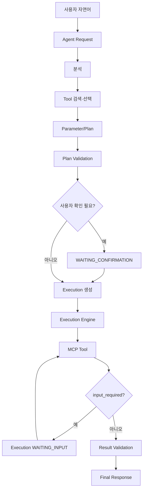

# MCPFlow 기능정의서

> **MCPFlow - MCP-based AI Agent Automation Platform**

| 항목 | 내용 |
|---|---|
| 문서 ID | `MCPF-FUNC-001` |
| 문서 버전 | `v0.3` |
| 상태 | Draft - 정합성 통합본 |
| 기준 문서 | `docs/01-requirements.md` v0.3 |
| 상세 계약 | `04-agent-mcp-architecture.md` v0.2, `05-data-model.md` v0.2 |
| 공식 과제명 | MCP 연계 업무 자동화 AI 에이전트 개발 |
| 개발 프로젝트명 | MCPFlow |
| 최종 수정일 | 2026-09-02 |

---

## 1. 문서 목적

본 문서는 `01-requirements.md`의 요구사항을 실제 구현 가능한 기능 단위(`FNC-*`)로 구체화한다. 각 기능은 실행주체, 입력, 처리, 출력, 상태변화, 예외 및 검증기준을 정의한다.

적용 원칙:

- 요구사항 ID `REQ-*`, `NFR-*`는 범위/수용기준 추적키다.
- 기능 ID `FNC-*`는 API·서비스·화면·시험이 참조하는 구현 단위다.
- Agent/MCP schema와 Plan Step Type은 `04`를 따른다.
- persisted 상태와 enum은 `05`를 따른다.
- 본 문서에서 Canonical enum을 변형하거나 새 상태를 만들지 않는다.

---

## 2. 기능 영역

| 영역 | 기능 ID | 주요 기능 |
|---|---|---|
| 공통 | `FNC-COM-*` | 식별자, 목록, 오류, Job, Idempotency |
| 인증·권한 | `FNC-AUTH-*` | Session, User, Role, Permission, ResourceGrant |
| MCP Server | `FNC-MCP-*` | 등록, 연결, Current/Legacy 확인, 상태, 영향분석 |
| MCP Tool | `FNC-TOOL-*` | Discovery, Version, Policy, Test, Verification |
| Agent | `FNC-AGT-*` | Version, 분석, 검색, 선택, Parameter, Plan, 응답, 평가 |
| Workflow | `FNC-WF-*` | Plan 검증, 작성, 게시, 복합 실행구조 |
| Execution | `FNC-EXE-*` | 생성, 상태, Queue, Tool 호출, retry, MRTR, 취소, 복구 |
| Approval | `FNC-APR-*` | Policy, 요청, 판단, 재개, 만료 |
| Schedule | `FNC-SCH-*` | Version 예약, occurrence, overlap/misfire |
| 운영·감사 | `FNC-OPS-*`, `FNC-AUD-*` | Dashboard, 이력, metric, audit, export |
| 확장 | `FNC-DISC-*`, `FNC-FAC-*` | 외부 MCP 탐색, Tool Factory |

---

## 3. 전체 실행 흐름



Planning 단계의 사용자 입력/확인은 AgentRequest에 속한다. MCP Tool 실행 중 MRTR 입력과 Approval은 Execution에 속한다.

---

# 4. 공통 기능

## FNC-COM-001. 공통 Resource 계약

- 관련: `REQ-CORE-001`, `002`, `005`
- 주요 Resource는 UUID, UTC 시각, 생성/변경정보를 가진다.
- Frontend는 공개 API schema만 사용한다.

## FNC-COM-002. 목록 검색

- 관련: `REQ-CORE-003`, `REQ-AUTH-004`
- 검색, allowlisted filter/sort, pagination을 공통형식으로 제공한다.
- 권한 없는 항목은 `items`와 `total` 모두에서 제외한다.

## FNC-COM-003. 입력검증·오류

```json
{
  "error": {
    "code": "MCP_CONNECTION_TIMEOUT",
    "message": "MCP Server 연결 시간이 초과되었습니다.",
    "details": [],
    "request_id": "...",
    "retryable": true
  }
}
```

오류 prefix:

```text
AUTH_ VALIDATION_ RESOURCE_ MCP_ TOOL_ AGENT_ PLAN_
EXECUTION_ APPROVAL_ SCHEDULE_ JOB_ FACTORY_ SYSTEM_
```

## FNC-COM-004. 비동기 Job

Canonical Job 상태:

```text
PENDING QUEUED RUNNING SUCCEEDED FAILED CANCELLED TIMED_OUT
```

Discovery, embedding, export, Factory, Evaluation 등 장기작업을 HTTP request thread와 분리한다.

## FNC-COM-005. Idempotency/동시성

- 생성성 action은 `Idempotency-Key` 또는 동등한 key를 지원한다.
- Mutable Resource는 `lock_version`/`If-Match`로 충돌을 감지한다.
- 같은 idempotency key에 다른 요청본문은 거절한다.

---

# 5. 인증·권한 기능

## FNC-AUTH-001. 로그인/Session

- 자체 계정 + 서버측 Session을 기본으로 한다.
- Cookie는 HttpOnly/Secure/SameSite와 CSRF 정책을 적용한다.
- OIDC는 AuthProvider adapter 확장점으로 둔다.

## FNC-AUTH-002. User/Role/Permission

- User 활성/비활성/잠금
- Role 생성·Permission 연결
- User 다중 Role
- 권한변경 감사

## FNC-AUTH-003. ResourceGrant

Agent, Workflow, MCP Server/Tool에 대한 자원 범위를 별도 Grant로 제한한다. UI 숨김은 편의기능이며 최종 보안판단은 Backend가 수행한다.

## FNC-AUTH-004. 실행 직전 권한검증

계획 생성 당시 권한과 관계없이 Tool 호출 직전에 User/Agent/Tool/Server/Approval 상태를 다시 확인한다.

---

# 6. MCP Server 기능

## FNC-MCP-001. Server 등록

입력:

```text
name, description
transport_type
endpoint 또는 stdio_manifest_id
auth_type + secret reference
timeout, concurrency, retry
```

초기 상태는 `DRAFT`다.

## FNC-MCP-002. 연결·Protocol 확인

처리:

1. URL/manifest와 secret reference 검증
2. transport 연결
3. Current MCP: self-describing 요청 기반, `server/discover`는 지원 시 optional 선조회
4. Current discovery 미지원 시 직접 요청으로 호환성을 판단하여 `INFERRED_CURRENT` 기록 가능
5. legacy는 initialize/initialized를 `LegacyMCPAdapter`에서 처리
6. protocol version, capability, discovery mode 저장

오류는 DNS, NETWORK, TLS, AUTH, PROTOCOL, PROCESS, TIMEOUT 등으로 분류한다.

## FNC-MCP-003. 상태·설정 변경

Canonical 상태:

```text
DRAFT ACTIVE INACTIVE ERROR
```

`ACTIVE` 전 연결검증과 Tool Discovery 조건을 확인한다. 설정 변경 전 Tool/Agent/Workflow/Schedule 영향을 조회한다.

## FNC-MCP-004. Health Check

Tool side effect 없이 protocol/transport 수준 상태를 점검하고 latency, 최근 성공/실패, 연속 실패를 기록한다.

## FNC-MCP-005. Stdio 실행경계

`stdio_manifest_id`는 `infra/mcp-manifests`의 승인된 manifest만 참조한다. API에 shell command 입력필드를 제공하지 않는다. 실제 process는 `mcp-worker`가 실행한다.

---

# 7. MCP Tool 기능

## FNC-TOOL-001. Discovery/Sync

처리:

1. MCP adapter 준비
2. `tools/list` pagination 완료
3. metadata/schema/annotation 정규화
4. descriptor hash 비교
5. `ADDED`, `CHANGED`, `MISSING`, `UNCHANGED` diff 생성
6. 관리자 적용 후 ToolVersion 생성

## FNC-TOOL-002. Tool 상태 및 Version

Logical Tool 상태:

```text
DISCOVERED ACTIVE INACTIVE MISSING BLOCKED
```

ToolVersion 검증상태:

```text
VALID INVALID WARNING
```

`INVALID`은 Tool logical status가 아니라 ToolVersion validation 결과다. Server에서 사라진 Tool은 `MISSING`으로 보존한다.

## FNC-TOOL-003. Tool Policy

Canonical policy:

```json
{
  "risk_class": "NON_IDEMPOTENT_WRITE",
  "requires_confirmation": true,
  "requires_approval": true,
  "approval_policy_id": "...",
  "timeout_ms": 30000,
  "max_attempts": 1,
  "max_result_bytes": 10485760,
  "allow_auto_select": false
}
```

위험도는 `READ_ONLY`, `IDEMPOTENT_WRITE`, `NON_IDEMPOTENT_WRITE`, `DESTRUCTIVE`, `UNKNOWN`을 사용한다.

## FNC-TOOL-004. 검색·상세

검색대상:

```text
name description tags capability Server status risk_class validation_status
```

일반 사용자와 관리자의 상세노출 범위를 분리한다.

## FNC-TOOL-005. Test Call

관리자 Tool 시험도 일반 Execution 보안경로를 사용하며 `source_type=MANUAL_TOOL_TEST`로 구분한다.

## FNC-TOOL-006. Tool Verification

특정 ToolVersion의 검증 증적을 생성한다.

검증 완료 조건 예:

- Server 연결 성공
- protocol/capability 확인
- Discovery 및 schema VALID
- 최소 1회 정상 Test Execution
- timeout/error 처리 확인
- 검증자와 기준 version 기록

Verification 상태:

```text
PENDING VERIFIED FAILED EXPIRED
```

과제 연계·검증 완료 Tool 집계는 유효한 `VERIFIED` 증적 기준이다.

---

# 8. Agent 기능

## FNC-AGT-001. Agent/Version 관리

Logical Agent:

```text
DRAFT ACTIVE INACTIVE ARCHIVED
```

AgentVersion:

```text
DRAFT → PUBLISHED → DEPRECATED
```

Published version을 직접 수정하지 않는다. Tool Grant도 Version 단위로 관리한다.

## FNC-AGT-002. 자연어 요청 접수·구조화

`04-agent-mcp-architecture.md`의 `StructuredRequest v1`을 사용한다. 본 문서에서 별도 schema를 재정의하지 않는다.

AgentRequest Canonical 상태:

```text
RECEIVED ANALYZING RETRIEVING SELECTING BUILDING_PARAMETERS
PLANNING VALIDATING WAITING_INPUT WAITING_CONFIRMATION
READY REJECTED FAILED CANCELLED
```

## FNC-AGT-003. Tool 후보검색

순서:

1. User Permission/ResourceGrant
2. AgentVersion Tool grant
3. Server/Tool ACTIVE
4. ToolVersion VALID
5. Policy hard filter
6. lexical/vector hybrid retrieval
7. LLM rerank

권한 없는 Tool은 LLM에 전달하지 않는다.

## FNC-AGT-004. Tool 평가·선택

- ToolVersion ID, confidence, margin, reason summary 저장
- 후보 없음: `NO_MATCH`
- 경합/낮은 신뢰도: clarification/confirmation
- high-risk: 점수와 별개로 policy 적용

chain-of-thought 저장을 요구하지 않는다.

## FNC-AGT-005. Planning 전 추가입력·확인

`WAITING_INPUT`: 필수 Parameter 등 계획 전 추가정보.

`WAITING_CONFIRMATION`: Tool/Plan/외부 side effect에 대한 실행 전 사용자 확인.

둘 다 AgentRequest 상태이며 Execution 상태가 아니다.

## FNC-AGT-006. Parameter 구성

Provenance:

```text
USER_EXPLICIT WORKFLOW_INPUT CONVERSATION_CONFIRMED
STEP_OUTPUT POLICY_DEFAULT MODEL_DERIVED SECRET_REFERENCE
```

Execution Plan Binding kind와 provenance를 혼용하지 않는다.

## FNC-AGT-007. Plan 생성·검증

`04`의 Execution Plan v1을 생성하고 Plan Validator를 통과해야 한다. 권한/정책 위반을 LLM repair로 우회하지 않는다.

## FNC-AGT-008. 최종응답

실제 Execution/Step 결과를 기반으로 `SUCCEEDED`, `PARTIALLY_SUCCEEDED`, `FAILED` 등을 정확하게 표현한다. 실행되지 않은 작업을 완료했다고 쓰지 않는다.

## FNC-AGT-009. Provider Profile

LLM/Embedding Provider를 관리하고 OpenAI-compatible API를 기본 adapter로 지원한다. credential은 Secret reference다.

## FNC-AGT-010. Tool 매핑 Evaluation

Dataset, AgentVersion, Prompt, model, embedding, Registry snapshot, threshold, commit SHA를 고정해 재현한다.

---

# 9. Workflow 기능

## FNC-WF-001. Execution Plan 검증

검증:

```text
schema/version
Step ID/type/config
dependency/cycle/reachability
binding/path/type
predicate
loop limit
ToolVersion/Server state
User/Agent Permission
ToolPolicy/ApprovalPolicy
overall limits
```

## FNC-WF-002. Workflow 작성/Version

Logical Workflow:

```text
DRAFT ACTIVE INACTIVE ARCHIVED
```

WorkflowVersion:

```text
DRAFT → PUBLISHED → DEPRECATED
```

DRAFT만 편집한다.

## FNC-WF-003. 순차·병렬

JOIN policy:

```text
ALL_SUCCESS ALL_COMPLETE ANY_SUCCESS
```

## FNC-WF-004. 조건

`04`의 제한된 Predicate AST만 사용한다. 임의 JavaScript/Python expression은 금지한다.

## FNC-WF-005. 제한반복

`FOR_EACH`, `WHILE`을 지원하며 max iteration을 필수로 둔다.

## FNC-WF-006. Input/Binding

`LITERAL`, `PLAN_INPUT`, `STEP_OUTPUT`, `EXECUTION_CONTEXT`, `LOOP_CONTEXT`, `SECRET_REF`를 사용한다.

## FNC-WF-007. Approval Step

Plan `APPROVAL` Step은 `approval_policy_id`를 참조한다. 승인 context snapshot과 실제 후속 Tool input을 재검증한다.

## FNC-WF-008. User Input 처리

Plan v1에는 authoring `USER_INPUT` Step Type을 제공하지 않는다. MCP Current MRTR의 `input_required`가 발생하면 실행 중 Tool Step이 `WAITING_INPUT`으로 전환된다.

## FNC-WF-009. 게시·폐기

Blocking validation error가 없는 `DRAFT`만 `PUBLISHED`로 전환한다. 게시 버전을 수정하지 않는다.

## FNC-WF-010. 수동 실행

Published WorkflowVersion + typed input으로 Execution을 생성하며 실행시점 Permission/Tool 상태를 재검증한다.

---

# 10. Execution Engine 기능

## FNC-EXE-001. Execution 생성

Execution 생성 시 고정:

```text
source_type / trigger_type
requester
AgentRequest/AgentVersion/WorkflowVersion
Plan snapshot + hash
input snapshot
ToolVersion
policy snapshot
idempotency key
```

Canonical source type:

```text
AGENT_REQUEST WORKFLOW_VERSION SCHEDULE_OCCURRENCE MANUAL_TOOL_TEST FACTORY_TEST
```

Retry는 `parent_execution_id` + `trigger_type=RETRY`로 표현한다.

## FNC-EXE-002. 상태전이

Execution:

```text
CREATED QUEUED RUNNING WAITING_INPUT WAITING_APPROVAL CANCEL_REQUESTED
SUCCEEDED PARTIALLY_SUCCEEDED FAILED CANCELLED TIMED_OUT
```

Step:

```text
PENDING READY RUNNING WAITING_INPUT WAITING_APPROVAL
SUCCEEDED FAILED SKIPPED TIMED_OUT CANCELLED UNKNOWN_OUTCOME
```

`PLANNING`, `WAITING_CONFIRMATION`, `REJECTED`, `EXPIRED`, `PARTIAL`을 Execution 상태로 사용하지 않는다.

## FNC-EXE-003. Queue/Claim

Celery/Redis는 전달과 coordination에 사용하고 DB가 상태 원본이다. Worker는 lease/idempotent claim을 사용한다.

## FNC-EXE-004. 실행 직전 재검증

User 활성/Permission, Agent grant, Server/Tool state, input, ToolPolicy, Approval snapshot, concurrency를 다시 확인한다.

## FNC-EXE-005. MCP Tool 호출

Attempt 생성 → Secret 주입 → MCP Adapter → progress/MRTR/cancel 처리 → Result Validation → 이력/metric.

## FNC-EXE-006. Timeout/Retry

- read/idempotent 일시오류만 제한 retry
- non-idempotent 결과불명은 `UNKNOWN_OUTCOME`
- max attempts와 전체 timeout 준수

## FNC-EXE-007. 결과검증

protocol 성공과 업무 output validation을 분리한다. output schema 불일치는 `SUCCEEDED` 금지.

## FNC-EXE-008. MRTR 입력

Current MCP `input_required` 발생 시:

1. inputRequests/requestState 저장
2. Step/Execution을 `WAITING_INPUT`
3. UI에서 사용자 입력
4. schema 검증
5. inputResponses + requestState로 원 요청 재호출
6. 최대 round/timeout 적용

Legacy elicitation은 같은 내부 흐름으로 normalize한다.

## FNC-EXE-009. Approval 대기

Approval Step 또는 ToolPolicy가 요구하면 `WAITING_APPROVAL`로 전환한다. 승인/거절/만료 결과는 Approval 엔터티에 남기며 Execution terminal은 Plan completion 정책으로 판정한다.

## FNC-EXE-010. 취소

취소 요청 → `CANCEL_REQUESTED` → 신규 Step 차단 → 가능한 remote cancel → 안전한 종료 후 `CANCELLED`.

## FNC-EXE-011. 복구

Worker lease, MCP task handle, persisted state를 사용해 재시작 후 복구한다. 동일 non-idempotent Tool을 무조건 재호출하지 않는다.

## FNC-EXE-012. 부분성공

선택 Step 실패 또는 승인 거절 등이 Plan completion policy상 허용되면 `PARTIALLY_SUCCEEDED`, 아니면 `FAILED`로 종료한다.

---

# 11. Approval 기능

## FNC-APR-001. ApprovalPolicy

관리 가능한 항목:

```text
decision mode
required approvals
approver scope
expiry
self approval
reject comment
```

## FNC-APR-002. 요청 생성

Tool/입력/위험/선행결과/요청자를 masked snapshot으로 저장하고 context hash를 계산한다.

## FNC-APR-003. Decision

Approval 상태:

```text
PENDING APPROVED REJECTED EXPIRED CANCELLED
```

Decision 값:

```text
APPROVE REJECT
```

중복/만료/권한/context hash를 transaction에서 검증한다.

## FNC-APR-004. 실행 재개

승인된 경우 후속 Tool 직전 최신 Permission과 context hash를 확인하고 동일 Execution을 재개한다.

---

# 12. Schedule 기능

## FNC-SCH-001. 예약 생성

Target:

```text
AGENT_VERSION
WORKFLOW_VERSION
```

논리 Resource의 “최신 버전”을 실행시점에 자동 선택하지 않는다.

## FNC-SCH-002. Schedule lifecycle

```text
ACTIVE PAUSED COMPLETED ERROR
```

## FNC-SCH-003. Occurrence

```text
PLANNED SKIPPED ENQUEUED RUNNING COMPLETED FAILED
```

`(schedule_id, scheduled_for)` unique로 중복 발생을 방지한다.

## FNC-SCH-004. Overlap/Misfire

Overlap:

```text
ALLOW SKIP QUEUE REPLACE
```

Misfire:

```text
SKIP RUN_ONCE CATCH_UP_LIMITED
```

## FNC-SCH-005. 실행시점 검증

사용자/Version/Tool/Permission을 다시 확인하고 `source_type=SCHEDULE_OCCURRENCE` Execution을 생성한다.

---

# 13. 운영·감사 기능

## FNC-OPS-001. Dashboard

- 실행 건수·성공/실패/대기
- MCP Server/Tool 상태
- Approval/Schedule/Job 이상
- Tool mapping 평가 요약

## FNC-OPS-002. Execution 운영조회

상태, 사용자, Agent, Workflow, Tool, 기간, 오류로 검색하고 Step/Event/Attempt를 추적한다.

## FNC-OPS-003. Health/Metric

- `/health/live`, `/health/ready`
- 업무 Dashboard 집계와 infrastructure metric 분리
- API/Queue/Worker/LLM/MCP/Scheduler metric

## FNC-AUD-001. Audit

중요 행위를 append-only event로 저장한다. 일반 앱 기능에 Update/Delete API를 제공하지 않는다.

## FNC-AUD-002. Export

권한이 적용된 Execution/Audit 결과를 CSV/JSONL 등으로 비동기 export하고 Object Storage에 저장한다.

---

# 14. 외부 MCP 탐색

## FNC-DISC-001. 후보 검색

Registry/허용 URL에서 metadata 후보를 수집하되 검색결과를 내부 Tool로 자동 등록하지 않는다.

## FNC-DISC-002. 보안 검토

출처, version, license, repository, install/connection hint를 표시하고 외부 문구/스크립트를 untrusted로 처리한다.

## FNC-DISC-003. Import

검토된 후보를 `mcp_servers.DRAFT`로만 가져온다. 이후 일반 MCP 연결검증/Discovery/Tool 검증을 수행한다.

---

# 15. Tool Factory

## FNC-FAC-001. Source 입력/분석

OpenAPI JSON/YAML 또는 제한된 Python source를 입력받아 구조, URL, ref, operation, dependency를 검증한다.

## FNC-FAC-002. 생성

선택 operation을 Tool로 생성하고 credential은 Secret reference placeholder로만 표현한다.

## FNC-FAC-003. Sandbox Build/Test

Core API/Worker에서 source를 직접 `exec/import`하지 않는다. 별도 `factory-worker`의 제한된 환경에서 build/test한다.

## FNC-FAC-004. 검증/배포 승인

구조검사, 기동, MCP Discovery, Tool test, 보안시험을 통과하고 관리자 승인 후 Draft MCP Server 등록으로 handoff한다.

## FNC-FAC-005. Version/Evidence

source hash, generator version, dependency lock, image/artifact hash, test report를 보존한다.

---

## 16. 완료 정의

기능 완료는 코드가 존재하는 것만으로 판정하지 않는다.

```text
관련 REQ/NFR 식별
→ 설계 계약 일치
→ API/Data/UI 반영
→ 자동/수동 Test 통과
→ 필요 Evidence 생성
→ 관련 문서 현행화
```

특히 상태·Step Type·risk_class·Version lifecycle은 `04`와 `05`에 없는 값을 임의로 추가하지 않는다.
