# MCPFlow 시스템 아키텍처 설계서

> **MCPFlow - MCP-based AI Agent Automation Platform**

| 항목 | 내용 |
|---|---|
| 문서 ID | `MCPF-ARCH-001` |
| 문서 버전 | `v0.1` |
| 상태 | Draft - 개발 기준 초안 |
| 기준 문서 | `docs/01-requirements.md` v0.1, `docs/02-functional-specification.md` v0.1 |
| 공식 과제명 | MCP 연계 업무 자동화 AI 에이전트 개발 |
| 개발 프로젝트명 | MCPFlow |
| 최종 수정일 | 2026-09-02 |

---

## 1. 문서 목적

본 문서는 MCPFlow의 전체 시스템 구조, 기술 스택, 컴포넌트 책임, 데이터 및 실행 흐름, 배포단위, 보안 경계, 장애복구와 확장방식을 정의한다.

이 문서는 다음 후속 작업의 직접적인 기준으로 사용한다.

- Backend 및 Frontend 프로젝트 골격 생성
- `docs/04-agent-mcp-architecture.md`의 Agent/MCP 상세설계
- `docs/05-data-model.md`의 엔터티, 트랜잭션 및 인덱스 설계
- `docs/06-api-design.md`의 REST/SSE 계약 설계
- `docs/07-ui-ux-design.md`의 화면·상태·권한 설계
- `docs/08-deployment-architecture.md`의 Docker 및 운영환경 설계
- Cursor Agents Window 작업분담과 코드 리뷰 기준

본 문서에서 확정한 아키텍처를 변경하려면 관련 ADR, 영향받는 요구사항 ID, 데이터 migration, API 호환성 및 배포영향을 함께 검토한다.

---

## 2. 아키텍처 목표

### 2.1 핵심 목표

1. 소규모 개발팀이 6개월 범위 안에서 완성 가능한 구조여야 한다.
2. 자연어 분석과 실제 Tool 실행의 책임을 분리하여 LLM의 비결정성을 통제해야 한다.
3. 장기 실행, 예약, 승인대기 및 장애복구 상태를 프로세스 memory가 아닌 영속 데이터로 관리해야 한다.
4. MCP Server와 Tool 증가에 따라 Worker를 수평확장할 수 있어야 한다.
5. Docker Compose로 동일하게 개발·시험·운영할 수 있어야 한다.
6. 권한, 승인, 감사 및 secret 보호가 모든 실행경로에서 우회되지 않아야 한다.
7. 설계문서와 코드가 동일한 기능·모듈·용어를 사용해야 한다.

### 2.2 주요 품질속성

| 품질속성 | 아키텍처 대응 |
|---|---|
| 안전성 | 실행 직전 권한·정책 재검증, 승인 snapshot, secret 격리, Tool allowlist |
| 신뢰성 | PostgreSQL 상태 원본, idempotency, transactional outbox, Worker lease, 복구 Worker |
| 확장성 | API/Worker/Scheduler 분리, Queue 기반 분산, stateless API, Worker pool 확장 |
| 추적성 | request/execution/step/tool-call correlation, 상태전이·감사 이벤트 저장 |
| 유지보수성 | 모듈형 모놀리스, Port/Adapter, 명시적 도메인 경계, 공유 계약 |
| 호환성 | MCP transport adapter, protocol 협상, LLM Provider adapter, Storage adapter |
| 배포성 | 단일 Backend 이미지의 역할별 command, Docker Compose profile, migration 분리 |
| 시험성 | 외부 LLM/MCP mock, contract test, deterministic Execution Engine |

---

## 3. 제약조건 및 전제

| 구분 | 내용 |
|---|---|
| 개발방식 | Cursor Agents Window와 Figma Make를 활용하되 설계문서를 Source of Truth로 사용 |
| Frontend | React + TypeScript + Vite |
| Backend | Python + FastAPI + Pydantic + SQLAlchemy |
| Database | PostgreSQL, Tool hybrid 검색을 위한 pgvector 사용 |
| 배포 | Docker 및 Docker Compose가 기본이며 Kubernetes는 현재 필수가 아님 |
| LLM | OpenAI-compatible API를 기본 Provider 계약으로 사용 |
| MCP | `stdio`, Streamable HTTP 지원, legacy HTTP+SSE는 선택 호환 |
| 사용자 규모 | 초기 단일 조직 내부 운영을 기준으로 하며 멀티테넌트 과금은 제외 |
| 실행 특성 | 수 초부터 장시간 실행, 승인·예약으로 수 시간 이상 대기 가능 |
| 보안 | 외부 MCP, Tool 출력 및 Factory 원본은 신뢰할 수 없는 입력으로 취급 |

---

## 4. 핵심 아키텍처 결정

| ADR | 결정 | 상태 | 근거 |
|---|---|---|---|
| ADR-001 | Backend는 모듈형 모놀리스 코드베이스로 개발하고 API·Worker·Scheduler 프로세스를 분리한다. | Accepted | 개발·배포 복잡도를 낮추면서 장기작업과 수평확장을 지원 |
| ADR-002 | PostgreSQL을 업무상태와 실행상태의 유일한 Source of Truth로 사용한다. | Accepted | 승인대기·예약·복구·감사 상태의 일관성과 조회성 확보 |
| ADR-003 | Redis/Celery는 비동기 작업 전달과 단기 coordination에 사용하고 최종 실행상태를 저장하지 않는다. | Accepted | Queue 재전달·유실 가능성과 업무상태를 분리 |
| ADR-004 | Workflow/Execution은 자체 명시적 상태머신과 DAG 실행기로 구현한다. | Accepted | LLM·외부 Agent Framework에 핵심 실행통제를 의존하지 않음 |
| ADR-005 | Agent Runtime은 구조화 출력만 생성하고 검증된 Execution Plan만 실행엔진에 전달한다. | Accepted | 자연어 계획의 직접실행 및 정책우회 방지 |
| ADR-006 | MCP 연계는 공식 Python SDK를 감싼 Port/Adapter로 구현한다. | Accepted | protocol 변화와 SDK 교체가 도메인에 전파되지 않도록 분리 |
| ADR-007 | Tool 후보검색은 권한필터 후 PostgreSQL 전문검색과 pgvector를 결합한 hybrid 검색을 사용한다. | Accepted | Tool 수 증가와 동의어 요청의 매핑 정확도 대응 |
| ADR-008 | Client 쓰기·조회는 REST, 실행 진행상태는 SSE와 polling fallback을 사용한다. | Accepted | 단방향 상태전달 요구에 비해 WebSocket 운영복잡도를 줄임 |
| ADR-009 | 기본 인증은 자체 계정과 서버측 session으로 제공하고 AuthProvider 인터페이스로 OIDC 확장을 허용한다. | Accepted | 독립 실행 가능한 기본제품과 조직 인증 확장성 확보 |
| ADR-010 | secret은 DB의 암호문과 외부 master key/Docker secret으로 분리한다. | Accepted | 조회 API·DB dump·로그에서 원문 노출 최소화 |
| ADR-011 | 대용량 결과, export 및 Factory 산출물은 S3-compatible Object Storage에 저장한다. | Accepted | DB 비대화 방지와 결과 보존정책 분리 |
| ADR-012 | Docker Compose edge proxy는 Traefik을 기본으로 사용한다. | Accepted | TLS 종료, path routing, health 기반 routing과 향후 서비스 추가 용이 |
| ADR-013 | Tool Factory 산출 MCP Server는 기본적으로 독립 Streamable HTTP 컨테이너로 배포한다. | Accepted | 동적 Python 코드를 핵심 Worker 프로세스와 격리 |
| ADR-014 | 감사·비동기 이벤트는 업무 transaction과 transactional outbox로 연결한다. | Accepted | 업무 성공 후 감사·Queue 이벤트만 유실되는 문제 방지 |

### 4.1 선택하지 않은 구조

| 대안 | 현재 선택하지 않은 이유 |
|---|---|
| 초기 Microservices 분리 | 작은 팀에서 계약·배포·관측·분산 transaction 비용이 과도함 |
| LLM이 Tool을 직접 반복 호출하는 완전 자율 loop | 권한, 승인, 재시도, 감사 및 재현성을 통제하기 어려움 |
| LangGraph 등 Agent Framework를 핵심 실행원장으로 사용 | 제품 고유 상태모델과 장기 승인·예약 요구를 외부 추상화에 종속시킬 위험 |
| Redis를 Execution 상태 원본으로 사용 | 영속 이력, 관계조회, 감사 및 복구 요구에 부적합 |
| WebSocket 단일 사용 | 현재 상태전달은 서버→클라이언트 중심이며 연결운영 복잡도가 증가 |
| API container에서 임의 stdio 명령 실행 | 공격면 확대와 API 안정성 저하 |
| 생성 Tool에 host Docker socket 직접 제공 | host 제어권 노출 위험이 큼 |

---

## 5. 시스템 컨텍스트

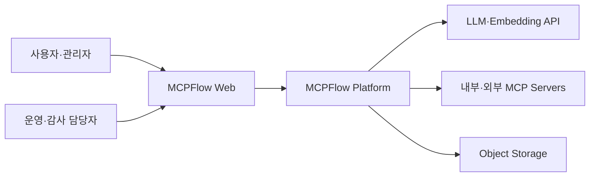

### 5.1 외부 시스템

| 외부 시스템 | 연계방식 | MCPFlow 책임 |
|---|---|---|
| LLM Provider | OpenAI-compatible HTTPS API | 요청제한, 구조화 출력검증, timeout, masking, 사용량 기록 |
| Embedding Provider | Adapter 기반 HTTPS 또는 내부 모델 | Tool metadata embedding 생성·버전 관리 |
| Remote MCP Server | Streamable HTTP, 선택적 legacy SSE | 연결·protocol 협상, Discovery, Tool 호출, timeout, 정책 |
| Local MCP Server | stdio subprocess | allowlist, 격리 Worker, process lifecycle, resource 제한 |
| 외부 MCP Registry | HTTPS API/문서 조회 | 후보만 수집하며 자동 설치·실행 금지 |
| Object Storage | S3-compatible API | 대용량 결과, export, Factory artifact 저장 |
| 알림 채널 | Notification Adapter | 승인·실행·예약 이벤트 전달, 실패 재처리 |

---

## 6. 논리 아키텍처

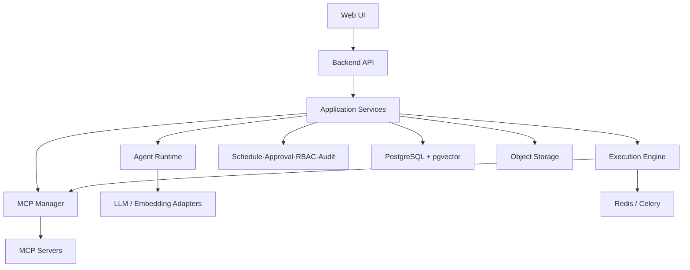

### 6.1 계층 구조

| 계층 | 책임 | 의존방향 |
|---|---|---|
| Presentation | REST/SSE endpoint, 인증 context, request/response schema | Application |
| Application | 유스케이스 orchestration, transaction 경계, 권한·정책 호출 | Domain, Ports |
| Domain | 엔터티, 값 객체, 상태전이, 업무규칙, 정책 | 외부 framework에 의존하지 않음 |
| Ports | Repository, Queue, LLM, MCP, Storage, Secret, Notification 인터페이스 | Domain type 사용 |
| Adapters | SQLAlchemy, Celery, MCP SDK, OpenAI-compatible client, S3, Redis 구현 | Ports 구현 |
| Infrastructure | FastAPI bootstrap, DI, config, logging, migration, container command | 전체 조립 |

의존성은 바깥 계층에서 안쪽 계층로 향한다. Domain에서 FastAPI, Celery, SQLAlchemy, MCP SDK 객체를 직접 사용하지 않는다.

---

## 7. 실행 프로세스 아키텍처

하나의 Backend source와 image를 사용하되 command와 Queue 역할을 분리한다.

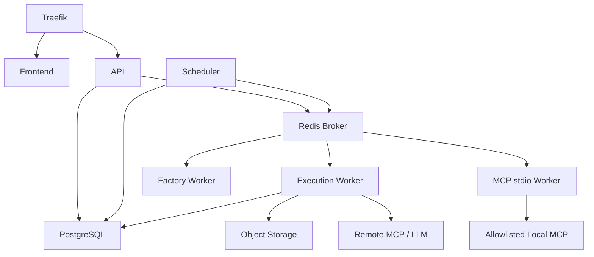

### 7.1 프로세스별 책임

| 프로세스 | 책임 | 금지사항 |
|---|---|---|
| `api` | REST/SSE, 인증, 동기 조회·변경, Execution 생성, Job 상태 | 장기 Tool 실행, 임의 subprocess |
| `worker` | Agent planning, DAG Step 실행, Remote MCP 호출, 결과검증, 복구 task | HTTP request session에 종속된 상태 |
| `mcp-stdio-worker` | 승인된 stdio MCP process 기동·호출·종료 | 임의 shell, host 경로, Docker socket |
| `scheduler` | due schedule claim, occurrence 생성, Execution enqueue, 만료·복구 scan | 실제 Workflow/Tool 실행 |
| `factory-worker` | 원본분석, 코드생성, 격리 build/test, artifact 생성 | 운영 DB secret 직접 사용, 자동 운영 활성화 |
| `outbox-relay` | 미전송 outbox claim, Queue/notification publish, 재시도 | 업무상태 임의 변경 |
| `migration` | Alembic migration 단회 수행 | API와 동시에 자동 schema 변경 |

초기 개발환경에서는 `scheduler`와 `outbox-relay`를 한 container command 안에서 실행할 수 있으나 논리 책임과 leader/lock은 분리한다.

### 7.2 Worker Queue 분리

| Queue | 작업 예시 | 기본 특성 |
|---|---|---|
| `agent` | 요청분석, 후보검색, Tool 선택, 계획생성, 최종응답 | 외부 LLM 지연, 제한된 retry |
| `execution` | DAG 상태전이, Remote MCP Step, 결과검증 | 높은 추적성, idempotent claim |
| `mcp_stdio` | local process MCP 호출 | 격리 container, 낮은 concurrency |
| `factory` | OpenAPI/Python 생성·build·test | 높은 자원, 별도 profile |
| `maintenance` | health check, embedding 갱신, export, 보존·정리 | 낮은 우선순위 |

Celery task payload에는 업무데이터 전체나 secret을 넣지 않고 `job_id`, `execution_id`, `step_execution_id` 등 식별자만 전달한다.

---

## 8. 기술 스택 기준

### 8.1 애플리케이션

| 영역 | 선택 | 적용 기준 |
|---|---|---|
| Frontend | React, TypeScript, Vite | SPA, strict TypeScript, API generated types 검토 |
| UI | Figma Make 결과 + 프로젝트 디자인 토큰 | 생성 코드를 직접 도메인 계약으로 사용하지 않음 |
| Backend API | Python 3.12, FastAPI, Pydantic | async I/O, OpenAPI, 명시적 dependency injection |
| ORM/Migration | SQLAlchemy 2.x, Alembic | async session, migration version 관리 |
| Task Queue | Celery 5.6 계열, Redis broker | task delivery만 담당, DB 상태와 분리 |
| Database | PostgreSQL 17 이상 | JSONB, row lock, transaction, full-text search |
| Vector | pgvector | Tool embedding 및 hybrid 후보검색 |
| MCP | 공식 Python SDK, protocol adapter | stdio, Streamable HTTP, version negotiation |
| HTTP Client | HTTPX 계열 async client | timeout, connection pool, redirect·SSRF 정책 |
| Object Storage | MinIO 기본, S3-compatible adapter | 결과, export, Factory artifact |
| Reverse Proxy | Traefik | TLS 종료, `/`, `/api`, `/events` routing |

### 8.2 개발·품질

| 영역 | 선택 또는 기준 |
|---|---|
| Python dependency | `pyproject.toml` + lock file, `uv` 사용 권장 |
| Frontend dependency | `package.json` + lock file, Node.js 22 LTS 기준 |
| Backend test | pytest, async integration test, contract fixture |
| Frontend test | unit/component test + 핵심 Playwright E2E |
| Lint/type | Ruff, mypy 또는 pyright, ESLint, TypeScript strict |
| API client | OpenAPI에서 TypeScript type/client 생성 또는 contract 검증 |
| CI | lint, type, unit, integration, migration, build, secret scan |
| Container | multi-stage build, non-root runtime, health check |

정확한 patch version은 구현 시작 시 lock file과 image digest로 고정한다. architecture 문서에는 호환 기준 major/minor만 기록하고 dependency update는 검증 후 수행한다.

---

## 9. Backend 모듈 구조

```text
backend/
├── pyproject.toml
├── uv.lock
├── alembic.ini
├── migrations/
├── src/mcpflow/
│   ├── main.py
│   ├── bootstrap/
│   ├── common/
│   ├── auth/
│   ├── users/
│   ├── mcp_registry/
│   ├── tool_registry/
│   ├── agents/
│   ├── workflows/
│   ├── executions/
│   ├── approvals/
│   ├── schedules/
│   ├── audit/
│   ├── operations/
│   ├── discovery/
│   ├── tool_factory/
│   ├── integrations/
│   └── workers/
└── tests/
    ├── unit/
    ├── integration/
    ├── contract/
    └── e2e/
```

### 9.1 모듈 내부 표준

```text
module/
├── domain/
│   ├── entities.py
│   ├── value_objects.py
│   ├── policies.py
│   ├── events.py
│   └── errors.py
├── application/
│   ├── commands.py
│   ├── queries.py
│   ├── handlers.py
│   └── ports.py
├── infrastructure/
│   ├── models.py
│   ├── repositories.py
│   └── adapters.py
└── presentation/
    ├── router.py
    └── schemas.py
```

작은 모듈에 빈 계층을 기계적으로 만들지는 않되 Domain과 외부 framework 경계는 유지한다.

### 9.2 모듈 소유권

| 모듈 | 소유 데이터 | 외부에 제공하는 주요 기능 |
|---|---|---|
| `auth/users` | User, Role, Permission, Session | 인증 context, 권한판단 |
| `mcp_registry` | MCPServer, ConnectionCheck | 등록, 연결, 상태, protocol 정보 |
| `tool_registry` | MCPTool, ToolVersion, ToolPolicy | Discovery 적용, 검색, 활성화, schema |
| `agents` | Agent, AgentVersion, evaluation | 분석, 후보선택, planning, 응답 |
| `workflows` | Workflow, Version, Plan schema | plan validation, publish, version |
| `executions` | Execution, Step, Attempt, Result | 상태머신, Step claim, 실행·복구 |
| `approvals` | ApprovalRequest, Decision, Snapshot | 승인 생성·판단·만료 |
| `schedules` | Schedule, Occurrence | due claim, 다음 시각, 중복정책 |
| `audit` | AuditEvent | append, 조회, export |
| `operations` | Job, Setting, Outbox | health, metric, background job, event relay |
| `discovery` | ExternalCandidate, Review | 외부 후보 수집·검토 |
| `tool_factory` | FactoryJob, Source, Artifact | 분석, 생성, 시험, 등록 handoff |

모듈 간 DB table을 직접 수정하지 않고 application service 또는 명시된 repository/port를 통해 접근한다.

---

## 10. Frontend 아키텍처

```text
frontend/
├── src/
│   ├── app/
│   │   ├── router/
│   │   ├── providers/
│   │   └── layouts/
│   ├── features/
│   │   ├── auth/
│   │   ├── dashboard/
│   │   ├── agent-run/
│   │   ├── executions/
│   │   ├── mcp-servers/
│   │   ├── mcp-tools/
│   │   ├── agents/
│   │   ├── workflows/
│   │   ├── approvals/
│   │   ├── schedules/
│   │   ├── audit/
│   │   └── settings/
│   ├── entities/
│   ├── shared/
│   │   ├── api/
│   │   ├── ui/
│   │   ├── hooks/
│   │   ├── lib/
│   │   └── config/
│   └── styles/
└── tests/
```

### 10.1 Frontend 원칙

- 화면은 `docs/02-functional-specification.md`의 `SCR-*`와 기능 ID를 기준으로 구성한다.
- 서버 상태는 query cache로 관리하고 전역 client store에 중복 보관하지 않는다.
- REST API type은 OpenAPI 계약에서 생성하거나 자동 정합성 검증한다.
- 실행 실시간 상태는 SSE event를 query cache에 반영한다.
- SSE 연결실패 시 지수 backoff 후 polling으로 전환한다.
- 권한에 따라 메뉴와 action을 숨기지만 Backend 권한검증을 대체하지 않는다.
- Figma Make code는 `features`와 `shared/ui` 구조에 맞게 재배치한 뒤 API와 연결한다.
- 상태 enum, 오류코드, time format을 화면별 문자열로 중복 구현하지 않는다.

### 10.2 라우팅 기준

| 경로 | 화면 ID | 접근 |
|---|---|---|
| `/login` | `SCR-AUTH-001` | Public |
| `/` | `SCR-DASH-001` | Operator 또는 관리자 |
| `/run` | `SCR-AGT-001` | User |
| `/agents` | `SCR-AGT-002` | Agent Designer |
| `/executions` | `SCR-EXE-001` | 인증 사용자 |
| `/executions/:id` | `SCR-EXE-002` | 자원권한 필요 |
| `/mcp/servers` | `SCR-MCP-001` | MCP Administrator |
| `/mcp/servers/:id` | `SCR-MCP-002` | MCP Administrator |
| `/mcp/tools` | `SCR-TOOL-001` | 권한 사용자 |
| `/mcp/tools/:id` | `SCR-TOOL-002` | 권한 사용자 |
| `/workflows` | `SCR-WF-001` | User/Designer |
| `/workflows/:id/edit` | `SCR-WF-002` | Agent Designer |
| `/approvals` | `SCR-APR-001` | Approver |
| `/schedules` | `SCR-SCH-001` | User/Operator |
| `/discovery` | `SCR-DISC-001` | MCP Administrator |
| `/factory` | `SCR-FAC-001` | Factory Permission |
| `/admin/users` | `SCR-ADM-001` | System Administrator |
| `/admin/roles` | `SCR-ADM-002` | System Administrator |
| `/audit` | `SCR-AUD-001` | Auditor |
| `/settings` | `SCR-SET-001` | System Administrator |

---

## 11. 데이터 아키텍처

### 11.1 저장소 역할

| 저장소 | 저장 데이터 | 저장하지 않는 데이터 |
|---|---|---|
| PostgreSQL | 사용자, Registry, Agent/Workflow 버전, Execution 상태, 승인, 예약, 감사, 설정, metadata | 대형 binary·무제한 Tool 원문 |
| pgvector | Tool 설명·schema embedding, embedding model/version | 사용자 secret |
| Redis | Celery message, 단기 lock/cache, session | 최종 Execution 상태, 감사 원본 |
| Object Storage | 대형 Tool 결과, export, Factory source/artifact/test bundle | 검색용 핵심 metadata |
| Container secret/env | master key, DB password, broker password, storage credential | 일반 업무설정 |

### 11.2 PostgreSQL schema 구분

초기에는 단일 DB와 기본 schema를 사용하되 table prefix 또는 명확한 naming으로 모듈 소유권을 구분한다. 감사·운영 격리가 필요해지면 별도 schema로 이동할 수 있다.

| 영역 | 대표 table |
|---|---|
| Identity | `users`, `roles`, `permissions`, `user_roles`, `sessions` |
| MCP | `mcp_servers`, `mcp_connection_checks`, `mcp_tools`, `mcp_tool_versions`, `tool_policies` |
| Agent | `agents`, `agent_versions`, `agent_tool_grants`, `tool_selection_evaluations` |
| Workflow | `workflows`, `workflow_versions`, `execution_plan_snapshots` |
| Execution | `executions`, `execution_steps`, `step_attempts`, `tool_calls`, `state_transitions` |
| Operation | `approval_requests`, `approval_decisions`, `schedules`, `schedule_occurrences`, `jobs` |
| Audit/Event | `audit_events`, `outbox_events`, `notification_deliveries` |
| Extension | `external_mcp_candidates`, `candidate_reviews`, `factory_jobs`, `factory_artifacts` |

상세 필드, FK, unique constraint, index, partition 및 보존정책은 `docs/05-data-model.md`에서 확정한다.

### 11.3 JSONB 사용기준

JSONB 적용 대상:

- MCP 원본 metadata와 schema snapshot
- Agent 설정 중 Provider별 확장필드
- Execution Plan immutable snapshot
- Tool 입력·출력 중 schema가 Server별로 다른 부분
- 감사 변경정보의 허용된 구조화 payload

정규 column 적용 대상:

- ID, 상태, 소유자, FK, version, 생성·변경시각
- 권한·검색·집계·정렬·보존 조건에 자주 사용하는 필드
- Execution 및 Step의 시작·종료·오류분류·소요시간

JSONB를 모듈 설계를 생략하는 범용 저장소로 사용하지 않는다.

### 11.4 대형 결과 처리

1. 결과 metadata와 hash, media type, size, masking 상태를 DB에 저장한다.
2. 설정 임계값 이하의 구조화 결과는 JSONB에 저장할 수 있다.
3. 임계값 초과 또는 binary 결과는 Object Storage에 저장한다.
4. DB에는 Object key와 보존·접근정책을 저장한다.
5. LLM에는 원본 전체가 아니라 정책에 따른 일부·요약·참조만 전달한다.
6. 다운로드는 권한확인 후 단기 URL 또는 Backend streaming으로 제공한다.

### 11.5 Transactional Outbox

업무 transaction 안에서 상태변경과 `outbox_events` insert를 함께 commit한다.

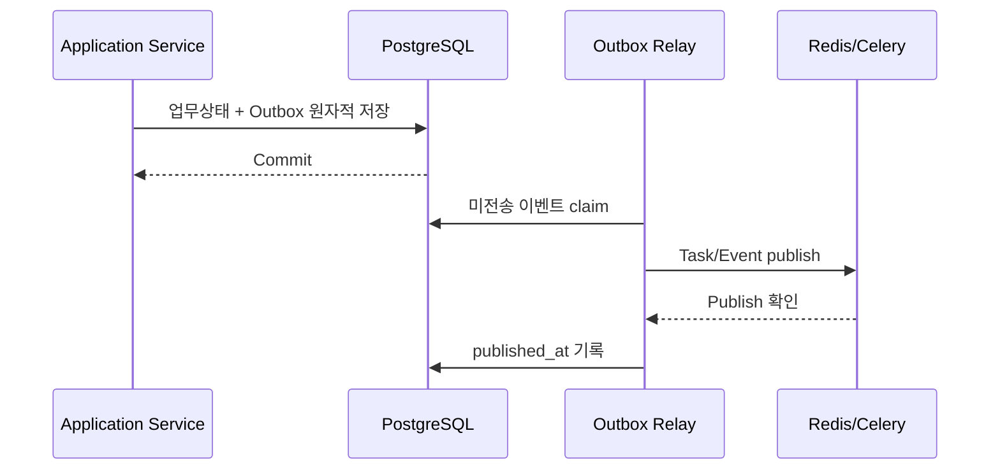

Outbox relay는 중복 publish가 가능하므로 consumer는 event ID 또는 업무 idempotency key로 중복처리한다.

---

## 12. Agent Runtime 아키텍처

### 12.1 구성요소

| 구성요소 | 책임 |
|---|---|
| Request Analyzer | 자연어 요청을 목적·엔터티·제약·기대결과로 구조화 |
| Tool Retriever | 권한·상태 filter 후 lexical/vector 후보검색 |
| Tool Selector | 후보 rerank, 신뢰도, 경합·확인 필요 판정 |
| Parameter Builder | 사용자·맥락·선행결과에서 schema 기반 입력 구성 |
| Plan Generator | Execution Plan schema로 단일·복합 계획 생성 |
| Plan Validator | 구조·cycle·binding·권한·정책·한도 검증 |
| Response Composer | 검증된 Step 결과로 성공·부분성공·실패 응답 생성 |
| Evaluation Runner | dataset 기반 Tool mapping 및 E2E 평가 |

### 12.2 Tool 선택 흐름

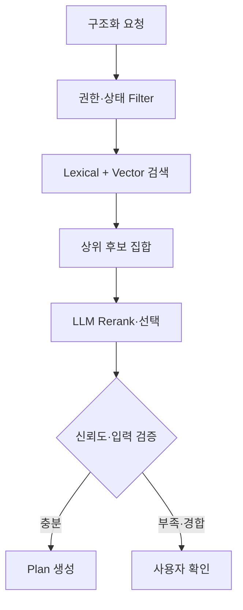

### 12.3 LLM Provider Port

```python
class LLMProviderPort(Protocol):
    async def structured_generate(
        self,
        *,
        model: str,
        messages: list[Message],
        response_schema: dict,
        timeout_seconds: float,
        trace_context: TraceContext,
    ) -> StructuredGenerationResult: ...
```

Provider adapter는 base URL, 인증, model mapping, structured output 지원차이를 흡수한다. Domain/Application은 OpenAI SDK의 response 객체에 의존하지 않는다.

### 12.4 Prompt와 Context 보호

- System/Agent 지침, 사용자 입력, Tool metadata, Tool 결과를 구분된 message/context로 구성한다.
- Tool 결과와 외부 Registry 설명은 untrusted data로 표시한다.
- secret은 prompt에 포함하지 않는다.
- 전체 Tool 목록 대신 Retriever 상위 후보만 전달한다.
- planning 최대횟수, 후보 수, token budget, timeout을 Agent 버전에 저장한다.
- 구조화 출력 실패는 제한된 repair 후 실패하며 raw text를 plan으로 실행하지 않는다.

Agent와 MCP 실행구조의 상세 schema·prompt·평가방식은 `docs/04-agent-mcp-architecture.md`에서 정의한다.

---

## 13. Execution Engine 아키텍처

### 13.1 핵심 원칙

- Execution Plan은 실행 시작 전에 immutable snapshot으로 저장한다.
- 실행엔진만 Execution/Step 상태를 변경할 수 있다.
- Worker는 Queue message가 아니라 DB 상태를 확인하여 실행권을 획득한다.
- 각 Step 시작 직전에 사용자·Agent·Tool·Server·승인 정책을 재검증한다.
- 상태전이는 조건부 update 또는 row lock으로 원자적으로 처리한다.
- 외부 부작용과 DB transaction을 하나의 분산 transaction으로 가정하지 않는다.
- 결과가 불명확한 부작용 호출은 자동 반복하지 않고 수동확인 대상으로 처리한다.

### 13.2 Step 실행 sequence

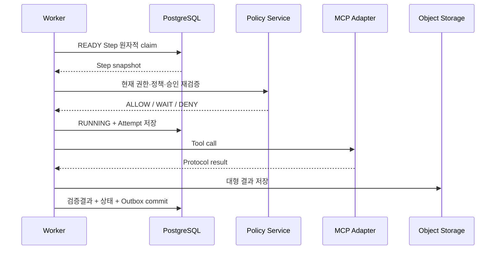

### 13.3 Step claim

Step은 다음 조건을 모두 충족할 때만 `READY`가 된다.

- 모든 필수 선행 Step이 계획의 join 정책을 충족함
- 선택된 조건분기 경로에 포함됨
- 반복 한도와 종료조건을 충족함
- 실행 전체가 취소·종료 상태가 아님
- 승인대기가 필요한 경우 유효한 승인 snapshot이 있음

복수 Worker가 같은 Step을 처리하지 않도록 상태 조건부 update, version column 또는 row lock을 사용한다.

### 13.4 Queue 전달과 DB 상태 관계

| 상황 | 처리 |
|---|---|
| Queue task 중복 전달 | DB claim 실패한 Worker는 호출 없이 종료 |
| DB commit 후 Queue publish 실패 | Outbox relay가 재전송 |
| Tool 호출 전 Worker 종료 | lease 만료 후 안전한 retry 가능 |
| Tool 호출 후 결과 저장 전 종료 | idempotency·Tool 성격 확인, 불명확하면 수동확인 |
| Redis 초기화 | DB의 QUEUED/READY 상태를 recovery scan하여 재발행 |
| Worker 장시간 heartbeat 없음 | Recovery Worker가 lease와 시도상태 판정 |

### 13.5 재시도

Celery 자체 autoretry에 업무판단 전체를 맡기지 않는다. Execution Engine이 오류분류, 멱등성, Tool 정책, 현재 시도횟수, 전체 timeout을 판단한 후 다음 시도를 DB에 예약하고 Queue에 전달한다.

### 13.6 순차·병렬·조건·반복

| 유형 | 내부 표현 | 실행방식 |
|---|---|---|
| 순차 | dependency edge | 선행 성공 후 후행 READY |
| 병렬 | 동일 선행조건의 복수 Step | concurrency policy 안에서 동시 claim |
| Join | `ALL_SUCCESS`, `ALL_COMPLETE`, `ANY_SUCCESS` | 그룹 결과 집계 후 후속 판정 |
| 조건 | 제한 표현식 + true/false edge | 선택되지 않은 Step `SKIPPED` |
| 반복 | body subgraph + max count + exit condition | iteration별 Step instance 생성 또는 명시적 index |
| 승인대기 | approval gate Step | 승인 event 후 재검증·재개 |

---

## 14. MCP 아키텍처

### 14.1 MCP Manager 내부구조

| 구성요소 | 책임 |
|---|---|
| Server Registry | 연결설정, 상태, protocol, capability, secret reference |
| Transport Factory | stdio, Streamable HTTP, legacy SSE adapter 생성 |
| Session Manager | initialize, capability negotiation, lifecycle, reconnect |
| Discovery Service | tools/list, pagination, metadata 정규화, diff |
| Tool Registry | Tool version, schema, annotation, 운영 metadata, policy |
| Invocation Service | tools/call, timeout, cancellation, result normalization |
| Health Service | 비부작용 연결점검, latency, 연속 실패 상태 |

### 14.2 MCP Port

```python
class MCPClientPort(Protocol):
    async def initialize(self, server: MCPServerConfig) -> MCPServerInfo: ...
    async def list_tools(self, server: MCPServerConfig) -> list[MCPToolDescriptor]: ...
    async def call_tool(
        self,
        *,
        server: MCPServerConfig,
        tool_name: str,
        arguments: dict,
        timeout_seconds: float,
        trace_context: TraceContext,
    ) -> MCPToolResult: ...
```

공식 SDK type은 adapter 내부에서 MCPFlow domain type으로 변환한다.

### 14.3 Transport별 배치

| Transport | 실행 위치 | 보안경계 |
|---|---|---|
| Streamable HTTP | 일반 Execution Worker의 MCP adapter | egress allowlist, TLS, redirect·SSRF, secret header masking |
| stdio | 전용 `mcp-stdio-worker` | allowlisted executable/image, non-root, read-only filesystem, 제한 mount·network |
| legacy SSE | 별도 호환 adapter | 기능 flag, 지원중단 경고, 표준 transport와 코드 분리 |

### 14.4 Session 전략

- 연결시험과 Discovery는 단기 session을 기본으로 한다.
- Tool 호출은 Server 특성과 protocol capability에 따라 요청 단위 또는 제한된 session pool을 사용한다.
- session은 사용자 secret 원문을 cache key나 로그에 포함하지 않는다.
- Server 설정 version이 바뀌면 기존 session을 폐기한다.
- Worker 장애 후 session 복구를 가정하지 않고 protocol initialize부터 재수행한다.
- stateful Server 사용이 필요하면 session affinity와 복구제약을 Server 정책에 명시한다.

### 14.5 Tool Registry 동기화

1. Server 연결 및 initialize 성공
2. Tool 목록 전체 조회
3. schema·annotation 정규화 및 검증
4. 원본 metadata hash 계산
5. 기존 version과 added/changed/removed 비교
6. 관리자 미리보기
7. 적용 transaction에서 새 version·상태·감사·outbox 저장
8. 변경 Tool embedding 갱신 Job 발행
9. 영향 Agent/Workflow 재검증 표시

### 14.6 MCP protocol version

기준 구현은 2026-07-28 MCP 문서와 호환되는 공식 SDK를 우선 검토한다. 특정 version 문자열만 하드코딩하지 않고 initialize 협상결과와 지원범위를 Server별로 기록한다. SDK upgrade는 stdio·Streamable HTTP contract test와 실제 시험 Server 검증 후 반영한다.

---

## 15. Tool 후보검색 아키텍처

### 15.1 색인 데이터

Tool version마다 다음 검색문서를 생성한다.

- 운영자용 Tool 이름과 원본 이름
- 운영자용 설명과 원본 설명
- 태그, Server 분류, 위험등급
- input property 이름·설명·타입
- output 설명 또는 schema 요약
- 사용 예시와 검증된 업무 키워드
- embedding model과 embedding version

### 15.2 Hybrid 검색

1. SQL에서 `ACTIVE` Server/Tool, 사용자 권한, Agent allowlist를 먼저 적용한다.
2. PostgreSQL full-text ranking으로 lexical 후보를 구한다.
3. pgvector similarity로 semantic 후보를 구한다.
4. 두 결과를 정규화하여 reciprocal rank 또는 설정된 가중치로 병합한다.
5. 상위 K개만 Tool Selector에 전달한다.
6. 선택결과와 후보순위를 평가데이터로 저장한다.

권한 없는 Tool은 vector 검색 후 사후 제거하는 것이 아니라 조회 query 단계에서 제외한다.

### 15.3 Embedding 갱신

- Tool version 생성 또는 검색 metadata 변경 시 비동기 Job을 발행한다.
- embedding 완료 전 lexical 검색은 가능하되 상태를 표시한다.
- embedding model 변경 시 version을 새로 저장하고 background reindex한다.
- 전체 재색인 중 기존 embedding을 유지하여 검색중단을 방지한다.

---

## 16. 인증 및 RBAC 아키텍처

### 16.1 기본 인증

초기 standalone 구성은 다음을 사용한다.

- 자체 사용자 계정
- Argon2id 등 검증된 password hashing 구현
- Redis 기반 서버측 session
- Browser에는 `HttpOnly`, `Secure`, `SameSite` cookie만 저장
- 상태변경 요청에 CSRF 보호 적용
- session 만료·회수·사용자 비활성화를 즉시 반영

`AuthProviderPort`를 두어 OIDC 연계 시 사용자 식별·claim mapping만 교체할 수 있게 한다.

### 16.2 권한판단

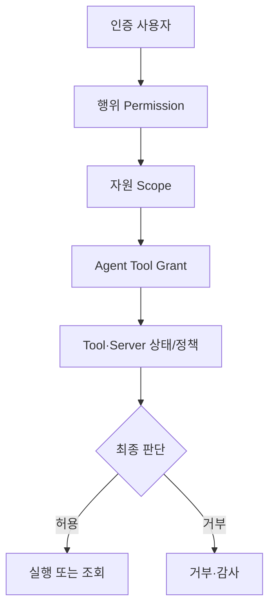

권한은 다음 위치에서 반복 적용한다.

- 목록 query의 row filter
- 상세조회와 변경 API
- Agent Tool 후보 retrieval
- Plan validation
- Step 실행 직전
- 결과·Object download
- export 및 감사조회

### 16.3 기본 역할

`System Administrator`, `MCP Administrator`, `Agent Designer`, `Operator`, `Approver`, `User`, `Auditor`를 seed 역할로 제공한다. 실제 Permission 조합은 수정 가능하며 역할명 하드코딩보다 Permission을 코드의 판단기준으로 사용한다.

---

## 17. Secret 및 보안 아키텍처

### 17.1 Secret 저장

| 단계 | 처리 |
|---|---|
| 입력 | TLS 보호 API에서 수신하고 요청 body logging 제외 |
| 암호화 | 애플리케이션 envelope encryption, nonce와 key version 저장 |
| Master key | DB와 분리된 Docker secret 또는 운영 secret store |
| 조회 | API는 값 대신 `configured`, `updated_at`, masked hint만 반환 |
| 사용 | Tool/LLM 호출 직전 필요한 Worker memory에서만 복호화 |
| 로그 | header, query, schema secret field를 중앙 redaction |
| 교체 | key version 기반 재암호화 Job 및 credential rotation 지원 |

### 17.2 외부 URL 보호

- 허용 scheme은 기본 HTTPS로 제한한다.
- URL parse 후 DNS resolve 결과와 redirect 대상까지 검증한다.
- loopback, link-local, metadata endpoint, 금지 사설망을 정책에 따라 차단한다.
- hostname allowlist/denylist와 egress firewall을 함께 사용한다.
- DNS rebinding 완화를 위해 연결시점 주소를 검증한다.
- response 크기, content type, redirect 횟수, connect/read timeout을 제한한다.

### 17.3 stdio 보호

- command는 자유형 shell 문자열이 아니라 승인된 manifest ID와 typed args로 저장한다.
- `shell=True`를 사용하지 않는다.
- non-root 사용자, read-only root filesystem, tmpfs 작업공간을 적용한다.
- 필요 mount와 egress만 허용한다.
- CPU, memory, process, file size, 실행시간을 제한한다.
- stdout은 MCP protocol 전용으로 취급하고 secret redaction된 stderr만 운영로그에 연결한다.

### 17.4 Prompt Injection 대응

- 사용자, Tool metadata, MCP 결과, 외부 Registry 설명의 신뢰영역을 구분한다.
- Tool 결과가 Agent 지침·Permission·allowlist를 변경할 수 없다.
- Tool 선택 전과 실행 직전에 deterministic policy를 적용한다.
- 결과 속 명령문을 후속 Tool 호출 근거로 사용할 때 schema·출처·정책을 재검증한다.
- high-risk Tool은 신뢰도와 무관하게 확인·승인 gate를 적용한다.

---

## 18. Scheduler 아키텍처

### 18.1 동작 방식

Scheduler는 PostgreSQL의 `next_run_at`을 기준으로 due Schedule을 조회한다. 복수 Scheduler 실행을 허용하되 row-level claim으로 같은 occurrence의 중복 생성을 막는다.

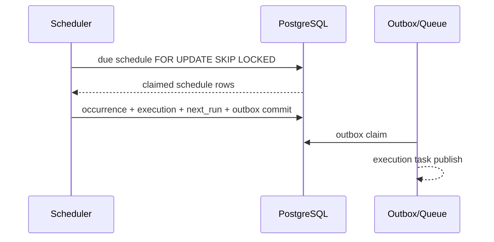

### 18.2 핵심 규칙

- occurrence key는 `schedule_id + planned_at`으로 unique하게 한다.
- 실행시점의 사용자·Agent·Workflow·Tool 권한을 다시 검증한다.
- `ALLOW`, `SKIP`, `QUEUE` 중복정책을 적용한다.
- 시스템 중단 중 놓친 occurrence는 lookback과 최대 보충건수 안에서만 처리한다.
- 반복 실패횟수와 자동일시정지는 DB transaction으로 처리한다.
- Celery Beat를 예약의 업무 원본으로 사용하지 않는다.

---

## 19. 승인 아키텍처

승인은 Execution Engine에 hardcoded된 UI 단계가 아니라 영속 Gate Step이다.

### 19.1 승인 snapshot

승인요청 생성 시 다음 hash/snapshot을 저장한다.

- execution/step/plan version
- Tool ID와 Tool version
- 민감값이 제거된 실행 입력 및 입력 hash
- Tool 위험등급과 적용 정책 version
- 요청자와 승인 scope
- 선행결과 요약 및 영향정보
- 만료시각

### 19.2 승인 transaction

1. 열린 요청과 승인자 권한을 row lock으로 확인한다.
2. 자기승인 금지 등 분리정책을 확인한다.
3. snapshot과 현재 Step을 비교한다.
4. Decision, Audit, Outbox를 하나의 transaction으로 저장한다.
5. Outbox event로 Execution 재평가 task를 발행한다.
6. Worker는 승인 결과를 신뢰하기 전에 실행 직전 정책을 다시 검증한다.

알림 실패는 승인 상태를 rollback하지 않는다.

---

## 20. Audit 및 운영 이벤트

### 20.1 감사 기록

Audit Event는 append-only application API만 제공한다. 일반 ORM repository에 update/delete method를 제공하지 않는다.

| 필드군 | 내용 |
|---|---|
| 행위자 | user ID, session/client, system actor |
| 행위 | 표준 event name, action, 결과 |
| 대상 | resource type, resource ID, version |
| 추적 | request ID, execution ID, step ID |
| 변경 | secret이 제거된 before/after 또는 field diff |
| 요청 | IP/agent 등 허용된 출처정보 |
| 시간 | occurred_at UTC |

### 20.2 구조화 로그

모든 container는 stdout/stderr에 JSON log를 출력한다.

필수 필드:

```text
timestamp, level, service, environment, event_name,
request_id, execution_id, step_execution_id, tool_call_id,
user_id, resource_type, resource_id, result, error_code, duration_ms
```

로그는 업무상 감사 원본을 대체하지 않는다.

### 20.3 Metric

| 영역 | Metric 예시 |
|---|---|
| API | request count, status, p50/p95/p99 latency |
| Agent | analysis/selection/plan latency, LLM calls, schema repair, confidence |
| Execution | queued/running/completed, E2E latency, recovery, cancellation |
| Queue | depth, publish failure, task runtime, redelivery |
| MCP | connection, initialize, discovery, call latency/error, Server health |
| Scheduler | due lag, occurrence created/skipped, failure pause |
| Approval | pending age, decision latency, expired count |
| Factory | validation/build/test duration and failure stage |

과제 성능지표는 별도 metric 또는 평가 table로 재현 가능하게 수집한다.

---

## 21. Tool Factory 아키텍처

### 21.1 보안 경계

Factory는 untrusted source와 dependency를 다루므로 일반 API/Worker와 별도 container·Queue·network·credential을 사용한다.

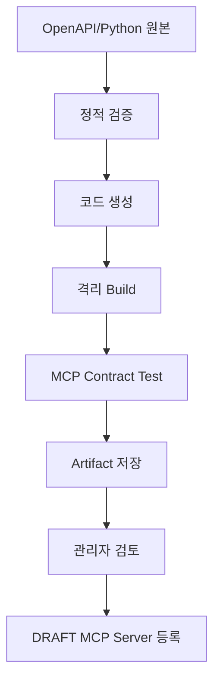

### 21.2 Build 원칙

- host Docker socket을 Factory container에 mount하지 않는다.
- rootless BuildKit 또는 별도 격리 build backend를 사용한다.
- build network는 dependency mirror 등 허용 endpoint로 제한한다.
- base image와 dependency는 digest/lock으로 재현 가능하게 한다.
- source, generator version, template version, dependency lock, artifact hash를 저장한다.
- static scan, container scan, MCP initialize/list/call contract test를 수행한다.
- 시험 credential은 운영 credential과 분리한다.

### 21.3 배포 산출물

Factory 결과는 기본적으로 Streamable HTTP MCP Server image와 다음 artifact를 포함한다.

- 생성 source archive
- Containerfile/Dockerfile
- dependency lock
- `.env.example` 또는 typed config schema
- MCP Tool metadata와 test fixture
- build/test/security report
- generator·template version manifest

생성완료는 운영활성화를 의미하지 않는다. 관리자 검토 후 일반 MCP Server 등록·연결·Discovery 절차를 거친다.

---

## 22. API 및 실시간 통신 아키텍처

### 22.1 REST 기준

- Base path: `/api/v1`
- JSON request/response를 기본으로 한다.
- create는 idempotency key를 지원한다.
- 목록은 공통 filter/sort/page 계약을 사용한다.
- 오류는 `code`, `message`, `details`, `request_id`, `retryable` 구조를 사용한다.
- 상태변경은 target state와 변경사유를 명시한다.
- 날짜는 timezone 포함 ISO 8601을 사용한다.
- OpenAPI에는 기능 ID와 Permission을 extension 또는 description으로 연결한다.

### 22.2 SSE 기준

- Endpoint 예시: `/api/v1/executions/{id}/events`
- 인증과 Execution 조회권한을 확인한다.
- event ID를 제공하여 reconnect 후 누락구간을 조회할 수 있게 한다.
- event payload는 상태변경·진행요약만 포함하고 대형 결과를 넣지 않는다.
- heartbeat와 서버측 최대 연결시간을 설정한다.
- reconnect 실패 시 Frontend는 Execution 상세 polling으로 전환한다.

### 22.3 내부 통신

초기에는 별도 내부 Microservice RPC를 만들지 않는다. Worker는 동일 codebase와 DB/Queue 계약을 공유한다. Factory build backend나 외부 알림 등 명확한 격리경계에서만 adapter 통신을 사용한다.

상세 endpoint와 schema는 `docs/06-api-design.md`에서 정의한다.

---

## 23. Docker Compose 배포구조

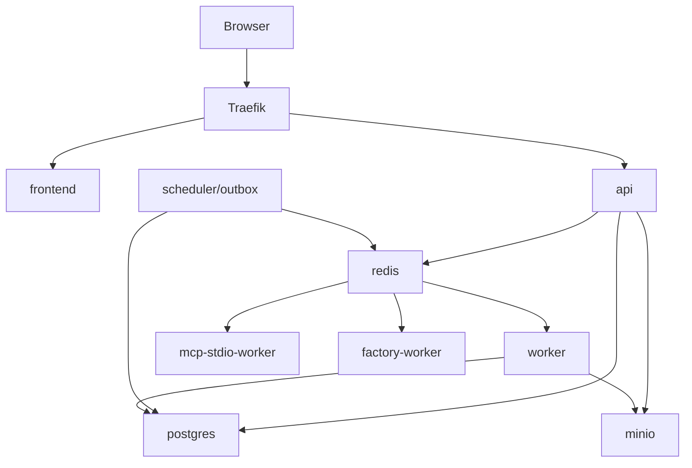

### 23.1 Compose service

| 서비스 | 필수 | image/역할 | 영속 volume |
|---|---:|---|---|
| `traefik` | 예 | reverse proxy, TLS | certificate/config |
| `frontend` | 예 | 정적 React build serving | 없음 |
| `api` | 예 | FastAPI/Uvicorn | 없음 |
| `worker` | 예 | Agent/Execution/Maintenance Celery | 없음 |
| `scheduler` | 예 | due scan, approval expiry, recovery, outbox | 없음 |
| `mcp-stdio-worker` | 예 | allowlisted stdio MCP | 제한 tmpfs |
| `postgres` | 예 | PostgreSQL + pgvector | database volume |
| `redis` | 예 | broker, session, cache | 운영정책에 따른 volume |
| `minio` | 예 | Object Storage | object volume |
| `factory-worker` | Extension | 생성·build·test controller | 작업 tmp/artifact는 MinIO |
| `buildkit` | Extension | rootless isolated builder | build cache |
| `prometheus` | Ops | metric 수집 | metric volume |
| `grafana` | Ops | dashboard | dashboard volume |

### 23.2 Compose profile

| Profile | 포함 |
|---|---|
| default | 핵심 app, DB, Redis, MinIO, stdio Worker |
| `factory` | Factory Worker, rootless builder |
| `observability` | Prometheus, Grafana, 선택 log collector |
| `dev` | hot reload, debug port, test MCP Servers, mail/notification stub |

### 23.3 Network

| Network | 연결 서비스 | 목적 |
|---|---|---|
| `edge` | Traefik, Frontend, API | 외부 ingress |
| `backend` | API, Worker, Scheduler, DB, Redis, MinIO | 내부 application |
| `mcp-egress` | Worker, stdio Worker, 허용 MCP | 외부 Tool 통신 경계 |
| `factory` | Factory Worker, BuildKit, artifact endpoint | untrusted build 격리 |

PostgreSQL, Redis, MinIO management endpoint와 Worker는 host port를 기본 공개하지 않는다.

---

## 24. 설정 아키텍처

### 24.1 설정 우선순위

1. 코드 기본값
2. 환경변수 또는 config file
3. DB 운영설정
4. 자원별 정책

보안·시스템 상한은 DB 운영자가 낮출 수는 있어도 환경에서 정한 hard limit을 초과하지 못하게 할 수 있다.

### 24.2 환경변수 영역

```text
APP_ENV
APP_BASE_URL
DATABASE_URL
REDIS_URL
SESSION_SECRET_REF
ENCRYPTION_MASTER_KEY_FILE
OBJECT_STORAGE_ENDPOINT
OBJECT_STORAGE_BUCKET
OBJECT_STORAGE_ACCESS_KEY_FILE
OBJECT_STORAGE_SECRET_KEY_FILE
LLM_DEFAULT_PROVIDER
TRUSTED_PROXY_CIDRS
ALLOWED_MCP_HOSTS
LOG_LEVEL
```

`.env.example`에는 키와 설명·예시 형식만 제공하며 실제 secret을 저장하지 않는다.

### 24.3 DB 운영설정

- 기본 timeout·retry·concurrency
- Agent planning과 후보 수 상한
- Tool 결과 inline 임계값
- 승인 기본 만료시간
- Scheduler lookback과 보충실행 상한
- 보존기간과 export 만료
- health check 주기
- notification routing

설정 변경은 schema·범위 검증, version, 감사 및 적용시각을 가진다.

---

## 25. 장애 및 복구 설계

| 장애 | 영향 | 자동대응 | 운영대응 |
|---|---|---|---|
| PostgreSQL 중단 | 모든 변경·실행중단 | API readiness false, Worker retry/backoff | DB 복구, 무결성 확인 |
| Redis 중단 | 신규 task 전달·session 영향 | Outbox 유지, 재연결, readiness 부분실패 | Redis 복구 후 DB scan 재발행 |
| Worker 종료 | 진행 Step 중단 가능 | lease/recovery scan | unknown outcome 수동판정 |
| Scheduler 종료 | 예약 지연 | 복구 후 bounded catch-up | 지연 metric 확인 |
| LLM 장애 | 분석·planning·응답 실패 | 제한 retry, circuit state | Provider 전환 또는 복구 |
| MCP Server 장애 | 해당 Tool 실패 | Server policy retry, health 상태 | 비활성화·설정수정 |
| MinIO 장애 | 대형 결과·export 실패 | 작은 metadata 유지, retry | storage 복구·orphan 정리 |
| SSE 단절 | 화면 갱신 지연 | reconnect/polling fallback | API 상태 확인 |
| Factory build 실패 | 생성 중단 | 단계별 실패와 artifact 보존 | 원본·dependency 수정 |

### 25.1 Backup/Restore

- PostgreSQL 정기 backup과 restore rehearsal
- MinIO bucket version/backup 정책
- master encryption key와 key version의 별도 안전 backup
- 배포 image digest와 migration version 기록
- Redis는 업무상 원본이 아니므로 Redis backup만으로 복구하지 않음
- 복구 후 Queue 재발행, orphan Job/Step scan, Object reference 검증 수행

### 25.2 Circuit Breaker

LLM과 Remote MCP의 반복 실패 시 application-level circuit 상태를 둘 수 있다. Circuit은 Tool/Server별로 독립 적용하고 관리조회와 과거 이력 조회를 차단하지 않는다. 초기 구현에서는 간단한 consecutive failure threshold와 cooldown으로 시작한다.

---

## 26. 성능 및 확장 설계

### 26.1 확장단위

| 병목 | 확장방식 |
|---|---|
| API 요청 | stateless API container 수 증가 |
| Agent/LLM 대기 | `agent` Worker concurrency·replica 증가 |
| Remote MCP | `execution` Worker 증가, Server별 limit 유지 |
| stdio MCP | 격리 Worker replica 증가, process limit 유지 |
| Factory | 별도 Factory Worker/BuildKit 확장 |
| Tool 검색 | PostgreSQL index tuning, embedding index, read replica 검토 |
| 대형 결과 | Object Storage 확장 |

### 26.2 Backpressure

- Queue별 maximum concurrency와 rate limit
- 사용자·Agent·Server·Tool 단위 동시실행 제한
- API에서 Queue depth가 hard limit을 넘으면 명시적 제한응답
- LLM Provider와 MCP Server의 rate limit을 retry-after와 정책에 반영
- 대형 결과와 export 동시작업 제한
- SSE client당 연결수와 전체 연결수 제한

### 26.3 초기 성능기준

정량 목표치는 `docs/09-test-strategy.md`에서 확정한다. Architecture는 다음 구간 metric을 필수로 제공한다.

- API request latency
- Queue wait
- request analysis
- Tool retrieval/selection
- plan generation/validation
- approval wait와 실제 처리시간 분리
- MCP connection/call
- output validation
- final response generation
- 전체 E2E

---

## 27. 시험 아키텍처

### 27.1 Test Pyramid

| 계층 | 대상 | 외부 의존성 |
|---|---|---|
| Unit | 상태전이, 정책, plan validation, condition, retry 판단 | 없음 |
| Component | Application handler + fake Port | fake LLM/MCP/Queue |
| Integration | PostgreSQL, Redis, MinIO, repository, outbox | Testcontainers/Compose |
| Contract | 공식 MCP SDK, stdio/Streamable HTTP test Server, LLM adapter | 제어된 시험 Server |
| API | 인증, Permission, schema, 오류, idempotency | 실제 API + test DB |
| E2E | 핵심 사용자·관리자 시나리오 | Frontend + 전체 Compose |
| Security | SSRF, prompt injection, 권한우회, secret leakage, Factory sandbox | 격리 시험환경 |
| Performance | mapping, E2E, concurrency, recovery | 고정 dataset와 환경 |

### 27.2 필수 Test Double

- deterministic LLM Provider
- Tool 후보 평가 fixture
- stdio test MCP Server
- Streamable HTTP test MCP Server
- 느린 Tool, 실패 Tool, 잘못된 schema Tool
- idempotent/non-idempotent Tool
- 대형 결과 Tool
- prompt injection 결과 Tool
- notification sink
- Object Storage fake 또는 test MinIO

### 27.3 Architecture Test

- Domain package의 FastAPI/Celery/SQLAlchemy import 금지
- presentation에서 repository 직접 접근 금지
- 모듈 간 infrastructure model 직접 import 금지
- API schema와 generated Frontend type 정합성
- migration head 단일성 및 downgrade 정책
- Docker image non-root·health·secret scan

---

## 28. CI/CD 흐름

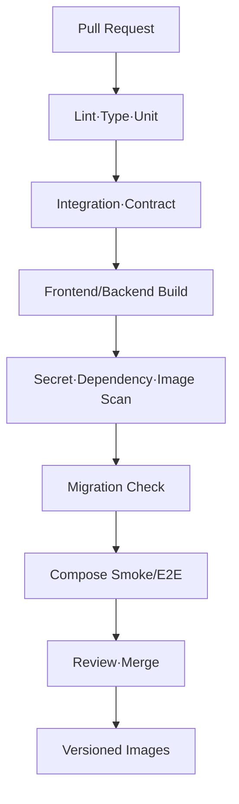

배포 순서:

1. backup·호환성 확인
2. migration Job 실행
3. API/Worker/Scheduler image 갱신
4. health/readiness 확인
5. 핵심 smoke test
6. 문제 시 application image rollback
7. schema rollback이 불가능하면 forward-fix 절차 사용

Migration은 expand/contract 방식으로 이전·신규 application version의 공존시간을 고려한다.

---

## 29. 개발환경과 운영환경 차이

| 항목 | Development | Test/CI | Operation |
|---|---|---|---|
| TLS | 선택 또는 local certificate | 내부 | Traefik TLS 필수 |
| Source | bind mount/hot reload | image build | immutable image |
| MCP | test servers 중심 | deterministic fixtures | 승인된 Server |
| Secret | 개발용 별도 값 | ephemeral CI secret | Docker/운영 secret |
| 로그 | human-readable 선택 | JSON artifact | JSON 수집 |
| Worker | 낮은 concurrency | scenario별 | 자원·정책 기반 |
| Factory | mock/build 제한 가능 | 격리 test | 별도 profile/host 권장 |
| Observability | 선택 | metric 검증 | 활성화 권장 |

개발환경 편의를 위해 보안정책 자체를 제거하지 않는다. 예를 들어 SSRF와 Permission 검증은 개발에서도 적용하고 허용목록만 개발값으로 설정한다.

---

## 30. Repository 구조

```text
mcp-flow/
├── README.md
├── AGENTS.md                         # 설계·Figma 반영 후 작성
├── docs/
│   ├── 01-requirements.md
│   ├── 02-functional-specification.md
│   ├── 03-system-architecture.md
│   ├── 04-agent-mcp-architecture.md
│   ├── 05-data-model.md
│   ├── 06-api-design.md
│   ├── 07-ui-ux-design.md
│   ├── 08-deployment-architecture.md
│   └── 09-test-strategy.md
├── backend/
│   ├── src/mcpflow/
│   ├── migrations/
│   ├── tests/
│   ├── pyproject.toml
│   └── uv.lock
├── frontend/
│   ├── src/
│   ├── tests/
│   ├── package.json
│   └── package-lock.json
├── mcp-servers/
│   └── test-servers/
├── infra/
│   ├── docker/
│   ├── traefik/
│   ├── observability/
│   └── scripts/
├── tests/
│   ├── e2e/
│   ├── performance/
│   └── security/
├── docker-compose.yml
├── docker-compose.dev.yml
├── .env.example
└── .github/workflows/
```

`AGENTS.md`는 설계와 Figma 화면코드 반영 후 실제 실행·시험 명령과 반복적으로 확인된 규칙을 기준으로 작성한다.

---

## 31. 요구사항 및 기능 추적

| 아키텍처 영역 | 관련 요구사항 | 주요 기능 |
|---|---|---|
| 계층·모듈 | `REQ-CORE-*`, `NFR-MNT-*` | `FNC-COM-*` |
| Identity/RBAC | `REQ-AUTH-*`, `NFR-SEC-*` | `FNC-AUTH-*` |
| MCP Manager | `REQ-MCP-*`, `REQ-TOOL-*`, `NFR-COMP-*` | `FNC-MCP-*`, `FNC-TOOL-*` |
| Agent Runtime | `REQ-AGT-*`, `NFR-PERF-005` | `FNC-AGT-*` |
| Workflow/Execution | `REQ-WF-*`, `REQ-EXE-*`, `NFR-REL-*` | `FNC-WF-*`, `FNC-EXE-*` |
| Approval/Scheduler | `REQ-APR-*`, `REQ-SCH-*` | `FNC-APR-*`, `FNC-SCH-*` |
| Operation/Audit | `REQ-OPS-*`, `REQ-AUD-*`, `NFR-PERF-001` | `FNC-OPS-*`, `FNC-AUD-*` |
| Discovery/Factory | `REQ-DISC-*`, `REQ-FAC-*`, `NFR-SEC-004`~`NFR-SEC-008` | `FNC-DISC-*`, `FNC-FAC-*` |
| Frontend/API | `REQ-UI-*`, `REQ-CORE-*` | `SCR-*`, 전체 Presentation 기능 |
| Deployment | `NFR-DEP-*`, `NFR-REL-*`, `NFR-SEC-*` | 전체 운영기능 |
| Test | `NFR-TEST-*` | 기능 완료 정의 및 성능지표 |

---

## 32. 아키텍처 검증 시나리오

### ASR-001. 단일 Tool E2E

1. 관리자가 Streamable HTTP 시험 Server를 등록한다.
2. 연결·initialize·Discovery를 수행한다.
3. Tool을 검증·활성화한다.
4. 사용자가 자연어로 요청한다.
5. Agent가 후보검색·선택·plan을 생성한다.
6. Worker가 권한·정책을 확인하고 Tool을 호출한다.
7. 결과검증·최종응답·감사·metric을 확인한다.

검증 품질속성: 기능분리, protocol 호환, 추적성, 권한, 결과정합성

### ASR-002. Worker 장애복구

1. 느린 idempotent Tool Step을 시작한다.
2. Tool 호출 전 Worker를 종료한다.
3. lease 만료와 Recovery scan을 확인한다.
4. 중복 없이 재실행되고 하나의 최종상태가 남는지 확인한다.

검증 품질속성: 복구, idempotency, Queue/DB 일관성

### ASR-003. 부작용 Tool 불명확 결과

1. non-idempotent Tool 호출 후 응답 저장 전 Worker를 종료한다.
2. 시스템이 자동 재호출하지 않는지 확인한다.
3. 운영자가 unknown outcome을 식별하고 후속조치를 기록할 수 있는지 확인한다.

검증 품질속성: 안전성, 중복부작용 방지, 운영성

### ASR-004. 승인대기 재시작

1. 위험 Tool 직전 승인요청을 생성한다.
2. API·Worker·Scheduler를 재시작한다.
3. 승인 대기상태와 snapshot이 유지되는지 확인한다.
4. 승인 후 동일 Step이 재검증되어 한 번 실행되는지 확인한다.

검증 품질속성: 영속상태, 승인보안, 복구

### ASR-005. 예약 중복방지

1. Scheduler 2개를 실행한다.
2. 동일 예약의 실행시각을 도래시킨다.
3. unique occurrence와 row claim으로 Execution이 한 건만 생성되는지 확인한다.

검증 품질속성: 동시성, 정확성, 수평확장

### ASR-006. Prompt Injection 차단

1. Tool 결과에 정책변경과 secret 반환을 요구하는 문자열을 포함한다.
2. Agent 후속 계획이 미허용 Tool을 선택하도록 유도한다.
3. 후보권한, plan validation, 실행 직전 정책에서 차단되는지 확인한다.

검증 품질속성: 보안, 최소권한, LLM 비결정성 통제

### ASR-007. Redis 복구

1. READY Step과 미전송 Outbox가 있는 상태에서 Redis를 초기화한다.
2. Redis 재기동 후 relay/recovery scan을 실행한다.
3. Execution이 유실·중복 없이 완료되는지 확인한다.

검증 품질속성: Queue 비원본 원칙, 복구, 멱등성

---

## 33. 후속 문서 결정사항

| ID | 결정 또는 상세화 대상 | 후속 문서 |
|---|---|---|
| A-TBD-001 | Execution Plan JSON Schema, Step type, 조건식 문법 | `04-agent-mcp-architecture.md` |
| A-TBD-002 | MCP SDK version, session pool과 protocol 호환 matrix | `04-agent-mcp-architecture.md` |
| A-TBD-003 | Hybrid retrieval scoring, embedding model과 평가 dataset | `04-agent-mcp-architecture.md`, `09-test-strategy.md` |
| A-TBD-004 | 전체 ERD, column, index, partition, 보존기간 | `05-data-model.md` |
| A-TBD-005 | Permission code 목록과 ResourceGrant 표현 | `05-data-model.md`, `06-api-design.md` |
| A-TBD-006 | REST endpoint, SSE event schema, idempotency header | `06-api-design.md` |
| A-TBD-007 | Figma IA, 디자인 토큰, Workflow 편집방식 | `07-ui-ux-design.md` |
| A-TBD-008 | Container image, Compose resource, network/firewall 세부값 | `08-deployment-architecture.md` |
| A-TBD-009 | 성능목표와 시험환경·dataset 규모 | `09-test-strategy.md` |
| A-TBD-010 | Factory rootless build backend의 실제 제품구성 | `08-deployment-architecture.md` |
| A-TBD-011 | OIDC 적용시점과 조직 claim mapping | 향후 변경요청 또는 API/배포 설계 |
| A-TBD-012 | Notification 실제 채널 | `06-api-design.md`, 운영설정 |

---

## 34. 참고자료

- [Model Context Protocol 2026-07-28 Documentation](https://modelcontextprotocol.io/docs/2026-07-28/getting-started/intro)
- [Celery - Introduction to Task Queues](https://docs.celeryq.dev/en/latest/getting-started/introduction.html)
- [FastAPI in Containers](https://fastapi.tiangolo.com/deployment/docker/)
- [PostgreSQL SELECT - Locking Clause and SKIP LOCKED](https://www.postgresql.org/docs/current/sql-select.html)

참고자료의 제품별 사용법보다 본 문서의 도메인 경계, 상태 원본, 보안 및 실행정책이 우선한다.

---

## 35. 변경 이력

| 버전 | 일자 | 변경 내용 |
|---|---|---|
| v0.1 | 2026-09-02 | 전체 논리·실행·데이터·Agent·MCP·보안·배포 아키텍처 및 기술 스택 최초 작성 |

