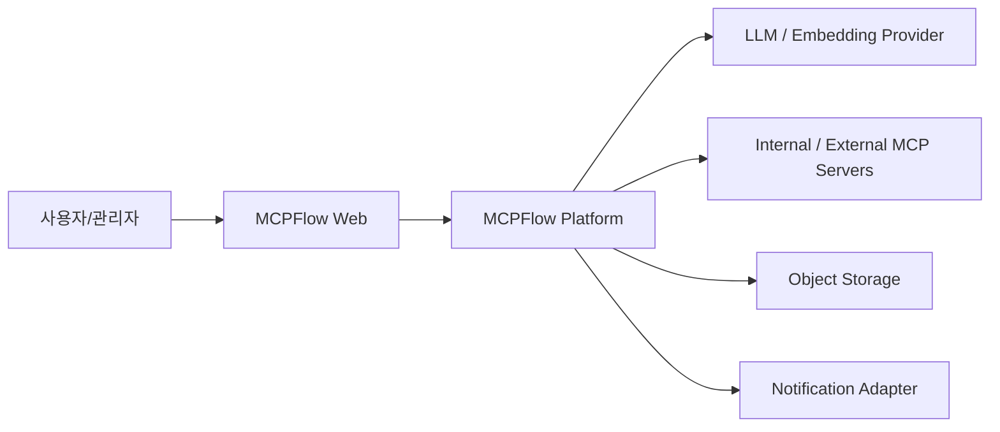
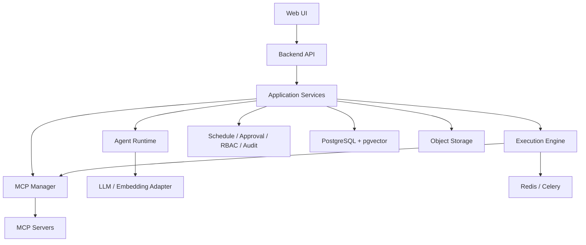
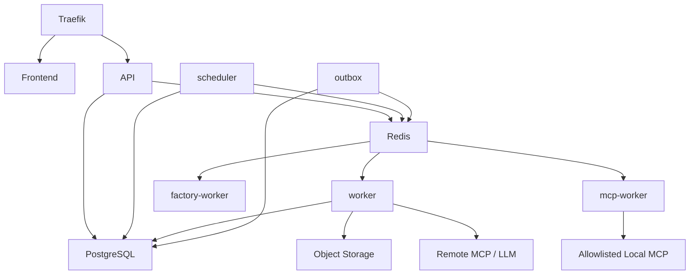

# MCPFlow 시스템 아키텍처 설계서

> **MCPFlow - MCP-based AI Agent Automation Platform**

| 항목 | 내용 |
|---|---|
| 문서 ID | `MCPF-ARCH-001` |
| 문서 버전 | `v0.3` |
| 상태 | Draft - 정합성 통합본 |
| 기준 문서 | `01-requirements.md` v0.3, `02-functional-specification.md` v0.3 |
| 상세 계약 | `04-agent-mcp-architecture.md` v0.2, `05-data-model.md` v0.2 |
| 공식 과제명 | MCP 연계 업무 자동화 AI 에이전트 개발 |
| 개발 프로젝트명 | MCPFlow |
| 최종 수정일 | 2026-09-02 |

---

## 1. 문서 목적

본 문서는 MCPFlow의 전체 시스템 구조, 기술 스택, 컴포넌트 책임, 데이터/실행 흐름, 프로세스 배치, 보안경계, 장애복구 및 확장방식을 정의한다.

본 문서는 Backend/Frontend 골격, Docker 배포, Cursor Agents 작업분담의 아키텍처 기준이다. Agent/MCP schema는 `04`, persisted 상태는 `05`를 재정의하지 않고 참조한다.

---

## 2. 아키텍처 목표

1. 소규모 개발팀이 제한된 사업기간 내 완성 가능한 구조
2. LLM Planning과 실제 실행통제의 분리
3. 장기 실행·예약·승인·MRTR 입력 상태의 영속화
4. MCP Tool 증가에 대응하는 Worker 확장
5. Docker Compose 기반 동일 개발/시험/시범운영
6. RBAC·Approval·Audit·Secret 경로 우회 방지
7. 설계와 코드의 동일 용어·상태·모듈 사용

품질속성:

| 속성 | 대응 |
|---|---|
| 안전성 | 실행 직전 권한/정책/승인 재검증, Tool allowlist, secret 분리 |
| 신뢰성 | PostgreSQL 원본, outbox, idempotency, lease, durable event |
| 확장성 | API/Worker/Scheduler 분리, Queue, stateless API |
| 추적성 | request/execution/step/tool-call correlation |
| 유지보수 | 모듈형 모놀리스, Port/Adapter, Canonical contract |
| 호환성 | Current/Legacy MCP adapter, Provider adapter |
| 배포성 | 동일 Backend image + 역할별 command |
| 시험성 | Mock LLM/MCP + deterministic Execution Engine |

---

## 3. 제약조건

| 구분 | 기준 |
|---|---|
| Frontend | React + TypeScript + Vite |
| Backend | Python 3.12 + FastAPI + Pydantic + SQLAlchemy |
| Database | PostgreSQL 17+ + pgvector |
| Queue | Redis + Celery |
| Object Storage | S3-compatible, 초기 MinIO |
| Reverse Proxy | Traefik |
| LLM | OpenAI-compatible API 기본 |
| MCP | Current `2026-07-28`, legacy adapter, stdio/Streamable HTTP |
| 배포 | Docker + Docker Compose |
| 개발 | Cursor Agents Window, Figma Make, docs를 Source of Truth로 사용 |

Kubernetes는 현재 필수 범위가 아니다.

---

## 4. 핵심 ADR

| ADR | 결정 | 상태 |
|---|---|---|
| `ADR-001` | Backend는 모듈형 모놀리스 코드베이스, API/Worker/Scheduler 프로세스 분리 | Accepted |
| `ADR-002` | PostgreSQL은 업무·실행 상태의 유일한 Source of Truth | Accepted |
| `ADR-003` | Redis/Celery는 전달/coordination이며 최종 상태 원본이 아님 | Accepted |
| `ADR-004` | Workflow/Execution은 자체 typed DAG와 명시적 상태머신 사용 | Accepted |
| `ADR-005` | Agent Runtime은 structured Plan만 생성하고 Execution Engine이 실행 | Accepted |
| `ADR-006` | MCP SDK를 Port/Adapter로 감싸 Domain과 protocol 결합 차단 | Accepted |
| `ADR-007` | Tool 후보검색은 권한 hard filter + lexical/vector hybrid | Accepted |
| `ADR-008` | REST + SSE, polling fallback 사용 | Accepted |
| `ADR-009` | 자체 계정/server Session 기본, OIDC 확장 가능 | Accepted |
| `ADR-010` | Secret은 DB 암호문 + 외부 master key/secret으로 분리 | Accepted |
| `ADR-011` | 대용량 결과/Export/Factory artifact는 Object Storage | Accepted |
| `ADR-012` | Edge proxy는 Traefik | Accepted |
| `ADR-013` | Factory 산출 MCP Server는 core process와 분리된 독립 컨테이너 | Accepted |
| `ADR-014` | 업무 transaction과 Queue/Audit 이벤트는 transactional outbox로 연결 | Accepted |
| `ADR-015` | Agent/Workflow Version은 `DRAFT→PUBLISHED→DEPRECATED`, 게시본 직접 수정 금지 | Accepted |
| `ADR-016` | Current MCP `server/discover`는 optional capability discovery, 미지원만으로 비호환 판단 금지 | Accepted |
| `ADR-017` | Current 실행 중 추가 사용자입력은 MRTR `input_required`를 내부 WAITING_INPUT으로 normalize | Accepted |
| `ADR-018` | stdio Server는 repo-managed manifest ID만 사용하며 자유 shell 설정 금지 | Accepted |

선택하지 않은 구조:

- 초기 microservices 분리
- LLM의 완전자율 Tool loop를 실행원장으로 사용
- Agent Framework를 핵심 상태원장으로 사용
- Redis를 Execution 상태원본으로 사용
- API container에서 임의 stdio command 실행
- 애플리케이션 container에 host Docker socket mount

---

## 5. 시스템 Context



외부 시스템은 모두 실패 가능하고 신뢰할 수 없는 경계로 취급한다.

---

## 6. 논리 아키텍처



### 계층

| 계층 | 책임 |
|---|---|
| Presentation | REST/SSE, 인증 context, API schema |
| Application | Use case orchestration, transaction, 정책 호출 |
| Domain | Entity, value object, state machine, business rule |
| Ports | Repository, Queue, LLM, MCP, Storage, Secret, Notification |
| Adapters | SQLAlchemy, Celery, MCP SDK, HTTPX, S3, Redis |
| Infrastructure | FastAPI bootstrap, DI, config, logging, migration |

Domain은 FastAPI/Celery/SQLAlchemy/MCP SDK 타입을 직접 사용하지 않는다.

---

## 7. 핵심 Module

```text
src/mcpflow/
├── auth/
├── users/
├── secrets/
├── model_profiles/
├── mcp_registry/
├── tool_registry/
├── agents/
├── workflows/
├── executions/
├── approvals/
├── schedules/
├── audit/
├── operations/
├── discovery/
├── tool_factory/
├── integrations/
└── workers/
```

모듈 책임:

| 모듈 | 소유 데이터/책임 |
|---|---|
| `auth/users` | Session, User, Role, Permission, ResourceGrant |
| `secrets` | 암호화 secret record와 host key adapter |
| `model_profiles` | LLM/Embedding profile |
| `mcp_registry` | MCP Server, discovery/check, transport config |
| `tool_registry` | Tool/Version/Policy/Verification/Embedding |
| `agents` | Agent/Version, AgentRequest, retrieval/planning/evaluation |
| `workflows` | Workflow/Version, Plan validation/publish |
| `executions` | Execution/Step/Attempt/Event/MRTR runtime |
| `approvals` | ApprovalPolicy, Request, Decision |
| `schedules` | Schedule/Occurrence |
| `audit` | append-only AuditEvent |
| `operations` | Job, Setting, Outbox, health/business metric |
| `discovery` | 외부 MCP candidate/review |
| `tool_factory` | Source/Build/Test/Artifact |

모듈이 다른 모듈 table을 직접 수정하지 않는다.

---

## 8. Agent Runtime과 Execution Engine 경계

```text
Agent Request
  자연어 분석
  Tool Retrieval/Selection
  Parameter 구성
  Plan 생성/검증
  사용자 추가입력/Plan 확인
  READY
        ↓
Execution 생성
        ↓
Execution Engine
  Queue/Claim
  Tool 호출
  Runtime MRTR Input
  Approval
  Retry/Timeout/Cancel
  Result Validation
  Final State
```

Planning 상태(`PLANNING`, `WAITING_CONFIRMATION`)를 Execution에 혼합하지 않는다.

Canonical 상태는 `05`에서 관리한다.

---

## 9. MCP 아키텍처

### 9.1 Port

```text
MCPClientPort
 ├─ CurrentMCPAdapter
 └─ LegacyMCPAdapter
```

### 9.2 Current `2026-07-28`

- stateless self-describing request
- optional `server/discover`
- 직접 `tools/list/tools/call`로 Current 호환 판단 가능
- discovery mode를 `EXPLICIT_DISCOVERY` 또는 `INFERRED_CURRENT`로 저장
- 중간 입력은 MRTR `input_required` → Execution `WAITING_INPUT`

### 9.3 Legacy

- initialize/initialized session lifecycle은 Adapter 내부
- legacy elicitation을 내부 MRTR-like input request로 normalize
- Domain/Application은 legacy session object를 알지 않는다.

### 9.4 Stdio

API는 `stdio_manifest_id`만 관리한다.

```text
infra/mcp-manifests/*.yaml
```

실행은 `mcp-worker`에서만 수행하며 shell, host path, Docker socket 접근을 기본 금지한다.

---

## 10. Tool 검색 아키텍처

```text
Permission/ResourceGrant hard filter
  ↓
AgentVersion Tool Grant
  ↓
Server/Tool/Version/Policy filter
  ↓
PostgreSQL FTS + pgvector
  ↓
RRF merge
  ↓
LLM rerank
  ↓
Tool Selection
```

권한 없는 Tool은 retrieval 이후 제거하는 것이 아니라 SQL hard filter 단계에서 제외한다.

Tool Verification(`VERIFIED`)은 과제 KPI와 운영 품질 확인에 사용하지만 Tool 활성정책과 검증 만료정책의 상세 관계는 ToolPolicy에서 결정한다.

---

## 11. Execution Engine

Execution Plan v1의 Step Type:

```text
TOOL CONDITION JOIN APPROVAL LOOP
```

Execution Engine 책임:

- Plan materialization
- dependency/ready 계산
- concurrency limit
- lease/claim
- 정책·Permission 재검증
- Tool call
- MRTR input wait/resume
- Approval wait/resume
- timeout/retry/cancel
- result validation
- state transition/event

일반 `USER_INPUT` authoring node는 v1에 포함하지 않는다.

---

## 12. 비동기 처리

Queue:

| Queue | 작업 |
|---|---|
| `agent` | 분석·검색·선택·Planning·최종응답 |
| `execution` | DAG Step, Remote MCP, result validation |
| `mcp_stdio` | Local stdio MCP |
| `factory` | OpenAPI/Python build/test |
| `maintenance` | health, embedding, export, retention |

Celery payload에는 전체 업무데이터/secret 대신 ID를 전달한다.

---

## 13. 프로세스 아키텍처



Canonical process/service naming:

```text
api
worker
mcp-worker
factory-worker
scheduler
outbox
migration
```

`outbox-worker`, `outbox-relay`, `mcp-stdio-worker` 같은 별도 명칭을 문서에서 혼용하지 않는다.

---

## 14. Frontend 아키텍처

```text
frontend/src/
├── app/
├── features/
│   ├── auth/
│   ├── dashboard/
│   ├── agent-run/
│   ├── executions/
│   ├── mcp-servers/
│   ├── mcp-tools/
│   ├── agents/
│   ├── workflows/
│   ├── approvals/
│   ├── schedules/
│   ├── model-profiles/
│   ├── audit/
│   └── settings/
├── entities/
└── shared/
    ├── api/
    ├── ui/
    └── lib/
```

OpenAPI generated type/client 또는 contract validation을 권장한다.

---

## 15. 데이터 및 저장소

### PostgreSQL

원본:

- User/RBAC
- MCP/Tool/Version/Verification
- Agent/Workflow Version
- AgentRequest/Conversation
- Execution/Step/Attempt/Event
- Approval/Schedule
- Audit/Job/Outbox/Evaluation

### Redis

- Celery broker
- Session cache/TTL payload
- 단기 lock/coordination

Execution 최종상태를 Redis에만 저장하지 않는다.

### Object Storage

- 대용량 Tool result
- Export
- Factory Source/Artifact/Test Report
- Tool Verification evidence

---

## 16. 인증 및 Secret 경계

- 자체 Session 기본
- state change CSRF
- Secret record 암호화
- master key는 DB 밖에서 주입
- LLM/MCP/Factory에 secret 원문이 불필요하게 전달되지 않도록 Adapter에서 최소 범위 주입
- log/SSE/Audit masking

---

## 17. 동시성 및 일관성

- Mutable Resource: optimistic lock
- Approval decision: row lock + context hash
- Schedule occurrence: unique constraint
- Worker Step claim: lease + idempotency
- Outbox: same transaction + at-least-once consumer dedup
- Execution Plan/Version: immutable snapshot

`RUNNING → QUEUED` 식으로 업무상태를 되돌려 Worker 재전달을 표현하지 않는다.

---

## 18. 관측성

Correlation:

```text
request_id
trace_id
agent_request_id
execution_id
step_execution_id
step_attempt_id
tool_call_id
job_id
```

로그는 JSON 구조화를 기본으로 하고 prompt/secret/raw large result를 일반 로그에 무차별 저장하지 않는다.

Metric:

- API latency/error
- Agent planning/selection
- Queue wait/worker
- MCP call/error/timeout
- LLM latency/token
- Scheduler occurrence
- Approval wait
- Tool Verification/KPI

---

## 19. 장애복구

| 장애 | 기본 처리 |
|---|---|
| API 재시작 | Worker 실행은 DB 상태 기준 지속 |
| Worker 종료 | lease 만료 후 복구, non-idempotent 재호출 제한 |
| Redis 장애 | 업무상태 유지, Outbox로 복구 후 재전달 |
| MCP 장애 | 관련 Step 오류정책 적용 |
| LLM 장애 | 신규 planning 실패, 관리/과거이력 유지 |
| Object Storage 장애 | artifact 기능 영향, DB 정합성 유지 |
| PostgreSQL 재시작 | 연결복구 후 상태원본 재사용 |

---

## 20. 기술 스택

| 영역 | 기준 |
|---|---|
| Frontend | React, TypeScript, Vite |
| Backend | Python 3.12, FastAPI, Pydantic |
| ORM/Migration | SQLAlchemy 2.x, Alembic |
| DB | PostgreSQL 17+, pgvector |
| Queue | Celery + Redis |
| HTTP | HTTPX async |
| MCP | 공식 Python SDK + Adapter |
| Storage | MinIO/S3-compatible |
| Proxy | Traefik |
| Test | pytest, Vitest/RTL, Playwright, k6 |
| Quality | Ruff, type checker, ESLint, TS strict |

정확한 patch version은 lock file/image digest로 구현 시 고정한다.

---

## 21. 보안 경계

- Browser ↔ Traefik/API
- API ↔ DB/Redis/Object Storage
- Worker ↔ LLM/Remote MCP
- mcp-worker ↔ Local MCP process
- factory-worker ↔ untrusted generated source

Factory와 stdio 실행은 핵심 API보다 높은 위험 경계로 취급한다.

금지:

- 일반 container Docker socket
- API process 임의 subprocess
- unrestricted remote URL
- secret의 Plan/Prompt 포함
- Tool result instruction을 system instruction으로 사용

---

## 22. 배포 단위

초기 Docker Compose:

```text
traefik
frontend
api
worker
mcp-worker
factory-worker
scheduler
outbox
postgres
redis
object-storage
migration
```

상세 network/volume/backup은 `08-deployment-architecture.md`를 따른다.

---

## 23. 문서 계약 우선순위

```text
01 Requirements        제품 범위
02 Functions           Use case 기능
03 Architecture        책임/프로세스
04 Agent/MCP            StructuredRequest, Plan, MCP Canonical Contract
05 Data Model           Persisted state/enum Canonical Contract
06 API                  HTTP 표현
07 UI                   화면 표현
08 Deployment           물리 배포
09 Test                 검증
```

새 Domain status, Plan Step Type, `risk_class`, Version lifecycle을 코드/하위문서에서 임의 추가하지 않는다.
