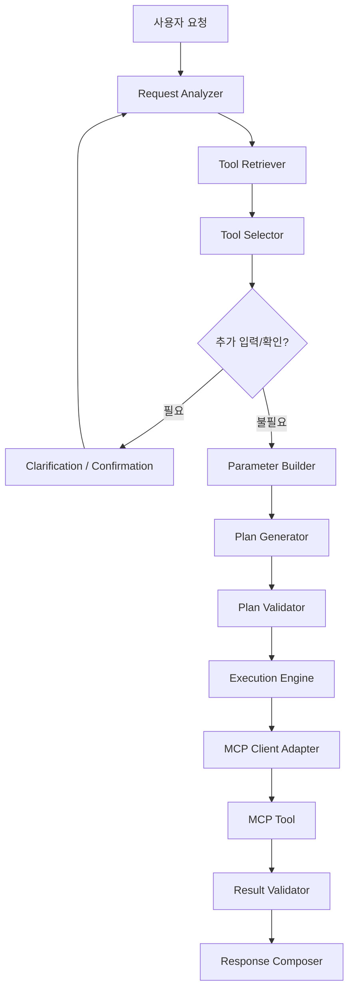

# MCPFlow Agent 및 MCP 실행구조 상세설계서

> **MCPFlow - MCP-based AI Agent Automation Platform**

| 항목 | 내용 |
|---|---|
| 문서 ID | `MCPF-AGENT-MCP-001` |
| 문서 버전 | `v0.2` |
| 상태 | Draft - 정합성 통합본 |
| 기준 문서 | `01-requirements.md` v0.3, `02-functional-specification.md` v0.3, `03-system-architecture.md` v0.3 |
| MCP 기준 | Current `2026-07-28`, legacy `2025-11-25` 이하 adapter 분리 |
| 공식 과제명 | MCP 연계 업무 자동화 AI 에이전트 개발 |
| 개발 프로젝트명 | MCPFlow |
| 최종 수정일 | 2026-09-02 |

---

## 1. 문서 목적

본 문서는 MCPFlow에서 자연어 요청이 구조화되고, 허용된 MCP Tool을 탐색·선택하여 검증된 Execution Plan으로 변환되는 과정과 MCP 호출 계약을 정의한다.

이 문서는 다음 항목의 **Canonical Contract**이다.

- `StructuredRequest v1`
- Agent Request 처리상태와 Planning 흐름
- Tool 후보검색·선택·신뢰도 판단
- Parameter provenance와 `BindingValue`
- `Execution Plan v1`
- Plan Step Type 및 Predicate AST
- MCP Current/Legacy adapter 계약
- MCP Tool 결과·오류·MRTR·취소·Tasks 처리
- Tool 위험도(`risk_class`) 및 재시도 원칙

영속 상태값과 DB enum은 `05-data-model.md`를 Canonical Source로 사용한다. API와 UI는 본 문서와 `05`의 계약을 재정의하지 않고 참조한다.

---

## 2. 설계 원칙

| 원칙 | 적용 방식 |
|---|---|
| LLM은 제안하고 시스템이 결정한다 | LLM 출력은 schema·권한·정책 검증 후에만 실행한다. |
| Planning과 Execution을 분리한다 | Agent Runtime은 계획까지만 만들고 실제 상태 변경·Tool 호출은 Execution Engine만 수행한다. |
| Tool 권한을 먼저 줄인다 | 권한·활성상태·Agent allowlist를 통과한 Tool만 LLM 후보로 제공한다. |
| 계획은 구조화한다 | 자연어 계획을 직접 실행하지 않고 `Execution Plan v1`만 실행한다. |
| 프로토콜과 도메인을 분리한다 | MCP SDK 객체는 normalized 내부 계약으로 변환한다. |
| 외부 콘텐츠는 신뢰하지 않는다 | Tool 설명·결과·Registry 문구는 data이며 system instruction으로 승격하지 않는다. |
| 부작용은 보수적으로 판단한다 | 검증되지 않은 Tool은 `UNKNOWN` 위험도로 처리한다. |
| 상태는 재현 가능해야 한다 | model, prompt, 후보, plan, ToolVersion, policy snapshot을 추적한다. |
| 실행경로를 하나로 통일한다 | Agent Plan과 저장 Workflow는 같은 Validator와 Execution Engine을 사용한다. |

---

## 3. 책임 경계



| 컴포넌트 | 책임 | 하지 않는 책임 |
|---|---|---|
| Request Analyzer | 요청 구조화 | Tool 호출, 권한 우회 |
| Tool Retriever | 권한 적용 후보검색 | 최종 Tool 결정 |
| Tool Selector | 후보평가·선택 | 미등록 Tool 생성 |
| Parameter Builder | 입력값·출처·binding 구성 | secret 원문 생성 |
| Plan Generator | Plan draft 생성 | 상태 변경, Tool 호출 |
| Plan Validator | schema·DAG·binding·권한·정책 검증 | 위반을 추측으로 보정 |
| Execution Engine | immutable Plan 실행, 상태전이 | 자연어 재해석 |
| MCP Adapter | protocol 호출 정규화 | 사용자 권한 판단 |
| Result Validator | output schema 및 결과 검증 | 실패를 성공으로 변경 |
| Response Composer | 검증된 결과를 사용자 응답으로 구성 | 실행되지 않은 결과 생성 |

---

## 4. Agent Request 상태

Agent Request는 실제 Execution과 별도 lifecycle을 가진다.

```text
RECEIVED
  → ANALYZING
  → RETRIEVING
  → SELECTING
  → BUILDING_PARAMETERS
  → PLANNING
  → VALIDATING
  → READY
```

중간 Gate:

```text
WAITING_INPUT
WAITING_CONFIRMATION
```

종료상태:

```text
READY
REJECTED
FAILED
CANCELLED
```

허용 상태:

| 상태 | 의미 |
|---|---|
| `RECEIVED` | 요청 접수 |
| `ANALYZING` | 업무 목적·엔터티·제약 구조화 |
| `RETRIEVING` | 허용 Tool 후보 검색 |
| `SELECTING` | 후보 평가 및 선택 |
| `BUILDING_PARAMETERS` | 입력값과 provenance 구성 |
| `PLANNING` | Execution Plan 생성 |
| `VALIDATING` | Plan schema·권한·정책 검증 |
| `WAITING_INPUT` | 계획 생성 전 추가 사용자 입력 대기 |
| `WAITING_CONFIRMATION` | 실행 전 사용자 계획 확인 대기 |
| `READY` | Execution 생성 가능 |
| `REJECTED` | 정책 또는 지원범위에 의해 거절 |
| `FAILED` | 안전하게 계획생성 실패 |
| `CANCELLED` | 사용자가 계획 단계를 취소 |

`PLANNING`과 `WAITING_CONFIRMATION`은 Execution 상태가 아니다. 실제 Execution 상태는 `05-data-model.md`의 Canonical enum을 사용한다.

---

## 5. StructuredRequest v1

```json
{
  "schema_version": "1.0",
  "request_text": "서울 날씨를 확인해서 우산이 필요한지 알려줘",
  "intent": "날씨 확인 및 준비물 판단",
  "entities": [
    {"name": "location", "value": "서울", "source": "USER_EXPLICIT"}
  ],
  "constraints": [],
  "expected_outputs": ["날씨", "우산 필요 여부"],
  "required_capabilities": ["weather.lookup"],
  "risk_hints": ["READ_ONLY"],
  "missing_inputs": [],
  "ambiguities": [],
  "needs_clarification": false
}
```

### 5.1 Canonical 필드

| 필드 | 필수 | 설명 |
|---|---:|---|
| `schema_version` | 예 | 계약 버전 |
| `request_text` | 예 | 사용자 원문 |
| `intent` | 예 | 한 문장 업무 목적 |
| `entities` | 예 | 값과 출처가 있는 주요 엔터티 |
| `constraints` | 예 | 시간·범위·순서·제외 조건 |
| `expected_outputs` | 예 | 기대 결과 목록 |
| `required_capabilities` | 예 | Tool 이름이 아닌 업무 capability |
| `risk_hints` | 예 | 요청에서 추론한 위험 참고값 |
| `missing_inputs` | 예 | 계획 전에 필요한 값 |
| `ambiguities` | 예 | 해소가 필요한 모호성 |
| `needs_clarification` | 예 | 사용자 추가입력 여부 |

다른 문서에서는 StructuredRequest schema를 별도로 정의하지 않고 본 절을 참조한다.

### 5.2 Context 구성

Request Analyzer에는 다음 순서로 필요한 정보만 제공한다.

1. system 보안·출력 계약
2. AgentVersion 지침·정책·한도
3. StructuredRequest JSON Schema
4. 현재 사용자 요청
5. 사용자가 확정한 직전 대화값
6. 허용된 업무 context 요약

전체 Tool 목록, secret, 다른 사용자의 정보, 내부 Permission 구현상세를 무조건 포함하지 않는다.

---

## 6. Tool 후보검색

### 6.1 Hard Filter

검색 전에 다음을 적용한다.

- 사용자 활성상태 및 `mcp.tool.execute` Permission
- ResourceGrant 범위
- AgentVersion Tool allow/deny rule
- MCP Server `ACTIVE`
- MCP Tool `ACTIVE`
- 선택 ToolVersion의 `validation_status = VALID`
- ToolPolicy 및 환경·시간 정책

권한 없는 Tool은 이름과 존재 여부도 LLM 후보에 제공하지 않는다.

### 6.2 Hybrid Retrieval

초기 기준:

| 설정 | 기본값 |
|---|---:|
| lexical 후보 | 40 |
| vector 후보 | 40 |
| RRF `k` | 60 |
| 병합 후보 | 20 |
| LLM rerank 입력 | 12 |
| 최종 shortlist | 5 |

검색대상은 이름·설명·태그·capability·입력 필드 설명·output summary로 구성한다. 전체 raw schema를 embedding하거나 매 요청마다 LLM에 전달하지 않는다.

### 6.3 ToolCandidateDescriptor

```json
{
  "tool_version_id": "...",
  "name": "weather_lookup",
  "description": "지역별 날씨를 조회한다.",
  "tags": ["weather", "read"],
  "required_inputs": ["location"],
  "optional_inputs": ["date"],
  "output_summary": "condition, precipitation_probability",
  "risk_class": "READ_ONLY",
  "retrieval_score": 0.91
}
```

endpoint, credential, 내부 서버 주소는 전달하지 않는다.

---

## 7. Tool 선택 및 신뢰도

```json
{
  "selected_tool_version_id": "...",
  "llm_fit_score": 0.92,
  "reason_summary": "날씨 조회 목적과 필수 입력이 일치함",
  "required_input_coverage": 1.0,
  "alternative_tool_ids": [],
  "ambiguities": [],
  "proposed_action": "AUTO_SELECT"
}
```

`reason_summary`는 사용자·운영자에게 공개 가능한 요약이며 chain-of-thought 저장을 요구하지 않는다.

초기 결합 신뢰도:

```text
C = 0.25 * retrieval
  + 0.45 * task_fit
  + 0.15 * candidate_margin
  + 0.15 * required_input_coverage
```

초기 판단기준:

| 조건 | 처리 |
|---|---|
| `C >= 0.82`, margin `>= 0.10`, 필수입력 충족, 정책 허용 | 자동선택 가능 |
| `0.60 <= C < 0.82` 또는 margin 부족 | 사용자 확인 |
| `C < 0.60`, 후보 없음, 중요 입력 부족 | clarification 또는 미지원 |
| 승인 필요/고위험 Tool | 점수와 무관하게 정책 Gate 적용 |

수치는 `09-test-strategy.md`의 Evaluation Dataset으로 calibration한다.

---

## 8. Parameter Provenance와 Binding

Parameter의 **출처(Provenance)**와 Execution Plan의 **Binding Type**은 별도 개념이다.

### 8.1 Provenance

```text
USER_EXPLICIT
WORKFLOW_INPUT
CONVERSATION_CONFIRMED
STEP_OUTPUT
POLICY_DEFAULT
MODEL_DERIVED
SECRET_REFERENCE
```

상위 출처를 하위 출처가 임의로 덮어쓰지 않는다.

### 8.2 BindingValue

```json
{
  "kind": "STEP_OUTPUT",
  "step_id": "lookup_weather",
  "path": "/structuredContent/precipitation_probability"
}
```

허용 `kind`:

```text
LITERAL
PLAN_INPUT
STEP_OUTPUT
EXECUTION_CONTEXT
LOOP_CONTEXT
SECRET_REF
```

`path`는 RFC 6901 JSON Pointer subset을 사용한다. 임의 JavaScript/Python/template expression을 실행하지 않는다.

Secret 원문은 LLM, Plan snapshot, 일반 로그에 포함하지 않는다.

---

## 9. Execution Plan v1

```json
{
  "schema_version": "1.0",
  "goal": "날씨를 확인하고 필요한 경우 알림을 전송한다.",
  "source": {"type": "AGENT", "agent_version_id": "..."},
  "inputs": {
    "location": {"type": "string", "required": true, "secret": false}
  },
  "limits": {
    "max_steps": 20,
    "max_duration_seconds": 300,
    "max_parallelism": 4,
    "max_loop_iterations": 50
  },
  "steps": [],
  "completion": {
    "success_policy": "ALL_REQUIRED",
    "response_step_ids": []
  }
}
```

### 9.1 Step 공통 구조

```json
{
  "id": "lookup_weather",
  "name": "날씨 조회",
  "type": "TOOL",
  "required": true,
  "depends_on": [],
  "when": null,
  "timeout_seconds": 30,
  "on_error": "FAIL_EXECUTION",
  "config": {}
}
```

Canonical Step Type:

```text
TOOL
CONDITION
JOIN
APPROVAL
LOOP
```

`USER_INPUT`은 Plan v1의 authoring Step Type이 아니다. MCP Current의 MRTR로 실행 중 입력이 필요해지면 해당 Tool Step이 `WAITING_INPUT`으로 전환된다.

### 9.2 오류정책

```text
FAIL_EXECUTION
MARK_PARTIAL
CONTINUE
```

### 9.3 JOIN 정책

```text
ALL_SUCCESS
ALL_COMPLETE
ANY_SUCCESS
```

### 9.4 APPROVAL Step

`config.approval_policy_id`를 통해 `05-data-model.md`의 ApprovalPolicy를 참조한다. 실행 시점의 보호대상 Tool·입력·정책을 snapshot하고 승인 이후 실제 호출 직전에 hash를 재검증한다.

### 9.5 LOOP

지원 mode:

```text
FOR_EACH
WHILE
```

반드시 `max_iterations`가 존재하며 system hard limit을 넘을 수 없다. Loop body는 독립 typed DAG scope다.

---

## 10. Predicate AST

허용 연산자:

```text
eq ne gt gte lt lte
in contains
exists is_null
and or not
```

규칙:

- 임의 함수호출·정규식 코드·파일·network 접근 금지
- operand type 사전검증
- 존재하지 않는 path는 null과 구분되는 `MISSING` 처리
- 평가 입력·결과를 Step 이력에 저장

---

## 11. Plan Validation

검증순서:

1. JSON Schema 및 schema version
2. Step ID·type·config
3. dependency 존재와 cycle
4. 도달 가능성·join/branch 구조
5. binding source/path/type
6. predicate operand type
7. loop nesting·iteration·parallelism 제한
8. ToolVersion·Server 상태
9. 사용자·Agent Tool 권한
10. ToolPolicy·ApprovalPolicy·timeout·retry
11. 전체 Step·duration·result budget
12. MCP transport/protocol capability

대표 오류:

```text
PLAN_SCHEMA_INVALID
PLAN_STEP_DUPLICATE
PLAN_DEPENDENCY_MISSING
PLAN_CYCLE_DETECTED
PLAN_BINDING_INVALID
PLAN_CONDITION_INVALID
PLAN_LIMIT_EXCEEDED
PLAN_TOOL_UNAVAILABLE
PLAN_PERMISSION_DENIED
PLAN_APPROVAL_REQUIRED
```

schema 구조 오류는 제한적으로 LLM repair를 허용할 수 있으나 권한·정책 위반은 repair로 우회하지 않는다.

---

## 12. MCP Protocol 지원기준

### 12.1 Current `2026-07-28`

Current MCP는 stateless core를 기본으로 사용한다.

- 각 요청은 protocol version과 필요한 client metadata/capability를 자체적으로 전달한다.
- `server/discover`는 capability를 선조회하기 위한 **선택적 discovery 호출**로 사용한다.
- discovery를 지원하지 않는 Current Server도 직접 `tools/list` 등 self-describing 요청이 정상 동작하면 호환 가능하다.
- Streamable HTTP adapter는 해당 specification에서 요구하는 routing/version header를 SDK 기준으로 구성한다.
- Server→Client JSON-RPC 요청 채널에 의존하지 않는다.

Discovery mode는 다음으로 기록한다.

```text
EXPLICIT_DISCOVERY
INFERRED_CURRENT
LEGACY_HANDSHAKE
```

### 12.2 Legacy `2025-11-25` 이하

구형 Server는 `LegacyMCPAdapter`에서 다음 lifecycle을 관리한다.

```text
initialize
→ initialized notification
→ tools/list / tools/call
```

Legacy session과 server→client elicitation 등은 adapter 내부에서 normalized 계약으로 변환하며 Domain/Application에 노출하지 않는다.

### 12.3 MCP Capability 범위

Core 범위:

```text
tools/list
tools/call
progress/cancellation where supported
```

선택 기능:

```text
Tasks extension
MRTR input_required
legacy compatibility
```

Resources/Prompts는 capability 정보는 저장할 수 있으나 초기 Tool 후보검색의 core 범위에는 포함하지 않는다.

---

## 13. MCP Tool Discovery 및 Versioning

Discovery 흐름:

1. transport·URL·stdio manifest 보안검증
2. 인증 준비
3. Current optional discovery 또는 legacy handshake
4. `tools/list` pagination 전체 수집
5. schema·annotation·metadata 정규화
6. canonical descriptor hash 생성
7. added/changed/missing/unchanged diff 생성
8. 관리자 적용
9. embedding·영향분석·검증 Job 발행

Tool identity:

```text
Logical Tool = server_id + remote_name
Tool Version = 의미 있는 remote descriptor hash 변경 시 새 버전
Invocation Identity = immutable tool_version_id
```

---

## 14. MCP Tool 호출 계약

### 14.1 NormalizedToolCall

```json
{
  "server_id": "...",
  "tool_version_id": "...",
  "source_tool_name": "weather_lookup",
  "arguments": {"location": "서울"},
  "timeout_seconds": 30,
  "execution_id": "...",
  "step_execution_id": "...",
  "attempt": 1
}
```

### 14.2 NormalizedToolResult

```json
{
  "protocol_success": true,
  "tool_error": false,
  "content": [],
  "structured_content": {},
  "metadata": {},
  "task_handle": null,
  "raw_size_bytes": 1024,
  "duration_ms": 240,
  "truncated": false
}
```

Tool 업무 오류(`isError`)와 transport/protocol 오류를 분리한다. outputSchema가 있으면 `structured_content`를 검증하고 불일치 결과를 `SUCCEEDED`로 처리하지 않는다.

---

## 15. MRTR 기반 실행 중 사용자 입력

Current `2026-07-28`의 실행 중 추가입력은 Multi Round-Trip Requests(MRTR)를 사용한다.

```text
tools/call
  ↓
resultType = input_required
  + inputRequests
  + opaque requestState
  ↓
Tool Step = WAITING_INPUT
  ↓
사용자 입력 수집·schema 검증
  ↓
원 요청 재호출
  + inputResponses
  + requestState echo
  ↓
complete result 또는 다음 input_required
```

규칙:

- `requestState`는 opaque 값으로 취급하고 LLM이 해석·변경하지 않는다.
- 최대 round 수와 전체 Step timeout을 둔다.
- input request가 secret·외부 URL 이동·금지 데이터 입력을 요구하면 정책으로 차단한다.
- UI에는 MCP Server가 요청한 입력임을 명확히 표시한다.
- Legacy elicitation은 `LegacyMCPAdapter`에서 동일한 `WAITING_INPUT` 내부 상태로 normalize한다.

---

## 16. Tool 위험도 및 재시도

Canonical `risk_class`:

| 값 | 의미 | 자동 재시도 | 기본 승인 |
|---|---|---:|---:|
| `READ_ONLY` | 외부 상태 변경 없음이 검증됨 | 일시 오류에 가능 | 선택 |
| `IDEMPOTENT_WRITE` | 같은 idempotency key로 중복효과 없음 | 조건부 가능 | 정책 |
| `NON_IDEMPOTENT_WRITE` | 중복 호출 시 추가효과 가능 | 기본 금지 | 권장/필수 정책 |
| `DESTRUCTIVE` | 삭제·전송·배포 등 복구 어려움 | 금지 | 필수 |
| `UNKNOWN` | 검증되지 않음 | 금지 | 필수 또는 사용자 확인 |

`risk_level`, `WRITE`, 별도 `idempotency_class`는 API의 canonical 필드로 사용하지 않는다.

정책 우선순위:

1. System hard policy
2. ToolPolicy
3. Tool 검증결과
4. MCP annotation
5. Agent request risk hint

timeout 후 결과가 불명확한 non-idempotent 호출은 `UNKNOWN_OUTCOME`으로 종료하고 자동 재호출하지 않는다.

---

## 17. Cancellation, Progress, Tasks

### Progress

MCP progress는 `execution.step.progress` event로 normalize한다. progress 비율을 알 수 없는 경우 임의 백분율을 만들지 않는다.

### Cancellation

1. Execution에 `CANCEL_REQUESTED`를 기록한다.
2. 신규 Step claim을 중지한다.
3. 가능하면 MCP cancellation을 전달한다.
4. 취소 불가능한 외부 호출은 결과를 기다리되 후속 Step을 시작하지 않는다.
5. 이미 발생한 side effect 가능성을 결과에 표시한다.

### Tasks extension

Server가 Tasks를 지원하면 remote task handle을 영속 저장하고 Worker를 장시간 점유하지 않는 polling으로 처리한다. 재시작 후 handle에서 polling을 복구한다.

---

## 18. Prompt Injection 및 데이터 흐름 통제

| 위협 | 통제 |
|---|---|
| 악성 Tool 설명 | untrusted metadata, hard filter, 관리자 검토 |
| Tool 결과의 추가 실행 지시 | data로 취급, 새 Plan과 권한검증 필요 |
| 권한 없는 Tool 노출 | 검색 전 SQL hard filter |
| Cross-server 데이터 유출 | source→target binding, 민감도, 정책 기록 |
| SSRF/redirect | URL·DNS·IP·redirect·egress 검증 |
| stdio command injection | manifest ID만 허용, shell 금지 |
| Credential leakage | Secret host 보관, LLM/Plan 미노출 |
| 대형 결과 DoS | byte/time/content 제한, Object Storage |
| 승인 우회 | Tool 직전 Permission·snapshot hash 재검증 |

---

## 19. 최종 응답 계약

```json
{
  "status": "SUCCEEDED",
  "summary": "서울은 비 가능성이 있어 우산을 준비하는 것이 좋습니다.",
  "facts": [],
  "step_references": ["lookup_weather"],
  "warnings": [],
  "failed_steps": [],
  "partial_side_effects": []
}
```

응답 규칙:

- 실제 Execution/Step 상태가 status 원본이다.
- LLM이 실패를 성공으로 변경할 수 없다.
- 부분성공과 외부 side effect를 명확히 표현한다.
- 실행되지 않은 사실을 실행결과처럼 생성하지 않는다.
- 권한 없는 raw result와 secret을 포함하지 않는다.
- Response Composer 장애 시 deterministic fallback을 제공한다.

---

## 20. 평가 계약

평가 metric:

```text
Candidate Recall@K
Top-1 Tool Mapping Accuracy
Safe Deferral Rate
False Auto-Execution Rate
Argument Accuracy
Plan Validity
Scenario Completion Rate
```

평가 snapshot에는 최소 다음을 기록한다.

- dataset version/hash
- Tool Registry snapshot
- AgentVersion
- Prompt/schema version
- LLM/Embedding Provider와 model
- selection threshold
- code commit SHA
- 실행환경과 시각

세부 목표와 KPI 증적은 `09-test-strategy.md`를 따른다.

---

## 21. 주요 Port 계약

```python
class ToolRetrieverPort(Protocol):
    async def retrieve(self, request, access_scope, settings): ...

class PlanValidatorPort(Protocol):
    async def validate(self, plan, context): ...

class MCPClientPort(Protocol):
    async def discover_server(self, config): ...  # optional capability discovery
    async def list_tools(self, config): ...
    async def call_tool(self, call): ...
    async def resume_input_required(self, call, input_responses, request_state): ...
    async def cancel(self, handle): ...

class LLMProviderPort(Protocol):
    async def structured_generate(self, request): ...
```

Port input/output은 MCP SDK 객체가 아니라 MCPFlow 내부 typed contract를 사용한다.

---

## 22. 변경 통제

다음 항목 변경 시 반드시 `05`, `06`, `07`, `09`를 함께 검토한다.

- Agent Request 상태
- StructuredRequest schema
- Execution Plan schema 또는 Step Type
- Binding Type/Predicate 연산자
- Tool `risk_class`
- MCP protocol adapter 동작
- MRTR 처리방식

새로운 Domain enum이나 Step Type이 필요하면 코드에서 먼저 추가하지 않고 설계 변경을 선행한다.
