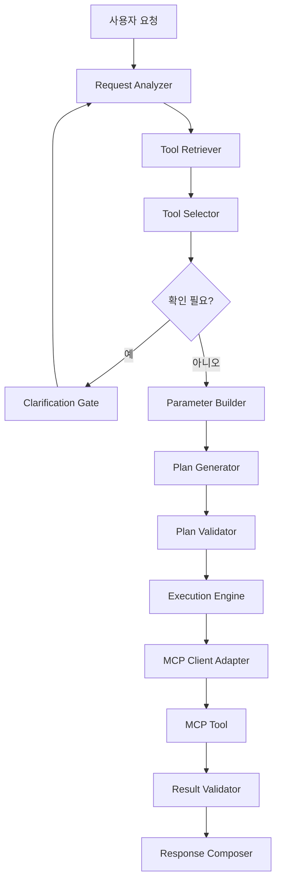
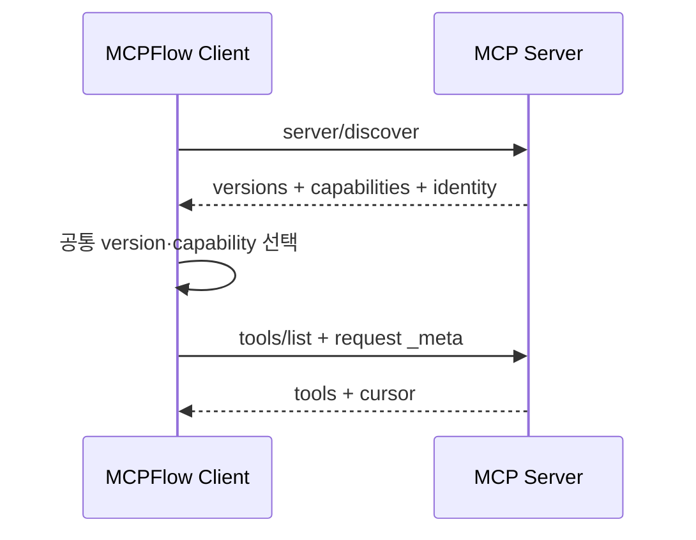
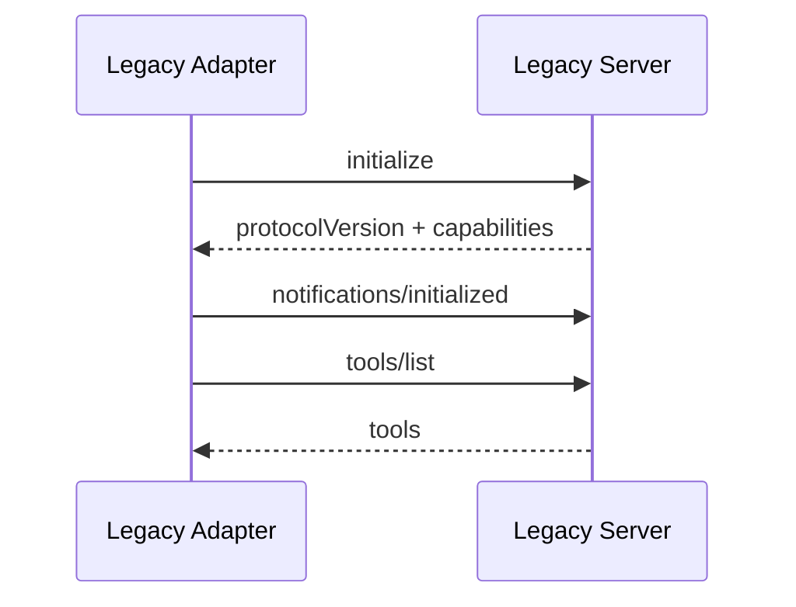
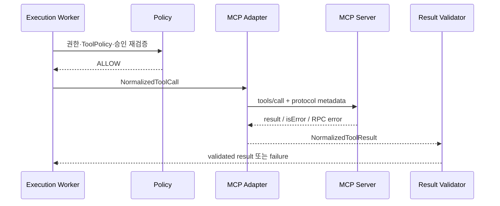
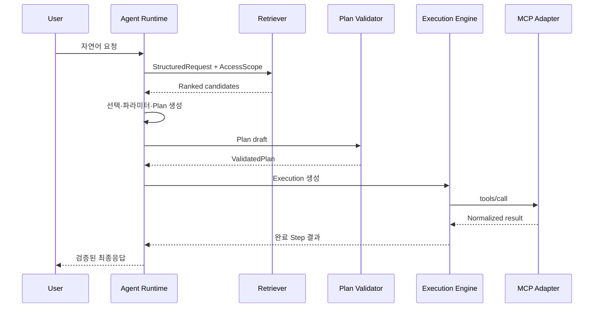
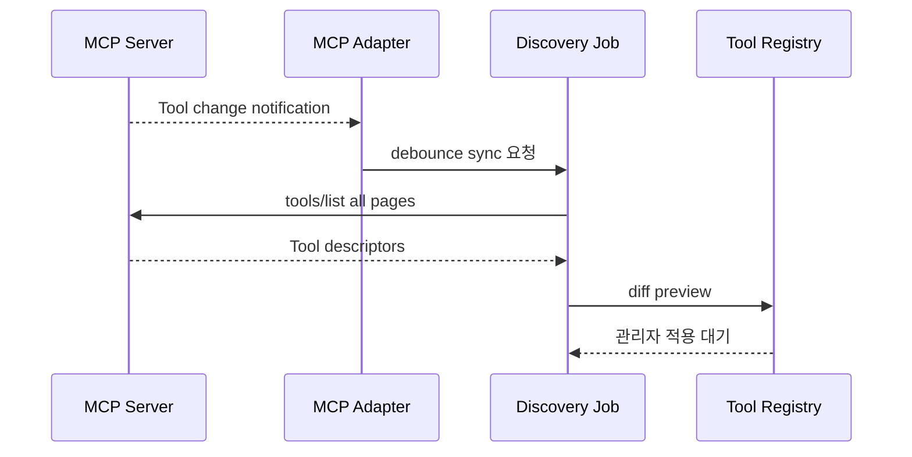
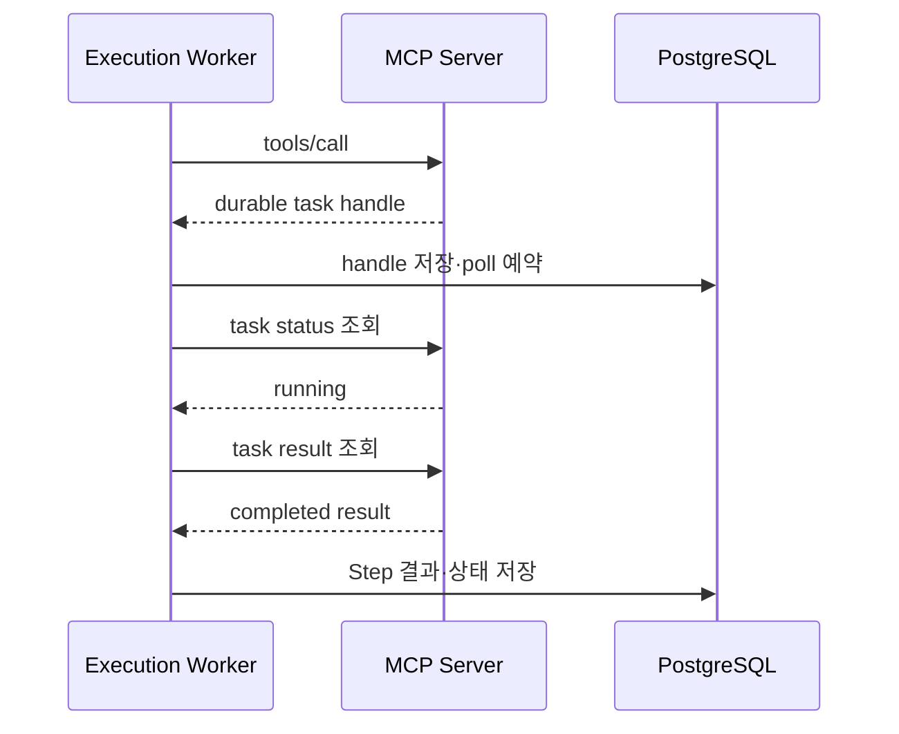

# MCPFlow Agent 및 MCP 실행구조 상세설계서

> **MCPFlow - MCP-based AI Agent Automation Platform**

| 항목 | 내용 |
|---|---|
| 문서 ID | `MCPF-AGENT-MCP-001` |
| 문서 버전 | `v0.1` |
| 상태 | Draft - 개발 기준 초안 |
| 기준 문서 | `docs/01-requirements.md` v0.2, `docs/02-functional-specification.md` v0.2, `docs/03-system-architecture.md` v0.2 |
| MCP 기준 | Current protocol `2026-07-28`, legacy protocol은 adapter로 분리 |
| 공식 과제명 | MCP 연계 업무 자동화 AI 에이전트 개발 |
| 개발 프로젝트명 | MCPFlow |
| 최종 수정일 | 2026-09-02 |

---

## 1. 문서 목적

본 문서는 자연어 업무요청이 Tool 후보검색, Tool 선택, 파라미터 구성, Execution Plan 생성, 검증, MCP Tool 실행 및 최종응답으로 변환되는 전체 구조를 정의한다.

특히 다음 구현 계약을 확정한다.

- Agent Runtime과 Execution Engine의 책임 경계
- Tool 후보검색, ranking, 신뢰도 및 사용자 확인 기준
- Execution Plan v1과 Step·binding·predicate 구조
- 순차·병렬·조건·제한 반복·승인대기 표현방식
- MCP `2026-07-28` discovery, version negotiation, Tool Discovery 및 호출방식
- 구형 handshake 기반 MCP Server의 호환 adapter
- MCP 결과·오류·progress·취소·Tasks extension 처리
- LLM·Tool 결과의 prompt injection과 권한우회 차단
- Tool 매핑 및 복합 실행 평가데이터 수집기준

본 문서의 schema와 상태모델을 변경할 경우 데이터 모델, API, UI/UX, 시험전략 및 기존 실행계획 migration 영향을 함께 검토한다.

---

## 2. 설계 원칙

| 원칙 | 적용 방식 |
|---|---|
| LLM은 제안하고 시스템이 결정한다 | LLM 출력은 schema·권한·정책 검증 후에만 실행 |
| Tool 권한을 먼저 줄인다 | 전체 Tool을 LLM에 준 뒤 사후 제거하지 않고 후보검색 전에 filter |
| 계획과 실행을 분리한다 | Agent Runtime은 Plan을 생성하고 Execution Engine만 상태를 변경 |
| MCP protocol과 도메인을 분리한다 | 공식 SDK type을 내부 normalized type으로 변환 |
| 현재 protocol을 기본으로 한다 | `2026-07-28` stateless discovery를 기본, legacy handshake는 adapter |
| 외부 출력은 신뢰하지 않는다 | Tool metadata·결과·Registry 설명을 untrusted input으로 취급 |
| 부작용을 기본 가정한다 | 안전성이 명시·검증되지 않은 Tool은 `UNKNOWN` 위험등급 적용 |
| 중복 실행보다 수동확인을 택한다 | 결과불명 non-idempotent 호출은 자동 재시도하지 않음 |
| 모든 판단을 재현 가능하게 한다 | model·prompt·후보·plan·Tool·policy version snapshot 저장 |
| 실행경로를 하나로 통일한다 | Agent Plan과 사용자 Workflow 모두 동일 Validator/Engine 사용 |

---

## 3. 핵심 상세설계 결정

| ADR | 결정 | 상태 |
|---|---|---|
| ADR-AM-001 | Agent Runtime은 자체 application module로 구현하고 특정 Agent Framework를 필수 dependency로 사용하지 않는다. | Accepted |
| ADR-AM-002 | LLM structured output은 Pydantic/JSON Schema로 검증하고 raw text 계획은 실행하지 않는다. | Accepted |
| ADR-AM-003 | Tool 검색은 hard filter → lexical/vector hybrid retrieval → LLM rerank 순서로 수행한다. | Accepted |
| ADR-AM-004 | 자동 Tool 선택 기준은 retrieval·LLM fit·후보 margin·필수입력 충족도를 결합한다. | Accepted |
| ADR-AM-005 | Execution Plan v1은 typed DAG와 제한된 nested loop를 사용한다. | Accepted |
| ADR-AM-006 | 조건은 임의 코드가 아니라 제한된 JSON predicate AST로 표현한다. | Accepted |
| ADR-AM-007 | 데이터 바인딩은 literal/input/step output/context/secret reference로 제한한다. | Accepted |
| ADR-AM-008 | MCP Current adapter는 `server/discover`와 요청별 protocol metadata를 사용한다. | Accepted |
| ADR-AM-009 | `2025-11-25` 이하 handshake 기반 Server는 `LegacyMCPAdapter`로 격리한다. | Accepted |
| ADR-AM-010 | MCP Tool `isError: true`와 transport/protocol 오류를 서로 다른 오류계층으로 저장한다. | Accepted |
| ADR-AM-011 | MCP Tasks extension은 Server가 광고할 때 장기호출 adapter로 사용한다. | Accepted |
| ADR-AM-012 | MCP sampling은 `2026-07-28`에서 deprecated이므로 신규 구현에서 사용하지 않는다. | Accepted |
| ADR-AM-013 | MCP elicitation은 구조화 form 입력만 제한 지원하고 Execution 사용자입력 Gate로 연결한다. | Accepted |
| ADR-AM-014 | Tool annotation은 위험도 참고값이며 내부 ToolPolicy보다 우선하지 않는다. | Accepted |

---

## 4. 전체 실행구조



### 4.1 컴포넌트 책임

| 컴포넌트 | 입력 | 출력 | 책임 밖의 항목 |
|---|---|---|---|
| Request Analyzer | 사용자 요청·허용된 대화맥락 | StructuredRequest | Tool 실행·권한판단 |
| Tool Retriever | StructuredRequest·권한·Agent 정책 | RankedCandidate | 최종 Tool 결정 |
| Tool Selector | 상위 후보·요청 | ToolSelection | 미등록 Tool 생성 |
| Parameter Builder | Tool schema·확인된 값·Step 결과 | Typed bindings | secret 원문 생성 |
| Plan Generator | 목표·Tool·binding·정책 | Plan draft | 상태변경·Tool 호출 |
| Plan Validator | Plan·현재 자원·정책 | ValidatedPlan/errors | LLM 추측 보정 |
| Execution Engine | immutable plan snapshot | Execution/Step state | 자연어 재해석 |
| MCP Adapter | normalized call request | normalized result/error | 사용자 권한 결정 |
| Result Validator | normalized result·output schema | ValidatedResult | 성공사실 조작 |
| Response Composer | 원요청·실제 Step 결과 | 사용자 응답 | 실행되지 않은 결과 생성 |

---

## 5. Agent Runtime 처리상태

| 상태 | 의미 | 다음 상태 |
|---|---|---|
| `RECEIVED` | 요청 접수 | `ANALYZING`, `REJECTED` |
| `ANALYZING` | 목적·엔터티·제약 구조화 | `RETRIEVING`, `WAITING_INPUT`, `FAILED` |
| `RETRIEVING` | 허용 Tool 후보검색 | `SELECTING`, `WAITING_INPUT`, `FAILED` |
| `SELECTING` | 후보평가·선택 | `BUILDING_PARAMETERS`, `WAITING_INPUT`, `FAILED` |
| `WAITING_INPUT` | 사용자 추가입력·선택 대기 | `ANALYZING`, `CANCELLED` |
| `BUILDING_PARAMETERS` | 입력값 및 출처 구성 | `PLANNING`, `WAITING_INPUT`, `FAILED` |
| `PLANNING` | Execution Plan 생성 | `VALIDATING`, `FAILED` |
| `VALIDATING` | schema·권한·정책 검증 | `READY`, `WAITING_CONFIRMATION`, `FAILED` |
| `WAITING_CONFIRMATION` | 계획 확인 대기 | `READY`, `CANCELLED` |
| `READY` | 실행엔진에 전달 가능 | Execution 생성 |
| `FAILED` | 안전하게 계획생성 종료 | 종료 또는 재요청 |
| `CANCELLED` | 사용자 취소 | 종료 |

Agent 처리상태는 Execution 상태와 구분한다. Agent 과정에서 Tool을 실제 호출하지 않는다.

---

## 6. 자연어 요청 구조화

### 6.1 StructuredRequest v1

```json
{
  "schema_version": "1.0",
  "request_text": "서울 날씨를 확인해서 우산이 필요한지 알려줘",
  "intent": "날씨 확인 및 준비물 판단",
  "entities": [
    {"name": "location", "value": "서울", "source": "USER_EXPLICIT"}
  ],
  "constraints": [],
  "expected_outputs": ["현재 또는 예보 날씨", "우산 필요 여부"],
  "required_capabilities": ["weather.lookup"],
  "risk_hints": ["READ_ONLY"],
  "missing_inputs": [],
  "ambiguities": [],
  "needs_clarification": false
}
```

### 6.2 필드 정의

| 필드 | 필수 | 설명 |
|---|---:|---|
| `schema_version` | 예 | StructuredRequest 계약 버전 |
| `request_text` | 예 | 사용자 원문, 저장·표시 정책 적용 |
| `intent` | 예 | 한 문장 업무목적 |
| `entities` | 예 | 이름·값·출처가 있는 주요 엔터티 |
| `constraints` | 예 | 시간, 범위, 순서, 제외조건 |
| `expected_outputs` | 예 | 사용자가 기대하는 결과목록 |
| `required_capabilities` | 예 | Tool 이름이 아닌 업무 capability 표현 |
| `risk_hints` | 예 | 요청에서 추론한 위험 참고값 |
| `missing_inputs` | 예 | 계획 전 필요한 추가값 |
| `ambiguities` | 예 | 선택지 또는 해소질문 |
| `needs_clarification` | 예 | 사용자입력 Gate 필요 여부 |

### 6.3 Context 구성

Request Analyzer에는 다음 순서로 context를 제공한다.

1. system 보안·출력 계약
2. AgentVersion의 목적·지침·한도
3. StructuredRequest JSON Schema
4. 현재 사용자 요청
5. 사용자가 명시적으로 확정한 직전 대화값
6. 허용된 업무 context 요약

전체 대화와 Tool 목록을 무조건 포함하지 않는다. secret, 내부 Permission 상세, 다른 사용자의 요청은 포함하지 않는다.

### 6.4 분석 실패

| 실패 | 처리 |
|---|---|
| JSON parse 실패 | 동일 model에 1회 schema repair 요청 |
| schema 불일치 | 제한 횟수 repair 후 `AGENT_OUTPUT_INVALID` |
| 목적 없음 | 구체적인 요청을 요구하는 clarification |
| 금지 요청 | 정책오류로 종료하고 감사 |
| context 한도 초과 | 오래된 맥락 요약·제외 후 재시도, 원요청은 유지 |

---

## 7. Tool 후보검색

### 7.1 Hard Filter

검색 전에 SQL query에서 다음 조건을 모두 적용한다.

- 사용자 활성상태 및 `tool.execute` Permission
- 사용자 ResourceGrant 범위
- AgentVersion Tool allowlist와 deny rule
- MCP Server `ACTIVE`
- ToolVersion `ACTIVE` 및 schema `VALID`
- ToolPolicy의 환경·시간·사용자 조건
- embedding 준비 여부는 vector 검색에만 적용하고 lexical 검색은 유지

권한 없는 Tool은 후보명과 존재 여부도 LLM에 전달하지 않는다.

### 7.2 검색문서

```text
display_name
source_name
operator_description
source_description
tags
capability_terms
input_property_names_and_descriptions
output_schema_summary
verified_examples
server_category
```

schema 원문 전체는 embedding하지 않고 property·설명·타입을 안정된 순서로 canonicalize한다.

### 7.3 Hybrid Retrieval 기본값

| 설정 | 초기값 | 설명 |
|---|---:|---|
| lexical 후보 | 40 | PostgreSQL full-text rank |
| vector 후보 | 40 | pgvector cosine distance |
| RRF `k` | 60 | 순위결합 완화 상수 |
| 병합 후보 | 20 | metadata boost 후 유지 |
| LLM rerank 입력 | 12 | 전체 schema가 아닌 축약 descriptor |
| 최종 shortlist | 5 | 선택·사용자 확인에 사용 |

RRF 기본식:

$$
RRF(d) = \frac{w_l}{k + rank_l(d)} + \frac{w_v}{k + rank_v(d)}
$$

- 초기 `w_l = 0.5`, `w_v = 0.5`
- 한 검색결과에 없는 문서는 해당 항을 0으로 처리한다.
- exact tag/capability match는 정규화된 RRF에 최대 10% boost를 적용한다.
- 값은 evaluation dataset 결과에 따라 설정으로 조정한다.

### 7.4 Embedding version

ToolVersion embedding에는 다음을 저장한다.

- provider/model ID
- embedding dimension
- source text hash
- 생성시각
- embedding schema version

model 변경 시 기존 embedding을 덮어쓰지 않고 새 version을 생성하며 reindex 완료 전 기존 version을 사용한다.

---

## 8. Tool 평가 및 선택

### 8.1 ToolCandidateDescriptor

LLM에는 다음 축약정보만 전달한다.

```json
{
  "tool_version_id": "...",
  "name": "weather_lookup",
  "description": "지역별 날씨를 조회한다.",
  "tags": ["weather", "read"],
  "required_inputs": ["location"],
  "optional_inputs": ["date"],
  "output_summary": "condition, precipitation_probability",
  "risk_class": "READ_ONLY",
  "retrieval_score": 0.91
}
```

endpoint, credential, 내부 Server 주소는 전달하지 않는다.

### 8.2 선택결과

```json
{
  "selected_tool_version_id": "...",
  "llm_fit_score": 0.92,
  "reason_summary": "지역 날씨 조회와 필요한 입력이 요청에 일치함",
  "required_input_coverage": 1.0,
  "alternative_tool_ids": [],
  "ambiguities": [],
  "proposed_action": "AUTO_SELECT"
}
```

`reason_summary`는 간결한 평가근거이며 내부 chain-of-thought 저장을 요구하지 않는다.

### 8.3 결합 신뢰도

$$
C = 0.25R + 0.45F + 0.15M + 0.15I
$$

| 기호 | 의미 |
|---|---|
| `R` | 정규화 retrieval score |
| `F` | LLM tool-task fit score |
| `M` | 1위와 2위 후보의 score margin 정규화값 |
| `I` | 필수입력 충족률 |

초기 판정기준:

| 조건 | 처리 |
|---|---|
| `C >= 0.82`, margin `>= 0.10`, 필수입력 충족, 위험정책 허용 | 자동선택 가능 |
| `0.60 <= C < 0.82` 또는 margin `< 0.10` | Tool 선택 또는 계획 사용자 확인 |
| `C < 0.60`, 후보 없음, critical 입력 부족 | 요청 보완 또는 미지원 응답 |
| high-risk 또는 승인필수 Tool | 신뢰도와 무관하게 확인·승인 적용 |

수치는 초기 calibration 값이며 `docs/09-test-strategy.md`의 label dataset 평가로 조정한다. LLM self-confidence 하나만으로 자동실행을 결정하지 않는다.

### 8.4 명시적 Tool 선택

사용자가 UI에서 Tool을 직접 선택해도 다음을 생략하지 않는다.

- 사용자/Agent allowlist
- Tool/Server 활성상태
- input schema
- ToolPolicy와 승인
- 실행 직전 재검증

---

## 9. 파라미터 구성

### 9.1 값 출처 우선순위

1. 현재 요청의 명시적 사용자값
2. 현재 Workflow input
3. 확인된 이전 대화값
4. 선행 Step output binding
5. 운영정책 기본값
6. model-derived 값

상위 출처를 하위 출처가 자동으로 덮어쓰지 않는다.

### 9.2 BindingValue

```json
{
  "kind": "STEP_OUTPUT",
  "step_id": "lookup_weather",
  "path": "/structuredContent/precipitation_probability"
}
```

| `kind` | 필수 필드 | 용도 |
|---|---|---|
| `LITERAL` | `value` | 검증된 정적값 |
| `PLAN_INPUT` | `input_name`, `path` | Workflow/사용자 입력 |
| `STEP_OUTPUT` | `step_id`, `path` | 선행 Step 검증결과 |
| `EXECUTION_CONTEXT` | `path` | 사용자 ID, 현재시각 등 허용 context |
| `LOOP_CONTEXT` | `name`, `path` | 현재 item/index |
| `SECRET_REF` | `secret_ref_id` | 실행 직전 host가 주입하는 secret |

`path`는 RFC 6901 JSON Pointer subset을 사용한다. 임의 template·Python·JavaScript expression은 허용하지 않는다.

### 9.3 Secret 처리

- LLM은 secret 원문과 `secret_ref_id` 목록을 보지 않는다.
- Agent/Workflow 설정에는 의미 있는 alias만 노출할 수 있다.
- Validator가 alias를 권한 있는 secret reference로 해석한다.
- 실행 직전 Worker가 복호화하여 transport adapter에 전달한다.
- Plan snapshot과 Tool 입력 이력에는 secret reference와 masked marker만 저장한다.

### 9.4 타입변환

안전한 변환만 허용한다.

| 원본→대상 | 처리 |
|---|---|
| integer→number | 자동 허용 |
| ISO 문자열→date/time | 명확한 format일 때 허용 |
| 문자열→enum | 대소문자 정책과 exact 후보가 하나일 때 확인 가능 |
| 임의 문자열→boolean/number | 자동변환하지 않고 사용자 확인 |
| object/array 구조변경 | 명시적 binding 또는 schema 기반 구성 필요 |

---

## 10. Execution Plan v1

### 10.1 Top-level 구조

```json
{
  "schema_version": "1.0",
  "goal": "날씨를 확인하고 필요한 경우 알림을 전송한다.",
  "source": {"type": "AGENT", "agent_version_id": "..."},
  "inputs": {
    "location": {"type": "string", "required": true, "secret": false}
  },
  "limits": {
    "max_steps": 20,
    "max_duration_seconds": 300,
    "max_parallelism": 4,
    "max_loop_iterations": 50
  },
  "steps": [],
  "completion": {
    "success_policy": "ALL_REQUIRED",
    "response_step_ids": ["lookup_weather", "send_notice"]
  }
}
```

### 10.2 Plan 필드

| 필드 | 필수 | 설명 |
|---|---:|---|
| `schema_version` | 예 | Plan 계약 버전 |
| `goal` | 예 | 실행목표, 사용자 표시용 |
| `source` | 예 | `AGENT` 또는 `WORKFLOW`와 version ID |
| `inputs` | 예 | 외부 입력의 typed schema |
| `limits` | 예 | 실행계획 상한, 시스템 hard limit 이하 |
| `steps` | 예 | typed Step 배열 |
| `completion` | 예 | 전체 성공·부분성공 및 응답대상 기준 |

### 10.3 공통 Step 구조

```json
{
  "id": "lookup_weather",
  "name": "날씨 조회",
  "type": "TOOL",
  "required": true,
  "depends_on": [],
  "when": null,
  "timeout_seconds": 30,
  "on_error": "FAIL_EXECUTION",
  "config": {}
}
```

| 필드 | 규칙 |
|---|---|
| `id` | Plan 내 unique, `[a-z][a-z0-9_]{0,63}` |
| `name` | 사용자·운영자 표시명 |
| `type` | `TOOL`, `CONDITION`, `JOIN`, `APPROVAL`, `LOOP` |
| `required` | 전체 성공판정에 포함 여부 |
| `depends_on` | 동일 scope의 선행 Step ID 목록 |
| `when` | 선택적 Predicate AST |
| `timeout_seconds` | Step 상한, ToolPolicy hard limit 이하 |
| `on_error` | `FAIL_EXECUTION`, `MARK_PARTIAL`, `CONTINUE` |
| `config` | type별 schema |

### 10.4 전체 예시

```json
{
  "schema_version": "1.0",
  "goal": "날씨를 조회하고 비가 예상되면 알림 전송",
  "source": {"type": "AGENT", "agent_version_id": "agtv_123"},
  "inputs": {
    "location": {"type": "string", "required": true, "secret": false}
  },
  "limits": {
    "max_steps": 10,
    "max_duration_seconds": 180,
    "max_parallelism": 2,
    "max_loop_iterations": 10
  },
  "steps": [
    {
      "id": "lookup_weather",
      "name": "날씨 조회",
      "type": "TOOL",
      "required": true,
      "depends_on": [],
      "when": null,
      "timeout_seconds": 30,
      "on_error": "FAIL_EXECUTION",
      "config": {
        "tool_version_id": "toolv_weather",
        "arguments": {
          "location": {"kind": "PLAN_INPUT", "input_name": "location", "path": ""}
        }
      }
    },
    {
      "id": "will_rain",
      "name": "강수 여부 판단",
      "type": "CONDITION",
      "required": true,
      "depends_on": ["lookup_weather"],
      "when": null,
      "timeout_seconds": 5,
      "on_error": "FAIL_EXECUTION",
      "config": {
        "predicate": {
          "op": "gte",
          "left": {"ref": {"kind": "STEP_OUTPUT", "step_id": "lookup_weather", "path": "/structuredContent/precipitation_probability"}},
          "right": {"literal": 50}
        }
      }
    },
    {
      "id": "approve_notice",
      "name": "알림 전송 승인",
      "type": "APPROVAL",
      "required": false,
      "depends_on": ["will_rain"],
      "when": {
        "op": "eq",
        "left": {"ref": {"kind": "STEP_OUTPUT", "step_id": "will_rain", "path": "/value"}},
        "right": {"literal": true}
      },
      "timeout_seconds": 86400,
      "on_error": "MARK_PARTIAL",
      "config": {"approval_policy_id": "approval_notice"}
    },
    {
      "id": "send_notice",
      "name": "알림 전송",
      "type": "TOOL",
      "required": false,
      "depends_on": ["approve_notice"],
      "when": null,
      "timeout_seconds": 30,
      "on_error": "MARK_PARTIAL",
      "config": {
        "tool_version_id": "toolv_notify",
        "arguments": {
          "message": {"kind": "LITERAL", "value": "비가 예상됩니다. 우산을 준비하세요."}
        }
      }
    }
  ],
  "completion": {
    "success_policy": "ALL_REQUIRED",
    "response_step_ids": ["lookup_weather", "send_notice"]
  }
}
```

---

## 11. Predicate AST

### 11.1 지원 연산자

| 유형 | 연산자 |
|---|---|
| 비교 | `eq`, `ne`, `gt`, `gte`, `lt`, `lte` |
| 집합·문자열 | `in`, `contains` |
| 존재 | `exists`, `is_null` |
| 논리 | `and`, `or`, `not` |

### 11.2 Operand

```json
{"literal": "SUCCEEDED"}
```

또는

```json
{"ref": {"kind": "STEP_OUTPUT", "step_id": "step_a", "path": "/status"}}
```

### 11.3 규칙

- 임의 함수호출, 정규식 실행, 파일·network 접근을 허용하지 않는다.
- 비교 전 operand type을 검증한다.
- 존재하지 않는 path는 `MISSING`으로 처리하고 null과 구분한다.
- `and`/`or`는 short-circuit 가능하나 결과는 동일해야 한다.
- Predicate 원문과 평가입력·결과를 Step 이력에 저장한다.

---

## 12. Step Type 상세

### 12.1 TOOL

| config 필드 | 필수 | 설명 |
|---|---:|---|
| `tool_version_id` | 예 | immutable ToolVersion |
| `arguments` | 예 | property별 BindingValue |
| `result_selector` | 아니오 | 저장·후속전달할 출력 subset |
| `policy_override` | 아니오 | 관리자가 허용한 범위의 stricter override만 가능 |

Tool schema와 binding type을 Plan validation에서 검사하고 실제 값은 Step 시작 직전에 다시 검증한다.

### 12.2 CONDITION

- `config.predicate`를 평가한다.
- 출력은 `{ "value": true|false }`이다.
- 후속 Step의 `when`이 이 출력을 참조한다.
- 외부 Tool이나 LLM을 호출하지 않는다.

### 12.3 JOIN

| 필드 | 값 |
|---|---|
| `policy` | `ALL_SUCCESS`, `ALL_COMPLETE`, `ANY_SUCCESS` |
| `cancel_remaining` | `ANY_SUCCESS`에서 나머지 취소 여부 |
| `collect` | 선행결과를 output map으로 수집할지 여부 |

`depends_on`에 두 개 이상의 Step이 있어야 한다.

### 12.4 APPROVAL

- approval policy ID, 만료, 승인자 scope를 config로 가진다.
- 실행 시점의 보호대상 후속 Tool·입력·정책을 snapshot한다.
- 승인 결과는 `{decision, approver_id, decided_at}`의 보호된 output으로 남는다.
- 승인 이후 후속 Tool 직전 snapshot 일치를 재검증한다.

### 12.5 LOOP

```json
{
  "mode": "FOR_EACH",
  "collection": {"kind": "STEP_OUTPUT", "step_id": "list_items", "path": "/structuredContent/items"},
  "item_name": "item",
  "max_iterations": 50,
  "max_parallelism": 5,
  "body": {"steps": []}
}
```

지원 mode:

| mode | 필수 config |
|---|---|
| `FOR_EACH` | collection binding, item name, max iterations, body |
| `WHILE` | predicate, max iterations, body |

Loop body는 독립 scope의 typed DAG이다. 외부 Step을 직접 참조할 수 있으나 body 내부 Step은 `LOOP_CONTEXT`를 통해 item/index를 참조한다. 무제한 반복은 schema validation에서 거절한다.

---

## 13. Plan Validation

### 13.1 검증순서

1. JSON Schema 및 schema version
2. Step ID·type·config
3. dependency 존재와 cycle
4. 도달 가능성과 join/branch 구조
5. binding path·source·type
6. predicate operand type
7. loop nesting·iteration·parallelism 한도
8. ToolVersion·Server 상태
9. 사용자·Agent Tool 권한
10. ToolPolicy·승인·timeout·retry
11. 전체 Step·duration·result budget
12. 현재 protocol/transport capability

### 13.2 오류 예시

| 코드 | 의미 |
|---|---|
| `PLAN_SCHEMA_INVALID` | Plan JSON 구조 오류 |
| `PLAN_STEP_DUPLICATE` | Step ID 중복 |
| `PLAN_DEPENDENCY_MISSING` | 선행 Step 없음 |
| `PLAN_CYCLE_DETECTED` | DAG cycle |
| `PLAN_BINDING_INVALID` | path/type/source 오류 |
| `PLAN_CONDITION_INVALID` | Predicate 오류 |
| `PLAN_LIMIT_EXCEEDED` | Step·loop·parallel·duration 한도 초과 |
| `PLAN_TOOL_UNAVAILABLE` | Tool/Server 비활성·삭제 |
| `PLAN_PERMISSION_DENIED` | 사용자/Agent 권한 없음 |
| `PLAN_APPROVAL_REQUIRED` | 필수 Approval gate 누락 |

가능한 오류를 한 번에 수집하되 권한 없는 Tool의 상세정보는 숨긴다.

### 13.3 LLM Plan Repair

- schema·구조 오류만 최대 1회 repair prompt로 전달할 수 있다.
- 권한거부, 비활성 Tool, 정책위반은 LLM repair로 우회하지 않는다.
- repair에도 원래 후보 allowlist만 제공한다.
- repair 전후 Plan과 오류코드를 evaluation 정보로 저장한다.
- 재검증 실패 시 실행하지 않는다.

---

## 14. Planning 전략

### 14.1 기본전략

- 단일 Tool로 해결 가능하면 단일 Step Plan을 우선한다.
- 다중 Tool은 필요한 데이터 의존성만 edge로 표현한다.
- LLM이 병렬이라고 표현해도 실제 dependency가 있으면 순차로 검증한다.
- 고위험 Tool 앞에는 ToolPolicy에 따른 Approval Step을 삽입한다.
- 사용자 확인과 조직 승인을 구분한다.
- 단순 값 판단은 CONDITION을 사용하고 추가 LLM 호출을 만들지 않는다.
- 임의 데이터 변환 코드는 Plan에 포함하지 않는다.

### 14.2 Plan 생성 한도

| 항목 | Agent 기본값 | System hard limit 예시 |
|---|---:|---:|
| Planning LLM 호출 | 2 | 4 |
| Plan repair | 1 | 1 |
| Top-level Step | 20 | 100 |
| Loop nesting | 1 | 2 |
| Loop iteration | 50 | 500 |
| Parallelism | 4 | 20 |

hard limit 실제값은 운영설정에서 확정하되 Plan snapshot에 적용값을 기록한다.

### 14.3 계획 사용자 확인

다음 중 하나이면 `WAITING_CONFIRMATION`으로 전환한다.

- Tool 선택 신뢰도·margin이 자동선택 기준 미달
- 사용자가 요구하지 않은 외부 side effect가 포함됨
- ToolPolicy가 사전 계획확인을 요구함
- 비용·시간·건수 추정이 사용자 한도를 초과함
- 대량 반복 또는 복수 대상 쓰기
- 요청 해석에 업무적으로 중요한 ambiguity가 남음

---

## 15. LLM Provider 및 Prompt 관리

### 15.1 호출유형

| 호출유형 | 출력 schema | temperature 기준 |
|---|---|---|
| Request analysis | StructuredRequest | 낮음 |
| Tool rerank/selection | ToolSelection | 낮음 |
| Parameter derivation | ParameterProposal | 낮음 |
| Plan generation/repair | ExecutionPlan | 낮음 |
| Final response | ResponseEnvelope | 업무설정 |

정확한 model parameter는 Provider capability에 따라 adapter가 변환한다.

### 15.2 PromptVersion

각 호출은 다음을 snapshot한다.

- prompt template ID/version/hash
- AgentVersion
- model/provider ID
- structured output schema version
- 입력 context hash와 허용된 요약
- 호출시각·소요시간·token usage
- parse/repair 결과

Prompt 원문에 secret이 포함되지 않도록 저장 전 검사한다.

### 15.3 Context budget

| 영역 | 정책 |
|---|---|
| Agent 지침 | versioned 고정부분 |
| 사용자 요청 | 원문 유지, 최대크기 제한 |
| 대화맥락 | 관련 confirmed facts 중심 요약 |
| Tool 후보 | 최대 12개 축약 descriptor |
| Tool schema | 선택 후보의 필요한 property만 |
| Tool 결과 | selector·크기 제한·요약 후 전달 |
| 오류 | 사용자에게 유용한 code/message만 |

---

## 16. MCP protocol 지원기준

### 16.1 Protocol era

| 구분 | 기본 adapter | 동작 |
|---|---|---|
| Current `2026-07-28` | `CurrentMCPAdapter` | stateless, `server/discover`, 요청별 `_meta`, HTTP version header |
| `2025-11-25` 이하 | `LegacyMCPAdapter` | initialize/initialized handshake와 해당 era session 처리 |
| 미지원 version | 없음 | 지원 version 목록을 포함한 명확한 오류 |

Current protocol에서 모든 요청은 `_meta`의 `io.modelcontextprotocol/protocolVersion`과 필요한 capability를 포함한다. Streamable HTTP는 `MCP-Protocol-Version` header도 설정한다.

### 16.2 Current discovery



`server/discover` 호출은 연결등록과 호환성 검증에서 필수로 사용한다. 일반 호출은 저장된 discovery 결과를 참고하되 unsupported version 응답 시 재-discovery 후 한 번 재협상한다.

### 16.3 Legacy handshake

구형 Server에만 다음 흐름을 사용한다.



Legacy 분기는 domain/application에 노출하지 않고 동일한 `MCPClientPort` 결과로 변환한다.

### 16.4 핵심 지원 matrix

| 기능 | 지원수준 | MCPFlow 처리 |
|---|---|---|
| `server/discover` | Current 필수 | version·capability·identity 저장 |
| `tools/list` | 필수 | pagination 전체 수집·version 생성 |
| `tools/call` | 필수 | normalized call/result |
| Tool change notification | 지원 | debounce 후 Discovery Job |
| Progress | 지원 | Step progress event로 변환 |
| Cancellation | 지원 가능한 Server | protocol cancel 전달 + local 상태 |
| Tasks extension | 선택 | durable task handle polling |
| Elicitation | 제한 지원 | structured form을 사용자입력 Gate로 변환 |
| Resources/Prompts | core 범위 아님 | capability 저장, Agent 후보로 사용하지 않음 |
| Sampling | 미지원 | deprecated 기능 오류 반환 |
| protocol logging notification | 의존하지 않음 | stderr/OTel/서버 로그 사용 |

---

## 17. MCP Server 설정 및 인증

### 17.1 Normalized ServerConfig

```json
{
  "server_id": "...",
  "transport": "STREAMABLE_HTTP",
  "endpoint": "https://example.com/mcp",
  "protocol_mode": "CURRENT",
  "auth": {"type": "OAUTH2", "secret_ref": "..."},
  "timeouts": {"connect": 10, "request": 60},
  "limits": {"max_concurrency": 5, "max_result_bytes": 10485760},
  "network_policy_id": "default_remote_mcp"
}
```

### 17.2 인증유형

| 유형 | 적용 | 저장 |
|---|---|---|
| `NONE` | 공개 또는 내부 무인증 Server | 없음 |
| `BEARER` | 고정 access token | secret reference |
| `API_KEY_HEADER` | 지정 header API key | header name + secret reference |
| `CUSTOM_HEADERS` | 승인된 header 집합 | typed header + secret reference |
| `OAUTH2` | Remote MCP 권장 | protected resource/auth server metadata, encrypted tokens |
| `STDIO_ENV` | local Server library credential | allowlisted env name + secret reference |

Remote MCP에서 OAuth를 지원하는 경우 OAuth 2.1 authorization code + PKCE 흐름을 우선한다. token은 MCPFlow host가 보관하며 LLM, Plan, 생성코드에 전달하지 않는다.

### 17.3 OAuth 상태

| 상태 | 의미 |
|---|---|
| `NOT_REQUIRED` | 인증 불필요 |
| `CONFIGURED` | metadata와 client 설정 완료 |
| `AUTHORIZATION_REQUIRED` | 사용자 동의 필요 |
| `AUTHORIZED` | 사용 가능한 token 보유 |
| `REFRESH_REQUIRED` | 갱신 필요 |
| `REVOKED` | 회수·실패로 재인증 필요 |

OAuth redirect URI, state, PKCE verifier는 session과 연결하고 재사용·혼동을 차단한다.

---

## 18. MCP Tool Discovery 및 versioning

### 18.1 Discovery 흐름

1. transport 보안검증과 인증 준비
2. Current `server/discover` 또는 legacy handshake
3. `tools/list`를 cursor가 끝날 때까지 호출
4. Tool schema와 metadata 정규화
5. canonical JSON과 SHA-256 hash 생성
6. 기존 ToolVersion과 diff
7. added/changed/removed 미리보기 저장
8. 관리자 적용 transaction
9. embedding·영향검증 Job 발행

### 18.2 Tool identity

| 식별자 | 정의 |
|---|---|
| Tool logical ID | `server_id + source tool name` |
| Tool version | source metadata hash가 달라질 때 생성 |
| Invocation identity | immutable `tool_version_id` |

Server가 Tool 이름을 재사용하더라도 schema·설명·annotation 변경은 새 version으로 취급한다.

### 18.3 Canonical hash 대상

- source name·description
- inputSchema
- outputSchema 또는 output metadata
- annotations
- protocol era에 따른 의미 있는 Tool metadata

운영자가 보완한 display name, tag, 위험정책은 source hash와 분리하여 자체 version을 가진다.

### 18.4 Schema 처리

- inputSchema는 활성화 전 유효한 JSON Schema인지 검사한다.
- `$ref` 처리범위와 최대 nesting을 제한한다.
- 지나치게 큰 schema는 활성화·LLM 전달 정책을 분리한다.
- outputSchema가 있으면 Tool 결과의 `structuredContent`를 검증한다.
- outputSchema가 없으면 unstructured 결과로 표시하고 후속 typed binding을 제한한다.

---

## 19. MCP Tool 호출

### 19.1 호출 흐름



### 19.2 NormalizedToolCall

```json
{
  "server_id": "...",
  "tool_version_id": "...",
  "source_tool_name": "weather_lookup",
  "arguments": {"location": "서울"},
  "protocol_version": "2026-07-28",
  "timeout_seconds": 30,
  "execution_id": "...",
  "step_execution_id": "...",
  "attempt": 1
}
```

### 19.3 NormalizedToolResult

```json
{
  "protocol_success": true,
  "tool_error": false,
  "content": [],
  "structured_content": {},
  "metadata": {},
  "task_handle": null,
  "raw_size_bytes": 1024,
  "duration_ms": 240,
  "truncated": false
}
```

`content` item은 text, image, audio, resource, resource link 등 SDK가 제공하는 유형을 내부 tagged union으로 변환한다. 원본 binary는 크기정책에 따라 Object Storage로 이동한다.

### 19.4 Tool error와 protocol error

| 결과 | 의미 | Step 기본처리 |
|---|---|---|
| 정상 result, `isError=false` | Tool 수행 성공 후보 | output 검증 후 성공 |
| 정상 RPC response, `isError=true` | Tool 업무 오류 | `TOOL_REPORTED_ERROR`, 정책상 retry 판단 |
| JSON-RPC error | protocol/server 오류 | code mapping 후 retry 판단 |
| HTTP/transport 오류 | 연결·인증·timeout 오류 | transport error mapping |
| output schema 불일치 | 결과검증 오류 | 성공 처리 금지 |

### 19.5 결과 Context 전달

- 후속 Step은 검증된 `structured_content`를 우선 사용한다.
- LLM에는 result selector로 선택한 필드와 요약만 전달한다.
- text content의 지시문은 data로 취급한다.
- resource link는 자동 fetch하지 않고 별도 허용정책을 적용한다.
- image/audio/binary는 media metadata와 승인된 분석경로만 제공한다.

---

## 20. MCP 오류 정규화 및 재시도

| 내부 코드 | 예시 원인 | retry 기본값 |
|---|---|---:|
| `MCP_DNS_FAILED` | DNS resolve | 가능 |
| `MCP_CONNECT_FAILED` | 연결거부 | 가능 |
| `MCP_AUTH_REQUIRED` | 401/OAuth 필요 | 자동 retry 안 함 |
| `MCP_AUTH_EXPIRED` | token 만료 | refresh 성공 후 1회 |
| `MCP_PROTOCOL_UNSUPPORTED` | 공통 version 없음 | 안 함 |
| `MCP_CAPABILITY_MISSING` | tools capability 없음 | 안 함 |
| `MCP_DISCOVERY_FAILED` | server/discover/tools list 실패 | 제한 가능 |
| `MCP_TOOL_NOT_FOUND` | tool 변경·삭제 | 재-discovery 후 1회 검토 |
| `MCP_INPUT_INVALID` | schema/Server validation | 안 함 |
| `MCP_TOOL_REPORTED_ERROR` | `isError=true` | ToolPolicy에 따름 |
| `MCP_OUTPUT_INVALID` | outputSchema 불일치 | 기본 안 함 |
| `MCP_TIMEOUT` | request timeout | side-effect 정책에 따름 |
| `MCP_CANCELLED` | 사용자/system 취소 | 안 함 |
| `MCP_SERVER_ERROR` | JSON-RPC server error | code와 정책에 따름 |
| `MCP_RESULT_TOO_LARGE` | 결과한도 초과 | 안 함 |

재시도 판단은 오류뿐 아니라 ToolSideEffectClass와 idempotency를 결합한다.

---

## 21. Tool 위험·부작용 정책

### 21.1 SideEffectClass

| 등급 | 의미 | 자동 retry | 기본 승인 |
|---|---|---:|---:|
| `READ_ONLY` | 외부 상태 변경 없음이 검증됨 | 일시 오류에 가능 | 선택 |
| `IDEMPOTENT_WRITE` | 같은 idempotency key로 중복효과 없음 | 조건부 가능 | 정책 |
| `NON_IDEMPOTENT_WRITE` | 중복 호출 시 추가효과 가능 | 금지 | 필수 권장 |
| `DESTRUCTIVE` | 삭제·전송·배포 등 복구 어려움 | 금지 | 필수 |
| `UNKNOWN` | 검증되지 않음 | 금지 | 필수 또는 사용자확인 |

### 21.2 정책 결정 우선순위

1. 조직/System hard policy
2. 운영자 ToolPolicy
3. Tool 검증결과
4. MCP Tool annotation
5. Agent 요청의 risk hint

annotation은 hint이며 상위 정책을 완화하지 못한다.

### 21.3 Idempotency

- Tool이 idempotency input을 제공하면 Step execution key를 매핑한다.
- Server가 보장하지 않는 idempotency를 MCPFlow가 추정하지 않는다.
- 요청 timeout으로 외부 결과가 불명확한 write Tool은 `UNKNOWN_OUTCOME`으로 운영확인한다.
- 재실행 시 원본 Tool 호출결과를 무조건 재사용하지 않는다.

---

## 22. Progress, Cancellation, Tasks, Elicitation

### 22.1 Progress

MCP progress event를 다음 내부 event로 변환한다.

```json
{
  "type": "STEP_PROGRESS",
  "step_execution_id": "...",
  "current": 3,
  "total": 10,
  "message": "처리 중",
  "occurred_at": "..."
}
```

빈도와 message 크기를 제한하고 SSE를 통해 사용자에게 전달한다.

### 22.2 Cancellation

1. Execution 취소 요청을 DB에 기록한다.
2. Worker가 취소상태를 감지한다.
3. adapter가 Server capability에 따라 cancel을 전달한다.
4. Server가 취소를 지원하지 않으면 응답을 기다리되 후속 Step은 시작하지 않는다.
5. 외부 side effect가 이미 발생했을 가능성을 결과에 명시한다.

### 22.3 Tasks extension

Server가 Tasks extension을 광고하고 Tool이 task handle을 반환하면:

1. handle과 Server/Tool/version을 StepAttempt에 저장한다.
2. Worker를 장시간 점유하지 않고 poll task를 예약한다.
3. poll interval·timeout·cancel policy를 적용한다.
4. 완료결과를 일반 NormalizedToolResult로 변환한다.
5. 시스템 재시작 후 handle에서 polling을 복구한다.

extension 미지원 Server에는 적용하지 않는다.

### 22.4 Elicitation

구조화 form elicitation만 다음처럼 제한 지원한다.

- Server 요청 schema와 message를 검증한다.
- URL·외부 이동·secret 요청 등 금지정책을 적용한다.
- Execution을 사용자입력 대기상태로 전환한다.
- UI에서 Server 요청임을 명확히 표시한다.
- 사용자 응답을 schema 검증 후 adapter로 전달한다.
- 대기 timeout과 취소를 적용한다.

지원하지 않는 elicitation 유형은 명확한 `MCP_ELICITATION_UNSUPPORTED`를 반환한다.

---

## 23. Session 및 cache

### 23.1 Current protocol

Current protocol은 application 관점에서 stateless하게 사용한다. HTTP connection pooling이나 transport session 정보는 adapter 내부 최적화이며 업무상태로 취급하지 않는다.

cache 가능 항목:

- `server/discover` 결과: Server config/version과 TTL로 무효화
- Tool 목록: Registry가 원본이며 notification/수동 sync로 갱신
- OAuth metadata: 만료·변경정책 적용
- HTTP connection pool: Worker process local

### 23.2 Legacy protocol

Legacy adapter는 handshake/session lifecycle을 관리한다. Worker 재시작 시 session 복구를 시도하지 않고 initialize부터 다시 수행한다.

### 23.3 Cache 금지

- secret 원문
- 사용자별 access token을 일반 shared cache key로 저장
- 실행 직전 권한판단 결과의 장기 cache
- Tool 호출결과의 무조건적 재사용

---

## 24. Prompt Injection 및 MCP 보안

### 24.1 위협과 통제

| 위협 | 통제 위치 | 통제 |
|---|---|---|
| 악성 Tool 설명 | Discovery/Agent | untrusted 표시, 후보 allowlist, 운영자 검토 |
| Tool 결과가 추가 호출 지시 | Result/Planner | data 취급, 새 Plan·권한·정책 검증 |
| 권한 없는 Tool 노출 | Retriever | SQL hard filter |
| Confused deputy | Auth/MCP Adapter | 사용자·Server token scope 분리, redirect/state 검증 |
| Cross-server exfiltration | Plan Validator/Policy | source→target 데이터흐름과 민감도 정책 |
| SSRF/redirect | Transport | DNS·IP·redirect·egress 검증 |
| stdio command injection | stdio Worker | manifest ID, typed args, shell 금지 |
| Credential leakage | Secret/Prompt | host만 보관, Plan·LLM·생성코드 미노출 |
| 대형 결과 DoS | Adapter/Storage | byte·content·time 제한, Object Storage |
| Schema bomb | Discovery | depth·property·ref·size 제한 |
| 승인 우회 | Execution | Tool 직전 snapshot·Permission 재검증 |

### 24.2 Cross-server 데이터흐름

Tool A 결과를 Tool B 입력으로 전달할 때 다음을 기록한다.

- source Tool/Server와 result path
- target Tool/Server와 argument path
- 데이터 분류 또는 민감도
- 사용자·Agent 권한
- 승인·masking·transform 정책

출력 잘라내기만으로 유출방지가 되었다고 판단하지 않는다.

### 24.3 Roots와 metadata

MCP roots·annotation·server metadata는 협력적 힌트로 사용하며 보안경계로 간주하지 않는다. 실제 파일·network·credential 경계는 container, filesystem mount, egress 및 host policy에서 강제한다.

---

## 25. 최종 응답 생성

### 25.1 ResponseEnvelope

```json
{
  "status": "SUCCEEDED",
  "summary": "서울은 비 가능성이 있어 우산을 준비하는 것이 좋습니다.",
  "facts": [],
  "step_references": ["lookup_weather"],
  "warnings": [],
  "failed_steps": [],
  "partial_side_effects": []
}
```

### 25.2 응답 규칙

- 실제 Execution·Step 상태가 response status의 원본이다.
- LLM은 `FAILED`를 `SUCCEEDED`로 변경할 수 없다.
- 부분성공과 외부 side effect를 명확히 표시한다.
- Tool 결과에 없는 사실을 실행결과처럼 표현하지 않는다.
- 사용자가 결과를 확인할 수 있게 관련 Step을 연결한다.
- 권한 없는 raw result와 secret을 포함하지 않는다.
- Response Composer 실패 시 deterministic fallback 응답을 제공한다.

---

## 26. 평가 및 성능지표

### 26.1 Tool mapping dataset

```json
{
  "case_id": "map_001",
  "request": "현재 서버 시간을 알려줘",
  "user_role": "USER",
  "agent_version_id": "...",
  "expected_tool_version_ids": ["toolv_current_time"],
  "forbidden_tool_version_ids": [],
  "required_arguments": {},
  "expected_action": "AUTO_SELECT",
  "tags": ["single", "read_only"]
}
```

### 26.2 평가 metric

| Metric | 정의 |
|---|---|
| Candidate Recall@K | 정답 Tool이 retrieval 상위 K에 포함된 비율 |
| Top-1 Accuracy | 최종 1위가 정답인 비율 |
| Safe Deferral Rate | 모호·권한부족 case에서 자동실행하지 않은 비율 |
| False Auto-Execution | 잘못된 Tool을 자동실행한 비율 |
| Argument Accuracy | 필수 파라미터 값·출처가 정답인 비율 |
| Plan Validity | 생성 Plan이 최초 validation을 통과한 비율 |
| Scenario Completion | 복합 시나리오 성공건수/전체건수 |

과제 Tool 매핑 정확도는 label dataset의 Top-1 Accuracy를 기본으로 하되 평가계획에서 산식을 확정한다.

### 26.3 평가 snapshot

- dataset version/hash
- Tool Registry snapshot
- AgentVersion·PromptVersion
- Provider/model·parameter
- embedding model·retrieval setting
- selection threshold
- Plan schema version
- code commit SHA
- 실행환경과 시각

### 26.4 Dataset 구성

| 유형 | 포함 case |
|---|---|
| 명확 단일 Tool | 직접적·동의어·업무표현 |
| 후보 경합 | 유사 Tool 둘 이상 |
| 정보 부족 | 필수값 누락 |
| 권한 제한 | 정답 Tool이 사용자에게 금지 |
| 미지원 요청 | 후보 없음 |
| 고위험 | 자동실행 금지 |
| 복합 | 순차·병렬·조건·반복·승인 |
| 공격 | prompt injection·악성 metadata·결과 |

---

## 27. 관측 및 감사

### 27.1 Agent event

| event | 주요 필드 |
|---|---|
| `agent.request_analyzed` | schema version, duration, missing count |
| `agent.tools_retrieved` | candidate count, lexical/vector timing |
| `agent.tool_selected` | selected ID, confidence, margin, action |
| `agent.clarification_requested` | reason code, missing fields |
| `agent.plan_generated` | step count, model, prompt version |
| `agent.plan_validated` | success, errors, repair count |
| `agent.response_composed` | status, duration, fallback 여부 |

### 27.2 MCP event

| event | 주요 필드 |
|---|---|
| `mcp.server_discovered` | server, versions, capabilities, protocol era |
| `mcp.tools_listed` | count, page count, duration |
| `mcp.registry_synced` | added/changed/removed |
| `mcp.tool_called` | tool version, attempt, duration, size |
| `mcp.tool_failed` | error layer, code, retryable |
| `mcp.task_polled` | task state, poll count |
| `mcp.elicitation_requested` | type, user gate ID |

원문 prompt, secret, 전체 Tool 결과를 일반 로그에 기록하지 않는다.

---

## 28. 주요 Port 계약

```python
class ToolRetrieverPort(Protocol):
    async def retrieve(
        self,
        request: StructuredRequest,
        access_scope: ToolAccessScope,
        settings: RetrievalSettings,
    ) -> list[RankedToolCandidate]: ...


class PlanValidatorPort(Protocol):
    async def validate(
        self,
        plan: ExecutionPlan,
        context: PlanValidationContext,
    ) -> PlanValidationResult: ...


class MCPClientPort(Protocol):
    async def discover_server(self, config: MCPServerConfig) -> MCPServerDiscovery: ...
    async def list_tools(self, config: MCPServerConfig) -> list[MCPToolDescriptor]: ...
    async def call_tool(self, call: NormalizedToolCall) -> NormalizedToolResult: ...
    async def cancel(self, handle: MCPRequestHandle) -> CancellationResult: ...


class LLMProviderPort(Protocol):
    async def structured_generate(
        self,
        request: StructuredGenerationRequest,
    ) -> StructuredGenerationResult: ...
```

Port input/output은 Pydantic domain contract이며 외부 SDK response 객체를 그대로 노출하지 않는다.

---

## 29. Package 구조

```text
backend/src/mcpflow/
├── agents/
│   ├── domain/
│   │   ├── structured_request.py
│   │   ├── tool_candidate.py
│   │   ├── selection.py
│   │   └── prompt_version.py
│   ├── application/
│   │   ├── analyze_request.py
│   │   ├── retrieve_tools.py
│   │   ├── select_tool.py
│   │   ├── build_parameters.py
│   │   ├── generate_plan.py
│   │   └── compose_response.py
│   └── infrastructure/
│       ├── llm_adapters/
│       ├── embedding_adapters/
│       └── tool_retriever.py
├── workflows/
│   ├── domain/
│   │   ├── execution_plan.py
│   │   ├── steps.py
│   │   ├── bindings.py
│   │   └── predicates.py
│   └── application/
│       └── plan_validator.py
├── mcp_registry/
│   ├── domain/
│   │   ├── server.py
│   │   ├── discovery.py
│   │   └── protocol.py
│   └── infrastructure/
│       ├── current_adapter.py
│       ├── legacy_adapter.py
│       ├── stdio_transport.py
│       └── streamable_http_transport.py
└── tool_registry/
    ├── domain/
    │   ├── tool.py
    │   ├── tool_version.py
    │   └── tool_policy.py
    └── application/
        ├── discover_tools.py
        ├── sync_registry.py
        └── invoke_tool.py
```

---

## 30. 상세 Sequence

### 30.1 자연어 단일 Tool 실행



### 30.2 Tool 목록 변경



### 30.3 MCP Task 장기실행



---

## 31. 시험전략

### 31.1 Agent Unit/Component

- StructuredRequest schema parse/repair
- 권한 없는 Tool hard filter
- lexical/vector RRF 결합
- confidence·margin threshold
- 필수입력 coverage와 clarification
- binding type/path validation
- Predicate AST 모든 연산자
- cycle·unreachable·loop limit
- high-risk 승인 Step 삽입
- final response와 실제 상태 일치

### 31.2 MCP Contract

- Current `server/discover`와 요청별 protocol metadata
- unsupported version 재협상
- legacy initialize adapter
- stdio·Streamable HTTP `tools/list` pagination
- Tool change notification
- `tools/call` 정상·`isError`·JSON-RPC·transport error
- outputSchema 성공·실패
- progress·cancel
- Tasks handle 복구
- elicitation 허용·거부
- OAuth token refresh와 credential 미노출

### 31.3 Security

- 악성 Tool description이 allowlist를 우회하지 못함
- Tool 결과 prompt injection
- cross-server data exfiltration
- SSRF·redirect·DNS rebinding
- stdio argument·environment injection
- schema depth·size 공격
- 결과 size·stream timeout
- 승인 snapshot mismatch
- secret이 prompt·Plan·log·audit에 노출되지 않음

### 31.4 Golden Scenario

| ID | 시나리오 |
|---|---|
| `GS-AM-001` | 명확한 단일 read-only Tool 자동선택 |
| `GS-AM-002` | 유사 후보 경합으로 사용자 확인 |
| `GS-AM-003` | 필수입력 누락 후 보완·재개 |
| `GS-AM-004` | 순차 결과 binding |
| `GS-AM-005` | 병렬 조회 후 ALL_SUCCESS join |
| `GS-AM-006` | 조건 false 경로 SKIPPED |
| `GS-AM-007` | bounded loop와 iteration 결과 |
| `GS-AM-008` | destructive Tool 승인 후 실행 |
| `GS-AM-009` | non-idempotent timeout unknown outcome |
| `GS-AM-010` | Current/Legacy MCP 동일 normalized 결과 |

---

## 32. 요구사항 및 기능 추적

| 상세영역 | 요구사항 | 기능 |
|---|---|---|
| 요청분석 | `REQ-AGT-003`, `REQ-AGT-007`, `REQ-AGT-009` | `FNC-AGT-002`, `FNC-AGT-005` |
| 후보검색 | `REQ-AGT-002`, `REQ-AGT-004`, `NFR-PERF-005` | `FNC-AGT-003` |
| Tool 선택 | `REQ-AGT-005`, `REQ-AGT-006`, `REQ-AGT-014` | `FNC-AGT-004`, `FNC-AGT-010` |
| 파라미터 | `REQ-AGT-007`~`REQ-AGT-009` | `FNC-AGT-006` |
| Plan | `REQ-WF-001`~`REQ-WF-010`, `REQ-WF-014` | `FNC-AGT-007`, `FNC-WF-001`, `FNC-WF-003`~`FNC-WF-006` |
| MCP discovery | `REQ-MCP-002`~`REQ-MCP-005`, `REQ-TOOL-001`~`REQ-TOOL-006` | `FNC-MCP-002`, `FNC-TOOL-001`, `FNC-TOOL-002` |
| Tool 호출 | `REQ-TOOL-007`~`REQ-TOOL-012`, `REQ-EXE-001`, `REQ-EXE-005`~`REQ-EXE-008` | `FNC-TOOL-005`, `FNC-EXE-004`~`FNC-EXE-007` |
| 보안 | `REQ-AGT-012`, `REQ-MCP-006`, `REQ-MCP-011`, `REQ-MCP-012`, `NFR-SEC-*` | Agent/MCP 전체 |
| 결과응답 | `REQ-AGT-011`, `REQ-EXE-017`, `REQ-EXE-018` | `FNC-AGT-008`, `FNC-EXE-007` |

---

## 33. 구현 순서

1. 내부 domain type과 Execution Plan v1 schema
2. Predicate·Binding·Plan Validator unit test
3. Current/Legacy MCP adapter contract test
4. Tool Discovery·version·policy
5. 단일 Tool normalized invocation
6. StructuredRequest와 deterministic LLM fake
7. lexical retrieval 후 vector hybrid 확장
8. Tool Selector·confidence·clarification
9. Plan Generator와 단일 Tool E2E
10. 순차·병렬·조건·loop·approval 연계
11. progress·cancel·Tasks·elicitation
12. evaluation dataset와 성능 tuning

처음부터 복합 자율계획을 구현하지 않고 deterministic fixture로 Plan/Engine/MCP 계약을 먼저 완성한다.

---

## 34. 후속 문서 확정사항

| ID | 상세화 대상 | 문서 |
|---|---|---|
| AM-TBD-001 | Entity/table, Plan·Tool snapshot 저장형식 | `05-data-model.md` |
| AM-TBD-002 | REST endpoint, OAuth callback, SSE event | `06-api-design.md` |
| AM-TBD-003 | Clarification·Plan 확인·MCP elicitation 화면 | `07-ui-ux-design.md` |
| AM-TBD-004 | stdio manifest, OAuth secret, egress 및 Factory runtime | `08-deployment-architecture.md` |
| AM-TBD-005 | Tool mapping threshold calibration과 dataset 규모 | `09-test-strategy.md` |
| AM-TBD-006 | 실제 embedding Provider/model | 구현 전 기술검증 |
| AM-TBD-007 | MCP Python SDK exact version 및 supported protocol matrix | 구현 전 contract test |
| AM-TBD-008 | Programmatic tool calling/code mode 도입 여부 | 기본 기능 완료 후 별도 ADR |

Programmatic tool calling은 현재 직접 범위에 포함하지 않는다. 향후 도입 시 network 없는 sandbox, host broker, per-call 권한·승인, credential host 보관을 필수로 한다.

---

## 35. 참고자료

- [MCP 2026-07-28 Architecture](https://modelcontextprotocol.io/docs/2026-07-28/learn/architecture)
- [MCP Versioning and Negotiation](https://modelcontextprotocol.io/docs/2026-07-28/learn/versioning)
- [MCP Client Best Practices](https://modelcontextprotocol.io/docs/2026-07-28/develop/clients/client-best-practices)
- [MCP Authorization](https://modelcontextprotocol.io/docs/2026-07-28/tutorials/security/authorization)
- [MCP Security Best Practices](https://modelcontextprotocol.io/docs/2026-07-28/tutorials/security/security_best_practices)
- [MCP Debugging and Logging](https://modelcontextprotocol.io/docs/2026-07-28/tools/debugging)
- [MCP Inspector](https://modelcontextprotocol.io/docs/2026-07-28/tools/inspector)

---

## 36. 변경 이력

| 버전 | 일자 | 변경 내용 |
|---|---|---|
| v0.1 | 2026-09-02 | Agent Runtime, Tool 검색·선택, Execution Plan v1, MCP Current/Legacy adapter, 보안·평가 상세설계 최초 작성 |
