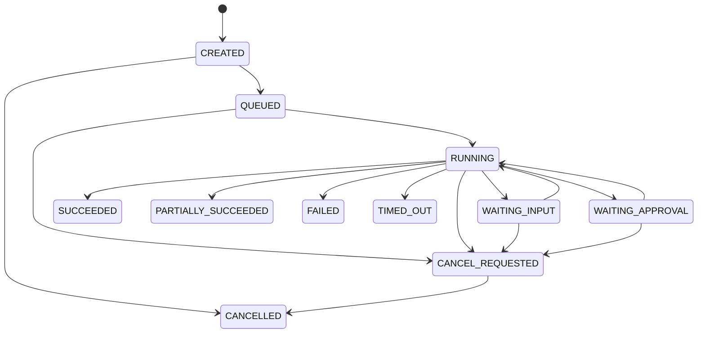

# MCPFlow 데이터 모델 및 ERD 설계서

> **MCPFlow - MCP-based AI Agent Automation Platform**

| 항목 | 내용 |
|---|---|
| 문서 ID | `MCPF-DATA-001` |
| 문서 버전 | `v0.2` |
| 상태 | Draft - 정합성 통합본 |
| 기준 문서 | `01-requirements.md` v0.3, `02-functional-specification.md` v0.3, `03-system-architecture.md` v0.3, `04-agent-mcp-architecture.md` v0.2 |
| Database | PostgreSQL + pgvector |
| 공식 과제명 | MCP 연계 업무 자동화 AI 에이전트 개발 |
| 개발 프로젝트명 | MCPFlow |
| 최종 수정일 | 2026-09-17 |

---

## 1. 문서 목적

본 문서는 MCPFlow의 영속 데이터 모델, 관계, 상태값, versioning, snapshot, 동시성 및 보존정책을 정의한다.

이 문서는 다음 항목의 **Canonical Source**이다.

- 주요 Domain Entity와 table
- persisted status enum
- Agent/Workflow Version lifecycle
- Execution/Step 상태머신
- Tool 위험정책과 검증 증적
- ApprovalPolicy 및 승인 snapshot
- Schedule target/source type
- Job/Outbox/Idempotency
- Object Storage 참조
- Audit/Evaluation 데이터

`06-api-design.md`, `07-ui-ux-design.md`, `09-test-strategy.md`는 본 문서의 상태값을 그대로 사용한다.

---

## 2. 모델링 원칙

| 원칙 | 적용 |
|---|---|
| PostgreSQL Source of Truth | 업무·실행·승인·예약 상태는 DB가 원본이다. |
| Immutable Version | Agent/Workflow/Tool 원본 버전은 게시·참조 후 덮어쓰지 않는다. |
| Snapshot Execution | 실행 시 Plan, 입력, 정책, version을 snapshot한다. |
| Logical Delete | 과거 실행에서 참조된 자원은 물리 삭제보다 비활성/보존한다. |
| Explicit State Machine | 상태전이는 Application service만 수행한다. |
| Optimistic Lock | Mutable Resource는 `lock_version`으로 충돌을 감지한다. |
| Append-only Event | Execution event와 Audit은 append-only를 기본으로 한다. |
| Secret Separation | secret 평문은 일반 업무 table에 저장하지 않는다. |
| JSONB Selective Use | versioned plan/schema/snapshot은 JSONB, 검색/관계/상태는 정형 컬럼으로 둔다. |
| UTC Storage | 모든 시각은 `timestamptz` UTC 기준으로 저장한다. |

Native PostgreSQL enum 대신 `varchar + CHECK constraint + Python enum + contract test`를 사용한다.

---

## 3. 공통 컬럼 규칙

Mutable Resource 공통 컬럼:

```text
id uuid PK
created_at timestamptz
created_by uuid nullable
updated_at timestamptz
updated_by uuid nullable
lock_version integer default 1
deleted_at timestamptz nullable
```

Immutable Version 공통 컬럼:

```text
id uuid PK
version_no integer
content_hash char(64)
created_at timestamptz
created_by uuid
```

식별자는 기본 UUID를 사용하며 append-only event cursor는 `bigint identity`를 사용할 수 있다.

---

## 4. Canonical 상태 및 Enum

### 4.1 핵심 상태

| Domain | Canonical 상태 |
|---|---|
| MCP Server | `DRAFT`, `ACTIVE`, `INACTIVE`, `ERROR` |
| MCP Tool | `DISCOVERED`, `ACTIVE`, `INACTIVE`, `MISSING`, `BLOCKED` |
| ToolVersion Validation | `VALID`, `INVALID`, `WARNING` |
| Tool Verification | `PENDING`, `VERIFIED`, `FAILED`, `EXPIRED` |
| Agent | `DRAFT`, `ACTIVE`, `INACTIVE`, `ARCHIVED` |
| AgentVersion | `DRAFT`, `PUBLISHED`, `DEPRECATED` |
| Workflow | `DRAFT`, `ACTIVE`, `INACTIVE`, `ARCHIVED` |
| WorkflowVersion | `DRAFT`, `PUBLISHED`, `DEPRECATED` |
| AgentRequest | `RECEIVED`, `ANALYZING`, `RETRIEVING`, `SELECTING`, `BUILDING_PARAMETERS`, `PLANNING`, `VALIDATING`, `WAITING_INPUT`, `WAITING_CONFIRMATION`, `READY`, `REJECTED`, `FAILED`, `CANCELLED` |
| Execution | `CREATED`, `QUEUED`, `RUNNING`, `WAITING_INPUT`, `WAITING_APPROVAL`, `CANCEL_REQUESTED`, `SUCCEEDED`, `PARTIALLY_SUCCEEDED`, `FAILED`, `CANCELLED`, `TIMED_OUT` |
| Step | `PENDING`, `READY`, `RUNNING`, `WAITING_INPUT`, `WAITING_APPROVAL`, `SUCCEEDED`, `FAILED`, `SKIPPED`, `TIMED_OUT`, `CANCELLED`, `UNKNOWN_OUTCOME` |
| Approval | `PENDING`, `APPROVED`, `REJECTED`, `EXPIRED`, `CANCELLED` |
| Job | `PENDING`, `QUEUED`, `RUNNING`, `SUCCEEDED`, `FAILED`, `CANCELLED`, `TIMED_OUT` |
| Schedule | `ACTIVE`, `PAUSED`, `COMPLETED`, `ERROR` |
| Occurrence | `PLANNED`, `SKIPPED`, `ENQUEUED`, `RUNNING`, `COMPLETED`, `FAILED` |

### 4.2 Tool 위험도

Canonical 필드명은 `risk_class`이다.

```text
READ_ONLY
IDEMPOTENT_WRITE
NON_IDEMPOTENT_WRITE
DESTRUCTIVE
UNKNOWN
```

별도 `risk_level=WRITE` 또는 `idempotency_class`를 API canonical field로 사용하지 않는다.

### 4.3 Execution Source Type

```text
AGENT_REQUEST
WORKFLOW_VERSION
SCHEDULE_OCCURRENCE
MANUAL_TOOL_TEST
FACTORY_TEST
```

Retry는 source type이 아니다. `parent_execution_id`와 `trigger_type = RETRY`로 표현한다.

### 4.4 Schedule Target Type

```text
AGENT_VERSION
WORKFLOW_VERSION
```

예약은 논리 Agent/Workflow가 아니라 실행할 immutable version을 고정한다.

---

## 5. 사용자·인증·권한

### 5.1 주요 테이블

```text
users
roles
permissions
user_roles
role_permissions
resource_grants
sessions
secret_records
```

`users` 주요 필드:

```text
id, username, display_name, email
status(ACTIVE/INACTIVE/LOCKED)
password_hash
last_login_at
created_at, updated_at, lock_version
```

`resource_grants`:

```text
id uuid PK

user_id uuid nullable
role_id uuid nullable

resource_type
resource_id uuid

created_at
created_by nullable
```

`user_id` / `role_id` 중 정확히 하나만 존재한다. 별도 principal_type enum은 두지 않는다.

`resource_type` Canonical 값:

```text
AGENT
WORKFLOW
MCP_SERVER
MCP_TOOL
```

ResourceGrant는 positive scope만 표현한다. Grant가 있으면 해당 `resource_type` + `resource_id` 범위가 허용되고, 없으면 허용되지 않는다. ALLOW/DENY effect나 wildcard/계층 inheritance는 두지 않는다. Exact resource match만 적용한다.

`resource_grants`는 사용자/Role이 Agent, Workflow, MCP Server, MCP Tool 등에 대해 갖는 자원 범위를 표현한다.

### 5.2 Session

Session payload는 Redis TTL로 관리할 수 있으나 PostgreSQL에는 발급·만료·폐기·보안감사에 필요한 durable metadata를 저장한다.

`sessions` durable schema:

```text
id uuid PK
user_id uuid FK users.id

token_hash char(64)

csrf_token_hash char(64) nullable

issued_at timestamptz
expires_at timestamptz
revoked_at timestamptz nullable

created_at timestamptz
```

raw Session token과 raw CSRF token은 저장하지 않는다.

```text
token_hash = SHA-256(raw session token)
csrf_token_hash = SHA-256(raw csrf token)
```

Session 활성 여부는 별도 Domain status enum 없이 계산한다.

```text
revoked_at IS NULL
AND expires_at > now()
```

### 5.3 Secret

`secret_records`:

| 컬럼 | 설명 |
|---|---|
| `id` | secret reference ID |
| `name` | 관리용 이름 |
| `secret_kind` | `API_KEY`, `OAUTH_TOKEN_SET`, `BASIC_AUTH`, `CUSTOM` |
| `ciphertext`, `nonce`, `key_version` | 암호화 정보 |
| `fingerprint` | keyed hash 기반 중복확인 |
| `status` | `ACTIVE`, `EXPIRED`, `REVOKED` |
| `expires_at`, `rotated_at` | lifecycle |

Secret API는 암호문·nonce·원문을 반환하지 않는다.

#### Secret decrypted payload (vertical slice)

Master key는 DB 밖(file injection)에 두고 AES-256-GCM으로 암호문을 관리한다.
복호화된 JSON payload shape는 `secret_kind`별로 다음과 같다.

```text
API_KEY          → { "value": "<string>" }
BASIC_AUTH       → { "username": "<string>", "password": "<string>" }
OAUTH_TOKEN_SET  → { "access_token": "<string>" }
CUSTOM           → { "<string>": "<string>", ... }  # string values only
```

BEARER MCP auth는 `API_KEY.value` 또는 `OAUTH_TOKEN_SET.access_token`만 사용한다.
Tool argument로 SECRET_REF를 materialize할 때 `API_KEY.value`만 string argument로 projection한다.
BASIC_AUTH / OAUTH_TOKEN_SET / CUSTOM을 Tool argument로 임의 projection하지 않는다(fail-closed).

---

## 6. Provider Profile

### 6.1 `llm_profiles`

```text
id, code, name
provider, model, base_url
credential_secret_id
parameters jsonb
status
created_at, updated_at, lock_version
```

### 6.2 `embedding_profiles`

```text
id, code, name
provider, model, base_url
dimension, distance_metric
credential_secret_id
status
is_active_for_tools
created_at, updated_at, lock_version
```

`base_url`은 OpenAI-compatible 등 Provider endpoint 연결을 위한 API root/reference이다.

Tool 검색용 active embedding profile은 한 시점에 하나를 기본으로 한다. dimension 변경은 migration과 전체 re-embedding을 동반한다.

---

## 7. MCP Server 모델

### 7.1 `mcp_servers`

| 컬럼 | 설명 |
|---|---|
| `id`, `code`, `name`, `description` | 기본정보 |
| `transport_type` | `STDIO`, `STREAMABLE_HTTP`, `LEGACY_HTTP_SSE` |
| `endpoint_url` | HTTP transport endpoint |
| `stdio_manifest_id` | 승인된 정적 manifest ID |
| `transport_config` | adapter 설정 |
| `auth_type` | Canonical 인증유형 |
| `auth_secret_id` | secret FK |
| `status` | `DRAFT`, `ACTIVE`, `INACTIVE`, `ERROR` |
| `protocol_era` | `CURRENT`, `LEGACY` |
| `discovery_mode` | `EXPLICIT_DISCOVERY`, `INFERRED_CURRENT`, `LEGACY_HANDSHAKE` |
| `negotiated_protocol_version` | 실제 사용 version |
| `capabilities` | normalized capability snapshot |
| `connect_timeout_ms`, `call_timeout_ms` | timeout |
| `max_concurrency`, `retry_policy` | 실행정책 |
| `last_healthy_at`, `last_error_at` | 운영상태 |
| 공통 | Mutable Resource |

Canonical `auth_type`:

```text
NONE
BEARER
API_KEY_HEADER
BASIC
OAUTH2
CUSTOM_HEADERS
STDIO_ENV
```

`server/discover` 미지원만으로 Current Server를 오류 처리하지 않는다. Current self-describing 요청이 정상 동작하면 `INFERRED_CURRENT`로 기록할 수 있다.

### 7.2 `mcp_server_discoveries`

```text
id, mcp_server_id
protocol_era, discovery_mode
requested_versions, selected_version
capabilities, raw_response
adapter_name, adapter_version
success, error_code, error_message
started_at, finished_at
```

### 7.3 `mcp_server_checks`

```text
id, mcp_server_id
check_type(MANUAL/SCHEDULED/PRE_ACTIVATION)
status(SUCCEEDED/FAILED/TIMED_OUT)
latency_ms, protocol_version
error_layer, error_code, error_message
checked_at, checked_by
```

---

## 8. MCP Tool Registry

### 8.1 `mcp_tools`

| 컬럼 | 설명 |
|---|---|
| `id`, `mcp_server_id` | identity |
| `remote_name` | Server 원본 이름 |
| `display_name`, `description_override`, `tags` | 운영자 보완값 |
| `status` | `DISCOVERED`, `ACTIVE`, `INACTIVE`, `MISSING`, `BLOCKED` |
| `current_version_id` | 적용 중 ToolVersion |
| `first_seen_at`, `last_seen_at` | discovery lifecycle |
| 공통 | Mutable Resource |

`MISSING`은 Server에서 사라졌지만 과거 이력 때문에 보존되는 상태다.

### 8.2 `mcp_tool_versions`

```text
id, mcp_tool_id, version_no
remote_description
input_schema, output_schema
annotations, raw_descriptor
schema_dialect
content_hash
validation_status(VALID/INVALID/WARNING)
validation_errors
discovered_at
created_at, created_by
```

Version row는 수정하지 않는다. remote descriptor의 의미 있는 변경은 새 version을 만든다.

### 8.3 `mcp_tool_policies`

```text
id, mcp_tool_id
risk_class
requires_confirmation boolean
requires_approval boolean
approval_policy_id nullable
timeout_ms
max_attempts
backoff_policy jsonb
max_result_bytes
allow_auto_select
data_classification
policy_metadata
updated_at, updated_by, lock_version
```

`requires_approval=true`이면 유효한 ApprovalPolicy를 요구한다.

### 8.4 Tool Verification

과제의 “연계·검증 완료 MCP Tool 수”를 직접 산출할 수 있도록 별도 증적 엔터티를 둔다.

`mcp_tool_verifications`:

| 컬럼 | 설명 |
|---|---|
| `id` | PK |
| `mcp_tool_version_id` | 검증 대상 immutable version |
| `status` | `PENDING`, `VERIFIED`, `FAILED`, `EXPIRED` |
| `verified_by`, `verified_at` | 검증자/시각 |
| `test_execution_id` | 검증에 사용한 Tool Test Execution |
| `criteria_version` | 검증기준 version |
| `result_summary` | 구조화 검증결과 |
| `evidence_blob_id` | 시험 report/증빙 |
| `expires_at` | 재검증 만료 정책이 있는 경우 |

동일 ToolVersion의 유효 `VERIFIED` 증적을 KPI 계산의 기준으로 사용한다.

### 8.5 Tool Sync

`tool_sync_runs.change_type`은 다음으로 통일한다.

```text
ADDED
CHANGED
MISSING
UNCHANGED
```

`REMOVED`, `UNAVAILABLE`을 별도 canonical change/status로 사용하지 않는다.

### 8.6 Tool Embedding

`tool_embeddings`는 ToolVersion + EmbeddingProfile 조합으로 관리한다.

```text
id uuid PK

mcp_tool_version_id uuid FK → mcp_tool_versions.id
embedding_profile_id uuid FK → embedding_profiles.id

search_text text
search_tsv tsvector

embedding vector nullable

content_hash char(64)

status
  READY
  STALE
  FAILED

created_at
updated_at
```

UNIQUE:

```text
(mcp_tool_version_id, embedding_profile_id)
```

의미:

```text
READY
→ search_text/content_hash와 embedding이 현재 생성기준에 일치

STALE
→ Tool 운영 metadata 변경 등으로 재생성 필요

FAILED
→ 최신 search_text는 존재하지만 embedding 생성 실패
```

FAILED row에서는 `embedding = null`을 허용한다.

`embedding` 컬럼은 Profile별 `dimension` 차이를 수용하기 위해 dimension-fixed DDL로 고정하지 않는다.
Service가 `len(vector) == embedding_profile.dimension`을 검증하며,
비교 query는 항상 단일 EmbeddingProfile scope로만 수행한다.

초기에는 exact cosine을 우선하고 HNSW는 성능시험 결과로 도입한다.

Indexes:

```text
UNIQUE(mcp_tool_version_id, embedding_profile_id)
GIN(search_tsv)
ix(embedding_profile_id)
ix(status)
ix(mcp_tool_version_id)
```

HNSW / IVFFlat index는 이 단계에 두지 않는다.

---

## 9. Agent 모델

### 9.1 `agents`

```text
id, code, name, description
status(DRAFT/ACTIVE/INACTIVE/ARCHIVED)
current_version_id
owner_id
visibility(PRIVATE/RESTRICTED/INTERNAL)
Mutable Resource
```

### 9.2 `agent_versions`

```text
id, agent_id, version_no
status(DRAFT/PUBLISHED/DEPRECATED)
system_instruction
llm_profile_id
request_schema_version
plan_schema_version
selection_settings
planning_settings
response_settings
validation_status(VALID/INVALID)
validation_report
content_hash, change_summary
published_at, published_by
deprecated_at, deprecated_by
created_at, created_by
```

Lifecycle:

```text
DRAFT → PUBLISHED → DEPRECATED
```

`PUBLISHED` 이후 본문을 직접 수정하지 않는다.

### 9.3 `agent_tool_grants`

```text
agent_version_id
mcp_tool_id
effect(ALLOW/DENY)
parameter_constraints
requires_confirmation
created_at, created_by
```

PK: `(agent_version_id, mcp_tool_id)`.

Grant는 Agent logical resource가 아니라 **AgentVersion**에 귀속된다.

---

## 10. Conversation 및 Agent Request

### 10.1 `conversations`

```text
id, owner_id, agent_id
title
status(ACTIVE/ARCHIVED)
last_message_at
```

### 10.2 `conversation_messages`

```text
id, conversation_id, sequence_no
role(USER/ASSISTANT/SYSTEM/TOOL)
content jsonb, content_text
agent_request_id, execution_id
visibility(USER/OPERATOR/INTERNAL)
created_at
```

### 10.3 `agent_requests`

```text
id, conversation_id, requester_id
agent_version_id, source_message_id
raw_request_text
structured_request jsonb
structured_request_version
status
missing_fields
rejection_code
created_at, analyzed_at, completed_at
trace_id
```

상태는 4.1 Canonical AgentRequest enum을 사용한다.

### 10.4 `clarification_requests`

```text
id, agent_request_id
request_type(MISSING_PARAMETER/TOOL_CONFIRMATION/PLAN_CONFIRMATION)
question_schema, prompt_text
status(OPEN/ANSWERED/EXPIRED/CANCELLED)
response_payload
requested_at, expires_at, answered_at, answered_by
```

Agent planning 단계의 `WAITING_INPUT`/`WAITING_CONFIRMATION`은 이 엔터티와 연결한다.

Answer semantics:

```text
OPEN → ANSWERED

response_payload
answered_at
answered_by
```

응답은 `status == OPEN`인 row에만 허용한다. 이미 `ANSWERED` / `EXPIRED` / `CANCELLED`이면 overwrite하지 않고 `RESOURCE_CONFLICT`다.

Atomic relation:

```text
Clarification OPEN → ANSWERED CAS
+
StructuredRequest update (MISSING_PARAMETER인 경우)
+
AgentRequest WAITING_* → resume status CAS
```

는 동일 transaction이다. AgentRequest CAS miss면 Clarification answer도 rollback하여 orphan ANSWERED를 만들지 않는다.

`expires_at != null && expires_at <= now`인 row에 대한 response는 `RESOURCE_CONFLICT`로 거부한다. AgentRequest `EXPIRED` 상태는 만들지 않는다.

### 10.5 Tool Selection 근거

```text
tool_selection_runs
tool_selection_candidates
```

Run에는 registry snapshot, model/profile, threshold, decision, selected ToolVersion, confidence, margin을 저장한다. 권한 filter에서 제외된 Tool identity는 사용자 요청별로 저장하지 않고 사유별 count만 기록한다.

#### `tool_selection_runs` (최소 field contract)

```text
id
agent_request_id
agent_version_id

embedding_profile_id
llm_profile_id

registry_snapshot jsonb
model_snapshot jsonb
threshold_snapshot jsonb

decision
selected_tool_version_id nullable

confidence nullable
candidate_margin nullable
required_input_coverage nullable

reason_summary nullable
ambiguities jsonb

created_at
```

`decision`은 Tool Selection 내부 결과이며 AgentRequest status가 아니다.

```text
AUTO_SELECT
CONFIRM
CLARIFY
NO_MATCH
```

`registry_snapshot`에는 authorized candidate ToolVersion ID와 embedding profile 식별자만 저장한다. Hard Filter로 제외된 Tool/ToolVersion identity(name/description 포함)는 요청별로 저장하지 않는다.

`model_snapshot`에는 LLM profile의 provider/model/parameters 등 재현용 메타만 저장한다. credential 원문·Authorization header·secret material은 저장하지 않는다.

`threshold_snapshot`에는 실제 적용된 선택 임계값을 저장한다.

```text
auto_select_threshold
confirmation_threshold
max_candidates
auto_select_margin
```

#### `tool_selection_candidates` (최소 field contract)

```text
tool_selection_run_id
tool_version_id

input_rank
retrieval_score
llm_fit_score nullable
reason_summary nullable
risk_class

created_at
```

Unique:

```text
(tool_selection_run_id, tool_version_id)
```

LLM prompt에 전달된 authorized candidate만 저장한다. LLM이 생략한 후보는 `llm_fit_score`/`reason_summary`를 null로 둘 수 있다.


### 10.6 Parameter Build 근거

```text
parameter_build_runs
```

Parameter Builder는 AgentRequest가 `BUILDING_PARAMETERS`일 때 최신 durable `ToolSelectionRun`과
immutable `selected_tool_version_id`를 복구한 뒤, StructuredRequest entities를 Tool input_schema
property에 매핑한 결과를 저장한다. Plan Generator는 프로세스 메모리 Outcome이 아니라 이 테이블의
latest complete run을 복구한다.

#### `parameter_build_runs` (최소 field contract)

```text
id

agent_request_id
tool_selection_run_id
tool_version_id

input_schema_snapshot jsonb
parameter_constraints_snapshot jsonb nullable

bindings_snapshot jsonb
missing_fields jsonb

is_complete boolean

created_at
```

의미:

```text
agent_request_id
→ 어떤 AgentRequest의 Parameter Build인지

tool_selection_run_id
→ 어떤 Tool Selection 결과를 사용했는지

tool_version_id
→ selection 당시 immutable selected ToolVersion

input_schema_snapshot
→ Builder가 실제 사용한 ToolVersion.input_schema

parameter_constraints_snapshot
→ AgentToolGrant.parameter_constraints 당시 값 (semantics 미정)

bindings_snapshot
→ provenance + BindingValue 결과

missing_fields
→ 추가 사용자 입력이 필요한 Tool parameter names (항상 JSON array)

is_complete
→ Planning으로 진행 가능한 Parameter Build인지
```

Invariant:

```text
is_complete = true → missing_fields == []
```

같은 AgentRequest에 대해 clarification 응답 후 재수행이 가능하므로
`UNIQUE(agent_request_id)`를 두지 않는다. 조회는 `created_at DESC, id DESC`.

`parameter_constraints` semantics가 canonical로 정의되기 전까지 Parameter Builder는
non-null constraint를 fail-closed(`FAILED`) 처리한다. 임의 DSL을 발명하지 않는다.

Secret material / credential 원문은 어떤 snapshot에도 저장하지 않는다.
`SECRET_REFERENCE` entity는 UUID secret reference만 `SECRET_REF` binding으로 보존한다.


### 10.7 Plan Generation 근거

```text
plan_generation_runs
plan_generation_tool_refs
```

Plan Generator는 AgentRequest가 `PLANNING`일 때 latest durable `ParameterBuildRun`과
immutable selected ToolVersion을 복구한 뒤, deterministic Execution Plan v1 draft를 저장한다.
Plan Validator는 프로세스 메모리 Outcome이 아니라 이 테이블의 latest run을 복구한다.

#### `plan_generation_runs` (최소 field contract)

```text
id

agent_request_id
parameter_build_run_id
agent_version_id

plan_schema_version
plan_snapshot jsonb
plan_hash char(64)

planning_settings_snapshot jsonb

created_at
```

의미:

```text
agent_request_id
→ 어떤 AgentRequest의 Plan Generation인지

parameter_build_run_id
→ 어떤 Parameter Build 결과를 사용했는지 (provenance evidence 추적)

agent_version_id
→ Plan source에 사용된 immutable AgentVersion

plan_schema_version
→ 현재 foundation은 "1.0"

plan_snapshot
→ ExecutionPlanV1.model_dump(mode="json") 결과

plan_hash
→ plan_snapshot만의 deterministic SHA-256 (64 hex)

planning_settings_snapshot
→ 현재 foundation은 {}
```

같은 AgentRequest에 대해 향후 repair/replanning이 가능하므로
`UNIQUE(agent_request_id)`를 두지 않는다. 조회는 `created_at DESC, id DESC`.

#### `plan_generation_tool_refs` (최소 field contract)

Plan JSON 안 ToolVersion FK는 DB가 직접 보장하지 못하므로 Workflow의
`workflow_version_tool_refs`와 같이 TOOL Step projection을 저장한다.

```text
plan_generation_run_id
step_key
mcp_tool_version_id
created_at
```

PK:

```text
(plan_generation_run_id, step_key)
```

AgentRequest foundation은 `step_key = tool_1` 하나만 저장한다.


### 10.8 Plan Validation 근거

```text
plan_validation_runs
```

Plan Validator는 AgentRequest가 `VALIDATING`일 때 latest durable `PlanGenerationRun`을 복구한 뒤
deterministic validation evidence를 저장한다. 프로세스 메모리 outcome만 두지 않는다.

#### `plan_validation_runs` (최소 field contract)

```text
id

agent_request_id
plan_generation_run_id

plan_hash
validator_version

decision

errors jsonb
warnings jsonb
checks_snapshot jsonb
policy_snapshot jsonb

confirmation_required boolean
clarification_request_id nullable

created_at
```

`validator_version` foundation: `"1.0"`

`decision` (DB-local/internal literal — AgentRequest terminal status와 동일 문자열):

```text
READY
WAITING_CONFIRMATION
REJECTED
FAILED
```

confirmation consistency:

```text
decision = WAITING_CONFIRMATION
→ confirmation_required = true
→ clarification_request_id IS NOT NULL
→ ClarificationRequest.type = PLAN_CONFIRMATION

decision ∈ {READY, REJECTED, FAILED}
→ confirmation_required = false
→ clarification_request_id IS NULL
```

같은 AgentRequest에 대해 confirmation 후 재검증/replan이 가능하므로
`UNIQUE(agent_request_id)`를 두지 않는다. latest ordering: `created_at DESC, id DESC`.

restart recovery:

```text
READY
→ AgentRequest READY + latest PlanValidationRun decision READY + plan_hash 일치

WAITING_CONFIRMATION
→ AgentRequest WAITING_CONFIRMATION + OPEN PLAN_CONFIRMATION
  + PlanValidationRun.clarification_request_id 일치
```

`policy_snapshot`에는 secret/credential 없이 ToolPolicy/ApprovalPolicy safe field만 저장한다.
`checks_snapshot`에는 authorization/tool availability boolean 수준만 저장한다.

Plan Validator `READY`는 Execution authorization token이 아니다.

`PLAN_CONFIRMATION` response는 다음으로 confirmation 대상 Plan을 고정한다.

```text
clarification_request_id
+ plan_generation_run_id
+ plan_hash
```

재검증 시 같은 PlanGenerationRun + 동일 `plan_hash` + 동일 `policy_snapshot` +
`ANSWERED` confirmation(`confirmed=true`, `answered_by=requester`)만 satisfied로 재사용한다.
policy snapshot이 바뀌면 prior confirmation을 재사용하지 않고 새 `PLAN_CONFIRMATION`을 만든다.


---

## 11. Workflow 모델

### 11.1 `workflows`

```text
id, code, name, description
owner_id
status(DRAFT/ACTIVE/INACTIVE/ARCHIVED)
current_version_id
visibility
Mutable Resource
```

### 11.2 `workflow_versions`

```text
id, workflow_id, version_no
status(DRAFT/PUBLISHED/DEPRECATED)
plan_schema_version
plan_definition jsonb
input_schema, output_schema
policy_defaults
validation_status(VALID/INVALID)
validation_report
content_hash, change_summary
published_at, published_by
deprecated_at, deprecated_by
created_at, created_by
```

Lifecycle:

```text
DRAFT → PUBLISHED → DEPRECATED
```

Published version은 수정하지 않고 변경 시 새 Draft version을 생성한다.

### 11.3 `workflow_version_tool_refs`

Plan JSON은 authoring 원본으로 유지하되 변경영향과 FK 무결성을 위해 TOOL Step projection을 저장한다.

```text
workflow_version_id
step_key
mcp_tool_version_id
created_at
```

---

## 12. ApprovalPolicy 및 승인

### 12.1 `approval_policies`

```text
id, code, name, description
status(ACTIVE/INACTIVE)
decision_mode(ANY/ALL/QUORUM)
required_approvals
approver_scope jsonb
default_expiry_seconds
allow_self_approval boolean
reject_comment_required boolean
created_at, updated_at, lock_version
```

ToolPolicy와 Plan `APPROVAL` Step은 이 Policy를 참조한다.

### 12.2 `approval_requests`

```text
id, execution_id, step_execution_id
approval_policy_id
status(PENDING/APPROVED/REJECTED/EXPIRED/CANCELLED)
decision_mode, required_approvals
approval_scope
context_snapshot, context_hash
requested_at, expires_at, resolved_at
requested_by
lock_version
```

### 12.3 `approval_decisions`

```text
id, approval_request_id
decided_by
decision(APPROVE/REJECT)
comment
context_hash
decided_at
```

승인 결과는 Execution 전체 상태로 `REJECTED`/`EXPIRED`를 생성하지 않는다. 해당 Approval Step의 오류정책과 required 여부에 따라 Execution은 `FAILED`, `PARTIALLY_SUCCEEDED`, `CANCELLED` 등으로 판정한다.

---

## 13. Execution 모델

### 13.1 `executions`

| 컬럼 | 설명 |
|---|---|
| `id` | PK |
| `source_type` | Canonical Execution Source Type |
| `trigger_type` | `USER`, `SCHEDULE`, `RETRY`, `SYSTEM`, `TEST` 등 발생 원인 |
| `requester_id` | 요청자 |
| `agent_request_id`, `agent_version_id` | Agent 실행 참조 |
| `workflow_version_id` | Workflow 실행 참조 |
| `schedule_occurrence_id` | 예약 발생 참조 |
| `parent_execution_id` | 재실행/연결 실행 원본 |
| `plan_validation_run_id` | AgentRequest 출처일 때 exact READY `PlanValidationRun` 증거 FK (nullable; Workflow/Schedule 등 비-Agent 출처는 null) |
| `status` | Canonical Execution status |
| `plan_schema_version`, `plan_snapshot`, `plan_hash` | immutable plan |
| `input_snapshot` | secret ref만 포함 |
| `policy_snapshot` | 실행 생성 당시 합성정책 |
| `result_summary` | 최종 ResponseEnvelope |
| `error_code`, `error_message` | 최종 오류 |
| `trace_id`, `priority` | 추적/우선순위 |
| lifecycle | requested/queued/started/finished/cancel_requested |
| `worker_id` | 현재 Execution orchestration lease holder (nullable) |
| `lease_token` | stale worker update를 차단하는 opaque UUID claim token (nullable) |
| `lease_expires_at`, `heartbeat_at` | orchestration lease 만료/heartbeat (nullable) |
| `lock_version`, `retention_until` | 동시성/보존 |

`source_type = AGENT_REQUEST` foundation은 `plan_validation_run_id`로 해당 Execution이 고정한 exact READY validation evidence를 pin한다. creation 이후 Plan/validation lineage를 재해석하지 않는다.

### 13.2 AgentRequest Execution Creation Foundation

READY AgentRequest에서 Execution `CREATED`까지의 foundation 경로:

```text
AgentRequest READY
→ latest PlanValidationRun (decision = READY)
→ exact PlanGenerationRun (validation.plan_generation_run_id)
→ current auth/policy/tool availability preflight
→ Execution CREATED + ExecutionStep PENDING
```

이 단계는 queue / Celery / Outbox / ApprovalRequest 생성 / SecretResolver / MCP Tool call을 수행하지 않는다. `CREATED`는 Tool 호출 인가 토큰이 아니다.

Snapshot semantics (AgentRequest foundation):

```text
plan_snapshot
→ PlanGenerationRun의 immutable validated plan (생성 후 불변)

input_snapshot
→ {}  (AgentRequest foundation; secret 원문 없음)

policy_snapshot
→ creation-time current safe ToolPolicy/ApprovalPolicy snapshot
  (secret/credential 없이)
```

Policy equality rule:

```text
current creation policy snapshot
== READY PlanValidationRun.policy_snapshot
```

불일치면 Execution을 만들지 않고 reject한다. validation 시점 정책과 생성 시점 정책이 달라진 경우 prior READY만으로 통과하지 않는다.

Confirmation rule:

```text
current confirmation required
(grant.requires_confirmation OR tool_policy.requires_confirmation)
→ 동일 plan_generation_run_id + plan_hash + policy_snapshot에 대한
  ANSWERED PLAN_CONFIRMATION (confirmed=true, answered_by=requester)
```

증거가 없거나 confirmed≠true이면 reject한다.

Materialization:

```text
executions.status = CREATED
executions.plan_validation_run_id = READY PlanValidationRun.id
execution_steps.status = PENDING  (foundation: single TOOL step)
```

#### Queue / Claim Foundation

AgentRequest source의 initial dispatch만 지원한다.

```text
CREATED
→ stager가 Execution row를 lock
→ QUEUED + queued_at + lock_version 증가
→ 같은 transaction에서 EXECUTION_DISPATCH Outbox 생성
→ outbox relay가 execution queue에 execution_id/outbox_event_id만 publish
→ worker가 QUEUED row를 DB lock으로 claim
→ RUNNING + worker_id + lease_token + lease_expires_at + heartbeat_at + started_at
→ 같은 transaction에서 single TOOL Step PENDING → READY + ready_at
```

Invariant:

```text
RUNNING → worker_id, lease_token, lease_expires_at 필수
QUEUED  → worker/lease/heartbeat 모두 null
```

중복 broker delivery는 `RUNNING`/terminal 상태를 되돌리지 않고 no-op 처리한다. `queued_at`, `started_at`, `ready_at`은 최초 transition에서만 설정한다.

Lease heartbeat는 `RUNNING` + 동일 worker_id + 동일 lease_token + 미만료 lease에서만 연장한다. 만료된 lease를 heartbeat로 되살리지 않는다. expired `RUNNING` lease takeover는 후속 복구 범위다.

Queue/claim은 coordination 책임만 가지며 User/ResourceGrant/ToolPolicy 재검증, Secret resolve, MCP call, StepAttempt 생성은 수행하지 않는다.

### 13.3 Execution 상태전이



Terminal:

```text
SUCCEEDED
PARTIALLY_SUCCEEDED
FAILED
CANCELLED
TIMED_OUT
```

`PLANNING`, `WAITING_CONFIRMATION`, `REJECTED`, `EXPIRED`, `PARTIAL`은 Execution canonical 상태가 아니다.

### 13.4 `execution_steps`

```text
id, execution_id
step_key
step_type(TOOL/CONDITION/JOIN/APPROVAL/LOOP)
mcp_tool_version_id nullable
parent_step_id
sequence_hint
status
step_snapshot
resolved_input(masked)
result_inline / result_blob_id
condition_result
iteration_no
attempt_count
ready_at, started_at, finished_at
error_code, error_message
lock_version
```

### 13.5 Step 상태전이

```text
PENDING → READY | SKIPPED | CANCELLED
READY → RUNNING | CANCELLED
RUNNING → WAITING_INPUT | WAITING_APPROVAL | SUCCEEDED | FAILED | TIMED_OUT | CANCELLED | UNKNOWN_OUTCOME
WAITING_INPUT → READY | FAILED | CANCELLED
WAITING_APPROVAL → READY | FAILED | SKIPPED | CANCELLED
```

`UNKNOWN_OUTCOME`은 terminal이며 자동 retry하지 않는다.

### 13.6 Attempt 및 Tool Call

`step_attempts`:

```text
id, step_execution_id, attempt_no
status(STARTED/SUCCEEDED/FAILED/TIMED_OUT/CANCELLED/UNKNOWN_OUTCOME)
worker_id, lease_expires_at
idempotency_key
request_snapshot, result_inline/result_blob_id
error_layer, error_code, error_message
is_retryable
started_at, finished_at
```

Attempt foundation에서는 `STARTED` row 생성과 Step `RUNNING` 전이만 수행한다.
`idempotency_key`는 StepAttempt lineage/deduplication 용도이며 remote MCP side-effect
idempotency와 동일하지 않다. `request_snapshot`/`resolved_input`은 SECRET_REF를
reference-only로 보존하고 raw secret을 기록하지 않는다.

`tool_calls`:

```text
id, step_attempt_id
mcp_server_id, mcp_tool_version_id
protocol_era, protocol_version, transport_type
remote_request_id
request_meta, response_meta
normalized_status(STARTED/SUCCEEDED/FAILED/TIMED_OUT/CANCELLED/UNKNOWN_OUTCOME)
request_bytes, response_bytes
started_at, first_byte_at, finished_at
```

`normalized_status`는 StepAttempt terminal 의미와 정렬한다. ToolCall STARTED evidence는
외부 `tools/call` 전에 durable commit한다. `request_meta`/`response_meta`에는 credential
header·raw secret·MRTR `requestState`를 저장하지 않는다.

### 13.7 MCP MRTR

`mcp_input_requests`:

```text
id, execution_id, step_execution_id, step_attempt_id
protocol_era
input_requests jsonb
request_state protected text/json
round_no
status(OPEN/ANSWERED/REJECTED/EXPIRED/UNSUPPORTED)
response_payload
requested_at, expires_at, answered_at, answered_by
```

Current MCP의 `input_required`와 Legacy elicitation을 공통 내부 엔터티로 normalize한다.

### 13.8 Execution Event

`execution_events`는 SSE 재연결 원본이다.

```text
id bigint identity
event_id uuid
execution_id
step_execution_id nullable
event_type
visibility(USER/OPERATOR/INTERNAL)
payload, payload_version
occurred_at
```

Redis Pub/Sub를 durable event 원본으로 사용하지 않는다.

---

## 14. Schedule 모델

### 14.1 `schedules`

```text
id, name, description, owner_id
target_type(AGENT_VERSION/WORKFLOW_VERSION)
agent_version_id nullable
workflow_version_id nullable
schedule_type(CRON/ONCE/INTERVAL)
schedule_expression
timezone
input_template
misfire_policy(SKIP/RUN_ONCE/CATCH_UP_LIMITED)
overlap_policy(ALLOW/SKIP/QUEUE/REPLACE)
max_catch_up
status(ACTIVE/PAUSED/COMPLETED/ERROR)
next_run_at, last_run_at, start_at, end_at
Mutable Resource
```

### 14.2 `schedule_occurrences`

```text
id, schedule_id
scheduled_for
status(PLANNED/SKIPPED/ENQUEUED/RUNNING/COMPLETED/FAILED)
decision_reason
created_at, enqueued_at, finished_at
```

Unique `(schedule_id, scheduled_for)`로 중복 occurrence를 차단한다.

---

## 15. Job, Outbox, Idempotency

### 15.1 `jobs`

```text
id, job_type
status(PENDING/QUEUED/RUNNING/SUCCEEDED/FAILED/CANCELLED/TIMED_OUT)
requested_by
resource_type, resource_id
input_snapshot
progress_current, progress_total
result_summary, result_blob_id
error_code, error_message
queued_at, started_at, heartbeat_at, finished_at
worker_id, lease_expires_at
lock_version
```

### 15.2 `outbox_events`

업무 row와 같은 transaction에서 생성하며 at-least-once 전달을 전제로 consumer가 idempotent해야 한다.

Queue/Claim foundation 최소 field contract:

```text
id uuid PK
event_type
aggregate_type
aggregate_id uuid
dedupe_key unique
payload jsonb
created_at
last_attempt_at nullable
published_at nullable
publish_attempt_count
last_error_code nullable
lock_version
```

Initial AgentRequest dispatch:

```text
event_type     = EXECUTION_DISPATCH
aggregate_type = EXECUTION
aggregate_id   = execution.id
dedupe_key     = execution:{execution_id}:initial
payload        = {"execution_id": "..."}
```

`published_at IS NULL`이면 미발행/재시도 대상이며 별도 Outbox status enum을 만들지 않는다. broker publish 성공 후 DB mark 전에 process가 종료될 수 있으므로 같은 event가 재전달될 수 있다. Consumer는 `outbox_event_id` lineage를 확인하고 DB Execution claim으로 중복을 제거한다.

Broker/network 실패 시 exception 원문이나 Redis credential을 저장하지 않고 `last_error_code=PUBLISH_FAILED` 수준만 남긴다. published row는 즉시 삭제하지 않으며 retention은 별도 maintenance 정책으로 처리한다.

### 15.3 `api_idempotency_records`

```text
principal_key
operation_scope
idempotency_key
request_hash
status(PROCESSING/COMPLETED/FAILED)
response_status, response_body
resource_type, resource_id
created_at, completed_at, expires_at
```

복합 PK:

```text
(principal_key, operation_scope, idempotency_key)
```

동일 key에 다른 `request_hash`가 오면 `IDEMPOTENCY_KEY_REUSED`로 거절한다.

#### AgentRequest Execution Creation foundation

```text
operation_scope = AGENT_REQUEST_EXECUTION_CREATE_V1
principal_key   = str(requester_id)
request_hash    = SHA-256(canonical JSON of
                  {agent_request_id, source_type=AGENT_REQUEST, trigger_type=USER})
resource_type   = EXECUTION
resource_id     = created Execution.id
status          = COMPLETED  (성공 생성/replay만 record)
expires_at      = null       (foundation: TTL 미적용)
```

성공 시에만 COMPLETED record를 남긴다. preflight 실패는 key를 소비하지 않는다.
동일 key + 동일 `request_hash` replay는 기존 Execution을 반환한다.
동시 생성 race는 unique 충돌 후 existing COMPLETED record로 reconcile한다.

---

## 16. Object Storage

`object_blobs`:

```text
id, bucket, object_key
content_type, size_bytes, sha256
encryption_mode, data_classification
status(UPLOADING/READY/QUARANTINED/DELETED)
created_by, created_at, retention_until, deleted_at
```

기준:

- 작은 JSON은 `result_inline`
- 큰 JSON/text 및 binary/file은 Object Storage
- presigned URL 자체는 DB에 저장하지 않는다.

---

## 17. 감사

`audit_events`는 append-only다.

```text
id bigint identity
event_id
occurred_at
actor_type(USER/SERVICE/SYSTEM)
actor_id
action
resource_type, resource_id
result(SUCCESS/DENIED/FAILURE)
request_id, trace_id
source_ip_hash
before_data, after_data, change_set
reason
integrity_hash
```

Application role은 일반 UPDATE/DELETE 권한을 갖지 않는다. 보존만료 정리는 별도 maintenance 절차로 수행한다.

---

## 18. 외부 MCP 탐색 및 Tool Factory

### External Discovery

```text
external_mcp_sources
external_mcp_candidates
external_mcp_reviews
```

후보 승인만으로 자동 활성화하지 않고 `mcp_servers.DRAFT` 생성 후 연결검증·Tool Discovery·검증 절차를 다시 수행한다.

### Tool Factory

```text
tool_factory_jobs
tool_factory_artifacts
tool_factory_test_results
```

생성 artifact hash, generator version, sandbox policy, 시험 결과를 보존한다. 운영 활성화는 관리자 승인 후 별도 MCP Server 등록 흐름을 사용한다.

---

## 19. Evaluation 모델

```text
evaluation_datasets
evaluation_cases
evaluation_runs
evaluation_case_results
```

Dataset는 `DRAFT`, `FROZEN`, `ARCHIVED` lifecycle을 사용하고 FROZEN 이후 case를 수정하지 않는다.

Run에는 다음 snapshot을 저장한다.

```text
AgentVersion
LLM/Embedding profile
Registry snapshot hash
settings snapshot
code commit SHA
metrics
started_at / finished_at
```

---

## 20. Stdio Manifest 관리

초기 구현에서 `stdio_manifest_id`는 DB에서 임의 command를 관리하는 기능이 아니다.

승인된 manifest는 저장소의 정적 설정으로 관리한다.

```text
infra/mcp-manifests/
├── README.md
└── *.yaml
```

Manifest에는 다음 allowlist만 정의한다.

```text
id
executable 또는 image
고정/typed argument schema
허용 env name
resource limit
filesystem mount policy
egress policy
```

API는 manifest ID만 선택할 수 있고 자유 shell command를 입력받지 않는다.

---

## 21. Snapshot 및 Canonical Hash

Plan, policy, approval context 등 장기 보존 snapshot은 `schema_version`을 포함한다.

Canonical hash 기준:

1. secret 평문과 변동성 필드 제외
2. object key 정렬
3. UTF-8
4. whitespace 정규화
5. 숫자 표현 정규화
6. SHA-256 lowercase hex

한 개의 canonicalization utility를 공유하고 DB JSON 출력문자열 자체를 hash source로 사용하지 않는다.

---

## 22. 인덱스 및 동시성 핵심 기준

필수 인덱스 예:

```text
executions(status, priority desc, requested_at)
executions(requester_id, requested_at desc)
execution_events(execution_id, id)
audit_events(occurred_at desc, id desc)
schedules(status, next_run_at) where status='ACTIVE'
mcp_tools(mcp_server_id, remote_name) live unique
tool_embeddings GIN(search_tsv)
```

동시성:

- Mutable Resource: optimistic lock
- Approval decision: row lock
- Schedule occurrence: unique constraint
- Worker claim: lease + `FOR UPDATE SKIP LOCKED` 또는 동등 방식
- Outbox: claim lease + idempotent publish

---

## 23. 문서 간 계약 규칙

상태 추가·변경 시 다음을 함께 수정한다.

1. 본 문서 Canonical enum
2. Domain enum/state machine
3. DB CHECK migration
4. `04` Agent/MCP 계약(관련 시)
5. `06` API schema
6. `07` UI label/StatusBadge
7. `09` 상태전이/회귀시험

다른 문서에서 본 문서와 다른 상태명을 새로 정의하지 않는다.
