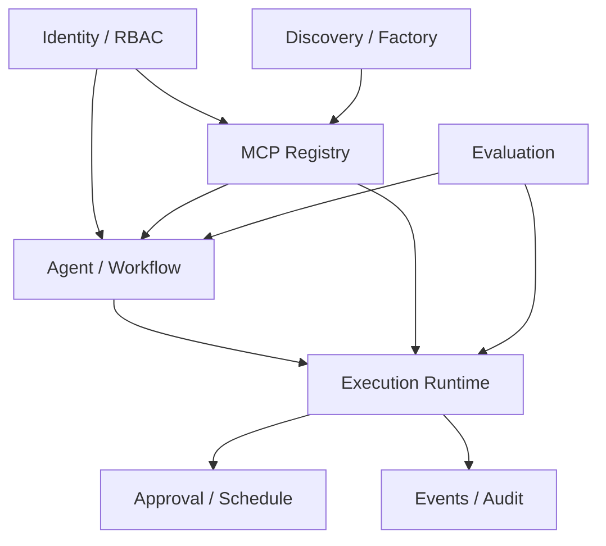
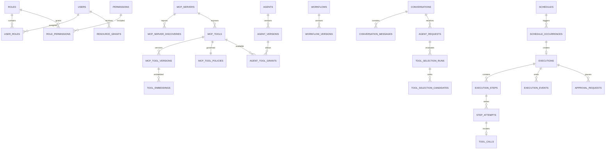
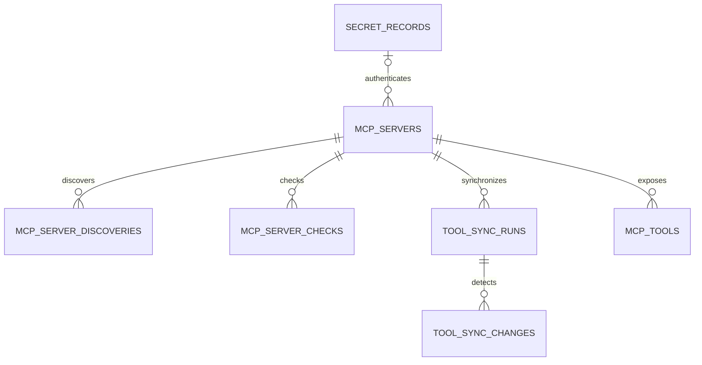
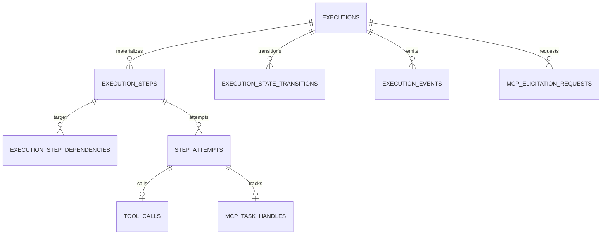
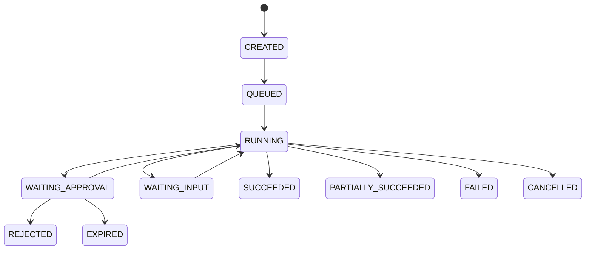

# MCPFlow 데이터 모델 및 ERD 설계서

> **MCPFlow - MCP-based AI Agent Automation Platform**

| 항목 | 내용 |
|---|---|
| 문서 ID | `MCPF-DATA-001` |
| 문서 버전 | `v0.1` |
| 상태 | Draft - 개발 기준 초안 |
| 기준 저장소 | `ramza2/mcp-flow` |
| 공식 과제명 | MCP 연계 업무 자동화 AI 에이전트 개발 |
| 선행 문서 | `01-requirements.md` v0.2, `02-functional-specification.md` v0.2, `03-system-architecture.md` v0.2, `04-agent-mcp-architecture.md` v0.1 |
| 기준 DBMS | PostgreSQL 17 이상 |
| 최종 수정일 | 2026-09-02 |

---

## 1. 문서 목적

본 문서는 MCPFlow의 영속 데이터 구조, 엔터티 관계, 키·제약조건, 인덱스, 트랜잭션 경계, 동시성 제어, 보존 및 보안 원칙을 정의한다. Backend 모델, Alembic migration, Repository 구현, API 계약 및 시험 데이터는 본 문서를 공통 기준으로 사용한다.

본 문서의 목적은 다음과 같다.

- 여러 Cursor Agent가 동일한 테이블명·필드명·관계를 사용하도록 기준을 고정한다.
- MCP Server와 Tool의 변경 이력을 보존하면서 현재 운영상태를 빠르게 조회한다.
- Agent가 생성한 Execution Plan과 실제 실행상태를 분리하고 실행 시점의 재현성을 확보한다.
- 승인, 예약, 재시도, 취소 및 비동기 Job의 중복 실행을 데이터 계층에서 방지한다.
- 실행이력과 감사로그가 운영·시험·제출 산출물의 근거가 되도록 추적성을 보장한다.
- 정형 컬럼, `jsonb`, Object Storage 및 `pgvector`의 책임 경계를 명확히 한다.

구현이 본 문서와 충돌할 경우 임의로 테이블 또는 필드를 추가하지 않는다. 영향받는 요구사항, 기능, API 및 후속 문서를 식별한 뒤 본 문서와 migration을 함께 변경한다.

---

## 2. 적용 범위

### 2.1 포함 범위

| 데이터 영역 | 포함 내용 |
|---|---|
| Identity/RBAC | 사용자, 역할, Permission, 역할 할당, 자원별 Grant, 인증 Session |
| Secret | MCP·LLM·외부 연계에 사용하는 암호화 비밀값과 회전 상태 |
| MCP Registry | MCP Server, protocol/capability discovery, 연결 점검, Tool 및 Tool version |
| Agent | Agent, Agent version, LLM/Embedding profile, Tool 허용범위 |
| Conversation | 대화, 메시지, 자연어 요청, clarification |
| Workflow | 재사용 가능한 Workflow와 불변 version, Execution Plan snapshot |
| Execution | Execution, Step, dependency, attempt, Tool call, state transition, event |
| Operation | 승인, 예약, 예약 발생건, Job, Outbox, 알림, idempotency |
| Audit/Artifact | 감사 이벤트, Object Storage 메타데이터, 내보내기 산출물 |
| Extension | 외부 MCP 후보, Tool Factory build/test artifact |
| Evaluation | Tool mapping dataset, 평가 실행 및 case별 결과 |

### 2.2 제외 범위

- Redis 내부 key의 물리 구조와 Celery broker protocol
- Object Storage의 bucket lifecycle 세부설정
- LLM Provider가 자체 보관하는 요청·응답 데이터 모델
- 외부 MCP Server 내부 데이터 모델
- 분석용 별도 Data Warehouse 또는 장기 BI star schema

Redis와 Object Storage도 시스템 구성요소이지만 PostgreSQL이 업무상태의 Source of Truth다. Redis 데이터 유실만으로 Execution의 최종상태나 감사기록이 소실되어서는 안 된다.

---

## 3. 설계 원칙

### 3.1 핵심 원칙

| ID | 원칙 | 적용 기준 |
|---|---|---|
| DM-PR-001 | PostgreSQL 원본성 | 업무상태, 실행상태, 승인, 예약 및 감사의 최종 원본은 PostgreSQL이다. |
| DM-PR-002 | 논리 자원과 Version 분리 | Agent, Workflow, MCP Tool은 논리 자원과 불변 version을 분리한다. |
| DM-PR-003 | 실행 Snapshot 고정 | Execution 생성 시 Plan, 입력, Tool version 및 정책을 고정하여 이후 설정 변경과 분리한다. |
| DM-PR-004 | 정형 우선 | 검색·조인·권한·제약에 사용하는 값은 정형 컬럼으로 저장한다. |
| DM-PR-005 | 제한적 JSONB | 외부 schema, snapshot, 가변 payload처럼 원자적으로 취급하는 구조에만 `jsonb`를 사용한다. |
| DM-PR-006 | 대용량 분리 | 큰 Tool 결과, 파일, export, build artifact는 Object Storage에 두고 DB에는 참조와 무결성 정보를 저장한다. |
| DM-PR-007 | Append-only 증거 | 상태전이, 실행 event 및 감사 event는 수정 대신 추가한다. |
| DM-PR-008 | 명시적 무결성 | 가능한 관계는 FK, unique, check constraint로 강제하고 application 검증만으로 대체하지 않는다. |
| DM-PR-009 | UTC 저장 | 모든 시각은 `timestamptz` UTC로 저장하고 표시 시 사용자 시간대로 변환한다. |
| DM-PR-010 | Secret 비노출 | secret 평문은 DB, JSON snapshot, 로그, prompt, audit에 저장하지 않는다. |
| DM-PR-011 | 멱등성 | API 생성, 예약 발생, Job 전달 및 Tool 재시도의 중복효과를 식별키로 통제한다. |
| DM-PR-012 | 측정 후 최적화 | 인덱스·partition은 예상이 아닌 대표 query와 `EXPLAIN (ANALYZE, BUFFERS)` 결과로 조정한다. |

### 3.2 관계형 컬럼과 JSONB 선택 기준

| 관계형 컬럼으로 저장 | JSONB로 저장 |
|---|---|
| 식별자, FK, 상태, 소유자, 시각 | 외부 MCP 원본 descriptor |
| 검색·필터·정렬 조건 | JSON Schema |
| Permission, risk, retry, timeout | Execution Plan 전체 snapshot |
| 집계·성능지표에 사용하는 수치 | 입력·출력 snapshot의 가변 본문 |
| unique 또는 check 대상 | Provider별 추가 설정 |

동일 JSON 경로가 권한판단, 상태전이 또는 빈번한 목록 필터에 사용되면 정형 컬럼으로 승격한다. `jsonb` 내부 값만으로 FK 또는 핵심 unique 규칙을 구현하지 않는다.

### 3.3 데이터 분류

| 등급 | 예시 | 저장·접근 원칙 |
|---|---|---|
| PUBLIC | 공개 Tool 이름·설명 | 일반 권한범위 내 조회 |
| INTERNAL | Agent 설정, Workflow, 실행 메타데이터 | 인증 및 RBAC 필요 |
| CONFIDENTIAL | Tool 입력·결과, 사용자 요청 | 최소권한, masking, 보존기간 적용 |
| SECRET | access token, API key, refresh token | 암호화 저장, 평문 반환 금지 |
| AUDIT | 권한변경, 승인, 실행 증적 | append-only, 별도 조회 Permission |

---

## 4. 기술 기준 및 Naming Convention

### 4.1 PostgreSQL 기준

- 운영 기준은 PostgreSQL 17 이상으로 한다.
- DB encoding은 `UTF8`, 운영 timezone은 `UTC`로 고정한다.
- 기본 schema는 `public` 대신 업무영역별 PostgreSQL schema를 사용하지 않고, 초기 modular monolith에서는 단일 schema와 명시적 table prefix를 사용한다.
- migration은 Alembic으로만 수행하며 운영 DB에서 ORM의 자동 `create_all()`을 사용하지 않는다.
- 필수 extension은 `vector`다. `pg_trgm`은 Tool 이름·태그의 유사검색 시험결과에 따라 활성화한다.

### 4.2 이름 규칙

| 대상 | 규칙 | 예시 |
|---|---|---|
| Table | 복수형 `snake_case` | `mcp_servers`, `execution_steps` |
| Column | 단수형 `snake_case` | `workflow_version_id` |
| PK | `id` | `id uuid primary key` |
| FK | `<singular>_id` | `agent_version_id` |
| Timestamp | `<verb>_at` | `created_at`, `started_at` |
| Boolean | `is_` 또는 `has_` | `is_active` |
| Check constraint | `ck_<table>__<rule>` | `ck_executions__terminal_time` |
| Unique constraint | `uq_<table>__<columns>` | `uq_roles__code` |
| FK constraint | `fk_<table>__<column>` | `fk_agents__created_by` |
| Index | `ix_<table>__<columns>` | `ix_executions__status_created_at` |

PostgreSQL identifier 길이 제한을 고려하여 이름이 길면 의미가 유지되는 범위에서 축약한다. migration에서 자동 생성되는 constraint 이름도 SQLAlchemy naming convention으로 통일한다.

### 4.3 공통 타입

| 논리 타입 | PostgreSQL 타입 | 기준 |
|---|---|---|
| 업무 ID | `uuid` | application에서 UUID v4 생성, 외부 노출 가능 |
| 고빈도 순번 | `bigint generated always as identity` | event·outbox 내부 정렬용 |
| 상태·종류 | `varchar(40)` | `CHECK`로 허용값 제한, native enum 미사용 |
| 짧은 code | `varchar(100)` | 시스템 내 unique code |
| 이름 | `varchar(200)` | UI 표시명 |
| 설명 | `text` | 길이 제한은 API와 application에서 병행 |
| 시각 | `timestamptz` | UTC |
| 구조화 payload | `jsonb` | object/array shape를 application schema로 검증 |
| 해시 | `char(64)` | SHA-256 lowercase hex |
| 바이너리 암호문 | `bytea` | AEAD ciphertext/nonce/tag |
| Vector | `vector(N)` 또는 `halfvec(N)` | 한 환경의 active embedding 차원 고정 |

### 4.4 공통 컬럼 세트

모든 테이블에 모든 컬럼을 기계적으로 추가하지 않는다. 성격별로 다음 세트를 적용한다.

| 세트 | 컬럼 |
|---|---|
| MutableResource | `id`, `created_at`, `created_by`, `updated_at`, `updated_by`, `lock_version`, `deleted_at` |
| ImmutableVersion | `id`, logical FK, `version_no`, `created_at`, `created_by`, `content_hash` |
| RuntimeEntity | `id`, `created_at`, 상태별 시각, `lock_version` |
| AppendOnlyEvent | `id bigint`, `event_id uuid`, `occurred_at`, event payload |

`updated_at`은 application이 UPDATE 시 명시적으로 변경한다. DB trigger에 의존하지 않는다. `lock_version`은 성공한 변경마다 1 증가시키고 `WHERE id = :id AND lock_version = :expected` 방식으로 낙관적 잠금을 적용한다.

---

## 5. 전체 논리 데이터 구조



### 5.1 핵심 ERD



### 5.2 영속성과 Cache 경계

| 데이터 | PostgreSQL | Redis | Object Storage |
|---|---:|---:|---:|
| 사용자·역할·Permission | 원본 | 짧은 TTL cache 가능 | - |
| Agent·Workflow·Tool version | 원본 | 검색/조회 cache 가능 | - |
| Execution/Step 상태 | 원본 | 진행상태 전달 cache 가능 | - |
| Celery task message | Outbox 원본 | 전달·소비 | - |
| Session payload | durable metadata | opaque session | - |
| 큰 Tool 결과·첨부파일 | metadata/ref | - | 원본 blob |
| 감사로그 | 원본 | 금지 | export만 가능 |
| Vector | 원본 | 금지 | 재생성 source 가능 |

### 5.3 물리 Table Catalog

`Core`는 제품의 기본 실행·운영에 필요한 테이블이며 `Extension`은 외부 탐색, Tool Factory 또는 정식 평가기능을 구현할 때 활성화한다. Optional로 명시하지 않은 테이블은 본 설계 범위에 포함한다.

| Domain | Table | 구분 | 책임 |
|---|---|---|---|
| Identity | `users` | Core | 사용자 identity·상태 |
| Identity | `roles`, `permissions` | Core | RBAC 정의 |
| Identity | `user_roles`, `role_permissions` | Core | RBAC 연결 |
| Identity | `resource_grants` | Core | 자원 단위 Allow/Deny |
| Identity | `auth_sessions` | Core | Session 발급·폐기 metadata |
| Secret | `secret_records` | Core | 암호화 credential |
| Provider | `llm_profiles`, `embedding_profiles` | Core | Model Provider 설정 |
| MCP | `mcp_servers` | Core | Server Registry |
| MCP | `mcp_server_discoveries`, `mcp_server_checks` | Core | protocol/capability·상태점검 이력 |
| Tool | `mcp_tools`, `mcp_tool_versions` | Core | Tool logical identity·불변 descriptor |
| Tool | `mcp_tool_policies` | Core | 위험·승인·timeout·retry 정책 |
| Tool | `tool_sync_runs`, `tool_sync_changes` | Core | Discovery diff·적용 이력 |
| Tool | `tool_embeddings` | Core | lexical/vector 검색자료 |
| Agent | `agents`, `agent_versions` | Core | Agent logical identity·불변 설정 |
| Agent | `agent_tool_grants` | Core | Agent version별 Tool 범위 |
| Conversation | `conversations`, `conversation_messages` | Core | 대화와 message |
| Agent | `agent_requests`, `clarification_requests` | Core | 자연어 분석·추가입력 |
| Agent | `tool_selection_runs`, `tool_selection_candidates` | Core | 검색·선택 재현근거 |
| Workflow | `workflows`, `workflow_versions`, `workflow_version_tool_refs` | Core | 재사용 Plan·version·Tool FK projection |
| Execution | `executions`, `execution_steps` | Core | 실행 instance·materialized Step |
| Execution | `execution_step_dependencies` | Core | Step DAG dependency |
| Execution | `step_attempts`, `tool_calls` | Core | 재시도·MCP 호출 증거 |
| Execution | `mcp_task_handles`, `mcp_elicitation_requests` | Core | MCP 장기 Task·사용자 입력대기 |
| Execution | `execution_state_transitions`, `execution_events` | Core | 상태전이·SSE Timeline |
| Approval | `approval_requests`, `approval_decisions` | Core | 승인대기와 판단 |
| Schedule | `schedules`, `schedule_occurrences` | Core | 예약 정의·발생 멱등성 |
| Operation | `jobs`, `outbox_events` | Core | 장기 Job·비동기 전달 |
| Operation | `api_idempotency_records` | Core | 생성 API 중복방지 |
| Operation | `notification_deliveries` | Core | 알림 전달상태 |
| Artifact | `object_blobs` | Core | Object Storage metadata |
| Audit | `audit_events`, `export_jobs` | Core | 감사 증거·내보내기 |
| Discovery | `external_mcp_sources`, `external_mcp_candidates`, `external_mcp_reviews` | Extension | 외부 MCP 후보 수집·검토 |
| Factory | `tool_factory_jobs`, `tool_factory_artifacts`, `tool_factory_test_results` | Extension | 생성·격리시험·artifact |
| Evaluation | `evaluation_datasets`, `evaluation_cases` | Extension | 고정 평가 dataset |
| Evaluation | `evaluation_runs`, `evaluation_case_results` | Extension | 평가 실행·metric |
| Configuration | `system_settings` | Core | runtime 변경 가능한 non-secret 설정 |

물리 구현 전 각 행은 담당 module의 SQLAlchemy model, Alembic revision, Repository 및 최소 constraint test와 1:1로 연결한다.

### 5.4 선행 문서의 대표명 확정

`03-system-architecture.md`의 table 목록은 대표명이므로 본 문서에서 다음처럼 물리명을 확정한다.

| 선행 문서 대표명/논리 Entity | 본 문서 물리 구현 |
|---|---|
| `sessions` | `auth_sessions` |
| `mcp_connection_checks` | `mcp_server_checks` |
| `tool_policies` | `mcp_tool_policies` |
| `tool_selection_evaluations` | `tool_selection_runs` + `tool_selection_candidates` |
| `execution_plan_snapshots` | `workflow_versions.plan_definition` 또는 `executions.plan_snapshot`; 별도 table 없음 |
| `state_transitions` | `execution_state_transitions` |
| `candidate_reviews` | `external_mcp_reviews` |
| `factory_jobs`, `factory_artifacts` | `tool_factory_jobs`, `tool_factory_artifacts` |
| 논리 `ExecutionResult` | `executions.result_summary`, `execution_steps.result_*`, `step_attempts.result_*`, `object_blobs`; 별도 table 없음 |

Backend code, migration 및 API 문서는 본 문서의 물리명을 사용한다. 선행 문서는 아키텍처 수준의 논리명으로 해석한다.

---

## 6. Identity 및 RBAC 모델

### 6.1 `users`

| 컬럼 | 타입 | Null | 제약/설명 |
|---|---|---:|---|
| `id` | `uuid` | N | PK |
| `login_id` | `varchar(100)` | N | 사용자 로그인 ID |
| `email` | `varchar(320)` | N | 원본 표시값 |
| `display_name` | `varchar(200)` | N | 화면 표시명 |
| `password_hash` | `text` | Y | local auth 사용 시에만 저장 |
| `auth_source` | `varchar(40)` | N | `LOCAL`, `OIDC` |
| `external_issuer` | `text` | Y | OIDC issuer URL |
| `external_subject` | `varchar(255)` | Y | OIDC subject |
| `status` | `varchar(40)` | N | `INVITED`, `ACTIVE`, `LOCKED`, `INACTIVE` |
| `timezone` | `varchar(64)` | N | IANA timezone, 기본 `UTC` |
| `locale` | `varchar(20)` | N | 기본 `ko-KR` |
| `last_login_at` | `timestamptz` | Y | 마지막 성공 로그인 |
| 공통 | - | - | MutableResource, 단 `deleted_at` 대신 비활성화 우선 |

제약 및 인덱스:

- `UNIQUE (lower(login_id))`
- `UNIQUE (lower(email))`
- `(auth_source, external_issuer, external_subject)`는 `external_subject IS NOT NULL`인 행에 partial unique index
- `status = 'ACTIVE'` 사용자만 신규 Session·Execution을 생성할 수 있다.

### 6.2 `roles`, `permissions`

| Table | 핵심 컬럼 | 제약 |
|---|---|---|
| `roles` | `id`, `code`, `name`, `description`, `is_system`, 공통 MutableResource | `code` unique, system role은 삭제 금지 |
| `permissions` | `id`, `code`, `name`, `resource_type`, `action`, `description`, `is_system` | `code` unique, seed migration으로 관리 |

Permission code 형식은 `<resource>:<action>`으로 고정한다.

```text
mcp_server:read
mcp_server:manage
mcp_tool:execute
agent:manage
workflow:execute
execution:operate
approval:decide
audit:read
```

### 6.3 `user_roles`, `role_permissions`

| Table | 컬럼 | PK/Unique | 삭제 규칙 |
|---|---|---|---|
| `user_roles` | `user_id`, `role_id`, `assigned_at`, `assigned_by`, `expires_at` | PK `(user_id, role_id)` | 할당 해제는 hard delete + audit |
| `role_permissions` | `role_id`, `permission_id`, `granted_at`, `granted_by` | PK `(role_id, permission_id)` | 연결 해제는 hard delete + audit |

`expires_at`이 지난 역할은 권한 계산에서 제외한다. 역할 변경 결과는 이후 요청부터 적용하며 이미 실행 중인 고위험 Step은 Tool 호출 직전에 Permission을 재검증한다.

### 6.4 `resource_grants`

Agent, Workflow, MCP Server 및 Tool별 허용범위를 나타낸다. RBAC의 coarse-grained Permission을 resource scope로 좁히는 용도다.

| 컬럼 | 타입 | Null | 설명 |
|---|---|---:|---|
| `id` | `uuid` | N | PK |
| `subject_type` | `varchar(20)` | N | `USER`, `ROLE` |
| `subject_id` | `uuid` | N | 사용자 또는 역할 ID |
| `resource_type` | `varchar(40)` | N | `MCP_SERVER`, `MCP_TOOL`, `AGENT`, `WORKFLOW` |
| `resource_id` | `uuid` | N | 대상 자원 ID |
| `permission_code` | `varchar(100)` | N | 허용할 Permission code |
| `effect` | `varchar(10)` | N | `ALLOW`, `DENY` |
| `conditions` | `jsonb` | N | 시간대·환경 등 제한, 기본 `{}` |
| `expires_at` | `timestamptz` | Y | 만료시각 |
| `created_at`, `created_by` | - | - | 생성 정보 |

`subject_id`와 `resource_id`는 다형 FK이므로 DB 단일 FK로 강제할 수 없다. application service가 유형별 존재를 검증하고 삭제 전 참조를 확인한다. `DENY`가 `ALLOW`보다 우선한다.

Unique: `(subject_type, subject_id, resource_type, resource_id, permission_code)`.

### 6.5 `auth_sessions`

| 컬럼 | 타입 | 설명 |
|---|---|---|
| `id` | `uuid` | PK, Redis session key에는 직접 사용하지 않고 난수 token hash와 연결 |
| `user_id` | `uuid` | FK users |
| `token_hash` | `char(64)` | opaque token의 SHA-256 hash, unique |
| `issued_at`, `expires_at` | `timestamptz` | 유효기간 |
| `last_seen_at` | `timestamptz` | 갱신은 빈도 제한 |
| `revoked_at`, `revoked_by` | `timestamptz`, `uuid` | 폐기 정보 |
| `ip_hash` | `char(64)` | 필요 시 비식별 추적값 |
| `user_agent_summary` | `varchar(300)` | 길이 제한·정규화 |

Redis에는 Session payload를 TTL로 저장하고 PostgreSQL에는 발급·만료·폐기 및 보안감사에 필요한 durable metadata만 보존한다.

---

## 7. Secret 및 Provider 설정

### 7.1 `secret_records`

| 컬럼 | 타입 | Null | 설명 |
|---|---|---:|---|
| `id` | `uuid` | N | PK, 외부에는 secret reference로만 노출 |
| `name` | `varchar(200)` | N | 관리용 표시명 |
| `secret_kind` | `varchar(40)` | N | `API_KEY`, `OAUTH_TOKEN_SET`, `BASIC_AUTH`, `CUSTOM` |
| `ciphertext` | `bytea` | N | AEAD 암호문 |
| `nonce` | `bytea` | N | 암호화 nonce |
| `key_version` | `varchar(100)` | N | 외부 KMS/host key version |
| `fingerprint` | `char(64)` | N | 중복 확인용 keyed hash, 평문 hash 금지 |
| `status` | `varchar(20)` | N | `ACTIVE`, `EXPIRED`, `REVOKED` |
| `expires_at` | `timestamptz` | Y | token 만료 등 |
| `rotated_at` | `timestamptz` | Y | 최근 회전 |
| 공통 | - | - | MutableResource, 조회 API에서 암호 관련 컬럼 제외 |

Secret 교체는 같은 ID의 암호문을 회전하고 `lock_version`을 증가시킨다. 이전 평문이나 암호문을 audit payload에 복사하지 않는다. 복구가 필요한 key rotation은 암호화 계층이 별도 안전 절차로 수행한다.

### 7.2 `llm_profiles`, `embedding_profiles`

| Table | 핵심 컬럼 |
|---|---|
| `llm_profiles` | `id`, `code`, `name`, `provider`, `model`, `base_url`, `credential_secret_id`, `parameters jsonb`, `status`, `lock_version`, audit columns |
| `embedding_profiles` | `id`, `code`, `name`, `provider`, `model`, `dimension`, `distance_metric`, `credential_secret_id`, `status`, `is_active_for_tools`, audit columns |

제약:

- `code` unique
- `dimension > 0`
- `distance_metric IN ('COSINE', 'L2', 'INNER_PRODUCT')`
- Tool Registry용 `is_active_for_tools = true` 행은 한 개만 허용하는 partial unique index를 둔다.
- active embedding profile의 dimension은 `tool_embeddings.embedding` typmod와 같아야 한다.

서로 다른 dimension의 model로 전환할 때는 profile 변경만으로 완료하지 않는다. 새 column/table migration, 전체 재embedding, recall 검증 및 traffic 전환 절차를 수행한다.

---

## 8. MCP Server 모델

### 8.1 MCP Server ERD



### 8.2 `mcp_servers`

| 컬럼 | 타입 | Null | 설명 |
|---|---|---:|---|
| `id` | `uuid` | N | PK |
| `code` | `varchar(100)` | N | 내부 고유 code |
| `name` | `varchar(200)` | N | 표시명 |
| `description` | `text` | Y | 설명 |
| `transport_type` | `varchar(30)` | N | `STDIO`, `STREAMABLE_HTTP`, `LEGACY_HTTP_SSE` |
| `endpoint_url` | `text` | Y | HTTP 계열, API에는 masking 가능 |
| `stdio_manifest_id` | `varchar(200)` | Y | 승인된 실행 manifest 식별자 |
| `transport_config` | `jsonb` | N | timeout 외의 허용된 adapter 설정, 기본 `{}` |
| `auth_type` | `varchar(30)` | N | `NONE`, `BEARER`, `OAUTH2`, `BASIC`, `CUSTOM` |
| `auth_secret_id` | `uuid` | Y | FK secret_records, `ON DELETE RESTRICT` |
| `status` | `varchar(20)` | N | `DRAFT`, `ACTIVE`, `INACTIVE`, `ERROR` |
| `protocol_era` | `varchar(20)` | Y | `CURRENT`, `LEGACY` |
| `negotiated_protocol_version` | `varchar(30)` | Y | 마지막 성공 discovery 결과 |
| `capabilities` | `jsonb` | N | 마지막 적용 capability snapshot |
| `connect_timeout_ms` | `integer` | N | `100..120000` |
| `call_timeout_ms` | `integer` | N | `100..3600000` |
| `max_concurrency` | `smallint` | N | `1..1000` |
| `retry_policy` | `jsonb` | N | 허용된 retry schema |
| `last_healthy_at` | `timestamptz` | Y | 마지막 정상 점검 |
| `last_error_at` | `timestamptz` | Y | 마지막 오류 |
| 공통 | - | - | MutableResource |

제약:

- `code` unique on live rows: `UNIQUE INDEX ... WHERE deleted_at IS NULL`
- HTTP transport는 `endpoint_url` 필수, STDIO는 `stdio_manifest_id` 필수
- `status = 'ACTIVE'` 전 discovery 성공과 최소 1회 연결검증을 application에서 확인
- secret FK는 nullable이나 `auth_type != 'NONE'`이면 인증방식별 필수 여부 검증

### 8.3 `mcp_server_discoveries`

Server discovery/협상 결과의 이력이다. 현재 적용값은 `mcp_servers`에 denormalize하되 원본 증거는 본 테이블에 남긴다.

| 컬럼 | 타입 | 설명 |
|---|---|---|
| `id` | `uuid` | PK |
| `mcp_server_id` | `uuid` | FK |
| `protocol_era` | `varchar(20)` | Current/Legacy adapter |
| `requested_versions` | `jsonb` | client가 제시한 version 목록 |
| `selected_version` | `varchar(30)` | 협상 결과 |
| `capabilities` | `jsonb` | 정규화 capability |
| `raw_response` | `jsonb` | secret 제거한 원본 descriptor |
| `adapter_name`, `adapter_version` | `varchar(100)` | 재현 정보 |
| `success` | `boolean` | 성공 여부 |
| `error_code`, `error_message` | `varchar(100)`, `text` | 정규화 오류 |
| `started_at`, `finished_at` | `timestamptz` | 소요시간 산출 |

Index: `(mcp_server_id, started_at DESC)`.

### 8.4 `mcp_server_checks`

| 컬럼 | 타입 | 설명 |
|---|---|---|
| `id` | `uuid` | PK |
| `mcp_server_id` | `uuid` | FK |
| `check_type` | `varchar(30)` | `MANUAL`, `SCHEDULED`, `PRE_ACTIVATION` |
| `status` | `varchar(20)` | `SUCCEEDED`, `FAILED`, `TIMED_OUT` |
| `latency_ms` | `integer` | 음수 금지 |
| `protocol_version` | `varchar(30)` | 확인된 version |
| `error_layer` | `varchar(30)` | `DNS`, `NETWORK`, `TLS`, `AUTH`, `PROTOCOL`, `TIMEOUT`, `SERVER` |
| `error_code`, `error_message` | - | secret 제거 |
| `checked_at`, `checked_by` | - | 점검 정보 |

Index: `(mcp_server_id, checked_at DESC)`, `(status, checked_at DESC)`.

---

## 9. MCP Tool Registry 모델

### 9.1 `mcp_tools`

Server가 공개하는 동일한 원격 Tool 이름의 논리 identity다.

| 컬럼 | 타입 | Null | 설명 |
|---|---|---:|---|
| `id` | `uuid` | N | PK |
| `mcp_server_id` | `uuid` | N | FK mcp_servers |
| `remote_name` | `varchar(255)` | N | Server 원본 Tool 이름 |
| `display_name` | `varchar(255)` | N | 운영자 보완 표시명 |
| `description_override` | `text` | Y | 운영자 설명, 원본과 분리 |
| `tags` | `jsonb` | N | string array, 정규화·개수 제한 |
| `status` | `varchar(20)` | N | `DISCOVERED`, `ACTIVE`, `INACTIVE`, `MISSING`, `BLOCKED` |
| `current_version_id` | `uuid` | Y | 적용 중인 mcp_tool_versions, deferred FK |
| `first_seen_at`, `last_seen_at` | `timestamptz` | N | discovery 시각 |
| 공통 | - | - | MutableResource |

Unique live identity: `(mcp_server_id, remote_name) WHERE deleted_at IS NULL`.

`MISSING`은 Server에서 사라졌으나 과거 이력 때문에 보존되는 상태다. 물리 삭제하지 않으며 신규 후보·실행에서 제외한다.

### 9.2 `mcp_tool_versions`

| 컬럼 | 타입 | Null | 설명 |
|---|---|---:|---|
| `id` | `uuid` | N | PK |
| `mcp_tool_id` | `uuid` | N | FK mcp_tools |
| `version_no` | `integer` | N | Tool 내 1부터 증가 |
| `remote_description` | `text` | Y | 원본 description |
| `input_schema` | `jsonb` | N | 검증된 JSON Schema |
| `output_schema` | `jsonb` | Y | 제공되는 경우 |
| `annotations` | `jsonb` | N | MCP annotation 원본/정규화 값 |
| `raw_descriptor` | `jsonb` | N | secret 제거한 원본 Tool descriptor |
| `schema_dialect` | `varchar(100)` | Y | 명시된 JSON Schema dialect |
| `content_hash` | `char(64)` | N | canonical descriptor SHA-256 |
| `validation_status` | `varchar(20)` | N | `VALID`, `INVALID`, `WARNING` |
| `validation_errors` | `jsonb` | N | 구조화 오류 array |
| `discovered_at` | `timestamptz` | N | 최초 발견 |
| `created_at`, `created_by` | - | - | ImmutableVersion |

Unique: `(mcp_tool_id, version_no)`, `(mcp_tool_id, content_hash)`.

Version row는 수정하지 않는다. 운영자 보완값과 정책은 논리 Tool/Policy에 두고 원격 descriptor가 달라지면 새 version을 생성한다.

### 9.3 `mcp_tool_policies`

| 컬럼 | 타입 | 설명 |
|---|---|---|
| `id` | `uuid` | PK |
| `mcp_tool_id` | `uuid` | FK, unique 1:1 |
| `risk_class` | `varchar(30)` | `READ_ONLY`, `IDEMPOTENT_WRITE`, `NON_IDEMPOTENT_WRITE`, `DESTRUCTIVE`, `UNKNOWN` |
| `requires_approval` | `boolean` | 정책상 승인 |
| `timeout_ms` | `integer` | Tool override, nullable 대신 명시값 |
| `max_attempts` | `smallint` | `1..10` |
| `backoff_policy` | `jsonb` | base/max/jitter |
| `max_result_bytes` | `bigint` | 양수 |
| `allow_auto_select` | `boolean` | LLM 자동선택 허용 |
| `data_classification` | `varchar(30)` | 최대 결과 민감도 |
| `policy_metadata` | `jsonb` | 확장 정책 |
| 공통 | - | `updated_at`, `updated_by`, `lock_version` |

정책 변경은 version row를 만들지 않지만 Execution 생성 시 `policy_snapshot`으로 고정한다. Tool 호출 직전 상위 hard policy와 현재 Permission은 다시 확인한다.

### 9.4 `tool_sync_runs`, `tool_sync_changes`

| Table | 핵심 컬럼 |
|---|---|
| `tool_sync_runs` | `id`, `mcp_server_id`, `trigger_type`, `status`, `protocol_version`, `started_at`, `finished_at`, `added_count`, `changed_count`, `missing_count`, `error_code`, `error_message`, `job_id` |
| `tool_sync_changes` | `id`, `tool_sync_run_id`, `mcp_tool_id`, `remote_name`, `change_type`, `old_version_id`, `new_version_id`, `diff_summary jsonb`, `apply_status`, `applied_at`, `applied_by` |

`change_type`: `ADDED`, `CHANGED`, `MISSING`, `UNCHANGED`. 미리보기와 적용을 분리하며 동일 sync run의 `(remote_name, change_type)`를 unique로 한다.

### 9.5 `tool_embeddings`

| 컬럼 | 타입 | 설명 |
|---|---|---|
| `id` | `uuid` | PK |
| `mcp_tool_version_id` | `uuid` | FK |
| `embedding_profile_id` | `uuid` | FK |
| `search_text` | `text` | Tool/Server/설명/태그를 정규화한 검색문서 |
| `search_tsv` | `tsvector` | `simple` config로 생성한 stored generated column |
| `embedding` | `vector(N)` | nullable, active dimension이 2,000 이하일 때 |
| `content_hash` | `char(64)` | search_text hash |
| `embedded_at` | `timestamptz` | 생성시각 |
| `status` | `varchar(20)` | `READY`, `STALE`, `FAILED` |
| `error_code` | `varchar(100)` | 실패 원인 |

Unique: `(mcp_tool_version_id, embedding_profile_id)`.

`status = 'READY'`이면 `embedding IS NOT NULL`이어야 한다. `search_tsv`는 `to_tsvector('simple', coalesce(search_text, ''))` 기반 generated stored column으로 만들어 application dual-write를 피한다.

`N`은 구현 전 선택한 active embedding model의 dimension으로 Alembic migration에 고정한다. dimension이 2,000을 초과하고 4,000 이하이면 `halfvec(N)`과 `halfvec_cosine_ops` 사용을 별도 ADR로 확정한다.

초기 Tool 수가 적을 때는 exact cosine search를 사용한다. HNSW는 대표 dataset으로 Recall@K와 latency를 측정한 뒤 생성한다.

```sql
CREATE INDEX ix_tool_embeddings__search_tsv
ON tool_embeddings USING gin (search_tsv);

-- 성능시험으로 필요성이 확인된 이후 적용
CREATE INDEX ix_tool_embeddings__embedding_hnsw
ON tool_embeddings USING hnsw (embedding vector_cosine_ops);
```

---

## 10. Agent 및 Tool 허용범위 모델

### 10.1 `agents`

| 컬럼 | 타입 | 설명 |
|---|---|---|
| `id` | `uuid` | PK |
| `code`, `name`, `description` | - | code unique on live rows |
| `status` | `varchar(20)` | `DRAFT`, `ACTIVE`, `INACTIVE`, `ARCHIVED` |
| `current_version_id` | `uuid` | 적용 Agent version, deferred FK |
| `owner_id` | `uuid` | FK users |
| `visibility` | `varchar(20)` | `PRIVATE`, `RESTRICTED`, `INTERNAL` |
| 공통 | - | MutableResource |

### 10.2 `agent_versions`

| 컬럼 | 타입 | 설명 |
|---|---|---|
| `id` | `uuid` | PK |
| `agent_id` | `uuid` | FK |
| `version_no` | `integer` | Agent 내 증가 |
| `system_instruction` | `text` | prompt 본문, secret 금지 |
| `llm_profile_id` | `uuid` | FK |
| `request_schema_version` | `varchar(30)` | `StructuredRequest` version |
| `plan_schema_version` | `varchar(30)` | `ExecutionPlan` version |
| `selection_settings` | `jsonb` | top-K, threshold, margin, RRF setting |
| `planning_settings` | `jsonb` | step/loop/repair 제한 |
| `response_settings` | `jsonb` | 응답 구성정책 |
| `content_hash` | `char(64)` | canonical config hash |
| `change_summary` | `text` | version 변경내용 |
| `created_at`, `created_by` | - | ImmutableVersion |

Unique: `(agent_id, version_no)`, `(agent_id, content_hash)`.

### 10.3 `agent_tool_grants`

| 컬럼 | 타입 | 설명 |
|---|---|---|
| `agent_version_id` | `uuid` | FK |
| `mcp_tool_id` | `uuid` | FK logical Tool |
| `effect` | `varchar(10)` | `ALLOW`, `DENY` |
| `parameter_constraints` | `jsonb` | 허용값·범위·고정값 |
| `requires_confirmation` | `boolean` | Agent별 추가 사용자 확인 |
| `created_at`, `created_by` | - | 생성정보 |

PK: `(agent_version_id, mcp_tool_id)`. 실행계획에는 grant가 가리킨 시점의 `current_version_id`를 명시적으로 확정한다.

### 10.4 Prompt version 관리

Agent prompt는 `agent_versions.system_instruction`에 포함하고 Agent version과 함께 불변화한다. 여러 Agent가 공유해야 하는 template이 생길 때만 다음 테이블을 추가한다.

- `prompt_templates`: 논리 template
- `prompt_template_versions`: 불변 본문, 변수 schema, content hash

초기 구현에서 사용처가 한 곳인 prompt를 과도하게 분리하지 않는다.

---

## 11. Conversation 및 자연어 요청 모델

### 11.1 `conversations`

| 컬럼 | 타입 | 설명 |
|---|---|---|
| `id` | `uuid` | PK |
| `owner_id` | `uuid` | FK users |
| `agent_id` | `uuid` | FK agents |
| `title` | `varchar(300)` | 자동/사용자 지정 제목 |
| `status` | `varchar(20)` | `ACTIVE`, `ARCHIVED` |
| `last_message_at` | `timestamptz` | 목록 정렬 |
| 공통 | - | MutableResource |

Index: `(owner_id, last_message_at DESC) WHERE deleted_at IS NULL`.

### 11.2 `conversation_messages`

| 컬럼 | 타입 | 설명 |
|---|---|---|
| `id` | `uuid` | PK |
| `conversation_id` | `uuid` | FK |
| `sequence_no` | `integer` | 대화 내 단조 증가 |
| `role` | `varchar(20)` | `USER`, `ASSISTANT`, `SYSTEM`, `TOOL` |
| `content` | `jsonb` | typed content part array |
| `content_text` | `text` | 검색/표시용 안전한 plain text |
| `agent_request_id` | `uuid` | 관련 요청, nullable |
| `execution_id` | `uuid` | 관련 실행, nullable |
| `visibility` | `varchar(20)` | `USER`, `OPERATOR`, `INTERNAL` |
| `created_at`, `created_by` | - | 생성정보 |

Unique: `(conversation_id, sequence_no)`. `sequence_no` 할당은 conversation row lock 또는 별도 atomic counter로 직렬화한다.

### 11.3 `agent_requests`

| 컬럼 | 타입 | 설명 |
|---|---|---|
| `id` | `uuid` | PK |
| `conversation_id` | `uuid` | nullable FK |
| `requester_id` | `uuid` | FK users |
| `agent_version_id` | `uuid` | 실행에 사용한 불변 version |
| `source_message_id` | `uuid` | 원본 user message |
| `raw_request_text` | `text` | 민감도·보존정책 적용 |
| `structured_request` | `jsonb` | schema-validated snapshot |
| `structured_request_version` | `varchar(30)` | schema version |
| `status` | `varchar(30)` | `RECEIVED`, `ANALYZED`, `WAITING_INPUT`, `PLANNED`, `REJECTED`, `FAILED` |
| `missing_fields` | `jsonb` | 미입력 정보 |
| `rejection_code` | `varchar(100)` | 지원불가·권한부족 등 |
| `created_at`, `analyzed_at`, `completed_at` | - | lifecycle |
| `trace_id` | `varchar(64)` | 분산 추적 ID |

### 11.4 `clarification_requests`

| 컬럼 | 타입 | 설명 |
|---|---|---|
| `id` | `uuid` | PK |
| `agent_request_id` | `uuid` | FK |
| `request_type` | `varchar(30)` | `MISSING_PARAMETER`, `TOOL_CONFIRMATION`, `PLAN_CONFIRMATION` |
| `question_schema` | `jsonb` | UI 입력 schema |
| `prompt_text` | `text` | 사용자 표시문구 |
| `status` | `varchar(20)` | `OPEN`, `ANSWERED`, `EXPIRED`, `CANCELLED` |
| `response_payload` | `jsonb` | schema 검증된 응답 |
| `requested_at`, `expires_at`, `answered_at` | - | lifecycle |
| `answered_by` | `uuid` | FK users |

동일 요청에 여러 clarification을 순차 생성할 수 있으나 `OPEN` 상태는 하나만 허용하는 partial unique index를 둔다.

### 11.5 Tool 선택 근거

#### `tool_selection_runs`

| 컬럼 | 타입 | 설명 |
|---|---|---|
| `id` | `uuid` | PK |
| `agent_request_id` | `uuid` | FK |
| `run_no` | `smallint` | 보완·repair에 따른 증가 |
| `embedding_profile_id`, `llm_profile_id` | `uuid` | 재현정보 |
| `registry_snapshot_hash` | `char(64)` | 후보 Registry 기준 |
| `settings_snapshot` | `jsonb` | top-K, RRF, threshold |
| `excluded_counts` | `jsonb` | 권한·비활성·정책별 제외 건수, 대상 ID는 기록하지 않음 |
| `decision` | `varchar(30)` | `AUTO_SELECT`, `CONFIRM`, `CLARIFY`, `NO_MATCH`, `DENIED` |
| `selected_tool_version_id` | `uuid` | nullable FK |
| `confidence`, `margin` | `numeric(6,5)` | `0..1` |
| `reason_codes` | `jsonb` | 구조화 근거 |
| `started_at`, `finished_at` | - | 성능 측정 |

Unique: `(agent_request_id, run_no)`.

#### `tool_selection_candidates`

| 컬럼 | 타입 | 설명 |
|---|---|---|
| `tool_selection_run_id` | `uuid` | FK |
| `rank` | `smallint` | 최종 순위 |
| `mcp_tool_version_id` | `uuid` | FK |
| `lexical_rank`, `vector_rank` | `integer` | 각 검색 순위 |
| `lexical_score`, `vector_score`, `rrf_score` | `double precision` | 원시 score |
| `fit_score`, `risk_score`, `input_score` | `numeric(6,5)` | 선택 공식 요소 |
| `final_score` | `numeric(6,5)` | 최종 confidence 근거 |

PK: `(tool_selection_run_id, rank)`, unique `(tool_selection_run_id, mcp_tool_version_id)`.

본 테이블에는 권한·상태·정책 hard filter를 통과한 후보만 저장한다. 제외된 Tool의 identity를 사용자 요청과 연결해 보존하지 않고 `tool_selection_runs.excluded_counts`에 사유별 집계만 기록한다.

---

## 12. Workflow 모델

### 12.1 `workflows`

| 컬럼 | 타입 | 설명 |
|---|---|---|
| `id` | `uuid` | PK |
| `code`, `name`, `description` | - | logical resource |
| `owner_id` | `uuid` | FK users |
| `status` | `varchar(20)` | `DRAFT`, `ACTIVE`, `INACTIVE`, `ARCHIVED` |
| `current_version_id` | `uuid` | deferred FK workflow_versions |
| `visibility` | `varchar(20)` | Agent와 동일 |
| 공통 | - | MutableResource |

### 12.2 `workflow_versions`

| 컬럼 | 타입 | 설명 |
|---|---|---|
| `id` | `uuid` | PK |
| `workflow_id` | `uuid` | FK |
| `version_no` | `integer` | logical Workflow 내 증가 |
| `plan_schema_version` | `varchar(30)` | Execution Plan schema version |
| `plan_definition` | `jsonb` | 검증된 전체 Plan template |
| `input_schema`, `output_schema` | `jsonb` | Workflow I/O schema |
| `policy_defaults` | `jsonb` | timeout·failure·approval 기본값 |
| `content_hash` | `char(64)` | canonical plan hash |
| `validation_status` | `varchar(20)` | `VALID`, `INVALID` |
| `validation_report` | `jsonb` | cycle, binding, permission 등 |
| `change_summary` | `text` | version 설명 |
| `created_at`, `created_by` | - | ImmutableVersion |

Unique: `(workflow_id, version_no)`, `(workflow_id, content_hash)`.

활성화는 `validation_status = 'VALID'`인 version만 허용한다. Plan의 `TOOL` step은 logical Tool이 아니라 `mcp_tool_version_id`를 참조한다. 새 실행에 최신 Tool을 자동 반영하려면 Workflow 새 version을 생성하고 재검증한다.

### 12.3 Plan 정규화 범위

Workflow authoring 및 version 비교의 원본은 `plan_definition` JSONB다. 별도 `workflow_steps` 테이블은 만들지 않는다.

이유:

- Execution Plan은 CONDITION, JOIN, APPROVAL, LOOP와 typed binding을 가진 versioned document다.
- draft 내부 step을 부분 수정하기보다 새 immutable version 생성 단위로 검증한다.
- 실행 시 `execution_steps`와 `execution_step_dependencies`로 materialize하여 운영 query와 동시성 제어를 수행한다.

Plan JSON만으로 런타임 상태를 갱신하지 않는다.

다만 Tool version 참조 무결성과 변경영향 조회를 위해 `workflow_version_tool_refs` projection을 함께 저장한다.

| 컬럼 | 타입 | 설명 |
|---|---|---|
| `workflow_version_id` | `uuid` | FK workflow_versions |
| `step_key` | `varchar(150)` | Plan 내 TOOL Step key |
| `mcp_tool_version_id` | `uuid` | FK mcp_tool_versions, `ON DELETE RESTRICT` |
| `created_at` | `timestamptz` | version 생성시각 |

PK: `(workflow_version_id, step_key)`. Workflow version과 projection은 같은 transaction에 생성하고, projection 집합이 Plan의 모든 TOOL Step과 정확히 일치하는지 contract test로 검증한다.

---

## 13. Execution 모델

### 13.1 실행 ERD



### 13.2 `executions`

| 컬럼 | 타입 | Null | 설명 |
|---|---|---:|---|
| `id` | `uuid` | N | PK |
| `source_type` | `varchar(30)` | N | `AGENT_REQUEST`, `WORKFLOW`, `SCHEDULE`, `API`, `RETRY` |
| `requester_id` | `uuid` | N | FK users |
| `agent_request_id` | `uuid` | Y | 자연어 요청 |
| `agent_version_id` | `uuid` | Y | 사용 Agent version |
| `workflow_version_id` | `uuid` | Y | 사용 Workflow version |
| `parent_execution_id` | `uuid` | Y | 재실행·하위실행의 원본 |
| `schedule_occurrence_id` | `uuid` | Y | 예약 발생건, unique nullable |
| `status` | `varchar(40)` | N | 실행 상태 |
| `plan_schema_version` | `varchar(30)` | N | Plan snapshot version |
| `plan_snapshot` | `jsonb` | N | 검증 완료 Plan |
| `plan_hash` | `char(64)` | N | canonical snapshot hash |
| `input_snapshot` | `jsonb` | N | secret은 `SECRET_REF`만 포함 |
| `policy_snapshot` | `jsonb` | N | 실행 생성 시 합성 정책 |
| `result_summary` | `jsonb` | Y | 최종 ResponseEnvelope의 구조화 결과 |
| `error_code`, `error_message` | - | Y | 최종 오류, secret 제거 |
| `trace_id` | `varchar(64)` | N | request trace |
| `priority` | `smallint` | N | `0..9`, 기본 5 |
| `requested_at` | `timestamptz` | N | 생성시각 |
| `queued_at`, `started_at`, `finished_at`, `cancel_requested_at` | `timestamptz` | Y | lifecycle |
| `lock_version` | `integer` | N | 상태 CAS |
| `retention_until` | `timestamptz` | Y | 보존 만료 예정 |

주요 check:

- terminal status이면 `finished_at IS NOT NULL`
- `started_at >= requested_at`, `finished_at >= started_at`
- `plan_hash`는 저장된 `plan_snapshot` canonical hash와 application에서 일치 검증
- `source_type`에 따른 reference 필수조건 검증

Index:

- `(requester_id, requested_at DESC)`
- `(status, priority DESC, requested_at)` for worker/operation
- `(agent_version_id, requested_at DESC)`
- `(workflow_version_id, requested_at DESC)`
- `(trace_id)`

### 13.3 Execution 상태



Terminal: `SUCCEEDED`, `PARTIALLY_SUCCEEDED`, `FAILED`, `CANCELLED`, `REJECTED`, `EXPIRED`.

상태전이는 application state machine이 수행하고 성공한 전이를 `execution_state_transitions`에 같은 transaction으로 기록한다.

#### 허용 Execution 상태전이

| 현재 상태 | 허용 다음 상태 |
|---|---|
| `CREATED` | `QUEUED`, `CANCELLED`, `FAILED` |
| `QUEUED` | `RUNNING`, `CANCELLED`, `FAILED` |
| `RUNNING` | `WAITING_APPROVAL`, `WAITING_INPUT`, `SUCCEEDED`, `PARTIALLY_SUCCEEDED`, `FAILED`, `CANCELLED` |
| `WAITING_APPROVAL` | `RUNNING`, `REJECTED`, `EXPIRED`, `CANCELLED` |
| `WAITING_INPUT` | `RUNNING`, `EXPIRED`, `CANCELLED`, `FAILED` |
| Terminal | 없음 |

`RUNNING → QUEUED`처럼 운영상 재전달이 필요해도 상태를 되돌리지 않는다. 동일 실행의 lease를 복구하거나 명시적인 새 Attempt를 생성한다. 전체 재실행은 `parent_execution_id`를 가진 새 Execution이다.

### 13.4 `execution_steps`

| 컬럼 | 타입 | 설명 |
|---|---|---|
| `id` | `uuid` | PK |
| `execution_id` | `uuid` | FK |
| `step_key` | `varchar(150)` | Plan 내 stable key |
| `step_type` | `varchar(30)` | `TOOL`, `CONDITION`, `JOIN`, `APPROVAL`, `LOOP` |
| `mcp_tool_version_id` | `uuid` | TOOL Step일 때 FK, 그 외 null |
| `parent_step_id` | `uuid` | nested loop 등 self FK |
| `sequence_hint` | `integer` | UI 기본 정렬, 실행순서 원본 아님 |
| `status` | `varchar(40)` | Step 상태 |
| `step_snapshot` | `jsonb` | 해당 Step의 immutable plan fragment |
| `resolved_input` | `jsonb` | 실행 직전 binding 결과, secret 평문 제외 |
| `result_inline` | `jsonb` | 제한 이하 결과 |
| `result_blob_id` | `uuid` | 큰 결과 Object Storage 참조 |
| `condition_result` | `boolean` | CONDITION일 때 |
| `iteration_no` | `integer` | loop materialization, 기본 0 |
| `attempt_count` | `smallint` | 완료 attempt 수 |
| `ready_at`, `started_at`, `finished_at` | - | lifecycle |
| `error_code`, `error_message` | - | 최종 Step 오류 |
| `lock_version` | `integer` | CAS |

Unique: `(execution_id, step_key, iteration_no)`.

한 결과는 `result_inline` 또는 `result_blob_id` 중 하나만 사용한다. `SECRET_REF`를 resolve한 평문은 `resolved_input`에 저장하지 않고 masked marker와 reference ID만 남긴다.

Step 상태전이는 다음을 기본으로 한다.

| 현재 상태 | 허용 다음 상태 |
|---|---|
| `PENDING` | `READY`, `SKIPPED`, `CANCELLED` |
| `READY` | `RUNNING`, `CANCELLED` |
| `RUNNING` | `WAITING_APPROVAL`, `WAITING_INPUT`, `SUCCEEDED`, `FAILED`, `TIMED_OUT`, `CANCELLED`, `UNKNOWN_OUTCOME` |
| `WAITING_APPROVAL` | `READY`, `FAILED`, `SKIPPED`, `CANCELLED` |
| `WAITING_INPUT` | `READY`, `FAILED`, `CANCELLED` |
| `FAILED`, `TIMED_OUT` | `READY` only when 새 Attempt가 정책상 허용됨 |
| `SUCCEEDED`, `SKIPPED`, `CANCELLED`, `UNKNOWN_OUTCOME` | 없음 |

`UNKNOWN_OUTCOME`은 자동 재시도하지 않는다. 운영자가 외부효과를 확인한 후 새 Execution 또는 보정 Workflow를 명시적으로 실행한다.

### 13.5 `execution_step_dependencies`

| 컬럼 | 타입 | 설명 |
|---|---|---|
| `execution_id` | `uuid` | 동일 실행 검증용 |
| `upstream_step_id` | `uuid` | 선행 Step |
| `downstream_step_id` | `uuid` | 후행 Step |
| `dependency_type` | `varchar(30)` | `SUCCESS`, `COMPLETION`, `CONDITION_TRUE`, `CONDITION_FALSE` |
| `created_at` | `timestamptz` | materialize 시각 |

PK: `(upstream_step_id, downstream_step_id, dependency_type)`.

`execution_steps`에 `UNIQUE (execution_id, id)`를 추가하고 dependency의 `(execution_id, upstream_step_id)`, `(execution_id, downstream_step_id)`에 composite FK를 적용하여 다른 Execution의 Step이 연결되지 못하게 한다. Self dependency는 `CHECK (upstream_step_id <> downstream_step_id)`로 차단하고 전체 cycle은 Plan Validator가 검증한다. runtime claim query는 모든 dependency가 충족된 Step만 `READY`로 전환한다.

### 13.6 `step_attempts`

| 컬럼 | 타입 | 설명 |
|---|---|---|
| `id` | `uuid` | PK |
| `step_execution_id` | `uuid` | FK execution_steps |
| `attempt_no` | `smallint` | 1부터 증가 |
| `status` | `varchar(30)` | `STARTED`, `SUCCEEDED`, `FAILED`, `TIMED_OUT`, `CANCELLED`, `UNKNOWN_OUTCOME` |
| `worker_id` | `varchar(200)` | 처리 Worker |
| `lease_expires_at` | `timestamptz` | orphan 탐지 |
| `idempotency_key` | `varchar(255)` | 제공 가능 시 외부 호출키 |
| `request_snapshot` | `jsonb` | secret 제거·masking |
| `result_inline` | `jsonb` | 작은 정규화 결과 |
| `result_blob_id` | `uuid` | 큰 결과 |
| `error_layer`, `error_code`, `error_message` | - | 구조화 오류 |
| `is_retryable` | `boolean` | 당시 판단 |
| `started_at`, `finished_at` | - | 소요시간 |

Unique: `(step_execution_id, attempt_no)`.

### 13.7 `tool_calls`

MCP 호출과 protocol 증거를 Attempt에 연결한다.

| 컬럼 | 타입 | 설명 |
|---|---|---|
| `id` | `uuid` | PK |
| `step_attempt_id` | `uuid` | FK, unique |
| `mcp_server_id` | `uuid` | 호출 Server |
| `mcp_tool_version_id` | `uuid` | 고정 Tool version |
| `protocol_era`, `protocol_version` | `varchar(30)` | 실제 adapter 정보 |
| `transport_type` | `varchar(30)` | 실제 transport |
| `remote_request_id` | `varchar(255)` | 제공될 경우 |
| `request_meta` | `jsonb` | secret 없는 protocol metadata |
| `response_meta` | `jsonb` | content type, size, isError 등 |
| `normalized_status` | `varchar(30)` | 정규화 결과 |
| `request_bytes`, `response_bytes` | `bigint` | 크기 지표 |
| `started_at`, `first_byte_at`, `finished_at` | - | latency 지표 |

### 13.8 `mcp_task_handles`

| 컬럼 | 타입 | 설명 |
|---|---|---|
| `id` | `uuid` | PK |
| `step_attempt_id` | `uuid` | FK, unique |
| `mcp_server_id` | `uuid` | FK |
| `remote_task_handle` | `text` | 암호화가 필요하면 secret 계층 사용 |
| `status` | `varchar(30)` | remote task 상태 |
| `poll_count` | `integer` | 음수 금지 |
| `next_poll_at`, `remote_expires_at` | `timestamptz` | polling |
| `last_response` | `jsonb` | 제한·masking |
| `created_at`, `updated_at`, `lock_version` | - | 복구 정보 |

Index: `(status, next_poll_at) WHERE status IN ('PENDING','RUNNING')`.

### 13.9 `execution_state_transitions`

| 컬럼 | 타입 | 설명 |
|---|---|---|
| `id` | `bigint identity` | PK |
| `transition_id` | `uuid` | 외부 추적 unique |
| `execution_id` | `uuid` | FK |
| `from_status`, `to_status` | `varchar(40)` | 상태전이 |
| `reason_code` | `varchar(100)` | 전이 이유 |
| `actor_type` | `varchar(20)` | `USER`, `SYSTEM`, `WORKER` |
| `actor_id` | `uuid` | nullable |
| `metadata` | `jsonb` | secret 없는 근거 |
| `occurred_at` | `timestamptz` | append-only |

Index: `(execution_id, occurred_at, id)`.

### 13.10 `execution_events`

SSE 재연결과 운영 Timeline의 durable event log다.

| 컬럼 | 타입 | 설명 |
|---|---|---|
| `id` | `bigint identity` | SSE cursor 및 PK |
| `event_id` | `uuid` | unique event ID |
| `execution_id` | `uuid` | FK |
| `step_execution_id` | `uuid` | nullable FK execution_steps |
| `event_type` | `varchar(100)` | `execution.*`, `step.*`, `mcp.*` |
| `visibility` | `varchar(20)` | `USER`, `OPERATOR`, `INTERNAL` |
| `payload` | `jsonb` | 작고 versioned event payload |
| `payload_version` | `varchar(20)` | consumer 호환성 |
| `occurred_at` | `timestamptz` | append-only |

Index: `(execution_id, id)`; SSE는 `id > :last_event_id`로 재개한다. event table을 Redis Pub/Sub로 대체하지 않는다.

### 13.11 `mcp_elicitation_requests`

| 컬럼 | 타입 | 설명 |
|---|---|---|
| `id` | `uuid` | PK |
| `execution_id`, `step_execution_id`, `step_attempt_id` | `uuid` | 관련 실행 |
| `request_schema` | `jsonb` | Server가 요청한 구조화 schema |
| `message` | `text` | 사용자 표시문구 |
| `status` | `varchar(20)` | `OPEN`, `ANSWERED`, `REJECTED`, `EXPIRED`, `UNSUPPORTED` |
| `response_payload` | `jsonb` | 검증된 사용자 응답 |
| `requested_at`, `expires_at`, `answered_at` | - | lifecycle |
| `answered_by` | `uuid` | FK users |

지원하지 않는 URL/secret elicitation은 저장 시 `UNSUPPORTED` 또는 `REJECTED`로 기록하고 외부 이동을 실행하지 않는다.

---

## 14. Approval 모델

### 14.1 `approval_requests`

| 컬럼 | 타입 | 설명 |
|---|---|---|
| `id` | `uuid` | PK |
| `execution_id` | `uuid` | FK |
| `step_execution_id` | `uuid` | FK execution_steps |
| `status` | `varchar(20)` | `PENDING`, `APPROVED`, `REJECTED`, `EXPIRED`, `CANCELLED` |
| `decision_mode` | `varchar(20)` | `ANY`, `ALL`, `QUORUM` |
| `required_approvals` | `smallint` | `>= 1` |
| `approval_scope` | `jsonb` | role/user 대상 |
| `context_snapshot` | `jsonb` | Tool, masked input, 영향, 선행결과 |
| `context_hash` | `char(64)` | 승인 대상 snapshot hash |
| `requested_at`, `expires_at`, `resolved_at` | - | lifecycle |
| `requested_by` | `uuid` | 사용자 또는 system actor nullable |
| `lock_version` | `integer` | 동시결정 제어 |

한 Step에는 terminal이 아닌 승인 요청 하나만 존재하도록 partial unique index를 둔다.

### 14.2 `approval_decisions`

| 컬럼 | 타입 | 설명 |
|---|---|---|
| `id` | `uuid` | PK |
| `approval_request_id` | `uuid` | FK |
| `decided_by` | `uuid` | FK users |
| `decision` | `varchar(20)` | `APPROVE`, `REJECT` |
| `comment` | `text` | 선택 사유 |
| `context_hash` | `char(64)` | 검토한 snapshot hash |
| `decided_at` | `timestamptz` | 결정시각 |

Unique: `(approval_request_id, decided_by)`.

결정 transaction은 승인 요청 row를 `FOR UPDATE`로 잠그고 권한·만료·context hash를 검증한 뒤 decision 추가와 최종상태 전이를 함께 수행한다. 승인 후 Tool 호출 직전 context hash가 달라지면 기존 승인은 무효화하고 새 요청을 생성한다.

---

## 15. Schedule 모델

### 15.1 `schedules`

| 컬럼 | 타입 | 설명 |
|---|---|---|
| `id` | `uuid` | PK |
| `name`, `description` | - | 표시정보 |
| `owner_id` | `uuid` | FK users |
| `target_type` | `varchar(20)` | `AGENT`, `WORKFLOW` |
| `agent_version_id` | `uuid` | nullable FK |
| `workflow_version_id` | `uuid` | nullable FK |
| `schedule_type` | `varchar(20)` | `CRON`, `ONCE`, `INTERVAL` |
| `schedule_expression` | `varchar(255)` | 유형별 검증 |
| `timezone` | `varchar(64)` | IANA timezone |
| `input_template` | `jsonb` | secret ref만 포함 |
| `misfire_policy` | `varchar(30)` | `SKIP`, `RUN_ONCE`, `CATCH_UP_LIMITED` |
| `overlap_policy` | `varchar(30)` | `ALLOW`, `SKIP`, `QUEUE`, `REPLACE` |
| `max_catch_up` | `smallint` | 제한 |
| `status` | `varchar(20)` | `ACTIVE`, `PAUSED`, `COMPLETED`, `ERROR` |
| `next_run_at`, `last_run_at` | `timestamptz` | scheduler query |
| `start_at`, `end_at` | `timestamptz` | 유효기간 |
| 공통 | - | MutableResource |

target type에 따라 Agent 또는 Workflow version이 정확히 하나 존재해야 한다.

Index: `(status, next_run_at) WHERE status = 'ACTIVE'`.

### 15.2 `schedule_occurrences`

| 컬럼 | 타입 | 설명 |
|---|---|---|
| `id` | `uuid` | PK |
| `schedule_id` | `uuid` | FK |
| `scheduled_for` | `timestamptz` | 논리 실행시각 |
| `status` | `varchar(20)` | `PLANNED`, `SKIPPED`, `ENQUEUED`, `RUNNING`, `COMPLETED`, `FAILED` |
| `decision_reason` | `varchar(100)` | misfire/overlap 판단 |
| `created_at`, `enqueued_at`, `finished_at` | - | lifecycle |

Unique: `(schedule_id, scheduled_for)`. 생성된 Execution은 `executions.schedule_occurrence_id`의 unique FK로 역참조한다. 이것이 Scheduler 중복 발생 방지의 핵심 제약이다.

---

## 16. Job, Outbox 및 Idempotency

### 16.1 `jobs`

Discovery, Tool sync, export, Factory build, embedding 같은 장기 작업의 사용자 조회용 원본이다.

| 컬럼 | 타입 | 설명 |
|---|---|---|
| `id` | `uuid` | PK |
| `job_type` | `varchar(50)` | 작업 종류 |
| `status` | `varchar(30)` | `PENDING`, `QUEUED`, `RUNNING`, `SUCCEEDED`, `FAILED`, `CANCELLED` |
| `requested_by` | `uuid` | FK users |
| `resource_type`, `resource_id` | - | 대상 다형 참조 |
| `input_snapshot` | `jsonb` | secret ref only |
| `progress_current`, `progress_total` | `bigint` | nullable, 0 이상 |
| `result_summary` | `jsonb` | 작은 결과 |
| `result_blob_id` | `uuid` | 큰 결과 |
| `error_code`, `error_message` | - | 정규화 오류 |
| `queued_at`, `started_at`, `finished_at` | - | lifecycle |
| `worker_id`, `lease_expires_at` | - | orphan 복구 |
| `lock_version` | `integer` | CAS |

### 16.2 `outbox_events`

| 컬럼 | 타입 | 설명 |
|---|---|---|
| `id` | `bigint identity` | PK, 발행 순서 |
| `event_id` | `uuid` | unique |
| `aggregate_type`, `aggregate_id` | - | 원본 aggregate |
| `event_type` | `varchar(100)` | consumer routing |
| `payload` | `jsonb` | 최소 전달 payload |
| `deduplication_key` | `varchar(255)` | unique |
| `occurred_at`, `available_at` | `timestamptz` | 발행 가능시각 |
| `published_at` | `timestamptz` | 성공시각 |
| `attempt_count` | `integer` | 발행 시도 |
| `last_error` | `text` | secret 제거 |
| `locked_by`, `locked_until` | - | publisher lease |

Index: `(available_at, id) WHERE published_at IS NULL`.

업무 row와 outbox row는 하나의 DB transaction으로 저장한다. Publisher는 `FOR UPDATE SKIP LOCKED`로 claim하고 Redis/Celery에 전달한 뒤 `published_at`을 기록한다. 전달은 at-least-once이므로 consumer도 `event_id` 또는 domain idempotency key로 중복을 제거한다.

### 16.3 `api_idempotency_records`

| 컬럼 | 타입 | 설명 |
|---|---|---|
| `id` | `uuid` | PK |
| `principal_key` | `varchar(255)` | `user:<uuid>` 또는 service principal |
| `operation_scope` | `varchar(100)` | endpoint/use-case code |
| `idempotency_key` | `varchar(255)` | client key |
| `request_hash` | `char(64)` | method/path/body canonical hash |
| `status` | `varchar(20)` | `PROCESSING`, `COMPLETED`, `FAILED` |
| `response_status` | `smallint` | HTTP status |
| `response_body` | `jsonb` | 허용된 크기 이하 |
| `resource_type`, `resource_id` | - | 생성 결과 |
| `created_at`, `completed_at`, `expires_at` | - | lifecycle |

Unique: `(principal_key, operation_scope, idempotency_key)`.

같은 key에 다른 `request_hash`가 오면 `IDEMPOTENCY_KEY_REUSED`로 거절한다. 저장 중 process 장애가 난 `PROCESSING` row는 lease/timeout 정책으로 복구한다.

### 16.4 `notification_deliveries`

| 컬럼 | 타입 | 설명 |
|---|---|---|
| `id` | `uuid` | PK |
| `event_id` | `uuid` | 원본 event |
| `recipient_user_id` | `uuid` | FK |
| `channel` | `varchar(20)` | `IN_APP`, `EMAIL`, `WEBHOOK` |
| `template_code` | `varchar(100)` | 알림 template |
| `status` | `varchar(20)` | `PENDING`, `SENT`, `FAILED`, `SUPPRESSED` |
| `attempt_count`, `next_attempt_at` | - | retry |
| `sent_at`, `last_error` | - | 결과 |

Unique: `(event_id, recipient_user_id, channel, template_code)`.

---

## 17. Object Storage 및 결과 메타데이터

### 17.1 `object_blobs`

| 컬럼 | 타입 | 설명 |
|---|---|---|
| `id` | `uuid` | PK |
| `bucket` | `varchar(100)` | 허용 bucket code |
| `object_key` | `text` | random/non-guessable key |
| `content_type` | `varchar(255)` | 검증된 MIME |
| `size_bytes` | `bigint` | `>= 0` |
| `sha256` | `char(64)` | 무결성 |
| `encryption_mode` | `varchar(30)` | `SSE`, `CLIENT_SIDE` 등 |
| `data_classification` | `varchar(30)` | 민감도 |
| `status` | `varchar(20)` | `UPLOADING`, `READY`, `QUARANTINED`, `DELETED` |
| `created_by`, `created_at` | - | 생성정보 |
| `retention_until`, `deleted_at` | - | lifecycle |

Unique: `(bucket, object_key)`. Presigned URL은 저장하지 않고 요청 시 짧은 TTL로 생성한다.

### 17.2 Inline과 Blob 경계

| 결과 | 저장 위치 |
|---|---|
| 구조화 JSON이며 정책상 inline limit 이하 | `result_inline jsonb` |
| limit 초과 JSON/text | Object Storage + `object_blobs` |
| binary/file | Object Storage only |
| 화면 요약·상태 | DB 정형 컬럼/summary JSONB |

Inline limit은 기본 256 KiB를 후보값으로 두되 `08-deployment-architecture.md`에서 DB·proxy·Object Storage 설정과 함께 확정한다. Tool별 `max_result_bytes`는 수신 자체의 상한이며 inline limit과 다르다.

---

## 18. 감사 및 변경 이력

### 18.1 `audit_events`

| 컬럼 | 타입 | 설명 |
|---|---|---|
| `id` | `bigint identity` | PK, 내부 정렬 |
| `event_id` | `uuid` | unique |
| `occurred_at` | `timestamptz` | 사건시각 |
| `actor_type` | `varchar(20)` | `USER`, `SERVICE`, `SYSTEM` |
| `actor_id` | `uuid` | nullable |
| `action` | `varchar(100)` | `resource.action` |
| `resource_type`, `resource_id` | - | 대상 |
| `result` | `varchar(20)` | `SUCCESS`, `DENIED`, `FAILURE` |
| `request_id`, `trace_id` | `varchar(64)` | 요청 추적 |
| `source_ip_hash` | `char(64)` | 필요 시 비식별 값 |
| `before_data`, `after_data` | `jsonb` | allowlist 필드만, secret 금지 |
| `change_set` | `jsonb` | 변경 path·요약 |
| `reason` | `text` | 사용자/시스템 사유 |
| `integrity_hash` | `char(64)` | 선택적 chain/export 검증 |

Index:

- `(occurred_at DESC, id DESC)`
- `(actor_id, occurred_at DESC)`
- `(resource_type, resource_id, occurred_at DESC)`
- `(action, occurred_at DESC)`
- `(trace_id)`

Application DB role에는 INSERT/SELECT만 허용하고 UPDATE/DELETE 권한을 주지 않는다. 보존기간 만료 삭제는 별도 maintenance role과 승인된 작업으로만 수행한다.

### 18.2 감사 payload 기준

저장 허용:

- 변경 전후 상태 code
- 이름, 설명, timeout, 정책값
- 역할·Permission code
- Tool/Agent/Workflow/Execution ID
- 승인 결정과 사유

저장 금지:

- password hash
- secret ciphertext/nonce/fingerprint
- OAuth token/API key
- 전체 사용자 요청이나 Tool 결과의 무차별 복사
- Authorization header, cookie, presigned URL

### 18.3 `export_jobs`

감사·실행이력 내보내기는 `jobs`의 하위 상세로 관리한다.

| 컬럼 | 타입 | 설명 |
|---|---|---|
| `job_id` | `uuid` | PK/FK jobs |
| `export_type` | `varchar(30)` | `AUDIT`, `EXECUTION`, `METRIC` |
| `filter_snapshot` | `jsonb` | 권한 검증된 조건 |
| `format` | `varchar(20)` | `CSV`, `JSONL` |
| `object_blob_id` | `uuid` | 완료 파일 |
| `row_count` | `bigint` | 결과 건수 |
| `expires_at` | `timestamptz` | 다운로드 만료 |

---

## 19. 외부 MCP 탐색 모델

### 19.1 `external_mcp_sources`

| 컬럼 | 타입 | 설명 |
|---|---|---|
| `id` | `uuid` | PK |
| `code`, `name` | - | source identity |
| `source_type` | `varchar(30)` | `REGISTRY`, `CATALOG`, `USER_URL` |
| `base_url` | `text` | SSRF 정책 적용 |
| `auth_secret_id` | `uuid` | nullable FK |
| `trust_level` | `varchar(20)` | `TRUSTED`, `REVIEW_REQUIRED`, `UNTRUSTED` |
| `status` | `varchar(20)` | `ACTIVE`, `INACTIVE` |
| `config` | `jsonb` | allowlisted 설정 |
| 공통 | - | MutableResource |

### 19.2 `external_mcp_candidates`, `external_mcp_reviews`

| Table | 핵심 컬럼 |
|---|---|
| `external_mcp_candidates` | `id`, `source_id`, `external_key`, `name`, `description`, `homepage_url`, `repository_url`, `connection_hint jsonb`, `metadata jsonb`, `metadata_hash`, `status`, `first_seen_at`, `last_seen_at`, `promoted_server_id` |
| `external_mcp_reviews` | `id`, `candidate_id`, `reviewer_id`, `decision`, `checklist jsonb`, `risk_summary`, `comment`, `reviewed_at` |

Candidate unique: `(source_id, external_key)`. `connection_hint`에는 credential을 저장하지 않는다. 후보를 승인해도 자동 실행하지 않고 별도 `mcp_servers` DRAFT 자원을 생성한 뒤 연결검증·Tool sync·활성화 절차를 거친다.

---

## 20. Tool Factory 모델

### 20.1 `tool_factory_jobs`

| 컬럼 | 타입 | 설명 |
|---|---|---|
| `job_id` | `uuid` | PK/FK jobs |
| `source_type` | `varchar(20)` | `OPENAPI`, `PYTHON` |
| `source_blob_id` | `uuid` | 입력 source artifact |
| `source_hash` | `char(64)` | 입력 무결성 |
| `generator_version` | `varchar(100)` | 생성기 version |
| `policy_snapshot` | `jsonb` | build 제한·egress·base image |
| `target_runtime` | `varchar(50)` | 생성 runtime |
| `build_status` | `varchar(30)` | 상세상태 |
| `review_status` | `varchar(30)` | `NOT_REQUIRED`, `PENDING`, `APPROVED`, `REJECTED` |
| `reviewed_by`, `reviewed_at` | - | 검토정보 |

### 20.2 `tool_factory_artifacts`

| 컬럼 | 타입 | 설명 |
|---|---|---|
| `id` | `uuid` | PK |
| `tool_factory_job_id` | `uuid` | FK |
| `artifact_type` | `varchar(30)` | `SOURCE`, `MANIFEST`, `IMAGE_SBOM`, `TEST_REPORT`, `PACKAGE` |
| `object_blob_id` | `uuid` | FK |
| `artifact_hash` | `char(64)` | immutable hash |
| `metadata` | `jsonb` | image digest 등 |
| `created_at` | `timestamptz` | 생성시각 |

Unique: `(tool_factory_job_id, artifact_type, artifact_hash)`.

### 20.3 `tool_factory_test_results`

| 컬럼 | 타입 | 설명 |
|---|---|---|
| `id` | `uuid` | PK |
| `tool_factory_job_id` | `uuid` | FK |
| `test_code` | `varchar(100)` | 구조·보안·contract test |
| `status` | `varchar(20)` | `PASSED`, `FAILED`, `SKIPPED` |
| `duration_ms` | `integer` | 0 이상 |
| `summary` | `text` | secret 제거 |
| `details` | `jsonb` | 제한된 상세 |
| `report_blob_id` | `uuid` | 큰 report |
| `executed_at` | `timestamptz` | 실행시각 |

생성 결과를 MCP Registry에 등록할 때 생성 artifact hash와 새 MCP Server/Tool을 audit event로 연결한다.

---

## 21. Evaluation 및 시험 데이터 모델

### 21.1 `evaluation_datasets`

| 컬럼 | 타입 | 설명 |
|---|---|---|
| `id` | `uuid` | PK |
| `code`, `name`, `description` | - | dataset identity |
| `version` | `integer` | dataset version |
| `purpose` | `varchar(30)` | `TOOL_MAPPING`, `PLAN`, `SECURITY`, `E2E` |
| `status` | `varchar(20)` | `DRAFT`, `FROZEN`, `ARCHIVED` |
| `content_hash` | `char(64)` | case 집합 hash |
| `created_at`, `created_by`, `frozen_at` | - | lifecycle |

Unique: `(code, version)`.

### 21.2 `evaluation_cases`

| 컬럼 | 타입 | 설명 |
|---|---|---|
| `id` | `uuid` | PK |
| `dataset_id` | `uuid` | FK |
| `case_key` | `varchar(100)` | dataset 내 key |
| `request_payload` | `jsonb` | 입력 |
| `expected_output` | `jsonb` | expected Tool/argument/action |
| `forbidden_output` | `jsonb` | 금지 Tool/행동 |
| `tags` | `jsonb` | case 분류 |
| `weight` | `numeric(8,4)` | 평가 가중치 |
| `created_at` | `timestamptz` | 생성시각 |

Unique: `(dataset_id, case_key)`.

### 21.3 `evaluation_runs`, `evaluation_case_results`

| Table | 핵심 컬럼 |
|---|---|
| `evaluation_runs` | `id`, `dataset_id`, `agent_version_id`, `llm_profile_snapshot jsonb`, `embedding_profile_snapshot jsonb`, `registry_snapshot_hash`, `settings_snapshot jsonb`, `code_commit_sha`, `status`, `metrics jsonb`, `started_at`, `finished_at`, `requested_by` |
| `evaluation_case_results` | `id`, `evaluation_run_id`, `evaluation_case_id`, `status`, `actual_output jsonb`, `metric_values jsonb`, `execution_id`, `duration_ms`, `error_code`, `created_at` |

Unique: `(evaluation_run_id, evaluation_case_id)`. Dataset가 `FROZEN`된 뒤 case를 수정하지 않고 새 dataset version을 만든다.

---

## 22. 설정 데이터

### 22.1 `system_settings`

| 컬럼 | 타입 | 설명 |
|---|---|---|
| `key` | `varchar(150)` | PK |
| `value` | `jsonb` | non-secret 설정값 |
| `value_schema` | `jsonb` | 선택적 검증 schema |
| `description` | `text` | 설정 설명 |
| `is_runtime_mutable` | `boolean` | 재시작 없이 변경 가능 여부 |
| `updated_at`, `updated_by`, `lock_version` | - | 변경제어 |

Secret은 `system_settings`에 저장하지 않는다. 환경별 인프라 설정은 환경변수/secret store가 원본이며 DB 설정과 책임을 혼합하지 않는다.

---

## 23. 상태 Code 기준

Native PostgreSQL enum은 값 추가·변경 migration의 결합을 줄이기 위해 사용하지 않는다. `varchar` + 명명된 `CHECK` constraint를 사용하고 Python enum과 contract test로 동기화한다.

### 23.1 주요 상태 집합

| Domain | 허용 상태 |
|---|---|
| MCP Server | `DRAFT`, `ACTIVE`, `INACTIVE`, `ERROR` |
| MCP Tool | `DISCOVERED`, `ACTIVE`, `INACTIVE`, `MISSING`, `BLOCKED` |
| Agent/Workflow | `DRAFT`, `ACTIVE`, `INACTIVE`, `ARCHIVED` |
| Execution | `CREATED`, `QUEUED`, `RUNNING`, `WAITING_APPROVAL`, `WAITING_INPUT`, `SUCCEEDED`, `PARTIALLY_SUCCEEDED`, `FAILED`, `CANCELLED`, `REJECTED`, `EXPIRED` |
| Step | `PENDING`, `READY`, `RUNNING`, `WAITING_APPROVAL`, `WAITING_INPUT`, `SUCCEEDED`, `FAILED`, `TIMED_OUT`, `CANCELLED`, `SKIPPED`, `UNKNOWN_OUTCOME` |
| Job | `PENDING`, `QUEUED`, `RUNNING`, `SUCCEEDED`, `FAILED`, `CANCELLED` |
| Approval | `PENDING`, `APPROVED`, `REJECTED`, `EXPIRED`, `CANCELLED` |

상태 추가 시 반드시 다음을 함께 변경한다.

1. domain enum
2. state machine transition table
3. DB check constraint migration
4. API schema/OpenAPI
5. UI label/color mapping
6. unit/integration test
7. 본 문서 및 `09-test-strategy.md`

---

## 24. Snapshot 및 JSON Schema 관리

### 24.1 Snapshot 공통 Envelope

```json
{
  "schema_version": "1.0",
  "captured_at": "2026-09-02T00:00:00Z",
  "content": {},
  "source_refs": [],
  "redactions": []
}
```

모든 snapshot에 envelope을 강제할 필요는 없지만 장기 보존·재생에 필요한 Plan, 정책, Provider 설정에는 `schema_version`을 반드시 포함한다.

### 24.2 Canonical hash

`content_hash`, `plan_hash`, `context_hash`는 다음 기준으로 계산한다.

1. secret 평문과 변동성 필드 제외
2. JSON object key 정렬
3. UTF-8 encoding
4. 불필요한 whitespace 제거
5. 숫자 표현 정규화 규칙 적용
6. SHA-256 lowercase hex

Python 구현은 한 개의 canonicalization utility를 공유한다. DB `jsonb` 출력 문자열을 그대로 hash source로 사용하지 않는다.

### 24.3 Schema validation 위치

| 단계 | 검증 |
|---|---|
| API ingress | Pydantic request schema |
| MCP discovery | JSON Schema 구조·크기·깊이·금지 keyword 정책 |
| Agent output | StructuredRequest/ExecutionPlan schema |
| DB write 전 | domain invariant, hash, reference |
| Tool call 전 | 선택된 Tool version의 input schema |
| Tool result | output schema가 있으면 결과 검증 |

DB `CHECK`는 JSON 내부의 복잡한 schema 전체를 재구현하지 않고 `jsonb_typeof`, 필수 top-level key 등 값싼 최소조건만 적용한다.

---

## 25. 참조 무결성 및 삭제 정책

### 25.1 FK 기본 정책

| 관계 | `ON DELETE` | 이유 |
|---|---|---|
| Version → logical resource | `RESTRICT` | 이력 보존 |
| Execution → Agent/Workflow/Tool version | `RESTRICT` | 재현성 보존 |
| Step/Attempt/Event → Execution | `CASCADE` 금지, `RESTRICT` | 실수로 전체 증적 삭제 방지 |
| Membership join | `CASCADE` 허용 가능 | 역할/사용자 삭제 자체는 운영에서 제한 |
| created_by/updated_by | `SET NULL` | 사용자 비활성화 후 이력 유지 |
| Secret reference | `RESTRICT` | 사용 중 secret 삭제 방지 |
| Blob reference | `RESTRICT` | metadata와 object 불일치 방지 |

운영 자원은 대체로 물리 삭제하지 않고 `status`와 `deleted_at`으로 신규 사용을 차단한다. 단, join table, 만료 idempotency/session, 임시 build 데이터는 정책에 따라 hard delete할 수 있다.

### 25.2 Current version의 순환 FK

`agents.current_version_id`, `workflows.current_version_id`, `mcp_tools.current_version_id`는 logical row와 version row 간 순환 참조를 만든다.

구현 순서:

1. logical row 생성
2. version row 생성
3. logical row의 current version 갱신
4. 필요 시 FK를 `DEFERRABLE INITIALLY DEFERRED`로 선언

Application은 current version이 같은 logical resource에 속하는지 검증한다. 이를 DB에서 완전히 강제하려면 composite FK가 필요하므로 구현 복잡도와 비교해 integration test로 보완한다.

### 25.3 Soft delete unique

Soft delete 대상의 자연키는 일반 unique constraint 대신 partial unique index를 사용한다.

```sql
CREATE UNIQUE INDEX uq_agents__code_live
ON agents (code)
WHERE deleted_at IS NULL;
```

삭제한 code의 재사용은 audit 혼동 가능성이 있으므로 기본적으로 금지한다. 실제 재사용이 필요하면 명시적 복구 또는 관리자 변경절차를 사용한다.

---

## 26. 동시성 및 잠금

### 26.1 낙관적 잠금

관리 자원 변경은 다음 형태로 수행한다.

```sql
UPDATE agents
SET name = :name,
    updated_at = now(),
    updated_by = :actor_id,
    lock_version = lock_version + 1
WHERE id = :id
  AND lock_version = :expected_version;
```

영향 row가 0이면 `RESOURCE_VERSION_CONFLICT`를 반환한다. `updated_at`만으로 충돌을 판단하지 않는다.

### 26.2 Worker claim

Job/Outbox/Schedule claim은 짧은 transaction에서 `FOR UPDATE SKIP LOCKED`를 사용한다.

```sql
SELECT id
FROM outbox_events
WHERE published_at IS NULL
  AND available_at <= now()
  AND (locked_until IS NULL OR locked_until < now())
ORDER BY id
FOR UPDATE SKIP LOCKED
LIMIT :batch_size;
```

Network 호출이나 LLM/MCP 실행 동안 DB row lock을 유지하지 않는다. claim transaction에서 lease만 기록하고 commit한 뒤 외부 작업을 수행한다.

### 26.3 Execution Step claim

1. dependency 충족 Step을 `READY`로 전환한다.
2. Worker가 `READY` row를 claim해 `RUNNING`, `worker_id`, lease를 저장한다.
3. attempt row를 같은 transaction에서 생성한다.
4. 외부 Tool을 호출한다.
5. 결과와 Step/Execution 상태, event, outbox를 하나의 완료 transaction으로 저장한다.

Lease 만료는 곧바로 재호출 허가를 의미하지 않는다. Tool risk/idempotency에 따라 `UNKNOWN_OUTCOME`, 운영확인 또는 안전 재시도를 결정한다.

### 26.4 승인 동시성

- Approval row를 `FOR UPDATE`로 잠근다.
- decision insert의 unique `(approval_request_id, decided_by)`로 중복 클릭을 제거한다.
- terminal approval에 대한 후속 결정은 거절한다.
- quorum 계산과 Approval/Execution 상태 변경을 같은 transaction에서 수행한다.

### 26.5 교착 회피

여러 row를 갱신할 때 고정 순서를 사용한다.

1. Execution
2. Execution Step (`step_key` 정렬)
3. Approval/Attempt
4. Event
5. Outbox

DB deadlock은 제한된 횟수만 transaction 전체를 재시도하며 외부 side effect가 시작된 transaction은 재시도하지 않는다.

---

## 27. 트랜잭션 경계

### 27.1 반드시 원자적으로 저장할 작업

| Use case | 같은 transaction에 포함 |
|---|---|
| Agent/Workflow version 활성화 | 새 version, current pointer, audit, outbox |
| Tool sync 적용 | Tool/version/status, sync change, audit, embedding job outbox |
| Execution 생성 | Execution, Step, dependency, initial event, outbox |
| Step claim | Step status, Attempt, state transition/event |
| Step 완료 | Attempt, Tool call, Step 결과, dependent ready 판단, Execution 상태, event/outbox |
| 승인 결정 | Decision, Approval 상태, Execution/Step 상태, audit/event/outbox |
| Schedule 발생 | Occurrence, Execution 또는 skip 결과, next_run_at, outbox |

### 27.2 외부 호출을 포함하지 않는 transaction

다음은 DB transaction 밖에서 수행한다.

- LLM API 호출
- MCP Server 연결/discovery/Tool call
- Object Storage upload/download
- Email/Webhook 전송
- Container build 및 security scan

외부 호출 전 의도를 저장하고, 호출 후 결과를 새 transaction에 저장한다. 이것이 `UNKNOWN_OUTCOME`을 명시적으로 모델링해야 하는 이유다.

### 27.3 Isolation level

- 기본 isolation은 PostgreSQL `READ COMMITTED`다.
- row claim, 승인, schedule 계산은 명시적 row lock과 unique constraint를 사용한다.
- 전체 transaction을 `SERIALIZABLE`로 올리는 방식은 기본값으로 사용하지 않는다.
- 복잡한 집계 일관성이 필요한 export는 snapshot/repeatable read를 선택적으로 사용한다.

---

## 28. 검색 및 인덱스 전략

### 28.1 인덱스 원칙

- FK column에는 실제 join/query 사용을 기준으로 B-tree index를 둔다.
- 목록 query는 `status + 정렬시각`, `owner + 정렬시각` 복합 index를 우선한다.
- 낮은 cardinality status 단독 index는 피한다.
- soft delete 대상은 live-row partial index를 활용한다.
- JSONB 전체에 일괄 GIN index를 만들지 않고 실제 `@>`, `?`, jsonpath query가 있는 컬럼만 적용한다.
- write-heavy event table의 index 수를 최소화한다.

### 28.2 주요 Query와 인덱스

| Query | 인덱스 |
|---|---|
| 내 최근 실행 | `executions(requester_id, requested_at DESC)` |
| 운영 실패 실행 | `executions(status, requested_at DESC)` partial terminal/error 검토 |
| 실행 Timeline | `execution_events(execution_id, id)` |
| 준비된 Outbox | `outbox_events(available_at, id) WHERE published_at IS NULL` |
| due Schedule | `schedules(next_run_at) WHERE status='ACTIVE'` |
| pending Approval | `approval_requests(status, requested_at) WHERE status='PENDING'` |
| Server별 Tool | `mcp_tools(mcp_server_id, status, display_name)` |
| Tool version history | `mcp_tool_versions(mcp_tool_id, version_no DESC)` |
| Audit 자원 추적 | `audit_events(resource_type, resource_id, occurred_at DESC)` |

### 28.3 Tool lexical search

`search_text`는 다음 순서와 weight 개념으로 application에서 구성한다.

1. Tool display/remote name
2. Server name
3. 운영자 description과 원본 description
4. tags
5. input property 이름·설명

`search_tsv`는 PostgreSQL `simple` configuration을 기본으로 한다. 한국어 형태소 수준 품질이 부족하면 dataset 기반으로 외부 tokenizer 또는 전용 검색엔진 도입을 별도 ADR로 검토하며, 먼저 이름·태그·공백 토큰·trigram 조합의 성능을 측정한다.

### 28.4 Vector search

초기 정책:

- Tool 수가 적으면 exact search로 Recall 1.0 기준선을 확보한다.
- cosine distance를 기본으로 하되 embedding profile의 metric과 일치시킨다.
- 후보 권한·Tool/Server 활성상태는 SQL `WHERE`에서 반드시 강제한다.
- approximate index를 쓰더라도 금지 후보가 결과에 포함되지 않도록 application 후처리에만 의존하지 않는다.

HNSW 도입 조건:

1. p95 검색시간이 목표를 초과
2. 대표 dataset에서 exact 대비 Recall@40 측정
3. 사용자/권한 filter 적용 후 후보 부족률 측정
4. `hnsw.ef_search`와 iterative scan 설정 튜닝
5. index build 시간·메모리·backup 영향 검토

Approximate index에서 filter는 index scan 뒤 적용될 수 있으므로 결과 부족을 모니터링하고 iterative scan 또는 exact fallback을 적용한다.

---

## 29. 보존, Partition 및 삭제

### 29.1 초기 보존 기준

아래 기간은 개발 기준 초안이며 법적·사업 요구 확인 후 운영정책에서 확정한다.

| 데이터 | 기본 보존 후보 | 처리 |
|---|---:|---|
| Execution/Step/Tool call | 1년 | metadata 유지, 민감 payload 조기 만료 가능 |
| Execution event | 1년 | 실행과 동일 |
| Audit event | 3년 | 승인된 정책에 따라 연장 |
| Conversation/message | 1년 또는 사용자 삭제정책 | 참조 Execution은 독립 보존 |
| Tool/Agent/Workflow version | 참조가 존재하는 동안 | 물리 삭제 금지 |
| Idempotency record | 24시간~7일 | operation별 TTL |
| Auth session | 만료 후 30일 | 보안감사 metadata |
| Object blob | 참조 데이터와 동일 | 참조 검증 후 lifecycle 삭제 |
| Evaluation dataset/result | 과제 종료 후 제출정책 | frozen dataset 보존 |

### 29.2 Payload redaction

Execution 증적을 보존하면서 개인정보·민감 결과를 더 짧게 보존해야 할 경우 row 자체를 삭제하지 않고 다음을 수행한다.

- inline payload를 redacted marker로 교체
- Object Storage blob 삭제 후 `object_blobs.status='DELETED'`
- hash, size, content type, 생성·삭제 시각 유지
- audit event에 승인된 redaction 작업 기록

감사 무결성과 정보 최소화를 함께 만족하도록 원문과 metadata 보존기간을 분리한다.

### 29.3 Partition 적용 기준

초기에는 운영 복잡도를 줄이기 위해 일반 table로 시작한다. 다음 중 하나가 확인되면 월 단위 RANGE partition migration을 검토한다.

- `execution_events` 또는 `audit_events`가 수천만 row 수준으로 증가
- 보존기간 만료 batch delete가 vacuum/bloat에 지속적 영향
- 기간 조건 query가 대부분이고 partition pruning 이점이 측정됨
- 월 단위 detach/archive가 운영 요구가 됨

Partition 후보:

- `execution_events` by `occurred_at`
- `audit_events` by `occurred_at`
- `outbox_events` by `occurred_at` 단, 미발행 row 처리 주의

Partition key를 PK/unique에 포함해야 하는 제약과 inbound FK를 사전에 검토한다. 적용 시 기본 partition을 두고 미래 partition 자동생성 실패를 모니터링한다.

---

## 30. 보안 및 접근통제

### 30.1 DB Role

| Role | 권한 |
|---|---|
| `mcpflow_migrator` | DDL, migration 전용, application에서 사용 금지 |
| `mcpflow_app` | 업무 table DML, audit UPDATE/DELETE 금지 |
| `mcpflow_readonly` | 제한된 운영 조회 view |
| `mcpflow_maintenance` | 보존·partition·vacuum 작업, 별도 credential |

Application과 migration credential을 분리한다. 운영 DB에 public schema CREATE 권한을 열어두지 않는다.

### 30.2 민감 컬럼 처리

- ORM model의 `__repr__`에서 secret, prompt 전체, request/result payload 제외
- API response DTO는 ORM entity를 직접 serialize하지 않음
- DB error와 slow query log에 bind parameter 기록 제한
- `secret_records`의 암호 관련 컬럼은 전용 Repository만 접근
- Tool input/result는 masking policy 적용 후 저장
- 사용자 email 등 PII export는 Permission과 목적 기록 필요

### 30.3 Row-Level Security

초기 버전은 application service의 RBAC와 명시적 query scope를 사용한다. PostgreSQL RLS는 운영자 직접조회나 다중 application이 생겼을 때 방어계층으로 검토한다. RLS 미사용이 무제한 조회를 의미하지 않으며 Repository method는 `AccessScope`를 필수 인자로 받는다.

### 30.4 Backup과 암호화

- DB volume과 backup은 저장구간 암호화를 사용한다.
- secret 암호화 key는 DB backup과 분리한다.
- 복구시험에서 FK, extension, migration revision, Object Storage 참조를 함께 검증한다.
- 운영 backup에 포함된 민감 payload도 동일 보존·폐기 정책을 적용한다.

---

## 31. Migration 전략

### 31.1 Alembic 원칙

- 모든 schema 변경은 review 가능한 Alembic revision으로 작성한다.
- revision ID와 적용일을 배포 로그에 남긴다.
- upgrade와 downgrade 가능성을 검토하되 데이터 손실 downgrade는 명시적으로 차단할 수 있다.
- migration에서 대량 데이터 backfill과 schema lock을 한 transaction에 혼합하지 않는다.
- extension 생성은 명시적 revision으로 관리한다.

### 31.2 안전한 컬럼 변경

운영 중 필수 컬럼 추가는 expand-contract를 따른다.

1. nullable column 추가
2. application dual-write/기본값 적용
3. batch backfill
4. 검증 query
5. `NOT NULL`/constraint 추가
6. 이전 column/read path 제거

큰 table index는 지원되는 경우 `CREATE INDEX CONCURRENTLY`를 검토하며 Alembic transaction 설정을 분리한다.

### 31.3 Seed 데이터

Migration seed 대상:

- system Permission code
- system Role과 Role-Permission 기본 연결
- schema/version registry의 최소값
- 비밀이 아닌 system setting 기본값

관리자 사용자, API key, Provider credential은 migration에 넣지 않는다.

### 31.4 초기 Migration 묶음

| 순서 | 내용 |
|---:|---|
| 001 | extension, naming convention, users/RBAC |
| 002 | secrets, LLM/embedding profiles |
| 003 | MCP Server/Tool Registry, sync, embedding |
| 004 | Agent, Conversation, selection evidence |
| 005 | Workflow/version |
| 006 | Object blob, Execution runtime/event |
| 007 | Approval, Schedule, Job, Outbox, idempotency |
| 008 | Audit/export |
| 009 | Discovery/Factory/Evaluation |
| 010 | indexes, views, seed, constraint validation |

Migration 분할은 구현 PR 크기와 FK 의존성에 따라 조정할 수 있으나 domain 책임은 유지한다.

---

## 32. SQLAlchemy 구현 기준

### 32.1 Package 구조

```text
backend/src/mcpflow/
├── db/
│   ├── base.py
│   ├── session.py
│   ├── types.py
│   ├── naming.py
│   └── migrations/
├── identity/infrastructure/models.py
├── mcp_registry/infrastructure/models.py
├── tool_registry/infrastructure/models.py
├── agents/infrastructure/models.py
├── workflows/infrastructure/models.py
├── execution/infrastructure/models.py
├── approval/infrastructure/models.py
├── scheduler/infrastructure/models.py
├── audit/infrastructure/models.py
└── factory/infrastructure/models.py
```

Domain entity와 SQLAlchemy model을 동일 객체로 강제하지 않는다. Repository adapter에서 명시적으로 변환하며 외부 SDK/MCP object도 ORM에 직접 저장하지 않는다.

### 32.2 ORM 규칙

- SQLAlchemy 2.x typed declarative style 사용
- lazy implicit query를 피하고 필요한 relationship loading을 명시
- API route에서 ORM Session을 장시간 유지하지 않음
- transaction은 use-case/application service가 소유
- Repository 내부에서 임의 commit 금지
- `expire_on_commit` 정책을 공통 session factory에서 고정
- timezone-aware datetime만 허용
- Decimal/float 변환 규칙을 metric별로 명시
- JSONB mutation tracking에 의존하지 않고 새 dict로 전체 교체하거나 명시적 change tracking 사용

### 32.3 공통 Repository 계약

```python
class UnitOfWork(Protocol):
    executions: ExecutionRepository
    outbox: OutboxRepository

    async def commit(self) -> None: ...
    async def rollback(self) -> None: ...


class ExecutionRepository(Protocol):
    async def get(self, execution_id: UUID, *, for_update: bool = False) -> Execution: ...
    async def add(self, execution: Execution) -> None: ...
    async def claim_ready_steps(self, *, worker_id: str, limit: int) -> list[ExecutionStep]: ...
```

Repository는 권한검증을 우회하는 범용 `list_all()`을 제공하지 않는다. 관리 목록도 `AccessScope`, filter, pagination을 명시한다.

---

## 33. 대표 DDL 예시

아래 DDL은 규칙을 설명하는 예시이며 실제 migration의 전체 정의를 대체하지 않는다.

```sql
CREATE TABLE executions (
    id uuid PRIMARY KEY,
    source_type varchar(30) NOT NULL,
    requester_id uuid NOT NULL REFERENCES users(id) ON DELETE RESTRICT,
    agent_request_id uuid NULL REFERENCES agent_requests(id) ON DELETE RESTRICT,
    agent_version_id uuid NULL REFERENCES agent_versions(id) ON DELETE RESTRICT,
    workflow_version_id uuid NULL REFERENCES workflow_versions(id) ON DELETE RESTRICT,
    parent_execution_id uuid NULL REFERENCES executions(id) ON DELETE RESTRICT,
    schedule_occurrence_id uuid NULL,
    status varchar(40) NOT NULL,
    plan_schema_version varchar(30) NOT NULL,
    plan_snapshot jsonb NOT NULL,
    plan_hash char(64) NOT NULL,
    input_snapshot jsonb NOT NULL,
    policy_snapshot jsonb NOT NULL,
    result_summary jsonb NULL,
    error_code varchar(100) NULL,
    error_message text NULL,
    trace_id varchar(64) NOT NULL,
    priority smallint NOT NULL DEFAULT 5,
    requested_at timestamptz NOT NULL DEFAULT now(),
    queued_at timestamptz NULL,
    started_at timestamptz NULL,
    finished_at timestamptz NULL,
    cancel_requested_at timestamptz NULL,
    lock_version integer NOT NULL DEFAULT 1,
    retention_until timestamptz NULL,
    CONSTRAINT ck_executions__priority CHECK (priority BETWEEN 0 AND 9),
    CONSTRAINT ck_executions__plan_object CHECK (jsonb_typeof(plan_snapshot) = 'object'),
    CONSTRAINT ck_executions__time_order CHECK (
        (started_at IS NULL OR started_at >= requested_at)
        AND (finished_at IS NULL OR started_at IS NULL OR finished_at >= started_at)
    )
);

CREATE INDEX ix_executions__requester_requested
ON executions (requester_id, requested_at DESC);

CREATE INDEX ix_executions__work_queue
ON executions (priority DESC, requested_at)
WHERE status = 'QUEUED';
```

---

## 34. 데이터 검증 및 시험 기준

### 34.1 Migration test

- 빈 DB에서 head까지 upgrade 성공
- 직전 release DB snapshot에서 upgrade 성공
- 필수 extension 미설치 시 명확한 실패
- seed 중복 실행의 멱등성
- constraint/index 이름 일관성
- schema drift 검사

### 34.2 Constraint test

- soft-delete 자연키 중복
- 잘못된 status/risk/transport code 거절
- 다른 Execution 간 Step dependency 거절
- Tool/Agent/Workflow version 수정 금지
- terminal Execution의 시간조건
- Schedule target exactly-one
- Schedule occurrence 중복 방지
- Approval 중복결정 방지
- Idempotency key 재사용과 request hash 충돌

### 34.3 Concurrency test

- 여러 Scheduler가 동일 occurrence를 한 번만 생성
- 여러 Worker가 같은 Step/Outbox를 중복 claim하지 않음
- 같은 자원 동시 수정에서 한 요청만 성공
- 승인 동시 클릭과 quorum 계산 일관성
- lease 만료와 Worker 장애 복구
- non-idempotent Tool timeout이 자동 중복호출되지 않음

### 34.4 Query performance test

대표 데이터량을 정의해 다음 query의 plan과 p95를 측정한다.

- 사용자 최근 실행 100만 건 중 page 조회
- 단일 Execution event Timeline
- pending approval/due schedule/outbox batch claim
- Server별 Tool 목록·version diff
- lexical top 40 + vector top 40 + RRF 후보검색
- Audit 기간/사용자/자원 복합 필터

성능시험에서 실제 사용하는 index와 문서의 index가 다르면 문서를 현행화한다.

### 34.5 보안 데이터 test

- secret 평문이 모든 업무 table에서 검색되지 않음
- ORM/API/log/audit에서 credential 미노출
- 권한 없는 Tool이 selection candidate와 execution에 없음
- redaction 후 blob 접근 불가, metadata 유지
- 삭제·비활성 사용자 이력의 FK 유지

---

## 35. 요구사항 및 기능 추적

| 데이터 영역 | 요구사항 | 기능 |
|---|---|---|
| 사용자/RBAC | `REQ-AUTH-001`~`REQ-AUTH-008` | `FNC-AUTH-*` |
| MCP Server | `REQ-MCP-001`~`REQ-MCP-012` | `FNC-MCP-*` |
| Tool Registry | `REQ-TOOL-001`~`REQ-TOOL-012` | `FNC-TOOL-*` |
| Agent/요청/선택 | `REQ-AGT-001`~`REQ-AGT-014` | `FNC-AGT-*` |
| Workflow | `REQ-WF-001`~`REQ-WF-014` | `FNC-WF-*` |
| Execution | `REQ-EXE-001`~`REQ-EXE-018` | `FNC-EXE-*` |
| Schedule | `REQ-SCH-*` | `FNC-SCH-*` |
| Approval | `REQ-APR-*` | `FNC-APR-*` |
| Audit/운영 | `REQ-OPS-*`, `REQ-AUD-*` | `FNC-OPS-*`, `FNC-AUD-*` |
| Discovery/Factory | `REQ-DISC-*`, `REQ-FAC-*` | `FNC-DISC-*`, `FNC-FAC-*` |
| 비기능 | `NFR-SEC-*`, `NFR-PERF-*`, `NFR-REL-*`, `NFR-DATA-*` | 전체 데이터 모델 |

상세 traceability matrix는 `09-test-strategy.md`에서 Requirement → Table/Constraint → API → Test Case로 확장한다.

---

## 36. 데이터 모델 결정사항

| ADR ID | 결정 | 근거 |
|---|---|---|
| ADR-DM-001 | 업무 ID는 application 생성 UUID v4를 `uuid`로 저장 | 범용 라이브러리 지원과 외부 노출 안정성 |
| ADR-DM-002 | 상태값은 native enum 대신 `varchar + CHECK` | 배포·migration 유연성과 API enum 동기화 |
| ADR-DM-003 | Agent/Workflow/Tool은 logical + immutable version으로 분리 | 실행 재현과 변경 이력 |
| ADR-DM-004 | Workflow Plan은 version JSONB 원본, 실행 시 runtime row로 materialize | 복합 Plan 표현과 운영 query를 동시에 충족 |
| ADR-DM-005 | PostgreSQL이 상태 원본, Redis/Celery는 전달 계층 | 장애복구와 감사 가능성 |
| ADR-DM-006 | Transactional Outbox 사용 | DB commit과 task 전달 사이 유실 방지 |
| ADR-DM-007 | 큰 결과는 Object Storage에 저장 | DB row lock·backup·전송 부담 제한 |
| ADR-DM-008 | 실행·감사 event는 append-only | Timeline, SSE 복구, 증적 보존 |
| ADR-DM-009 | mutable resource에 `lock_version` 적용 | lost update 방지 |
| ADR-DM-010 | Tool vector는 환경별 고정 dimension | pgvector typmod/index와 embedding model 일관성 |
| ADR-DM-011 | exact vector search로 시작하고 측정 후 HNSW 적용 | 초기 규모에서 recall 기준선과 단순성 확보 |
| ADR-DM-012 | 초기에는 partition하지 않고 임계치 측정 후 적용 | unique/FK/운영 복잡도 최소화 |
| ADR-DM-013 | Secret 평문은 어떠한 snapshot에도 저장하지 않음 | credential 유출면 최소화 |
| ADR-DM-014 | DB trigger보다 application state machine과 명시적 event 기록 사용 | 도메인 로직 가시성·시험성 확보 |

---

## 37. 구현 순서

1. SQLAlchemy base, naming convention, async session, Alembic 환경
2. users/RBAC/secret과 seed Permission
3. MCP Server/Tool/version/policy/sync 모델
4. Tool lexical/vector 저장과 exact retrieval query
5. Agent/version/grant 및 Conversation/Request/Selection 근거
6. Workflow/version과 Plan snapshot validator 연계
7. Object blob metadata와 Execution/Step/Attempt/Tool call
8. state transition/event와 SSE cursor query
9. Approval/Schedule/Job/Outbox/idempotency
10. Audit/export와 보존 작업
11. Discovery/Factory/Evaluation
12. representative dataset, query plan, index tuning 및 HNSW 검토

각 순서는 migration → model → Repository → constraint test → service integration 순으로 완료한다.

---

## 38. 후속 문서 확정사항

| ID | 상세화 대상 | 후속 문서 |
|---|---|---|
| DM-TBD-001 | 각 Resource의 REST field와 pagination/filter | `06-api-design.md` |
| DM-TBD-002 | Execution event의 SSE 공개 payload/version | `06-api-design.md` |
| DM-TBD-003 | 상태·민감도·승인·오류의 화면 표현 | `07-ui-ux-design.md` |
| DM-TBD-004 | DB/Redis/Object Storage volume, backup, credential 주입 | `08-deployment-architecture.md` |
| DM-TBD-005 | 실제 보존기간, 성능 데이터량, partition 임계치 | `09-test-strategy.md` |
| DM-TBD-006 | active embedding Provider/model/dimension | 구현 전 기술검증 및 ADR |
| DM-TBD-007 | Tool result inline limit 최종값 | 배포환경 부하시험 |
| DM-TBD-008 | local auth와 OIDC 적용 범위 | 인증 상세설계/API 설계 |
| DM-TBD-009 | 감사 hash chain 또는 외부 WORM 보관 필요성 | 운영·제출 요건 확인 |

---

## 39. 참고자료

- [PostgreSQL 17 JSON Types](https://www.postgresql.org/docs/17/datatype-json.html)
- [PostgreSQL 17 Constraints](https://www.postgresql.org/docs/17/ddl-constraints.html)
- [PostgreSQL 17 SELECT and Locking Clause](https://www.postgresql.org/docs/17/sql-select.html)
- [PostgreSQL 17 Explicit Locking](https://www.postgresql.org/docs/17/explicit-locking.html)
- [PostgreSQL 17 Partial Indexes](https://www.postgresql.org/docs/17/indexes-partial.html)
- [PostgreSQL 17 Indexes on Expressions](https://www.postgresql.org/docs/17/indexes-expressional.html)
- [PostgreSQL 17 Table Partitioning](https://www.postgresql.org/docs/17/ddl-partitioning.html)
- [pgvector Official Repository](https://github.com/pgvector/pgvector)

---

## 40. 변경 이력

| 버전 | 일자 | 변경 내용 |
|---|---|---|
| v0.1 | 2026-09-02 | MCP Registry, Agent/Workflow version, Execution runtime, 승인·예약·Outbox·감사·Vector를 포함한 데이터 모델 최초 작성 |
