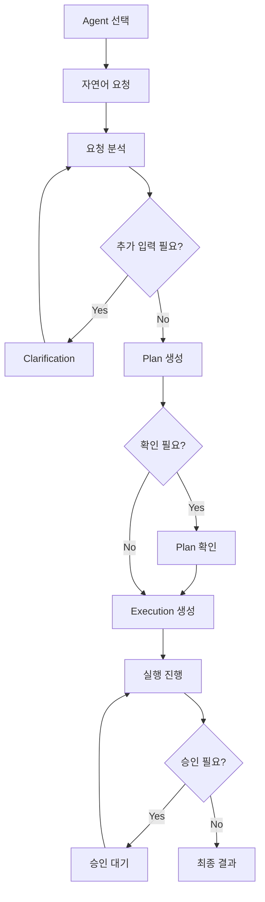
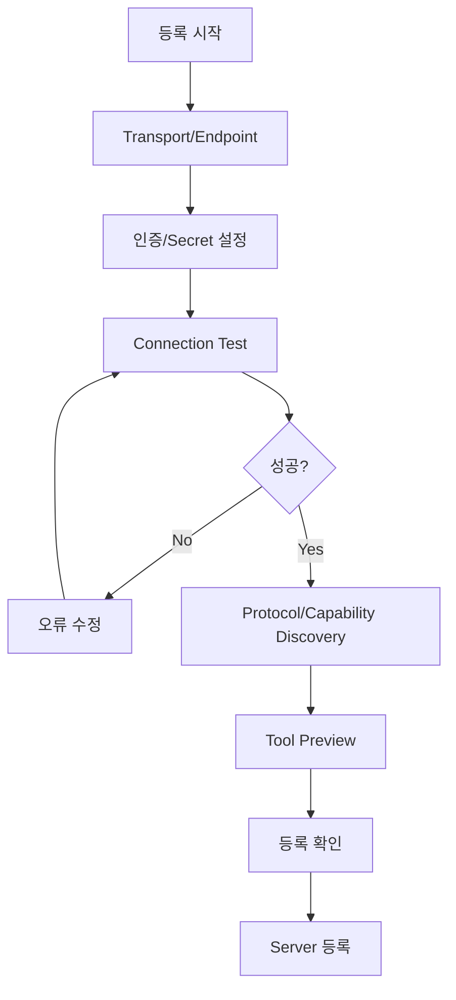
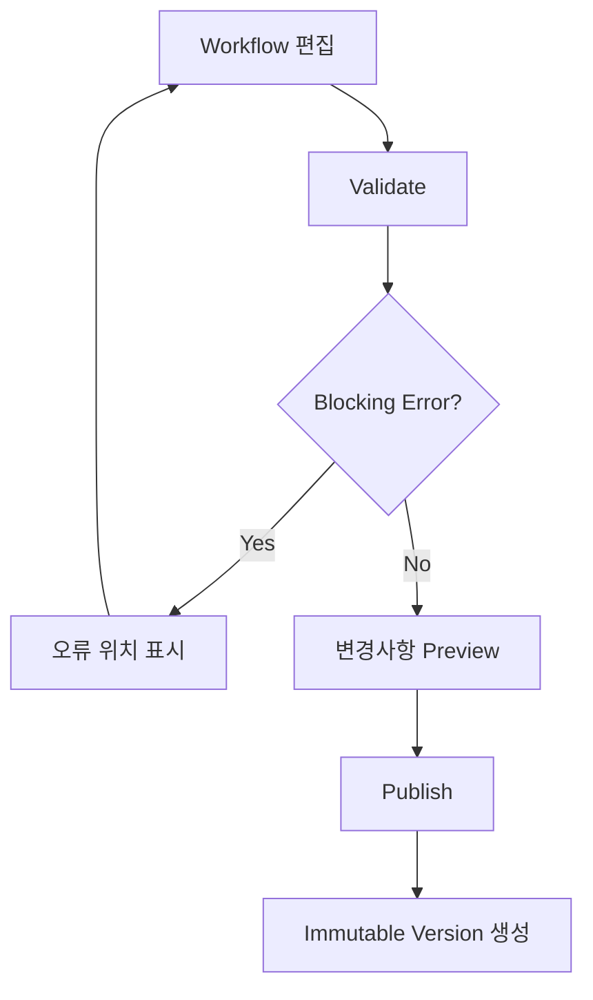

# MCPFlow UI/UX 설계서

> **MCPFlow - MCP-based AI Agent Automation Platform**

| 항목 | 내용 |
|---|---|
| 문서 ID | `MCPF-UIUX-001` |
| 문서 버전 | `v0.1` |
| 상태 | Draft - Figma/Frontend 개발 기준 초안 |
| 기준 저장소 | `ramza2/mcp-flow` |
| 공식 과제명 | MCP 연계 업무 자동화 AI 에이전트 개발 |
| 선행 문서 | `01-requirements.md` v0.2, `02-functional-specification.md` v0.2, `03-system-architecture.md` v0.2, `04-agent-mcp-architecture.md` v0.1, `05-data-model.md` v0.1, `06-api-design.md` v0.1 |
| Frontend 기준 | React + TypeScript + Vite |
| UI 설계/초기 구현 | Figma Make |
| 최종 수정일 | 2026-09-02 |

---

## 1. 문서 목적

본 문서는 MCPFlow의 정보구조(IA), 화면구성, 사용자 흐름, 공통 UI 패턴, 화면 상태, 권한별 노출, API 연계 및 Figma/Frontend 구현 기준을 정의한다.

본 문서는 다음 작업의 공통 기준으로 사용한다.

- Figma Make 기반 화면 설계 및 초기 UI 코드 생성
- React Router 기반 Frontend route 구성
- 공통 Layout 및 Component 개발
- Backend API와 화면 간 계약 매핑
- Cursor Agents Window를 이용한 Frontend 병렬 개발
- UI 기능시험 및 E2E 시험 시나리오 작성
- 최종 제출용 화면정의 및 UI/UX 설계 산출물 작성

화면은 DB 테이블 구조를 그대로 노출하지 않고 사용자의 업무 목적과 운영 흐름을 중심으로 설계한다. Backend API 또는 데이터 모델과 UI 요구가 충돌할 경우 임의의 별도 UI 전용 데이터를 생성하지 않고 영향받는 설계 문서를 함께 검토한다.

---

## 2. UX 목표 및 설계 원칙

### 2.1 UX 목표

MCPFlow UI/UX는 다음 목표를 갖는다.

1. 일반 사용자는 MCP나 Execution Engine의 내부 구조를 몰라도 자연어로 업무를 실행할 수 있어야 한다.
2. 실행 전에는 **무엇을 수행할 것인지**, 실행 중에는 **어디까지 진행되었는지**, 실행 후에는 **무엇이 실제 수행되었는지** 확인할 수 있어야 한다.
3. 관리자와 운영자는 MCP Server, Tool, Agent, Workflow, Schedule, Approval 및 Audit 상태를 빠르게 파악하고 문제를 추적할 수 있어야 한다.
4. AI가 생성한 계획과 실제 시스템 실행결과를 명확하게 구분하여 자동화에 대한 신뢰성을 확보해야 한다.
5. 위험한 동작은 확인·승인·권한검증을 UI에서도 명확하게 표현해야 한다.
6. 복합 Workflow의 순차·병렬·조건·승인대기 상태를 시각적으로 이해할 수 있어야 한다.
7. Figma와 실제 React 구현이 동일한 Component, 상태명 및 Screen ID를 사용해야 한다.

### 2.2 핵심 UX 원칙

| ID | 원칙 | 적용 기준 |
|---|---|---|
| `UX-PR-001` | 업무 중심 | 일반 사용자에게 MCP protocol, schema 등 불필요한 기술정보를 기본 노출하지 않는다. |
| `UX-PR-002` | 실행 투명성 | AI 계획, 사용자 확인, 시스템 실행, Tool 결과를 서로 다른 상태로 표현한다. |
| `UX-PR-003` | Progressive Disclosure | 요약을 먼저 보여주고 Tool schema, raw payload, trace 등 고급정보는 상세 펼침으로 제공한다. |
| `UX-PR-004` | 안전 우선 | 파괴적·외부전송·고위험 작업은 위험도와 영향범위를 확인할 수 있어야 한다. |
| `UX-PR-005` | 상태 일관성 | 동일한 Execution/Job/Approval 상태는 모든 화면에서 같은 label과 icon 의미를 사용한다. |
| `UX-PR-006` | 권한 비노출 | 권한 없는 메뉴와 action은 기본적으로 노출하지 않으며 존재 여부를 추측하게 하지 않는다. |
| `UX-PR-007` | 복구 가능 | 오류 발생 시 원인, 영향, 재시도 가능 여부 및 사용자가 취할 다음 행동을 제시한다. |
| `UX-PR-008` | 데이터 보수성 | secret, password, token 및 masking 대상 데이터는 UI에 원문 표시하지 않는다. |
| `UX-PR-009` | Desktop First | 초기 운영제품은 데스크톱 업무환경을 우선하되 태블릿까지 핵심 조회·승인 기능을 지원한다. |
| `UX-PR-010` | 접근성 | 키보드 탐색, focus, label, contrast, status text를 고려한다. 색상만으로 상태를 전달하지 않는다. |

---

## 3. 사용자 역할과 UX 범위

| 역할 | 주요 사용 화면 | 주요 행위 |
|---|---|---|
| User | Agent 실행, 내 실행이력, 내 예약 | 자연어 요청, 계획 확인, 실행, 결과 조회 |
| Agent Designer | Agent, Workflow, 실행 테스트 | Agent 설정, Tool 범위 지정, Workflow 작성·게시 |
| MCP Administrator | MCP Server, MCP Tool, Discovery | Server 등록, Discovery, Tool 활성화·시험 |
| Operator | Dashboard, Executions, Jobs, Schedules | 상태 모니터링, 실패 분석, 재시도·취소 |
| Approver | Approvals, Execution Detail | 승인·거절, 영향 확인 |
| Auditor | Audit, Execution History | 변경·실행 증적 조회 및 export |
| System Administrator | Users/Roles, Settings, 전체 관리 | 사용자·권한·시스템설정 관리 |

한 사용자가 여러 Role을 보유할 수 있으므로 메뉴와 action은 Role 이름 자체보다 Backend에서 계산된 Permission을 기준으로 노출한다.

---

## 4. 전체 정보구조(IA)

### 4.1 1Depth Navigation

```text
MCPFlow
├─ Dashboard
│
├─ Work
│  ├─ Agent Run
│  ├─ Executions
│  ├─ Schedules
│  └─ Approvals
│
├─ Build
│  ├─ Agents
│  └─ Workflows
│
├─ MCP
│  ├─ MCP Servers
│  ├─ MCP Tools
│  ├─ External Discovery
│  └─ Tool Factory
│
└─ Administration
   ├─ Users & Roles
   ├─ Audit Logs
   ├─ Jobs
   └─ System Settings
```

### 4.2 Navigation 원칙

- Sidebar는 Desktop에서 고정 또는 축소 가능한 형태로 제공한다.
- 현재 메뉴와 상위 그룹을 시각적으로 명확히 표시한다.
- Permission이 없는 1Depth/2Depth 메뉴는 숨긴다.
- 직접 URL 접근 시 Backend 권한판단 결과에 따라 `403` 또는 안전한 Not Found 화면을 표시한다.
- Breadcrumb는 상세/편집 화면에서 제공한다.
- 전역 사용자 메뉴에는 사용자 정보, 현재 Role 요약, timezone, 로그아웃을 제공한다.

---

## 5. Screen ID 및 Route 정의

### 5.1 공통 및 사용자 업무 화면

| Screen ID | 화면명 | Route | 주요 사용자 |
|---|---|---|---|
| `SCR-AUTH-001` | 로그인 | `/login` | 전체 |
| `SCR-DASH-001` | Dashboard | `/` | 인증 사용자 |
| `SCR-RUN-001` | Agent 실행 | `/run` | User |
| `SCR-RUN-002` | Agent 실행 상세/대화 | `/run/:conversationId` | User |
| `SCR-EXE-001` | 실행이력 목록 | `/executions` | User, Operator |
| `SCR-EXE-002` | 실행 상세 | `/executions/:executionId` | User, Operator, Approver, Auditor |
| `SCR-SCH-001` | 예약 목록 | `/schedules` | User, Operator |
| `SCR-SCH-002` | 예약 등록/수정 | `/schedules/new`, `/schedules/:id/edit` | User, Operator |
| `SCR-APR-001` | 승인 요청 목록 | `/approvals` | Approver |
| `SCR-APR-002` | 승인 요청 상세 | `/approvals/:approvalId` | Approver |

### 5.2 Agent/Workflow 설계 화면

| Screen ID | 화면명 | Route | 주요 사용자 |
|---|---|---|---|
| `SCR-AGT-001` | Agent 목록 | `/agents` | Agent Designer |
| `SCR-AGT-002` | Agent 상세 | `/agents/:agentId` | Agent Designer |
| `SCR-AGT-003` | Agent 편집 | `/agents/:agentId/edit` | Agent Designer |
| `SCR-WF-001` | Workflow 목록 | `/workflows` | Agent Designer |
| `SCR-WF-002` | Workflow 상세 | `/workflows/:workflowId` | Agent Designer |
| `SCR-WF-003` | Workflow Designer | `/workflows/:workflowId/edit` | Agent Designer |

### 5.3 MCP 관리 및 확장 화면

| Screen ID | 화면명 | Route | 주요 사용자 |
|---|---|---|---|
| `SCR-MCP-001` | MCP Server 목록 | `/mcp/servers` | MCP Administrator |
| `SCR-MCP-002` | MCP Server 등록 | `/mcp/servers/new` | MCP Administrator |
| `SCR-MCP-003` | MCP Server 상세 | `/mcp/servers/:serverId` | MCP Administrator |
| `SCR-TOOL-001` | MCP Tool 목록 | `/mcp/tools` | MCP Administrator, Agent Designer |
| `SCR-TOOL-002` | MCP Tool 상세 | `/mcp/tools/:toolId` | MCP Administrator, Agent Designer |
| `SCR-DISC-001` | 외부 MCP 탐색 | `/mcp/discovery` | MCP Administrator |
| `SCR-FAC-001` | Tool Factory 목록 | `/tool-factory` | MCP Administrator |
| `SCR-FAC-002` | Tool Factory 생성 | `/tool-factory/new` | MCP Administrator |
| `SCR-FAC-003` | Factory Build 상세 | `/tool-factory/:buildId` | MCP Administrator |

### 5.4 운영 및 시스템 관리 화면

| Screen ID | 화면명 | Route | 주요 사용자 |
|---|---|---|---|
| `SCR-USR-001` | 사용자 목록 | `/admin/users` | System Administrator |
| `SCR-USR-002` | 사용자 상세 | `/admin/users/:userId` | System Administrator |
| `SCR-RBAC-001` | Role/Permission 관리 | `/admin/roles` | System Administrator |
| `SCR-AUD-001` | 감사로그 | `/admin/audit-logs` | Auditor, System Administrator |
| `SCR-JOB-001` | 비동기 Job 목록 | `/admin/jobs` | Operator, System Administrator |
| `SCR-JOB-002` | Job 상세 | `/admin/jobs/:jobId` | Operator, System Administrator |
| `SCR-SET-001` | 시스템 설정 | `/admin/settings` | System Administrator |

---

## 6. Global Layout

### 6.1 Desktop Layout

```text
┌──────────────────────────────────────────────────────────────┐
│ Top Bar                                      User / Profile  │
├──────────────┬───────────────────────────────────────────────┤
│              │ Breadcrumb / Page Header                    │
│  Sidebar     ├───────────────────────────────────────────────┤
│              │                                               │
│ Dashboard    │                Page Content                   │
│ Work         │                                               │
│ Build        │                                               │
│ MCP          │                                               │
│ Admin        │                                               │
│              │                                               │
└──────────────┴───────────────────────────────────────────────┘
```

### 6.2 Page Header 구성

기본 Page Header는 다음 구조를 사용한다.

```text
Breadcrumb
Page Title                           [Primary Action]
Page description                    [Secondary Action]
```

목록 화면에서는 Filter/Search 영역이 이어지고, 상세화면에서는 상태 Badge와 주요 metadata를 Header에 배치한다.

### 6.3 Content Width

- Dashboard, 목록, Designer, Execution 상세는 available width를 넓게 사용한다.
- 단순 등록·설정 form은 지나치게 넓게 늘리지 않고 읽기 가능한 최대폭을 둔다.
- JSON Schema, Execution Plan, log viewer는 넓은 영역을 우선한다.

---

## 7. 공통 Component 규격

### 7.1 기본 Component

Figma와 Frontend는 최소한 다음 공통 Component를 동일 개념으로 사용한다.

| Component | 용도 |
|---|---|
| `AppShell` | Sidebar + Topbar + Content Layout |
| `PageHeader` | 제목, 설명, Breadcrumb, action |
| `DataTable` | 목록, 정렬, pagination, row action |
| `FilterBar` | 검색, 상태, 기간, 유형 필터 |
| `StatusBadge` | 상태를 text + icon + visual style로 표현 |
| `EmptyState` | 데이터 없음 + 다음 action |
| `ErrorState` | 오류 요약 + retry 또는 이동 action |
| `LoadingSkeleton` | 조회 중 Layout 유지 |
| `ConfirmDialog` | 위험하지 않은 확인 |
| `DangerDialog` | 파괴적·외부영향 action 확인 |
| `SidePanel` | 상세 quick view, filter, metadata |
| `JsonViewer` | schema, payload, raw 결과 읽기 전용 |
| `CodeEditor` | Factory Python 등 허용된 source 편집 |
| `Timeline` | 상태전이·감사·실행 event 표시 |
| `StepGraph` | Workflow/Execution DAG 시각화 |
| `MetricCard` | Dashboard KPI |
| `PermissionGate` | Frontend action 노출 제어 helper |
| `AsyncJobStatus` | Job 상태, 진행률, 오류, 결과 link |
| `ConflictBanner` | 낙관적 잠금 충돌 안내 |

### 7.2 Status Badge 규칙

색상만으로 구분하지 않고 label과 icon 또는 shape를 함께 사용한다.

| 의미 | 대표 상태 |
|---|---|
| Neutral | `DRAFT`, `QUEUED`, `PENDING` |
| Processing | `RUNNING`, `DISCOVERING`, `BUILDING` |
| Success | `ACTIVE`, `SUCCEEDED`, `APPROVED`, `VERIFIED` |
| Warning | `WAITING_INPUT`, `WAITING_CONFIRMATION`, `WAITING_APPROVAL`, `DEGRADED` |
| Error | `FAILED`, `REJECTED`, `TIMED_OUT`, `UNHEALTHY` |
| Disabled | `INACTIVE`, `CANCELLED`, `EXPIRED`, `ARCHIVED` |

정확한 색상 token은 Figma Design System에서 확정하되 상태 의미는 변경하지 않는다.

---

## 8. 공통 화면 상태

모든 비정적 화면은 최소 다음 상태를 설계하고 Figma frame 또는 component variant로 표현한다.

| 상태 | UI 기준 |
|---|---|
| Initial Loading | 최종 Layout과 유사한 Skeleton 사용 |
| Loaded | 정상 데이터 표시 |
| Empty | 단순 `0건`이 아니라 이유와 가능한 다음 action 제시 |
| Filtered Empty | 필터 조건을 해제할 수 있는 action 제공 |
| Error | 사용자용 오류 메시지, request ID, retry 가능 여부 표시 |
| Permission Denied | 민감 Resource 상세를 노출하지 않고 접근 불가 안내 |
| Offline/Dependency Error | MCP/LLM 등 dependency 문제와 사용자 action 분리 |
| Saving | action 중복입력 방지, 진행상태 표시 |
| Saved | toast 또는 inline confirmation |
| Conflict | 최신 데이터 reload 후 재검토하도록 안내 |
| Deleted/Inactive | 과거 link 접근 시 비활성 상태와 이력은 유지 |

### 8.1 Toast 사용 원칙

Toast는 짧은 성공·비차단 안내에 사용한다.

Toast만으로 처리하지 않는 항목:

- 권한 오류
- 저장 충돌
- 승인 실패
- 실행 실패
- 데이터 손실 위험
- 장기 Job 실패

위 항목은 화면 내 persistent message 또는 상세 오류영역을 함께 제공한다.

---

## 9. Dashboard 설계

### 9.1 `SCR-DASH-001`

Dashboard는 사용자의 Role/Permission에 따라 다른 Widget을 표시한다.

#### 공통 Widget

- 최근 실행
- 실행 성공/실패 상태 요약
- 나의 대기 승인 또는 사용자입력 필요 건
- 최근 사용 Agent/Workflow

#### Operator/Admin Widget

- 최근 24시간 Execution 수
- 성공률/실패율
- 실행 중/승인대기/실패 건수
- MCP Server 상태
- 비정상 Job
- 예약 실패/중복 차단 건수
- Tool Mapping 평가 요약

#### UX 원칙

- Dashboard는 운영 원장 전체를 대체하지 않는다.
- 숫자 Widget 클릭 시 해당 필터가 적용된 목록으로 이동한다.
- 성능지표 값에는 측정 기간과 기준을 함께 표시한다.
- 오류 또는 비정상 상태가 없으면 불필요한 경고 영역을 비워두지 않는다.

---

## 10. Agent 실행 UX

### 10.1 `SCR-RUN-001`, `SCR-RUN-002` 목표

일반 사용자의 핵심 진입점이다.

사용자는 다음 흐름을 경험한다.

```text
Agent 선택
   ↓
자연어 요청 입력
   ↓
요청 분석
   ↓
추가정보 필요 여부
   ├─ 필요 → Clarification
   └─ 충분
        ↓
실행계획 생성
        ↓
계획 확인 필요 여부
        ├─ 필요 → 사용자 확인
        └─ 불필요
             ↓
Execution 시작
             ↓
Step 진행상태 표시
             ↓
최종 결과 + 실행 근거
```

### 10.2 기본 Layout

```text
┌──────────────────────────────────────────────────────────────┐
│ Agent: General Assistant                    [New Task]       │
├───────────────────────────────┬──────────────────────────────┤
│                               │ Execution / Plan            │
│ Conversation                  │                              │
│                               │ Step 1  Completed           │
│ User Message                  │ Step 2  Running             │
│ Assistant                     │ Step 3  Waiting             │
│                               │                              │
│                               │ [Details]                   │
│───────────────────────────────│                              │
│ Ask MCPFlow...       [Send]   │                              │
└───────────────────────────────┴──────────────────────────────┘
```

좁은 화면에서는 오른쪽 Execution Panel을 drawer/tab 형태로 전환한다.

### 10.3 Message 유형

| 유형 | 표시 내용 |
|---|---|
| User Message | 사용자 원문 |
| Analysis Summary | 내부 chain-of-thought가 아닌 사용자에게 공개 가능한 요청 해석 요약 |
| Clarification | 부족한 입력과 선택지 |
| Plan Card | 실행 목적, 사용할 Tool, Step, 예상 영향 |
| Confirmation Card | 사용자의 실행 확인 필요항목 |
| Execution Card | 현재 실행상태 및 Step progress |
| Result Message | 실제 실행결과를 근거로 작성한 최종 응답 |
| Error Message | 실패 Step, 사용자 영향, 가능한 다음 action |

내부 model reasoning, system prompt, secret, 권한 내부규칙은 Conversation UI에 노출하지 않는다.

### 10.4 실행계획 Card

사용자에게 기본적으로 표시할 내용:

- 수행 목적
- Step 수
- 사용 예정 Tool의 사용자 친화적 이름
- 외부 데이터 전송 여부
- 생성/수정/삭제 등 부작용 여부
- 승인 필요 여부
- 사용자가 확인해야 할 입력값

고급 상세 펼침:

- Tool Server
- Tool version
- Step dependency
- parameter 중 secret이 아닌 값
- timeout/retry 정책 요약

### 10.5 SSE 연결

Execution 시작 후 Frontend는 `06-api-design.md`에서 정의한 Execution event SSE를 우선 사용한다.

- 연결 성공: 실시간 event 반영
- 일시 단절: reconnect
- 장기 단절/지원 불가: polling fallback
- 화면 reload: Execution snapshot 조회 후 마지막 event 이후 재연결
- 중복 event: event ID 기준 무시

화면상 상태는 Client 추측이 아니라 Backend snapshot/event를 기준으로 한다.

---

## 11. Execution 상세 UX

### 11.1 `SCR-EXE-002` Layout

```text
Execution #...
Status / Agent / Started / Duration / Initiator          [Cancel]

[Overview] [Steps] [Events] [Inputs/Outputs] [Audit]

Overview
- Original Request
- Plan Summary
- Result Summary
- Error Summary

Steps
┌─────────────────────────────────────────────────────────────┐
│ Step Graph                                                  │
│  A ──→ B ──┬──→ D                                           │
│            └──→ C                                           │
└─────────────────────────────────────────────────────────────┘

Selected Step Detail
- Tool
- State
- Attempts
- Started/Ended
- Input Summary
- Output Summary
- Error
```

### 11.2 Step Graph 규칙

지원 표현:

- 순차 dependency
- 병렬 branch
- 조건 branch
- 제한 loop
- 승인 Gate
- 사용자입력 Gate

Graph는 화면 시각화를 위한 임의 workflow 상태를 생성하지 않고 Execution Plan snapshot과 실제 Step state를 사용한다.

### 11.3 Step 상태

Step별 최소 표시:

- 상태
- 실행 순번 또는 dependency
- Tool/Node 표시명
- 시작·종료 시각
- 소요시간
- Attempt 수
- 오류 발생 여부

`RUNNING` 상태에서는 실제 progress가 제공되는 경우만 percentage를 표시한다. 진행률을 알 수 없으면 indeterminate indicator를 사용하고 임의 백분율을 계산하지 않는다.

### 11.4 Cancel/Retry UX

취소:

- 취소 가능한 Execution 상태에서만 action 표시
- 이미 외부 Tool에 발생한 부작용은 되돌려지지 않을 수 있음을 안내
- Cancel 요청 후 즉시 `CANCELLED`로 가정하지 않고 Backend 상태전이를 기다림

재시도:

- 정책상 retryable한 실패에만 표시
- non-idempotent 결과불명 Tool은 자동/사용자 retry를 제한
- 재시도가 새 Attempt인지 새 Execution인지 UI label에서 구분

---

## 12. Approval UX

### 12.1 `SCR-APR-001`

기본 컬럼:

- 요청 제목/목적
- 요청자
- Agent/Workflow
- 위험도
- 요청시각
- 만료시각
- 상태

기본 filter:

- `PENDING`
- 위험도
- 요청자
- 기간

### 12.2 `SCR-APR-002`

승인자는 결정 전에 최소 다음 정보를 확인할 수 있어야 한다.

- 사용자의 원 요청
- 실행 목적
- 승인 직전까지 완료된 Step
- 승인 이후 실행될 Tool/Step
- 입력값 요약
- 외부전송/생성/수정/삭제 영향
- Tool risk 및 내부 Policy 요약
- 요청자/실행자
- 만료시각

Action:

- Approve
- Reject

Reject 시 사유 입력을 필수 또는 Policy에 따라 요구한다.

승인 시점의 입력 snapshot과 실제 실행값이 달라지는 경우 기존 승인을 재사용하지 않는다.

---

## 13. MCP Server 관리 UX

### 13.1 `SCR-MCP-001`

목록 주요 컬럼:

- Name
- Transport (`Streamable HTTP`, `stdio`, legacy)
- Status
- Protocol version
- Tool count
- Last health check
- Updated at

주요 action:

- Register Server
- Health Check
- Discover/Sync
- View Details
- Deactivate

### 13.2 `SCR-MCP-002` 등록 Wizard

등록은 단계형 UI를 권장한다.

```text
1. Basic Information
2. Transport
3. Authentication / Secret Reference
4. Connection Test
5. Protocol / Capability Discovery
6. Tool Preview
7. Review & Register
```

#### Secret 입력 규칙

- 기존 secret 원문은 표시하지 않는다.
- 저장된 경우 `Configured` 등의 상태만 표시한다.
- 변경 시 새 값을 입력하여 교체한다.
- Browser form state에 불필요하게 오래 보관하지 않는다.

### 13.3 `SCR-MCP-003`

Tabs:

- Overview
- Tools
- Discovery History
- Health
- Dependencies
- Audit

Server 설정 변경 전 영향받는 Agent/Workflow/Schedule 수를 표시한다.

---

## 14. MCP Tool UX

### 14.1 `SCR-TOOL-001`

검색과 필터를 중요하게 제공한다.

필터 예:

- Server
- Active/Inactive
- Risk
- Validation status
- Tag/Capability

목록 주요 컬럼:

- Display Name
- Source Tool Name
- Server
- Risk
- Version
- Validation
- Agent 사용 수
- Updated at

### 14.2 `SCR-TOOL-002`

Tabs:

- Overview
- Input Schema
- Output Schema
- Policy
- Test Call
- Used By
- Versions
- Audit

일반 사용자에게 공개되지 않는 개발/운영 상세 화면이다.

Test Call은 실제 외부 부작용 가능성을 명확히 표시하고, 안전한 dry-run capability가 없는 경우 경고 후 별도 확인을 요구한다.

---

## 15. Agent 관리 UX

### 15.1 `SCR-AGT-001`

Agent 카드 또는 Table 중 관리 효율을 우선하여 Table을 기본으로 한다.

표시:

- Name
- Status
- Current Version
- Allowed Tools
- Model Profile
- Last Published
- Updated By

### 15.2 `SCR-AGT-003` 편집

Section:

1. Basic
2. Instructions
3. Model Profile
4. Tool Scope
5. Planning/Confirmation Policy
6. Limits
7. Evaluation
8. Publish

Tool Scope는 전체 Tool을 단순 checkbox 수백 개로 보여주지 않고 Server/Tag/Capability 검색과 선택 목록을 조합한다.

게시된 version은 직접 수정하지 않고 변경사항 저장 후 새 version publish 흐름으로 처리한다.

### 15.3 Publish UX

Publish 전 Validation Summary를 표시한다.

- schema 오류
- 비활성 Tool 참조
- 권한/정책 충돌
- 미설정 Model Profile
- 평가결과
- 이전 version 대비 변경사항

Blocking error가 있으면 Publish action을 비활성화하고 원인으로 이동할 수 있게 한다.

---

## 16. Workflow Designer UX

### 16.1 `SCR-WF-003`

초기 Workflow Designer는 범용 BPMN 편집기를 목표로 하지 않는다. MCPFlow Execution Plan에서 지원하는 node만 제공한다.

지원 node:

- Tool Step
- Condition
- Parallel Split/Join
- Approval Gate
- User Input Gate
- Limited Loop
- End

### 16.2 Layout

```text
┌───────────────┬───────────────────────────────┬──────────────┐
│ Node Palette  │ Canvas                        │ Properties   │
│               │                               │              │
│ Tool          │  [A] ──→ [Condition]          │ Selected     │
│ Condition     │            ├─→ [B]            │ node config  │
│ Parallel      │            └─→ [C]            │              │
│ Approval      │                               │              │
└───────────────┴───────────────────────────────┴──────────────┘
```

### 16.3 Designer 원칙

- 임의 JavaScript/Python expression 입력을 허용하지 않는다.
- 조건은 상세설계에서 정의한 제한된 predicate builder로 구성한다.
- binding은 literal/input/previous step/context/secret reference로 선택한다.
- 순환 dependency는 저장/검증 단계에서 명확하게 오류표시한다.
- Canvas 위치는 표현정보이며 실행 semantics의 원본이 아니다.
- Workflow의 실행 가능성 Validation 결과를 별도 panel로 제공한다.

---

## 17. Schedule UX

### 17.1 `SCR-SCH-002`

예약 Form:

- Target Agent 또는 Workflow
- Input
- One-time / Recurring
- Date/Time
- Timezone
- Overlap policy
- Misfire policy
- Failure policy
- Active/Inactive

가능하면 사용자가 cron 표현식을 직접 작성하지 않도록 일반 반복 UI를 우선한다.

예:

```text
Every [1] [day] at [09:00]
Timezone: Asia/Seoul
```

고급 사용자가 cron을 사용할 수 있는 경우 parsed preview를 반드시 표시한다.

```text
Next runs
2026-09-03 09:00 KST
2026-09-04 09:00 KST
2026-09-05 09:00 KST
```

---

## 18. External MCP Discovery UX

### 18.1 `SCR-DISC-001`

외부 MCP 탐색 결과는 **설치 가능한 신뢰된 Tool 목록**이 아니라 **검토 대상 후보**로 표현한다.

표시:

- Candidate name
- Source/Registry
- Description
- Transport/Repository 정보
- Last observed version
- Verification state
- Risk/Warning

행위 흐름:

```text
Search
  ↓
Candidate Review
  ↓
Security / Source Check
  ↓
Import Draft
  ↓
Connection Test / Discovery
  ↓
Administrator Approval
  ↓
Register
```

검색 결과에서 즉시 자동 실행·설치를 제공하지 않는다.

---

## 19. Tool Factory UX

### 19.1 `SCR-FAC-002`

Factory 생성은 Wizard를 사용한다.

OpenAPI:

```text
Source
→ Parse
→ Select Operations
→ Generated Tool Preview
→ Security Review
→ Build
→ Isolated Test
→ Register
```

Python:

```text
Metadata
→ Source
→ Static Validation
→ Dependency Review
→ Isolated Build/Test
→ Generated MCP Preview
→ Register
```

### 19.2 Build 진행상태

Factory build는 동기 spinner로 기다리지 않는다.

`AsyncJobStatus`를 사용하여 다음을 표시한다.

- queued/running/succeeded/failed
- current stage
- elapsed time
- sanitized build log
- generated artifact
- validation/test result

Build 실패 시 사용자가 수정 가능한 입력 오류와 내부 시스템 오류를 구분한다.

---

## 20. Users / RBAC UX

### 20.1 사용자 관리

User detail:

- Account status
- Basic profile
- Roles
- Resource Grants
- Active Sessions
- Recent security/audit events

### 20.2 Role/Permission 관리

Permission은 내부 code와 사용자 설명을 함께 제공한다.

```text
mcp.server.manage
MCP Server를 등록·변경·비활성화할 수 있습니다.
```

위험한 Permission 묶음을 Role에 추가하는 경우 영향을 요약하고 명시적 저장 확인을 요구한다.

Frontend의 PermissionGate는 UX 최적화일 뿐 보안통제가 아니며 모든 권한은 Backend가 다시 검증한다.

---

## 21. Audit Log UX

### 21.1 `SCR-AUD-001`

감사로그는 일반 application log와 구분한다.

검색/필터:

- 시간범위
- Actor
- Action
- Resource type
- Resource ID
- Result
- request ID
- execution ID

상세 표시:

- 누가
- 언제
- 어떤 action을
- 어떤 resource에
- 어떤 결과로 수행했는지
- 관련 request/execution/approval
- 허용된 범위의 before/after 요약

secret 및 masking 대상 필드는 audit detail에서도 복원하지 않는다.

---

## 22. Job UX

### 22.1 `SCR-JOB-001`, `SCR-JOB-002`

Job은 Execution과 구분해서 보여준다.

Execution 예:

- 업무 Workflow 실행
- MCP Tool 실행

Job 예:

- Tool Discovery
- Factory Build
- Export 생성
- Embedding 재생성

Job 상세:

- Type
- Status
- Target Resource
- Progress/Current Stage
- Created/Started/Ended
- Retryability
- Error
- Result link

사용자가 Job과 업무 Execution을 혼동하지 않도록 메뉴와 용어를 분리한다.

---

## 23. API-화면 매핑 원칙

정확한 Endpoint 계약은 `06-api-design.md`를 Source of Truth로 한다.

| 화면 영역 | 주요 API Resource |
|---|---|
| Login/Profile | `/auth/*` |
| Dashboard | dashboard/metric 및 executions summary |
| Agent Run | conversations, agent requests, plan, executions |
| Execution | `/executions`, execution steps/events, SSE |
| Schedule | `/schedules` |
| Approval | `/approvals` |
| Agent | `/agents`, agent versions |
| Workflow | `/workflows`, workflow versions/validation |
| MCP Server | `/mcp/servers`, discovery/health actions |
| MCP Tool | `/mcp/tools`, tool versions/test |
| External Discovery | discovery candidates/jobs |
| Tool Factory | factory definitions/build jobs/artifacts |
| User/RBAC | users, roles, permissions, resource grants |
| Audit | audit logs/export |
| Jobs | `/jobs` |

### 23.1 API State 처리

Frontend에서 API 호출은 최소 다음 상태로 구분한다.

```ts
type AsyncViewState<T> =
  | { status: 'idle' }
  | { status: 'loading' }
  | { status: 'success'; data: T }
  | { status: 'empty' }
  | { status: 'error'; error: ApiError };
```

실제 구현 type은 Frontend 규칙문서에서 조정할 수 있으나 `undefined/null/loading/error`를 임의 조합하여 화면 상태를 추론하는 방식은 피한다.

---

## 24. Form UX 규칙

### 24.1 Validation

- 단순 필수값·형식은 Client에서 즉시 검증한다.
- 업무규칙과 권한은 Backend Response를 최종 기준으로 한다.
- Server의 `422` field error를 해당 입력항목에 연결한다.
- Form 상단에는 전체 오류 요약을 제공할 수 있다.
- 첫 오류 항목으로 focus 이동을 지원한다.

### 24.2 Save

- 저장 중 버튼 중복 입력 방지
- 성공 후 현재 Resource와 version 상태를 명확히 반영
- `412 Precondition Failed` 시 자동 overwrite 금지
- 충돌 시 `Reload latest`를 제공하고 사용자 수정내용 유실 가능성을 경고

### 24.3 Unsaved Changes

Agent, Workflow, Settings 등 주요 편집 화면은 저장하지 않은 변경이 있을 때 route 이동/브라우저 이탈을 경고한다.

---

## 25. 위험 Action UX

### 25.1 위험도별 확인

| Action | 기본 UX |
|---|---|
| 일반 설정 변경 | Save |
| 비활성화 | Confirm Dialog |
| 실행 취소 | 영향 안내 + Confirm |
| External side effect Tool 실행 | 계획/영향 확인 |
| Role/Permission 고위험 변경 | Danger Dialog |
| Factory 생성 코드 등록 | Build/Test 결과 확인 후 Register |
| 사용자/자원 영구 삭제가 허용되는 경우 | 이름 재입력 등 강화 확인 |

Dialog의 확인 버튼 텍스트는 `확인`보다 실제 동작을 사용한다.

예:

- `Execution 취소`
- `MCP Server 비활성화`
- `승인`
- `거절`

---

## 26. Error UX

### 26.1 Error 표현 구조

```text
작업을 완료하지 못했습니다.
MCP Server에 연결할 수 없습니다.

다시 시도할 수 있습니다.
Request ID: 64e5...

[다시 시도] [상세 보기]
```

### 26.2 오류 유형별 사용자 메시지

| 오류 | UX |
|---|---|
| Validation | 해당 field 중심 |
| Permission | action 또는 화면 접근 불가 안내 |
| Resource Conflict | 최신정보 reload 안내 |
| MCP Connection | Server 이름, 실패 단계, retry 가능 여부 |
| Tool Failure | 실패 Tool/Step과 사용자 영향 |
| LLM Failure | 요청이 실행되지 않았는지/실행 후 응답생성만 실패했는지 구분 |
| Execution Timeout | 어느 Step에서 timeout인지 표시 |
| Unknown | request ID와 운영 문의 기준 제공 |

LLM의 최종 응답생성만 실패한 경우 이미 완료된 Tool 실행을 실패로 오인하게 표현하지 않는다.

---

## 27. Responsive 기준

### 27.1 Breakpoint 전략

정확한 pixel token은 Frontend 구현 시 확정하되 동작 기준은 다음과 같다.

| 범위 | UX |
|---|---|
| Wide Desktop | Sidebar + 다중 panel + 넓은 Table/Graph |
| Desktop/Laptop | 기본 목표환경 |
| Tablet | Sidebar drawer, detail panel tab/drawer 전환 |
| Mobile | 핵심 조회·승인·단순 실행 중심, Designer/복잡 관리화면은 제한 가능 |

### 27.2 Mobile 최소지원

- 로그인
- Agent 자연어 요청
- Execution 상태/결과 조회
- 승인/거절
- Dashboard 핵심 상태

Workflow Designer, 대규모 Table, Tool Factory code 편집은 Desktop 사용을 권장하는 안내를 제공할 수 있다.

---

## 28. Accessibility 기준

- 모든 interactive element는 keyboard로 접근 가능해야 한다.
- Modal/Drawer는 focus trap과 닫힌 후 focus restore를 지원한다.
- Icon-only button은 accessible name을 제공한다.
- Form input은 label을 연결한다.
- 오류는 색상 외 text/icon으로 표시한다.
- 주요 상태변경과 validation 오류는 screen reader가 인식할 수 있는 live region 적용을 검토한다.
- Graph의 핵심 실행정보는 시각화 외에도 Step list/Table로 접근 가능해야 한다.
- animation은 기능 이해를 돕는 범위로 제한하고 reduced motion 설정을 존중한다.

WCAG 2.2 AA를 설계 목표로 하며 실제 준수 수준은 시험 단계에서 점검한다.

---

## 29. 날짜·시간·숫자 표시

### 29.1 시간

Backend는 UTC ISO 8601을 반환하고 Frontend는 사용자 timezone으로 표시한다.

예:

```text
2026-09-02 15:30 KST
```

Execution 상세에는 필요 시 UTC 원본을 tooltip/상세에서 제공할 수 있다.

상대시간만 단독 사용하지 않는다.

```text
3분 전 (2026-09-02 15:30 KST)
```

### 29.2 Duration

```text
850 ms
2.4 s
1 min 32 s
```

성능지표 화면에서는 단위를 명확하게 고정한다.

---

## 30. Figma Make 작업 기준

### 30.1 Figma 작업 순서

```text
1. IA / Navigation
2. Design Tokens
3. Global Layout
4. Core Components
5. Core User Flow
   - Login
   - Dashboard
   - Agent Run
   - Execution Detail
6. MCP Management
7. Agent / Workflow
8. Schedule / Approval
9. Admin / Audit
10. Tool Factory / Discovery
11. Responsive Variants
12. Frontend Code Export / Integration
```

### 30.2 초기 우선 화면

Figma Make 1차 대상은 다음 화면을 우선한다.

1. `SCR-AUTH-001` Login
2. `SCR-DASH-001` Dashboard
3. `SCR-RUN-001/002` Agent Run
4. `SCR-EXE-001/002` Execution List/Detail
5. `SCR-MCP-001/003` MCP Server List/Detail
6. `SCR-TOOL-001/002` MCP Tool List/Detail
7. `SCR-AGT-001/003` Agent List/Edit
8. `SCR-WF-001/003` Workflow List/Designer
9. `SCR-APR-001/002` Approval
10. `SCR-SCH-001/002` Schedule

위 화면의 디자인 언어와 Component가 안정된 후 운영·확장 화면으로 확장한다.

### 30.3 Figma Component Naming

예시:

```text
Layout/AppShell
Layout/PageHeader
Navigation/SidebarItem
Data/DataTable
Data/StatusBadge
Feedback/Toast
Feedback/ErrorState
Execution/StepGraph
Execution/StepCard
Agent/PlanCard
Approval/ApprovalCard
MCP/ServerStatus
```

Figma 이름과 React component 이름을 가능한 한 동일한 개념으로 유지한다.

---

## 31. Frontend 구조 권고

본 문서는 상세 Frontend Coding Rule은 아니지만 UI 구현 경계는 다음을 권고한다.

```text
frontend/src/
├─ app/
│  ├─ router/
│  ├─ providers/
│  └─ layout/
├─ pages/
│  ├─ dashboard/
│  ├─ run/
│  ├─ executions/
│  ├─ agents/
│  ├─ workflows/
│  ├─ mcp/
│  └─ admin/
├─ features/
│  ├─ auth/
│  ├─ execution/
│  ├─ approval/
│  ├─ schedule/
│  └─ workflow-designer/
├─ components/
├─ api/
├─ hooks/
├─ types/
└─ utils/
```

원칙:

- API 호출 로직을 화면 component에 직접 산재시키지 않는다.
- Backend DTO와 화면 ViewModel 변환이 필요한 경우 명시적으로 분리한다.
- Permission 판단용 Backend 결과를 공통 helper로 사용한다.
- SSE 연결 lifecycle은 Execution feature 내부 공통 hook/service로 관리한다.
- Server 상태를 Frontend에서 임의로 재정의하지 않는다.

상세 coding convention은 설계 및 Figma 코드 반영 후 작성할 `AGENTS.md` 및 Cursor Rule 문서에서 확정한다.

---

## 32. 핵심 사용자 흐름

### 32.1 자연어 업무 실행



### 32.2 MCP Server 등록



### 32.3 Workflow 게시



---

## 33. 화면별 Figma 완료 기준

각 Screen은 다음 항목을 갖추어야 완료로 본다.

- Screen ID
- Desktop 기본 frame
- 필요한 Responsive variant
- Loading state
- Empty state
- Error state
- Permission state
- 주요 Modal/Drawer
- Primary/Secondary action
- Backend API 연계 메모
- 주요 Component instance
- 위험 action 확인 UI
- 입력 validation 상태
- navigation/breadcrumb 정의

단순 정상화면 한 장만 만든 상태는 완료로 간주하지 않는다.

---

## 34. UI/UX 수용 기준

| ID | 검증 기준 |
|---|---|
| `UX-AC-001` | 일반 사용자가 MCP 기술정보 없이 Agent를 선택하고 자연어 요청을 실행할 수 있다. |
| `UX-AC-002` | Execution의 전체 상태와 각 Step 상태를 한 화면에서 추적할 수 있다. |
| `UX-AC-003` | 계획 상태와 실제 실행결과가 시각적으로 구분된다. |
| `UX-AC-004` | 승인자는 승인 이후 수행될 영향과 입력을 확인한 뒤 결정할 수 있다. |
| `UX-AC-005` | MCP 관리자는 Server 등록부터 연결검증, Discovery, Tool 확인까지 이어진 흐름으로 수행할 수 있다. |
| `UX-AC-006` | 목록화면은 검색·필터·정렬·페이지네이션과 Empty/Error 상태를 제공한다. |
| `UX-AC-007` | 낙관적 잠금 충돌 시 기존 변경을 자동 overwrite하지 않는다. |
| `UX-AC-008` | secret 원문이 조회·상세·audit 화면에 노출되지 않는다. |
| `UX-AC-009` | 권한이 없는 주요 메뉴와 action은 노출되지 않으며 Backend 권한검증과 일치한다. |
| `UX-AC-010` | Figma Screen ID, route, Frontend page가 추적 가능하게 연결된다. |
| `UX-AC-011` | 실행 실시간 상태가 SSE 단절 후 polling 또는 reconnect로 복구된다. |
| `UX-AC-012` | Graph 정보는 Step list 등 비시각적 대체 표현으로도 확인할 수 있다. |

---

## 35. 요구사항·기능 추적 기준

후속 화면정의/시험에서는 다음 추적방식을 사용한다.

```text
Requirement ID
   ↓
Function ID
   ↓
Screen ID
   ↓
API Endpoint
   ↓
Frontend Component / Route
   ↓
Test Case
```

예시:

```text
REQ-APR-*
  ↓
FNC-APR-*
  ↓
SCR-APR-001 / SCR-APR-002
  ↓
/api/v1/approvals/*
  ↓
Approval pages/components
  ↓
E2E approval test
```

---

## 36. 구현 우선순위

### P0 - 제품 핵심 E2E

- Login / AppShell
- Dashboard 기본
- Agent Run
- Execution List/Detail
- MCP Server List/Register/Detail
- MCP Tool List/Detail
- 공통 Table/Form/Error/Loading

### P1 - 복합업무 운영

- Agent 관리
- Workflow Designer
- Approval
- Schedule
- Audit
- Jobs

### P2 - 확장기능

- External MCP Discovery
- Tool Factory
- Evaluation 상세 UI
- 고급 운영 Dashboard

우선순위는 공식 개발단계를 의미하지 않고 구현의 기술적 의존성과 E2E 검증 순서를 나타낸다.

---

## 37. 미확정 항목

다음은 Figma/Frontend 구현 과정에서 실제 사용성을 확인하여 확정한다.

- UI Component library 최종 선택
- Icon set
- Typography family 및 상세 scale
- 상태별 정확한 color token
- Workflow graph library
- Code/JSON editor library
- Table virtualization 적용 기준
- Mobile 지원범위의 최종 수준
- Dashboard chart 종류와 시각표현

외부 library 선택은 기능 요구사항이 아니라 구현 결정이며, 선택 시 bundle size, 접근성, 라이선스, 유지보수성과 Cursor/Figma 코드 호환성을 검토한다.

---

## 38. 후속 문서 연계

본 문서 이후 다음 작업을 수행한다.

1. `docs/08-deployment-architecture.md`
2. `docs/09-test-strategy.md`
3. Figma Make 기반 UI/UX 구현
4. Figma 생성코드 Frontend 반영 및 실제 API 연계
5. 설계·UI·코드 구조가 안정화된 후 루트 `AGENTS.md` 작성
6. 필요 시 세부 Cursor Rules 작성

`AGENTS.md`에는 본 문서의 Screen ID, route, Component 책임, 상태처리 및 설계문서 우선원칙을 참조하도록 한다.

---

## 39. 변경관리

UI/UX 변경 시 최소 다음 영향을 확인한다.

- Requirement/Function ID 영향
- API endpoint 또는 response field 영향
- route 영향
- Permission 영향
- 데이터 모델 영향
- Figma Component 영향
- E2E Test 영향

화면만 변경하고 API/기능 문서가 불일치한 상태를 남기지 않는다.

---

## 40. 완료 정의

본 UI/UX 설계는 다음 조건을 만족할 때 개발 기준으로 승인 가능한 상태로 본다.

- 핵심 Screen ID와 Route가 확정됨
- Role/Permission 기반 메뉴 구조가 정의됨
- Agent 요청부터 Execution 결과까지 E2E UX가 정의됨
- MCP Server/Tool 관리 흐름이 정의됨
- Agent/Workflow 설계·게시 흐름이 정의됨
- 승인·예약·감사·Job UX가 정의됨
- 공통 Loading/Empty/Error/Conflict 상태가 정의됨
- SSE 및 polling 기반 실시간 상태 처리 원칙이 정의됨
- Figma 완료기준과 Frontend 연결기준이 정의됨
- 향후 `AGENTS.md`에서 참조할 공통 UI 개발원칙이 정리됨
