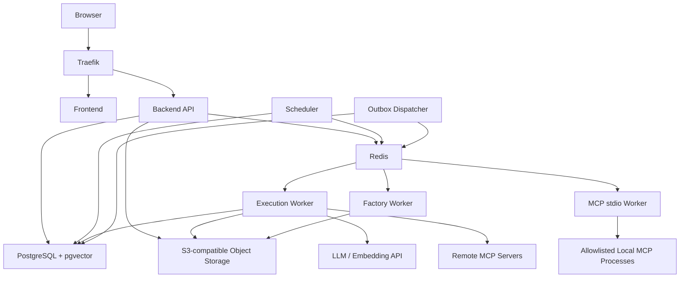

# MCPFlow 배포 아키텍처 설계서

> **MCPFlow - MCP-based AI Agent Automation Platform**

| 항목 | 내용 |
|---|---|
| 문서 ID | `MCPF-DEPLOY-001` |
| 문서 버전 | `v0.1` |
| 상태 | Draft - 개발/운영 배포 기준 초안 |
| 기준 저장소 | `ramza2/mcp-flow` |
| 공식 과제명 | MCP 연계 업무 자동화 AI 에이전트 개발 |
| 선행 문서 | `01-requirements.md` v0.2, `02-functional-specification.md` v0.2, `03-system-architecture.md` v0.2, `04-agent-mcp-architecture.md` v0.1, `05-data-model.md` v0.1, `06-api-design.md` v0.1, `07-ui-ux-design.md` v0.1 |
| 기본 배포 방식 | Docker + Docker Compose |
| Reverse Proxy | Traefik |
| 상태 원본 | PostgreSQL |
| 비동기 전달 | Redis + Celery |
| 최종 수정일 | 2026-09-02 |

---

## 1. 문서 목적

본 문서는 MCPFlow의 개발·시험·운영환경에서 사용하는 Docker 기반 배포 구조와 운영 기준을 정의한다.

본 문서는 다음 작업의 공통 기준으로 사용한다.

- Dockerfile 및 Docker Compose 작성
- 개발자 로컬 실행환경 구성
- 시험·시범운영 서버 배포
- Backend API, Worker, Scheduler 프로세스 분리
- PostgreSQL, Redis, Object Storage 연결
- Traefik 기반 Reverse Proxy 및 TLS 구성
- 환경변수와 Secret 관리
- Health Check, 로그, metric 및 장애감지 구성
- DB migration, 백업 및 복구
- Cursor Agents Window 기반 인프라 코드 생성 및 리뷰
- 향후 운영 배포 절차 및 제출용 배포 아키텍처 산출물 작성

배포구조는 `03-system-architecture.md`에서 정의한 **모듈형 모놀리스 + 프로세스 분리** 원칙을 따른다. Backend는 하나의 source tree와 기본 image를 공유하되 API, Worker, Scheduler, MCP stdio Worker, Factory Worker가 서로 다른 command와 권한으로 실행된다.

---

## 2. 배포 목표 및 원칙

### 2.1 배포 목표

1. 개발자 PC와 시험·운영 서버에서 가능한 동일한 container image와 환경변수 구조를 사용한다.
2. `docker compose up` 기준으로 핵심 플랫폼을 재현 가능하게 기동할 수 있어야 한다.
3. PostgreSQL을 업무·실행 상태의 유일한 Source of Truth로 유지한다.
4. API와 장기 실행 Worker를 분리하여 Tool 실행 지연이나 장애가 Web API 응답성을 직접 훼손하지 않도록 한다.
5. 외부 MCP, Tool Factory 산출물 및 stdio 프로세스의 실행경계를 API 프로세스와 분리한다.
6. Secret을 image, Git 저장소, 일반 환경변수 파일에 평문으로 포함하지 않는다.
7. 서비스 장애 시 원인과 영향을 로그·Health·Metric으로 식별할 수 있어야 한다.
8. DB migration, backup, rollback이 배포절차에 포함되어야 한다.
9. 초기에는 Docker Compose로 단순성을 유지하되 향후 Kubernetes 이전을 막는 구조적 종속성을 만들지 않는다.

### 2.2 핵심 배포 원칙

| ID | 원칙 | 적용 기준 |
|---|---|---|
| `DEP-PR-001` | Immutable Image | 운영 container 내부에서 source를 직접 수정하지 않는다. |
| `DEP-PR-002` | Same Image, Different Role | Backend 역할은 동일 image에서 command로 분리한다. |
| `DEP-PR-003` | Config Externalization | 환경별 값은 image 밖의 환경변수·Secret으로 주입한다. |
| `DEP-PR-004` | Persistent State Separation | DB, Object Storage 등 영속 데이터는 container lifecycle과 분리한다. |
| `DEP-PR-005` | Least Privilege | Container별 사용자, network, volume, secret 접근을 최소화한다. |
| `DEP-PR-006` | Explicit Health | 기동 여부와 실제 요청 처리 가능 여부를 health endpoint로 구분한다. |
| `DEP-PR-007` | Migration First | 애플리케이션 기동 전 호환되는 DB migration을 명시적으로 적용한다. |
| `DEP-PR-008` | Observable by Default | JSON 로그, request/execution correlation, 기본 metric을 운영환경에서 활성화한다. |
| `DEP-PR-009` | Controlled Egress | 외부 LLM/MCP 호출이 필요한 프로세스만 외부통신을 허용하는 구조를 지향한다. |
| `DEP-PR-010` | No Docker Socket Exposure | 일반 애플리케이션 container에 host Docker socket을 제공하지 않는다. |

---

## 3. 배포 환경 구분

MCPFlow는 최소 다음 환경을 구분한다.

| 환경 | 목적 | 특징 |
|---|---|---|
| `local` | 개발자 로컬 개발 | source bind mount, hot reload, mock service 사용 가능 |
| `test` | 통합·E2E·성능 시험 | 운영과 유사한 image, 테스트 데이터, mock/실제 외부연계 선택 |
| `pilot` | 시범운영 | 운영 수준의 secret, TLS, backup, monitoring 적용 |
| `prod` | 정식 운영 확장용 | 현재 초기 필수범위는 아니나 동일 구조로 확장 가능하게 설계 |

환경 차이는 source code 분기가 아니라 configuration과 Compose override/profile로 관리한다.

예시:

```text
compose.yaml
compose.local.yaml
compose.test.yaml
compose.pilot.yaml
```

또는 단일 Compose 파일과 profile을 조합할 수 있다. 프로젝트 진행 중 한 방식을 선택한 뒤 혼용하지 않는다.

---

## 4. 전체 배포 구성

### 4.1 논리 배포 구조



### 4.2 기본 서비스 목록

| 서비스 | 기본 이름 | 역할 | 영속성 |
|---|---|---|---|
| Reverse Proxy | `traefik` | TLS 종료, Frontend/API routing | 설정만 유지 |
| Frontend | `frontend` | React 정적 UI 제공 | 없음 |
| Backend API | `api` | REST/SSE, 인증, 동기 Use Case | 없음 |
| Execution Worker | `worker` | Agent/Execution 비동기 처리 | 없음 |
| MCP stdio Worker | `mcp-worker` | 허용된 local MCP subprocess 실행 | 없음 |
| Factory Worker | `factory-worker` | Tool Factory build/test | 작업공간 임시 |
| Scheduler | `scheduler` | 예약 발생 및 실행 생성 | 없음 |
| Outbox Dispatcher | `outbox` | DB outbox 이벤트를 Queue/알림으로 전달 | 없음 |
| PostgreSQL | `postgres` | 업무·실행·감사 상태 원본 | 필수 |
| Redis | `redis` | Celery broker, 단기 coordination | 재생성 가능 |
| Object Storage | `object-storage` | 대용량 결과, export, Factory artifact | 필수 |
| Migration | `migration` | Alembic migration 실행용 one-shot job | 없음 |

개발 초기에는 `outbox`를 Worker command로 통합할 수 있으나 논리적 책임은 분리한다.

---

## 5. Backend Image 및 프로세스 분리

### 5.1 Backend 단일 Image

다음 프로세스는 하나의 Backend image를 공유한다.

```text
mcpflow-backend:<version>
```

역할별 command 예시:

```text
api             -> python -m mcpflow.entrypoints.api
worker          -> celery -A mcpflow.infrastructure.celery worker ...
scheduler       -> python -m mcpflow.entrypoints.scheduler
mcp-worker      -> celery ... -Q mcp_stdio
factory-worker  -> celery ... -Q factory
outbox          -> python -m mcpflow.entrypoints.outbox
migration       -> alembic upgrade head
```

실제 module path는 코드 골격 확정 시 조정할 수 있으나 **동일 source/image + 역할별 command** 원칙은 유지한다.

### 5.2 Backend Image 기준

- Python runtime과 OS base image는 버전을 명시적으로 pin한다.
- dependency는 lock file을 통해 재현 가능하게 설치한다.
- multi-stage build를 사용하여 build dependency를 runtime image에 최소화한다.
- root가 아닌 전용 사용자로 실행한다.
- source code와 dependency 외에 secret을 image layer에 포함하지 않는다.
- container 기동 시 dependency install을 수행하지 않는다.
- migration은 API startup script에서 암묵적으로 수행하지 않는다.

### 5.3 Frontend Image

Frontend는 production build 결과를 정적 파일로 제공한다.

```text
React + TypeScript + Vite
        ↓
    npm build
        ↓
static assets
        ↓
web server / frontend container
```

Frontend에서 API base URL을 source에 하드코딩하지 않는다. 동일 origin 기준 `/api/v1` 접근을 기본으로 하여 환경별 CORS 복잡도를 줄인다.

---

## 6. Docker Compose 구성 기준

### 6.1 Project Name

Docker Compose project name은 다음으로 고정한다.

```text
mcpflow
```

실행 예시:

```bash
COMPOSE_PROJECT_NAME=mcpflow docker compose up -d
```

또는 Compose의 top-level `name: mcpflow`를 사용할 수 있다.

### 6.2 서비스 의존성

`depends_on`은 기동 순서 보조용이며 애플리케이션의 실제 readiness 보장을 대체하지 않는다.

기본 의존관계:

```text
postgres healthy
redis healthy
object-storage healthy
        ↓
migration success
        ↓
api / worker / scheduler / outbox
        ↓
frontend / traefik routing
```

Worker는 dependency 일시 장애를 자체 retry할 수 있어야 한다.

### 6.3 Restart Policy

| 서비스 | 권장 정책 |
|---|---|
| `traefik` | `unless-stopped` |
| `frontend` | `unless-stopped` |
| `api` | `unless-stopped` |
| `worker` | `unless-stopped` |
| `mcp-worker` | `unless-stopped` |
| `factory-worker` | `unless-stopped` |
| `scheduler` | `unless-stopped` |
| `outbox` | `unless-stopped` |
| `postgres` | `unless-stopped` |
| `redis` | `unless-stopped` |
| `object-storage` | `unless-stopped` |
| `migration` | restart 하지 않는 one-shot |

Crash loop가 무한히 숨겨지지 않도록 모니터링에서 반복 restart 횟수를 감지한다.

---

## 7. Network 설계

### 7.1 Network 구분

초기 Compose에서는 최소 다음 논리 network를 사용한다.

| Network | 연결 서비스 | 목적 |
|---|---|---|
| `edge` | Traefik, Frontend, API | 사용자 요청 ingress |
| `app` | API, Worker, Scheduler, Outbox, Redis | 내부 application 통신 |
| `data` | API, Worker, Scheduler, Outbox, PostgreSQL, Object Storage | 영속 데이터 접근 |
| `mcp` | Worker/MCP Worker, 외부/내부 MCP 연계 | MCP 실행경계 |

필요 없는 서비스는 특정 network에 연결하지 않는다.

### 7.2 외부 Port 공개

운영환경에서 host에 직접 공개하는 port는 기본적으로 Traefik의 HTTP/HTTPS만 허용한다.

```text
80/tcp
443/tcp
```

다음 서비스 port는 운영 host에 직접 publish하지 않는다.

- PostgreSQL
- Redis
- Object Storage 관리 port
- Backend 내부 port
- Worker
- Scheduler

개발환경에서만 진단 목적의 port mapping을 override로 허용한다.

### 7.3 DNS 및 서비스 접근

Container 간 접근은 Compose service name을 사용한다.

예:

```text
postgres:5432
redis:6379
object-storage:9000
api:8000
```

IP 주소를 configuration에 고정하지 않는다.

---

## 8. Traefik 및 외부 Routing

### 8.1 기본 Routing

```text
https://<host>/             -> frontend
https://<host>/api/v1/*    -> api
https://<host>/health/*    -> api health endpoint 또는 운영정책에 따라 제한
```

SSE endpoint는 buffering으로 인해 event 전달이 지연되지 않도록 proxy 설정을 검증한다.

### 8.2 TLS

`pilot` 이상 환경에서는 TLS를 기본으로 한다.

- 인증서와 private key는 image에 포함하지 않는다.
- 인증서 발급/갱신 방식은 운영환경에 맞춰 Traefik ACME 또는 관리자가 제공한 인증서를 사용할 수 있다.
- HTTP는 HTTPS로 redirect한다.
- 내부 업무망에서 자체 CA를 사용하는 경우 client trust 배포절차를 별도로 관리한다.

### 8.3 보안 Header

Traefik 또는 Frontend 응답계층에서 최소 다음을 검토한다.

- `Strict-Transport-Security`
- `X-Content-Type-Options`
- `Content-Security-Policy`
- `Referrer-Policy`
- frame embedding 제한

정확한 CSP는 Figma 반영 후 실제 Frontend asset/API 사용패턴을 기준으로 확정한다.

---

## 9. PostgreSQL 배포

### 9.1 기준

- PostgreSQL 17 이상
- `pgvector` extension 사용
- timezone UTC
- UTF-8
- 운영 data directory는 named volume 또는 별도 host storage에 보존
- DB port는 외부 공개하지 않음

### 9.2 Volume

예시:

```text
mcpflow_postgres_data
```

Container 삭제와 DB 데이터 삭제를 동일 작업으로 취급하지 않는다.

### 9.3 Connection Pool

API와 Worker의 DB pool 총합이 PostgreSQL `max_connections`를 초과하지 않도록 산정한다.

초기에는 서비스별 작은 pool을 사용하고 실제 동시사용량을 측정하여 조정한다.

```text
총 예상 connection
= API replicas × API pool
+ Worker processes × Worker pool
+ Scheduler/Outbox
+ 운영/관리 여유분
```

### 9.4 Migration

Alembic migration은 배포 시 독립 one-shot 단계로 수행한다.

```text
Image Pull/Build
      ↓
Backup 확인
      ↓
Migration 실행
      ↓
Migration 성공 확인
      ↓
Application 교체
```

운영환경에서 `SQLAlchemy create_all()`을 사용하지 않는다.

### 9.5 Migration 호환성

무중단 또는 롤백 가능성을 위해 가능한 다음 순서를 따른다.

1. 새 nullable column/table/index 추가
2. 신규 코드 배포
3. 데이터 backfill
4. 새 코드가 완전히 전환된 후 obsolete column 제거

한 배포에서 destructive schema change와 해당 필드를 제거한 code를 동시에 강제하지 않는 것을 원칙으로 한다.

---

## 10. Redis 및 Queue 배포

### 10.1 Redis 역할

Redis는 다음 목적으로만 사용한다.

- Celery message broker
- 단기 distributed coordination
- 선택적 짧은 TTL cache

다음 데이터의 Source of Truth로 사용하지 않는다.

- Execution 최종상태
- Approval 상태
- Schedule 원본
- Audit log
- 사용자·권한 원본

### 10.2 Queue 분리

초기 Queue 예시:

| Queue | 소비자 | 주요 작업 |
|---|---|---|
| `execution` | `worker` | Agent, Execution, remote MCP 호출 |
| `mcp_stdio` | `mcp-worker` | local stdio MCP 실행 |
| `factory` | `factory-worker` | Tool Factory build/test |
| `maintenance` | `worker` 또는 전용 worker | index, cleanup, evaluation 등 |

위험도와 실행시간이 크게 다른 작업을 하나의 queue에 몰아넣지 않는다.

### 10.3 Queue 장애

Queue 전달은 at-least-once 가능성을 전제로 한다.

- 모든 중요 작업은 DB의 상태와 idempotency key를 재검증한다.
- 중복 message가 동일 Tool 부작용을 반복하지 않도록 Execution/Attempt 상태를 확인한다.
- transactional outbox로 DB transaction과 message 생성 사이의 유실을 방지한다.

---

## 11. Object Storage 배포

S3-compatible Object Storage는 다음 데이터를 저장한다.

- 대용량 Tool result
- 사용자 export 파일
- Tool Factory source/build/test artifact
- 필요 시 평가 결과 파일

DB에는 다음 메타데이터만 저장한다.

- object key
- content type
- size
- checksum
- 생성자/생성시각
- 보존정책
- 관련 resource ID

### 11.1 보안 원칙

- Bucket을 public으로 설정하지 않는다.
- Browser가 Object Storage endpoint를 직접 사용하지 않는 것을 기본으로 한다.
- 필요 시 Backend가 권한 확인 후 단기 presigned URL을 발급한다.
- secret과 password 원문을 artifact에 저장하지 않는다.

---

## 12. Secret 및 환경변수 관리

### 12.1 환경변수 분류

| 분류 | 예시 | 저장 방식 |
|---|---|---|
| 일반 설정 | log level, timezone, feature flag | `.env` 또는 배포환경 변수 |
| 내부 접속정보 | DB host, Redis host | 환경변수 |
| Secret | DB password, master key, LLM API key | Docker Secret 또는 외부 secret 파일/관리체계 |
| 사용자 등록 Credential | MCP API key/token | 암호화 DB + master key |

### 12.2 Git 저장 금지

다음 파일은 Git에 commit하지 않는다.

```text
.env
.env.local
.env.test.local
.env.pilot
secrets/*
certs/private/*
```

Repository에는 `.env.example`만 제공한다.

### 12.3 권장 환경변수 Namespace

```text
MCPFLOW_APP_*
MCPFLOW_DB_*
MCPFLOW_REDIS_*
MCPFLOW_STORAGE_*
MCPFLOW_LLM_*
MCPFLOW_SECURITY_*
MCPFLOW_LOG_*
```

예:

```text
MCPFLOW_APP_ENV=pilot
MCPFLOW_DB_HOST=postgres
MCPFLOW_DB_PORT=5432
MCPFLOW_REDIS_HOST=redis
MCPFLOW_LOG_LEVEL=INFO
```

Secret 값은 예시 파일에서도 실제처럼 보이는 값을 넣지 않는다.

---

## 13. Local MCP 및 stdio 격리

Local stdio MCP는 API container에서 직접 실행하지 않는다.

기본 실행경로:

```text
Execution Worker
      ↓ Queue
MCP stdio Worker
      ↓
Allowlisted Command
      ↓
Local MCP Process
```

### 13.1 실행 제한

- 등록된 executable/command template만 허용한다.
- 사용자 입력을 shell command 문자열로 직접 합성하지 않는다.
- 가능하면 shell 없이 argument array로 subprocess를 실행한다.
- 실행 사용자 권한을 최소화한다.
- read-only filesystem을 기본으로 하고 필요한 temp directory만 쓰기 허용한다.
- CPU, memory, timeout, process 수 제한을 둔다.
- host root filesystem 및 Docker socket을 mount하지 않는다.
- 필요한 외부 network만 허용한다.

### 13.2 Factory 산출 Tool

Tool Factory가 생성한 MCP Server는 기본적으로 독립 Streamable HTTP container로 배포하는 것을 원칙으로 한다.

```text
Factory Source
   ↓
Static/Security Validation
   ↓
Build
   ↓
Isolated Test
   ↓
Artifact Registry
   ↓
Operator Approval
   ↓
Independent MCP Container
```

Factory Worker가 운영 host Docker daemon을 직접 제어하는 구조는 사용하지 않는다. 초기 구현에서 자동 배포가 어려운 경우 artifact 생성과 관리자 수동 배포를 분리한다.

---

## 14. Health Check 및 Readiness

### 14.1 API Health Endpoint

다음 endpoint를 기준으로 한다.

```text
GET /health/live
GET /health/ready
```

`live`는 process가 deadlock 없이 동작 중인지 확인하며 외부 dependency 전체를 검사하지 않는다.

`ready`는 최소 다음을 확인한다.

- PostgreSQL 연결 가능
- 필수 migration version 만족
- 필수 configuration 로드 완료

Redis, Object Storage, LLM, MCP 장애는 기능별 degraded 상태로 표현할 수 있으며 API 전체 readiness를 무조건 실패시키지는 않는다. 어떤 dependency가 필수인지 환경별로 명시한다.

### 14.2 Worker Health

Worker는 단순 process 존재뿐 아니라 다음 heartbeat 정보를 운영 측에서 확인할 수 있어야 한다.

- worker id
- role/queue
- last heartbeat
- active task 수
- 마지막 성공/오류시각

### 14.3 Service Health 상태

| 상태 | 의미 |
|---|---|
| `HEALTHY` | 정상 처리 가능 |
| `DEGRADED` | 일부 외부기능 장애이나 핵심 서비스 가능 |
| `UNHEALTHY` | 핵심 요청 처리 불가 |
| `UNKNOWN` | 상태 확인 불가 |

---

## 15. 로그 설계

### 15.1 기본 형식

운영환경은 JSON structured logging을 기본으로 한다.

필수 공통 필드:

```text
timestamp
level
service
instance_id
environment
request_id
user_id (허용 시)
execution_id
step_execution_id
job_id
event
message
```

해당 context가 없는 필드는 생략할 수 있다.

### 15.2 금지 데이터

로그에 다음을 기록하지 않는다.

- password
- API key/token 원문
- session cookie
- secret plaintext
- 전체 Authorization header
- 불필요한 사용자 민감정보

Tool input/output은 기본 application log에 그대로 남기지 않고 필요하면 DB의 보안된 Execution 기록으로 추적한다.

### 15.3 Container Log Rotation

Docker 기본 json log가 host disk를 고갈시키지 않도록 rotation을 적용한다.

예시 정책은 운영환경 용량에 따라 확정하되 `max-size`, `max-file` 제한을 반드시 둔다.

---

## 16. Metric 및 운영 모니터링

초기에는 최소 다음 metric을 수집할 수 있도록 instrumentation point를 둔다.

### 16.1 API

- 요청 수
- HTTP status별 오류 수
- endpoint latency
- active SSE connection
- 인증 실패 수

### 16.2 Execution

- Execution 생성/완료/실패 수
- 전체 수행시간
- Step 수행시간
- Tool 호출 성공/실패/timeout 수
- retry 수
- 승인대기 시간
- queue wait time

### 16.3 Agent/LLM

- 요청 분석시간
- Tool mapping 성공/실패
- LLM 호출 latency
- model/provider별 오류
- token/usage 정보가 제공되는 경우 사용량

### 16.4 Infrastructure

- container restart count
- CPU/memory
- DB connection/pool
- DB storage
- Redis queue depth
- Object Storage 사용량

Prometheus/Grafana 같은 구체적인 제품 도입은 개발 진행과 운영환경에 따라 결정하되 application metric endpoint 또는 exporter 연계 가능 구조를 유지한다.

---

## 17. Backup 및 Restore

### 17.1 백업 대상

| 대상 | 중요도 | 백업 방식 |
|---|---|---|
| PostgreSQL | 최상 | 정기 logical/physical backup |
| Object Storage | 높음 | bucket replication 또는 정기 copy |
| 배포 설정 | 높음 | Git + 별도 secret backup |
| Redis | 낮음 | 원본상태가 아니므로 재생성 가능 |
| Container image | 높음 | Registry 또는 versioned image 보관 |

### 17.2 최소 운영정책

시범운영 시작 전 다음을 확정한다.

- DB 백업 주기
- 백업 보존기간
- Object Storage 백업 방식
- 복구 책임자
- 복구 목표시간(RTO)
- 허용 데이터 손실범위(RPO)

숫자는 실제 운영기관 요구와 자원조건이 확정되기 전에 임의로 고정하지 않는다.

### 17.3 Restore 시험

백업 성공 로그만으로 복구 가능성을 판단하지 않는다. 시범운영 전 최소 1회 별도 환경에 복원하여 다음을 확인한다.

1. DB restore 성공
2. migration version 확인
3. Object Storage reference 정합성
4. 사용자 로그인
5. MCP Server/Tool metadata 조회
6. 과거 Execution 조회
7. 신규 Execution 생성

---

## 18. 배포 및 업데이트 절차

### 18.1 기본 배포 흐름

```text
Source Merge
    ↓
Test
    ↓
Image Build
    ↓
Image Tag
    ↓
Backup 확인
    ↓
Migration Dry Review
    ↓
Migration 실행
    ↓
Application Container 교체
    ↓
Health Check
    ↓
Smoke Test
    ↓
배포 완료 기록
```

### 18.2 Image Tagging

`latest`만으로 운영 배포하지 않는다.

예:

```text
mcpflow-backend:0.1.0
mcpflow-frontend:0.1.0
```

필요 시 Git commit SHA를 함께 기록한다.

```text
0.1.0-g<shortsha>
```

배포기록에는 최소 다음을 남긴다.

- release/version
- Git commit SHA
- image digest/tag
- migration revision
- 배포시각
- 배포자
- 주요 변경내용

### 18.3 Smoke Test

배포 후 최소 확인항목:

1. Login 가능
2. `/health/ready` 정상
3. Dashboard 조회
4. MCP Server 목록 조회
5. Tool 목록 조회
6. 테스트용 단일 Execution 생성
7. SSE 또는 polling으로 상태변화 확인
8. Execution 완료 및 이력 조회
9. Audit event 기록 확인

---

## 19. Rollback 전략

### 19.1 Application Rollback

DB schema가 이전 application과 호환되는 경우 이전 image tag로 되돌린다.

### 19.2 DB Rollback

운영 migration은 무조건 downgrade 가능하다고 가정하지 않는다.

- destructive migration 전 backup을 확인한다.
- 대규모 변경은 expand → migrate → contract 방식으로 수행한다.
- rollback이 어려운 데이터 변환은 별도 restoration 절차를 문서화한다.

### 19.3 실패 배포 처리

```text
Health 실패
   ↓
신규 traffic 차단
   ↓
원인 확인
   ↓
Application rollback 가능? ─ Yes → 이전 image 복구
   │
   No
   ↓
DB/데이터 영향 확인
   ↓
복구 절차 수행
```

---

## 20. 개발환경 Compose 기준

Local 개발환경에서는 개발생산성을 위해 일부 기준을 완화할 수 있다.

허용 예:

- Frontend HMR
- FastAPI reload
- source bind mount
- PostgreSQL/Redis host port 임시 공개
- Mock LLM/MCP container
- 개발용 seed data

운영과 다른 설정은 `compose.local.yaml` 또는 `local` profile에만 둔다.

개발편의를 위해 다음을 운영구성에 반영하지 않는다.

- root container
- wildcard CORS
- 인증 비활성화
- hardcoded credential
- public database port
- Docker socket mount
- debug stack trace 외부 노출

---

## 21. Test/Pilot 환경 기준

### 21.1 Test

통합시험에서는 다음을 검증한다.

- migration from clean DB
- migration from previous revision
- service restart 후 Execution 복구
- Redis 재기동 후 영속상태 유지
- Worker 중단/재기동
- MCP timeout
- LLM Provider 장애
- Object Storage 장애
- SSE 재연결 및 polling fallback

### 21.2 Pilot

시범운영 환경은 최소 다음을 적용한다.

- HTTPS
- 외부 DB/Redis port 차단
- 운영 Secret 분리
- JSON log 및 rotation
- 정기 backup
- health monitoring
- 이미지 버전 고정
- 초기 관리자 password 교체 정책
- audit 확인

---

## 22. 성능 및 Scale-out 기준

### 22.1 우선 확장대상

MCPFlow는 다음 순서로 수평확장을 고려한다.

1. Execution Worker
2. MCP stdio Worker
3. Factory Worker
4. Backend API

PostgreSQL은 초기 단일 instance를 기본으로 하며 필요 시 외부 관리형/HA DB로 이전할 수 있도록 connection string 외에 application 의존성을 두지 않는다.

### 22.2 Worker Scale-out

Worker replica를 늘려도 동일 Execution Step이 중복 수행되지 않도록 DB lease/lock/idempotency를 적용한다.

```text
Queue Message
    ↓
Worker A / Worker B 경쟁
    ↓
DB에서 실행권한 획득
    ↓
1개 Worker만 수행
```

### 22.3 API Scale-out

API는 server-side Session을 사용하되 Session 원본을 특정 API process memory에만 저장하지 않는다. 여러 API replica에서 동일하게 인증 가능하도록 공유 가능한 session store 또는 DB 기반 session을 사용한다.

---

## 23. 장애 시나리오 및 복구 기준

| 장애 | 기대 동작 |
|---|---|
| API 재시작 | 진행 중 Execution은 Worker/DB 기준으로 유지 |
| Worker 종료 | lease 만료 후 복구 Worker가 안전하게 재평가 |
| Redis 재시작 | Queue 전달 복원 후 DB 원본상태와 reconciliation |
| PostgreSQL 장애 | 신규 상태변경 중단, 오류 명시, 자동 추측 실행 금지 |
| Object Storage 장애 | 대용량 결과 관련 Step 실패 또는 재시도, DB reference 조작 금지 |
| LLM 장애 | Agent planning 실패/재시도, 기존 확정 Plan 실행과 구분 |
| Remote MCP 장애 | timeout/retry policy 적용, non-idempotent 결과불명 호출은 자동 재시도 금지 |
| Scheduler 중단 | 재기동 후 occurrence reconciliation, 중복 Execution 방지 |
| Outbox 중단 | 미전송 event를 DB에서 재전송 |

---

## 24. Repository 인프라 구조

초기 권장 구조:

```text
mcp-flow/
├── backend/
│   ├── Dockerfile
│   └── ...
├── frontend/
│   ├── Dockerfile
│   └── ...
├── infra/
│   ├── compose/
│   │   ├── compose.yaml
│   │   ├── compose.local.yaml
│   │   ├── compose.test.yaml
│   │   └── compose.pilot.yaml
│   ├── traefik/
│   │   ├── dynamic/
│   │   └── traefik.yaml
│   ├── scripts/
│   │   ├── backup-db.sh
│   │   ├── restore-db.sh
│   │   ├── deploy.sh
│   │   └── smoke-test.sh
│   └── README.md
├── docs/
├── .env.example
└── README.md
```

실제 구현 시 운영체제 의존 shell script를 최소화하고 가능한 명령은 Python 또는 Compose command로 제공한다.

---

## 25. `.env.example` 구성 기준

예시 구조:

```dotenv
# Application
MCPFLOW_APP_ENV=local
MCPFLOW_APP_HOST=0.0.0.0
MCPFLOW_APP_PORT=8000

# Database
MCPFLOW_DB_HOST=postgres
MCPFLOW_DB_PORT=5432
MCPFLOW_DB_NAME=mcpflow
MCPFLOW_DB_USER=mcpflow
MCPFLOW_DB_PASSWORD_FILE=/run/secrets/db_password

# Redis
MCPFLOW_REDIS_HOST=redis
MCPFLOW_REDIS_PORT=6379

# Object Storage
MCPFLOW_STORAGE_ENDPOINT=http://object-storage:9000
MCPFLOW_STORAGE_BUCKET=mcpflow

# Logging
MCPFLOW_LOG_LEVEL=INFO
MCPFLOW_LOG_FORMAT=json

# Security
MCPFLOW_SECURITY_MASTER_KEY_FILE=/run/secrets/master_key
MCPFLOW_SECURITY_SESSION_KEY_FILE=/run/secrets/session_key
```

실제 변수명은 Settings/Pydantic 모델 구현 시 확정하고 본 문서를 현행화한다.

---

## 26. Docker Compose 구현 시 금지사항

다음 구성은 명시적으로 금지한다.

- source repository에 실제 password/token commit
- API container에 `/var/run/docker.sock` mount
- 운영 PostgreSQL/Redis port의 `0.0.0.0` 공개
- `privileged: true` 사용
- 필요 없는 host directory 전체 mount
- container 내부 source hot patch
- 운영 image tag를 `latest` 하나로만 관리
- Redis를 Execution 상태 DB처럼 사용하는 구현
- API startup마다 자동 destructive migration 실행
- Tool Factory 코드를 핵심 API process에서 import 후 실행
- 외부 MCP 응답을 검증 없이 shell/env/config에 사용

예외가 필요한 경우 별도 ADR과 위험분석을 남긴다.

---

## 27. 구현 단계별 배포 범위

### 27.1 Foundation

```text
traefik
frontend
api
worker
postgres
redis
migration
```

목표:

- 로그인
- MCP Server/Tool 관리
- 단일 Tool 실행
- 실행이력

### 27.2 Intelligence / Orchestration

추가·강화:

```text
worker scale-out
object-storage
scheduler
outbox
```

목표:

- Agent planning
- 복합 Execution
- 대용량 결과
- 예약/승인

### 27.3 Extension

추가:

```text
mcp-worker
factory-worker
factory-generated MCP containers
```

목표:

- local stdio MCP 격리
- Tool Factory
- 외부 MCP 확장

위 단계명은 **개발 증분을 설명하기 위한 내부 구현 구분이며 공식 과제의 1차/2차 개발 단계 표현으로 사용하지 않는다.**

---

## 28. 배포 수용 기준

| ID | 수용 기준 |
|---|---|
| `DEP-AC-001` | 신규 개발환경에서 문서화된 명령으로 전체 핵심 서비스가 기동된다. |
| `DEP-AC-002` | PostgreSQL/Redis는 운영환경에서 host 외부에 직접 공개되지 않는다. |
| `DEP-AC-003` | API, Worker, Scheduler가 동일 Backend image에서 역할별 command로 실행된다. |
| `DEP-AC-004` | DB migration을 독립 단계로 실행할 수 있다. |
| `DEP-AC-005` | container 재시작 후 기존 Execution/Approval/Schedule 상태가 유지된다. |
| `DEP-AC-006` | Redis 데이터 유실만으로 완료된 Execution 이력이 사라지지 않는다. |
| `DEP-AC-007` | Secret 원문이 Git, image layer, 일반 API 응답 및 로그에 포함되지 않는다. |
| `DEP-AC-008` | `/health/live`, `/health/ready`로 API 상태를 확인할 수 있다. |
| `DEP-AC-009` | 운영 로그에서 `request_id`와 `execution_id`로 관련 처리를 추적할 수 있다. |
| `DEP-AC-010` | DB backup을 별도 환경에 restore하여 서비스 기동을 검증할 수 있다. |
| `DEP-AC-011` | 배포된 image tag와 Git commit을 추적할 수 있다. |
| `DEP-AC-012` | 단일 Worker 장애 후 안전한 작업 복구 또는 명확한 수동확인 상태가 된다. |
| `DEP-AC-013` | SSE 연결이 Reverse Proxy를 경유해 정상 전달되고 실패 시 polling fallback이 동작한다. |
| `DEP-AC-014` | Local MCP/Factory 실행경로가 API process 및 host Docker socket과 격리되어 있다. |

---

## 29. 후속 문서 연계

본 문서 확정 후 다음 문서 및 구현에 반영한다.

| 대상 | 연계 내용 |
|---|---|
| `09-test-strategy.md` | Compose 기동, 장애, backup/restore, migration, scale-out 시험 |
| `AGENTS.md` | Docker/Secret/Migration/환경변수 변경 규칙 |
| Backend | role별 entrypoint, health endpoint, Settings 구성 |
| Frontend | 동일 origin `/api/v1`, build/runtime config 정책 |
| Infra | Dockerfile, Compose, Traefik, backup/deploy script |
| CI/CD | test → image build → migration 검증 → 배포 절차 |

---

## 30. 설계 변경 관리

다음 사항을 변경할 경우 본 문서를 우선 검토한다.

- Docker Compose에서 Kubernetes로 전환
- PostgreSQL/Redis/Object Storage 제품 또는 운영방식 변경
- Backend process 분리 또는 microservice 전환
- Traefik 교체
- Session store 방식 변경
- Queue/Celery 교체
- Tool Factory 자동 container 배포방식 도입
- 외부 Secret Manager 도입
- HA/DR 요구 추가

변경 시 관련 Architecture ADR, 데이터모델, API, UI, 시험전략, 운영절차를 함께 현행화한다.
