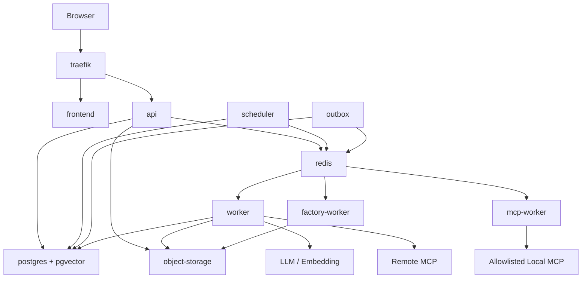

# MCPFlow 배포 아키텍처 설계서

> **MCPFlow - MCP-based AI Agent Automation Platform**

| 항목 | 내용 |
|---|---|
| 문서 ID | `MCPF-DEPLOY-001` |
| 문서 버전 | `v0.2` |
| 상태 | Draft - 정합성 통합본 |
| 기준 저장소 | `ramza2/mcp-flow` |
| 선행 문서 | `01` v0.3, `02` v0.3, `03` v0.3, `04` v0.2, `05` v0.2, `06` v0.2, `07` v0.2 |
| 기본 배포 | Docker + Docker Compose |
| Docker Project | `mcpflow` |
| Reverse Proxy | Traefik |
| 상태 원본 | PostgreSQL |
| 비동기 전달 | Redis + Celery |
| 공식 과제명 | MCP 연계 업무 자동화 AI 에이전트 개발 |
| 최종 수정일 | 2026-09-02 |

---

## 1. 문서 목적

본 문서는 MCPFlow의 로컬·시험·시범운영 환경에서 사용하는 Docker 기반 배포구조, 서비스명, network, volume, Secret, health, logging, backup/restore 및 배포절차를 정의한다.

`03-system-architecture.md`의 모듈형 모놀리스 + 프로세스 분리 원칙을 물리 배포로 구체화한다.

---

## 2. 배포 원칙

1. 동일 source/image를 환경별 configuration으로 실행한다.
2. `docker compose`로 핵심 platform을 재현할 수 있어야 한다.
3. PostgreSQL이 업무·실행 상태의 원본이다.
4. API와 장기 Worker를 분리한다.
5. stdio/Factory는 API process와 격리한다.
6. Secret을 Git/image/.env 평문에 저장하지 않는다.
7. health/log/metric으로 장애원인을 식별한다.
8. migration/backup/rollback을 배포절차에 포함한다.
9. Docker socket을 일반 application container에 mount하지 않는다.
10. 향후 Kubernetes 이전을 막는 host 종속성을 최소화한다.

---

## 3. 환경 구분

| 환경 | 목적 | 특징 |
|---|---|---|
| `local` | 개발자 로컬 | bind mount, hot reload, mock 가능 |
| `test` | 통합/E2E/성능 | 운영유사 image, test seed |
| `pilot` | 시범운영 | TLS, Secret, backup, monitoring 적용 |
| `prod` | 향후 정식운영 | 동일 구조 확장 가능 |

환경차이는 source branch가 아니라 Compose override/profile과 환경변수로 관리한다.

권장:

```text
compose.yaml
compose.local.yaml
compose.test.yaml
compose.pilot.yaml
```

프로젝트 진행 중 하나의 override/profile 전략을 선택하고 혼용하지 않는다.

---

## 4. 전체 배포구조



Canonical service name:

```text
traefik
frontend
api
worker
mcp-worker
factory-worker
scheduler
outbox
postgres
redis
object-storage
migration
```

다른 문서에서 `mcp-stdio-worker`, `outbox-worker`, `outbox-relay`를 별도 서비스명으로 사용하지 않는다.

---

## 5. 서비스 책임

| 서비스 | 역할 | 영속성 |
|---|---|---|
| `traefik` | TLS, routing, edge policy | config/cert |
| `frontend` | React 정적 UI | 없음 |
| `api` | REST/SSE, 인증, 동기 use case | 없음 |
| `worker` | Agent planning, Execution, Remote MCP/LLM | 없음 |
| `mcp-worker` | 승인된 local stdio MCP 실행 | 없음 |
| `factory-worker` | untrusted Factory build/test | 임시 workspace |
| `scheduler` | occurrence claim/Execution 생성 | 없음 |
| `outbox` | DB outbox → Queue/notification publish | 없음 |
| `postgres` | 업무/실행/감사 원본 | 필수 |
| `redis` | Celery broker/단기 coordination | 재생성 가능 |
| `object-storage` | result/export/artifact/evidence | 필수 |
| `migration` | Alembic one-shot | 없음 |

---

## 6. Backend Image

기본 image:

```text
mcpflow-backend:<version-or-commit>
```

역할별 command 예:

```text
api            -> python -m mcpflow.entrypoints.api
worker         -> celery -A mcpflow.infrastructure.celery worker -Q agent,execution,maintenance
mcp-worker     -> celery -A mcpflow.infrastructure.celery worker -Q mcp_stdio
factory-worker -> celery -A mcpflow.infrastructure.celery worker -Q factory
scheduler      -> python -m mcpflow.entrypoints.scheduler
outbox         -> python -m mcpflow.entrypoints.outbox
migration      -> alembic upgrade head
```

실제 module path는 코드 골격에서 조정 가능하나 **same image + different role** 원칙은 유지한다.

Image 기준:

- multi-stage build
- non-root runtime
- dependency lock
- version/digest pin
- runtime dependency install 금지
- Secret image layer 포함 금지
- API startup 시 자동 migration 금지

---

## 7. Frontend Image

```text
React + TypeScript + Vite
 → production build
 → static assets
 → frontend container
```

API base URL을 source에 환경별 host로 하드코딩하지 않고 동일 origin `/api/v1`을 기본으로 한다.

---

## 8. Docker Compose Project

Project name:

```text
mcpflow
```

권장 top-level:

```yaml
name: mcpflow
```

또는:

```bash
COMPOSE_PROJECT_NAME=mcpflow docker compose up -d
```

---

## 9. 서비스 기동 의존성

```text
postgres healthy
redis healthy
object-storage healthy
       ↓
migration completed
       ↓
api / worker / mcp-worker / scheduler / outbox
       ↓
frontend / traefik routing
```

`depends_on`은 readiness를 보장하지 않으므로 서비스 자체 retry/health를 구현한다.

Factory는 별도 profile에서 기동할 수 있다.

---

## 10. Network

| Network | 서비스 | 목적 |
|---|---|---|
| `edge` | traefik, frontend, api | 사용자 ingress |
| `app` | api, worker, scheduler, outbox, redis | 내부 application |
| `data` | api, worker, scheduler, outbox, postgres, object-storage | 영속 데이터 |
| `mcp` | worker, mcp-worker | MCP outbound/local boundary |
| `factory` | factory-worker, object-storage | 생성코드 격리 |

필요 없는 서비스는 network에 연결하지 않는다.

운영 host 공개 port 기본:

```text
80/tcp
443/tcp
```

PostgreSQL, Redis, Object Storage admin, API internal port는 직접 publish하지 않는다.

---

## 11. Traefik

Routing:

```text
https://<host>/           -> frontend
https://<host>/api/v1/*  -> api
https://<host>/health/*  -> api health
```

SSE endpoint는 proxy buffering/idle timeout 때문에 event가 지연되지 않도록 설정하고 실제 reconnect 시험을 수행한다.

Pilot 이상:

- TLS 필수
- HTTP→HTTPS redirect
- 인증서/private key image 미포함
- HSTS/CSP/X-Content-Type-Options/Referrer-Policy 검토

---

## 12. PostgreSQL

기준:

```text
PostgreSQL 17+
pgvector
UTF-8
UTC
```

Volume은 container lifecycle과 분리한다.

DB role 예:

```text
mcpflow_app
mcpflow_migration
mcpflow_maintenance
```

- application role은 schema DDL 권한 최소화
- Audit Update/Delete 금지
- migration role만 Alembic DDL 수행
- backup/retention maintenance는 별도 권한 검토

---

## 13. Redis / Celery

Redis 용도:

- Celery broker
- Session payload TTL
- 짧은 coordination

금지:

- Execution 최종 상태 원본
- Approval 원본
- Schedule 원본
- Audit 원본

Queue:

```text
agent
execution
mcp_stdio
factory
maintenance
```

Task payload에는 업무 object 전체나 credential 대신 ID를 전달한다.

---

## 14. Object Storage

초기 MinIO 또는 S3-compatible adapter를 사용한다.

저장:

- 대용량 Execution result
- Audit/Execution export
- Factory source/artifact/test report
- Tool Verification evidence

Bucket/key는 API response에 내부 credential과 함께 직접 노출하지 않는다.

Presigned URL 사용 시 짧은 TTL과 선행 Permission 검증을 적용한다.

---

## 15. Secret 및 환경변수

`.env.example`에는 **값이 아닌 key와 설명만** 둔다.

예:

```text
MCPFLOW_ENV=
DATABASE_URL=
REDIS_URL=
OBJECT_STORAGE_ENDPOINT=
OBJECT_STORAGE_BUCKET=
SECRET_MASTER_KEY_FILE=
SESSION_SIGNING_KEY_FILE=
```

운영 secret:

- Docker secret/file mount 또는 외부 Secret Store
- DB의 `secret_records` 암호화 master key는 DB와 분리
- Runtime Process별 필요한 Secret만 mount

Git에 실제 credential을 commit하지 않는다.

---

## 16. Stdio MCP Manifest

정적 승인 manifest 위치:

```text
infra/mcp-manifests/
├── README.md
└── *.yaml
```

Manifest 예시 구조:

```yaml
id: filesystem-readonly-v1
runtime: process
executable: /opt/mcp/filesystem-server
args_schema: {}
env_allowlist: []
resource_limits:
  memory: 256m
  cpus: 0.5
filesystem:
  readonly: true
egress: deny
```

실제 executable/image allowlist는 운영환경 기준으로 작성한다. 사용자/API가 arbitrary command를 저장하지 않는다.

---

## 17. Factory 격리

`factory-worker`는 일반 `worker`보다 제한된 권한을 사용한다.

- host Docker socket 금지
- read-only base filesystem 지향
- 임시 workspace quota
- CPU/memory/time limit
- 기본 egress deny 또는 allowlist
- 생성코드에 운영 DB/Secret 접근 금지
- artifact만 Object Storage로 handoff

생성 MCP Server 배포 자동화가 필요해져도 host Docker socket 직접노출 대신 별도 승인된 deployment controller/CI 경로를 설계한다.

---

## 18. Health

### Liveness

```text
GET /health/live
```

Process가 event loop/request를 처리할 수 있는지 확인한다. 외부 LLM/MCP 장애 때문에 liveness를 실패시키지 않는다.

### Readiness

```text
GET /health/ready
```

최소 DB 접근, migration compatibility 등 traffic 수신 필수조건을 확인한다.

외부 dependency 상세는 인증된 `/api/v1/ops/system-health`에서 제공한다.

---

## 19. Logging / Metric

JSON log 기본필드:

```text
timestamp
level
service
event
request_id
trace_id
agent_request_id
execution_id
step_execution_id
job_id
error_code
```

일반 로그 금지:

- Password/API Key/OAuth Token
- Cookie/Authorization header
- 전체 Prompt/Tool result 무차별 복사
- presigned URL

Metric:

```text
API latency/error
Queue depth/wait
Worker active/lease recovery
Agent planning/tool selection
MCP latency/error
LLM latency/token
Scheduler occurrence
Approval wait
Object Storage error
```

---

## 20. Backup/Restore

백업 대상:

1. PostgreSQL
2. Object Storage
3. 필요한 deployment config/manifest
4. 암호화 key의 별도 안전한 운영 백업 절차

Restore 시험:

```text
clean environment
→ DB restore
→ Object Storage restore/연결
→ User/MCP/Agent/Workflow 조회
→ 과거 Execution/Audit 관계 확인
→ 신규 Execution 실행
```

백업 생성 성공만으로 복구 성공으로 판정하지 않는다.

---

## 21. Migration

배포순서:

```text
backup/restore point 확인
→ image pull/build
→ migration one-shot
→ api/worker/scheduler/outbox rollout
→ frontend/traefik 확인
→ smoke test
```

Schema 변경은 backward-compatible migration을 우선한다.

대규모 destructive migration은:

```text
expand → migrate data → application switch → contract
```

순서를 검토한다.

---

## 22. 배포·Rollback

Release tag/image는 `latest`만 사용하지 않고 최소 version 또는 commit SHA를 추적한다.

Rollback 판단:

- application image rollback이 가능한지
- 이미 적용한 DB migration이 backward compatible한지
- 새 Version/Plan schema가 이전 코드와 호환되는지

DB rollback을 자동 기본동작으로 두지 않는다. 데이터 손실 가능성이 있으면 forward fix를 우선 검토한다.

---

## 23. 개발/시험 Profile

Local:

- source bind mount
- frontend/backend hot reload
- Test MCP/LLM mock
- 필요 시 DB/Redis diagnostic port

Test:

- production-like image
- deterministic test MCP servers
- test seed
- Browser E2E

Pilot:

- TLS
- 실제 Secret 관리
- backup/monitoring
- 외부 port 최소화
- Debug mode 비활성화

---

## 24. Scale-out

초기 확장 순서:

1. `worker` replicas 증가
2. Queue별 Worker 분리/증가
3. `mcp-worker` concurrency 별도 조정
4. API replica 증가
5. DB connection pool/Query 최적화

Stateless API를 유지하고 Session/Execution 업무상태를 process memory에만 두지 않는다.

---

## 25. 장애 복구 기준

| 장애 | 기대 동작 |
|---|---|
| API 재시작 | Worker 실행 영향 최소 |
| Worker 강제종료 | lease 만료 후 정책 복구 |
| Redis 중단 | DB 원본 유지, Outbox 재전달 |
| MCP Server 중단 | 해당 Step 오류정책 적용 |
| LLM 중단 | 신규 Agent planning 영향, 운영조회 유지 |
| Object Storage 중단 | artifact 관련 실패, DB 정합성 유지 |
| PostgreSQL 재시작 | 연결복구 후 중복실행 방지 |

---

## 26. 보안 체크

- non-root container
- read-only filesystem 가능한 서비스 적용
- capability drop
- Docker socket 금지
- DB/Redis 외부 port 금지
- Factory/stdio 별도 network/권한
- Secret file permission
- Dependency/image vulnerability scan
- MCP URL SSRF/egress policy
- Upload size/type validation

---

## 27. Repository 배포 구조

```text
infra/
├── docker/
│   ├── backend.Dockerfile
│   └── frontend.Dockerfile
├── traefik/
├── mcp-manifests/
└── scripts/

compose.yaml
compose.local.yaml
compose.test.yaml
compose.pilot.yaml
.env.example
```

실제 파일명은 구현 시 확정할 수 있으나 `mcpflow` project name과 service naming은 본 문서를 따른다.

---

## 28. 배포 완료 기준

- clean host에서 문서화된 절차로 기동 가능
- migration 성공
- health 정상
- 로그인/API/SSE 정상
- Test MCP 호출 정상
- Worker/Scheduler/Outbox 동작
- Secret scan 통과
- backup/restore 검증
- 장애 재시작 시 중복 side effect 없음

배포코드가 `03~07`의 Canonical 계약을 바꾸지 않는다.
